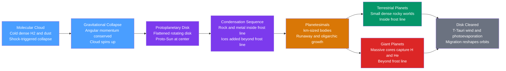

# 🌫️ Formation of the Solar System

> [!abstract] TL;DR
> About **4.567 billion years ago** a fragment of a giant molecular cloud collapsed under gravity. Conservation of angular momentum spun the infalling gas into a flattened, rotating **protoplanetary disk** with the proto-Sun at its center. Inside the **frost line** only rock and metal could condense, building small dense **terrestrial planets**; beyond it, ices added far more solid material, so massive cores formed and captured gas to become the **giant planets**. This *nebular hypothesis* naturally explains the coplanar, near-circular, prograde orbits, the age and isotopic uniformity of meteorites, and — with modern migration models (Nice, Grand Tack) — the detailed architecture of the asteroid and Kuiper belts.

## Intuition — analogy FIRST

Watch a figure skater pull in her arms during a spin: she speeds up dramatically. Now imagine a vast, slowly turning cloud of gas the size of a light-year "pulling in its arms" as gravity drags it inward. It must spin faster and faster, and — like pizza dough spun in the air — it flattens into a disk. The Sun forms in the dense hub; the leftover disk is the raw material for planets.

The second key idea is a "frost line" in this disk, like the snow line on a mountain. Below a certain temperature, water freezes solid. Close to the warm proto-Sun, water stays vapor and only rock and metal can solidify into dust. Cross the frost line and ice suddenly becomes available too — and there is a *lot* of it. That single temperature boundary is why the inner planets are small rocky worlds and the outer ones are giants.

---

## How It Works



### Secondary Level

The **nebular hypothesis** (Kant 1755, Laplace 1796) says the Sun and planets condensed from one spinning cloud — the *solar nebula*.

1. **Trigger and collapse.** A dense clump in a molecular cloud is pushed over its gravitational threshold (often by a nearby supernova shock) and collapses. See [[Star_Formation]].
2. **Spin-up and flattening.** As it shrinks, conservation of **angular momentum** makes it rotate faster and settle into a disk — the same physics as a spinning skater or [[Rotational_Dynamics|a spinning top]].
3. **Heating.** Infalling gas piles onto the center, forming the hot **proto-Sun**.
4. **Condensation and the frost line.** Near the Sun ($< \sim 2.7$ AU) it is too warm for ice, so only **rock and metal** condense into dust. Beyond the **frost (snow) line**, water and other ices also freeze, so there is far more solid material.
5. **Growth.** Dust sticks into pebbles, pebbles into **planetesimals** (km-sized), and gravity assembles these into planets.

| Region | Temperature | Solids available | Result |
|--------|------------|------------------|--------|
| Inside frost line | Hot | Rock, metal only | Small dense **terrestrial** planets |
| Beyond frost line | Cold | Rock, metal **+ ices** | Massive cores → **giant** planets |

### Undergraduate Level

**Condensation sequence.** As nebular gas of roughly solar composition cools, minerals condense in a temperature order (Grossman 1972): refractory oxides and Ca-Al-rich inclusions (**CAIs**) near $1400$–$1700$ K, metallic iron $\sim 1350$ K, silicates (forsterite, enstatite) $\sim 1200$–$1300$ K, troilite (FeS) $\sim 700$ K, water ice $\sim 150$–$170$ K, then ammonia and methane ices at still lower temperatures. The frost line sits where $T \approx 150$–$170$ K, near $2.7$ AU today.

**Planetesimal growth.** Micron dust grows by sticking, but the "meter-size barrier" (rapid inward gas drag) is bypassed by the **streaming instability**, which concentrates pebbles into self-gravitating clumps that collapse into $\sim$km planetesimals.

**Runaway then oligarchic accretion.** Gravitational focusing gives a body an effective cross-section
$$\sigma_{eff} = \pi R^2\left(1 + \frac{v_{esc}^2}{v_{rel}^2}\right),$$
so bigger bodies grow *faster* — **runaway growth**. As a few winners stir up random velocities, growth slows into **oligarchic** growth, ending in a handful of planetary embryos per feeding zone. Terrestrial planets finish through giant impacts of embryos over $\sim 10$–$100$ Myr; the Moon-forming impact is the classic example (see [[Earth_Formation_and_Differentiation]]).

**Two routes to giants.**

| Mechanism | Idea | Timescale | Favored for |
|-----------|------|-----------|-------------|
| **Core accretion** | $\sim 10\,M_\oplus$ ice-rock core forms first, then runaway capture of H/He | few Myr (must beat gas dispersal) | Jupiter, Saturn, most planets |
| **Disk instability** | Massive cold disk fragments gravitationally into bound gas clumps | $\sim$ orbits (fast) | distant, massive planets |

**Disk clearing.** After $\sim 3$–$10$ Myr the young Sun enters the violent **T-Tauri phase**; its strong wind and UV **photoevaporation** blow the residual gas away, ending gas-giant growth and freezing in the planetary inventory.

**What the theory must — and does — explain:**
- **Coplanar, near-circular, prograde orbits** — all inherited from one rotating disk.
- **Terrestrial/giant dichotomy** — set by the frost line.
- **Age and isotopic uniformity** — CAIs date to $4.567$ Gyr and meteorites share isotope ratios, showing a single well-mixed nebula (see [[Radiometric_Dating]]).
- **Late Heavy Bombardment** ($\sim 4.1$–$3.8$ Gyr ago) — a spike in impacts recorded on the Moon.

### Graduate Level

**The angular-momentum problem.** The Sun holds $\sim 99.8\%$ of the system's *mass* but under $2\%$ of its *angular momentum*; Jupiter alone carries $\sim 60\%$. A proto-Sun that kept the disk's angular momentum would spin near break-up — instead it turns once per $\sim 25$ days. Resolution requires transporting angular momentum **outward** while mass flows **inward**:
- **Magnetic braking:** the star's magnetized wind, corotating out to the Alfvén radius, exerts a lever-arm torque that spins the star down.
- **Disk transport via turbulent viscosity**, often driven by the **magnetorotational instability (MRI)**, moves angular momentum outward through the disk; disk winds can also carry it away.

**Viscous disk evolution.** In the Shakura–Sunyaev $\alpha$-prescription the kinematic viscosity is $\nu = \alpha c_s H$ ($c_s$ = sound speed, $H$ = scale height). The surface density $\Sigma(r,t)$ obeys the diffusion equation
$$\frac{\partial \Sigma}{\partial t} = \frac{3}{r}\frac{\partial}{\partial r}\left[\sqrt{r}\,\frac{\partial}{\partial r}\left(\nu\,\Sigma\,\sqrt{r}\right)\right],$$
so most mass accretes onto the star while a small tail spreads outward, carrying the angular momentum.

**Thermal structure and the frost line.** A passive, irradiated disk has midplane temperature roughly $T(r)\propto r^{-1/2}$, while a viscously heated inner disk steepens toward $T\propto r^{-3/4}$; the frost line lies where $T$ crosses the ice-sublimation temperature and migrates inward as accretion (and luminosity) decline.

**Migration and the outer architecture.** Disk torques drive **Type I** migration (low-mass, embedded) and **Type II** migration (gap-opening giants), explaining hot Jupiters and super-Earths seen in [[Exoplanets_and_Detection_Methods]]. In the **Nice model** the giants formed more compactly; crossing the Jupiter–Saturn 2:1 resonance destabilized the outer system, scattering planetesimals to trigger the Late Heavy Bombardment and sculpting the Kuiper belt and Trojans. The **Grand Tack** has Jupiter migrate inward to $\sim 1.5$ AU, then "tack" back out once Saturn locks into resonance — truncating the disk to produce a small Mars and the compositionally split asteroid belt.

```python
# Locate the frost/snow line from the equilibrium temperature of a
# blackbody dust grain heated by the Sun: T(r) = (L / (16 pi sigma r^2))^(1/4).
# Water ice condenses near ~150-170 K -> that radius is the frost line.
import numpy as np

L_sun  = 3.828e26      # solar luminosity, W
sigma  = 5.670e-8      # Stefan-Boltzmann, W m^-2 K^-4
AU     = 1.496e11      # metres

def T_grain(r_AU):
    r = r_AU * AU
    return (L_sun / (16 * np.pi * sigma * r**2)) ** 0.25

def frost_line(T_ice):
    # invert T(r) = T_ice  ->  r = sqrt(L / (16 pi sigma T^4))
    r = np.sqrt(L_sun / (16 * np.pi * sigma * T_ice**4))
    return r / AU

for r in [0.4, 1.0, 2.7, 5.2, 30.0]:      # Mercury, Earth, belt, Jupiter, Neptune
    print(f"r = {r:5.1f} AU  ->  T = {T_grain(r):6.1f} K")

for T_ice in (150, 160, 170):
    print(f"water frost line (T={T_ice} K):  {frost_line(T_ice):4.2f} AU")
# T = 278 K at 1 AU; frost line lands near 2.7-3.4 AU, just beyond the
# asteroid belt -- exactly where the terrestrial/giant transition occurs.
```

---

## Real-World Notes

- **CAIs are the birth certificate.** Calcium-aluminium-rich inclusions in the Allende meteorite are the oldest solids known, $4567.30 \pm 0.16$ Myr — the standard zero-point for solar-system time (see [[Radiometric_Dating]]).
- **A supernova rocked the cradle.** Decay products of short-lived radionuclides ($^{26}\mathrm{Al}$, $^{60}\mathrm{Fe}$) in meteorites imply fresh injection from a nearby supernova that likely helped trigger the collapse.
- **ALMA sees it happening.** The 2014 ALMA image of **HL Tauri** revealed concentric bright rings and dark gaps in a protoplanetary disk — plausibly carved by forming planets — confirming disks are structured, not smooth.
- **Meteorites are unmelted leftovers.** Chondrites preserve near-solar, unfractionated composition; they are literal samples of the planetesimal building blocks.
- **Exoplanet diversity stress-tests the model.** Hot Jupiters, compact super-Earth systems, and misaligned orbits forced migration into the standard picture; our own architecture is one outcome among many (see [[Exoplanets_and_Detection_Methods]]).
- **Comets carry the frost-line ices.** Kuiper Belt and Oort Cloud bodies are volatile-rich survivors from beyond the frost line (see [[Small_Bodies_Asteroids_Comets_and_KBOs]]).

---

## Common Pitfalls

1. **"The Sun formed from the planets' leftovers."** Reverse it: the Sun formed first and dominates the mass; planets built from the residual $\sim 0.1\%$ disk.
2. **Confusing angular-momentum *conservation* with the angular-momentum *problem*.** Collapse conserves total $L$ (spin-up). The *problem* is why the Sun ended up with so little of it — solved by braking and outward disk transport, not by violating conservation.
3. **Treating the frost line as fixed at 2.7 AU.** It migrates inward over time as the disk cools and accretion wanes; 2.7 AU is roughly its late-stage location.
4. **Assuming giants formed where we see them today.** Migration (Nice, Grand Tack) means the giants moved substantially; current positions are not birthplaces.
5. **Thinking planetesimals grew purely by gentle sticking.** The meter-size barrier blocks simple coagulation; the streaming instability and gravitational collapse of pebble clouds are essential.
6. **Equating "terrestrial" with "small" as a coincidence.** The dichotomy is causal: less solid mass inside the frost line means smaller cores that never captured nebular gas.

---

## Related Concepts

- [[_MOC_Solar_System|↑ Section MOC]]
- [[Orbital_Mechanics_and_Celestial_Dynamics]] — the coplanar, prograde, near-circular orbits the disk bequeaths, and the resonances behind migration
- [[Terrestrial_Planets]] — the small dense worlds built inside the frost line
- [[Giant_Planets_and_Their_Moons]] — massive cores beyond the frost line that captured H/He
- [[Small_Bodies_Asteroids_Comets_and_KBOs]] — leftover planetesimals sculpted by the giants
- [[Exoplanets_and_Detection_Methods]] — testing formation theory against thousands of other systems
- [[Astrobiology_and_Habitability]] — where in the disk conditions for life could arise
- [[Star_Formation]] — the collapse and proto-Sun stage in stellar context
- **Physics** — [[Rotational_Dynamics]] (angular-momentum spin-up of the collapsing cloud); [[Newtons_Laws_and_Kinematics]] (gravity and orbital motion)
- **Earth Science** — [[Earth_Formation_and_Differentiation]] (accretion and the giant impact); [[Radiometric_Dating]] (dating CAIs and meteorites)
- **Mathematics** — [[_MOC_Mathematics_Master]] (the diffusion/ODE machinery behind disk evolution)

---

## Review Questions

1. **Secondary**: Why are the inner planets small and rocky while the outer planets are huge and gas-rich? Explain using the frost line and what materials can condense at each distance.
2. **Undergraduate**: Distinguish core accretion from disk instability for giant-planet formation. Why does the frost line make core accretion easier beyond it, and why is the few-Myr gas-dispersal timescale a critical constraint?
3. **Graduate**: State the angular-momentum problem quantitatively (mass vs. angular-momentum shares of Sun and planets) and describe two mechanisms — one stellar, one within the disk — that redistribute angular momentum. How does the Shakura–Sunyaev $\alpha$-disk let mass accrete inward while $L$ flows outward?

---

## Sources

- Armitage — *Astrophysics of Planet Formation*, 2nd ed. (2020)
- de Pater & Lissauer — *Planetary Sciences*, 2nd ed.
- Grossman (1972) — "Condensation in the primitive solar nebula," *Geochim. Cosmochim. Acta* 36, 597
- Gomes, Levison, Tsiganis & Morbidelli (2005) — Nice model / Late Heavy Bombardment, *Nature* 435, 466
- Walsh, Morbidelli, Raymond, O'Brien & Mandell (2011) — Grand Tack, *Nature* 475, 206
- ALMA Partnership (2015) — "The 2014 ALMA Long Baseline Campaign: HL Tau," *ApJL* 808, L3

#astronomy #planetary-science #nebular-hypothesis #protoplanetary-disk #frost-line #accretion #planet-migration #secondary #undergraduate #graduate
