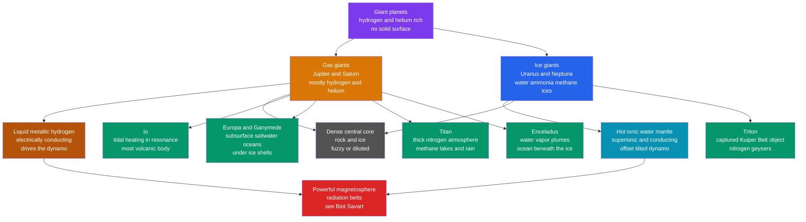

# 🪐 Giant Planets and Their Moons

> [!abstract] TL;DR
> The outer solar system holds four giants in two families. The **gas giants** Jupiter and Saturn are overwhelmingly hydrogen and helium; the **ice giants** Uranus and Neptune are richer in water, ammonia, and methane "ices." None has a solid surface — you fall through thickening gas into a layer of electrically conducting **liquid metallic hydrogen** (in the gas giants) that runs a dynamo and powers the strongest magnetic fields in the solar system (see [[Magnetism_and_Biot_Savart]]). Jupiter, Saturn, and Neptune radiate more heat than they receive, driven by slow Kelvin–Helmholtz contraction and, for Saturn, helium rain. Their true wonders are the **moons**: Io is the most volcanic body known, heated by tidal flexing in the Laplace resonance; Europa, Ganymede, Enceladus, and possibly Callisto hide liquid-water oceans under ice; Titan has a thick nitrogen atmosphere with methane rain; and Triton is a captured Kuiper Belt object with nitrogen geysers.

## Intuition — analogy FIRST

Imagine squeezing a rubber ball over and over in your fist: it warms up, because every squeeze does work against the rubber's internal friction. Now make the "fist" a planet's gravity and the "ball" a moon on a slightly stretched, eccentric orbit. Each orbit the moon swings closer and farther, so the planet's tidal pull rises and falls, kneading the moon's rock like that rubber ball. On Io — big, close to Jupiter, and locked in a resonance that keeps its orbit from circularizing — this kneading dumps roughly $10^{14}$ watts of heat, enough to melt the interior and drive four hundred volcanoes. That is why the little moon of a cold planet, five times farther from the Sun than Earth, is the most volcanically active world in the solar system.

The giants themselves invert everyday intuition too: they have no ground to stand on. "Descending" onto Jupiter means the gas around you simply gets denser and hotter with no boundary — until, kilometres deep, hydrogen is squeezed so hard it turns into a liquid metal.

---

## How It Works



---

### Secondary Level

**Two families of giants.** Beyond the asteroid belt orbit four planets far larger than Earth. The **gas giants** — Jupiter and Saturn — are made almost entirely of hydrogen and helium, the same stuff as the Sun. The **ice giants** — Uranus and Neptune — are smaller and contain proportionally much more "ice," which in astronomy means water, ammonia, and methane (mostly hot fluids inside, not solid). All four are sometimes called the **Jovian** (Jupiter-like) planets.

**No surface to land on.** A giant planet is gas at the top that thickens smoothly into liquid with depth. There is no line where "atmosphere" ends and "ground" begins — a probe sinking into Jupiter is crushed and heated long before reaching any core.

**Signature features.** Jupiter's **Great Red Spot** is a storm wider than Earth that has raged for over three centuries. Saturn's **rings** are countless chunks of water ice orbiting in a sheet only tens of metres thick. Uranus is tipped on its side, so it rolls around the Sun. And these planets host dozens of **moons** — Jupiter and Saturn have well over a hundred each — some of which are worlds with oceans, volcanoes, and atmospheres.

### Undergraduate Level

**Comparative anatomy of the four giants.**

| Property | Jupiter | Saturn | Uranus | Neptune |
|---|---|---|---|---|
| Mass ($M_\oplus$) | 317.8 | 95.2 | 14.5 | 17.1 |
| Equatorial radius ($R_\oplus$) | 11.2 | 9.45 | 4.01 | 3.88 |
| Mean density (kg m$^{-3}$) | 1326 | 687 | 1270 | 1638 |
| Semi-major axis (AU) | 5.20 | 9.58 | 19.2 | 30.1 |
| Orbital period (yr) | 11.86 | 29.46 | 84.0 | 164.8 |
| Rotation period (h) | 9.93 | ~10.7 | 17.24 | 16.11 |
| Axial tilt (deg) | 3.1 | 26.7 | 97.8 | 28.3 |
| Family | gas | gas | ice | ice |

Note Saturn's density of $687\ \text{kg m}^{-3}$ — **less than water**. And despite being the least massive, Neptune is the *densest* giant.

**Interior structure.** In a gas giant, molecular hydrogen ($\text{H}_2$) gives way with depth to **liquid metallic hydrogen** — at roughly a megabar of pressure the molecules dissociate and electrons delocalize, so the fluid conducts electricity like a metal. This deep, convecting, conducting layer is a **dynamo** that generates the magnetic field (the physics of moving charge making $\vec{B}$ is [[Magnetism_and_Biot_Savart]]). Below sits a dense **core** of rock and ice, of order $10$–$20\ M_\oplus$. Ice giants lack the pressure to metallize much hydrogen; instead a thin H/He envelope overlies a hot, ionic **water–ammonia–methane mantle** whose conductivity runs a tilted, offset dynamo, wrapped around a rock-ice core.

**Internal heat.** Jupiter, Saturn, and Neptune emit more energy than they absorb from sunlight:

| Planet | Emitted / Absorbed | Main source |
|---|---|---|
| Jupiter | ~1.67 | Kelvin–Helmholtz contraction + primordial heat |
| Saturn | ~1.78 | contraction **plus helium rain** |
| Uranus | ~1.06 | anomalously low — nearly none |
| Neptune | ~2.61 | contraction + primordial heat |

The **Kelvin–Helmholtz mechanism** is slow gravitational contraction (Jupiter shrinks $\sim$cm per year) converting potential energy to heat — a self-luminosity that also warms young stars and links to [[Laws_of_Thermodynamics]]. Saturn's excess exceeds contraction alone because helium becomes immiscible in its cooler metallic hydrogen and **rains** downward, releasing gravitational energy (and explaining Saturn's helium-poor upper atmosphere).

**Atmospheres.** Fast **zonal winds** organize the clouds into light **zones** (rising, cool ammonia ice) and dark **belts** (sinking, warmer). Storms include the Great Red Spot (an anticyclone, winds $\sim430\ \text{km h}^{-1}$) and Neptune's transient dark spots; Neptune has the fastest winds measured, up to $\sim2100\ \text{km h}^{-1}$. Methane absorbs red light, giving Uranus and Neptune their blue-green color. Uranus's $98^\circ$ tilt produces $42$-year seasons of continuous sunlight or darkness at the poles.

**Rings and the Roche limit.** Saturn's rings are $>95\%$ water ice, particles from millimetres to metres, spanning $\sim7{,}000$–$80{,}000$ km above the equator yet only tens of metres thick. They lie within the **Roche limit** — the distance inside which a planet's tidal force exceeds a moon's self-gravity, so material cannot accrete into (or survives being torn from) a satellite. The other three giants have fainter, darker rings.

**Moons and tidal heating.** The four **Galilean moons** of Jupiter — Io, Europa, Ganymede, Callisto — were seen by Galileo in 1610. The inner three are locked in the **Laplace resonance**: their orbital periods sit in a $1:2:4$ ratio, so repeated conjunctions pump their orbital eccentricities and keep the orbits from circularizing. The forced eccentricity feeds **tidal heating**, the dominant energy source for outer-moon activity: Io's volcanism, and the subsurface oceans of Europa, Enceladus, and others of astrobiological interest (see [[Astrobiology_and_Habitability]]).

### Graduate Level

**Metallization of hydrogen.** Inside Jupiter the molecular-to-metallic transition occurs near $\sim1\ \text{Mbar}$ ($\sim100\ \text{GPa}$) at temperatures of several thousand kelvin — a *continuous* fluid transition rather than a sharp surface, occurring around $0.8$–$0.9\,R_J$. Static-compression experiments (diamond anvil cells) and dynamic shock experiments bracket solid metallic hydrogen near $\sim495\ \text{GPa}$ at low temperature; the exact phase diagram remains debated. What matters planetarily is that above the transition the fluid's electrical conductivity jumps by orders of magnitude, enabling the dynamo. **Juno** gravity data further suggest Jupiter's core is **fuzzy** — diluted and gradational rather than a sharp rock ball — hinting at a giant impact or inefficient settling during formation.

**Roche limit.** For a fluid, self-gravitating satellite of density $\rho_m$ orbiting a body of radius $R_M$ and density $\rho_M$:

$$d_{\text{Roche}} \approx 2.44\, R_M \left(\frac{\rho_M}{\rho_m}\right)^{1/3}$$

For a rigid body the coefficient drops to $\approx1.26$. Saturn's rings sit inside $\sim2.3\,R_{\text{Saturn}}$, consistent with icy material that could never accrete — or the debris of a moon that strayed too close.

**Tidal heating.** For a synchronously rotating satellite the dissipated power is

$$\dot{E}_{\text{tidal}} = \frac{21}{2}\,\frac{k_2}{Q}\,\frac{R^5\, n^5\, e^2}{G}, \qquad n = \sqrt{\frac{G M_p}{a^3}}$$

where $R$ is the moon's radius, $e$ its eccentricity, $n$ the mean motion, and $k_2/Q$ the ratio of the tidal Love number to the dissipation quality factor. Because $n \propto a^{-3/2}$, the heating scales as $\dot{E}\propto e^2 R^5 a^{-15/2}$ — a *ferociously* steep dependence on size, distance, and eccentricity. Io wins on all three: large, close to Jupiter, and held eccentric by the resonance. Kill the eccentricity and heating vanishes, which is why the resonance is essential. Uranus's near-zero heat flux is the outlier — possibly a stably stratified interior that traps heat, plausibly linked to the same giant impact that tipped it over.

---

## Code Demo

```python
import numpy as np

# Tidal heating in a synchronously rotating moon (Murray & Dermott form):
#   E_dot = (21/2) * (k2/Q) * R^5 * n^5 * e^2 / G      [watts]
# with mean motion n = sqrt(G * M_planet / a^3).
# Key scaling: power ~ e^2 * R^5 * a^-15/2  ->  favors BIG, CLOSE, ECCENTRIC moons.

G   = 6.674e-11          # gravitational constant [m^3 kg^-1 s^-2]
M_J = 1.898e27           # Jupiter mass [kg]

def tidal_power(R, a, e, k2_over_Q, M_planet=M_J):
    n = np.sqrt(G * M_planet / a**3)              # orbital mean motion [rad/s]
    return 10.5 * k2_over_Q * R**5 * n**5 * e**2 / G

# Galilean moons:   R [m]     a [m]      forced e   k2/Q (order of magnitude)
moons = {
    "Io":     (1.822e6, 4.217e8, 0.0041, 0.015),
    "Europa": (1.561e6, 6.711e8, 0.0094, 0.015),
}

for name, (R, a, e, kq) in moons.items():
    P    = tidal_power(R, a, e, kq)
    flux = P / (4 * np.pi * R**2)                  # surface heat flux [W m^-2]
    print(f"{name:7s}: tidal power = {P:.2e} W   surface flux = {flux:.2f} W/m^2")

# Why the resonance matters: set Io's orbit circular (e = 0)
R, a, e, kq = moons["Io"]
print(f"\nIo with e = 0 (circular): {tidal_power(R, a, 0.0, kq):.2e} W  -> no volcanism")

# Distance sensitivity: move Io out to Europa's orbit (a^-15/2 collapse)
print(f"Io relocated to Europa's a: {tidal_power(R, moons['Europa'][1], e, kq):.2e} W")
```

Expected output: Io radiates $\sim9\times10^{13}$ W at $\sim2$ W m$^{-2}$ (matching its observed heat flux), Europa an order of magnitude less; a *circular* Io emits **zero** tidal heat; and shifting Io to Europa's distance collapses the heating by a factor of $\sim30$ — the $a^{-15/2}$ law in action.

---

## Real-World Notes

- **Juno** (Jupiter, 2016–present) mapped a lumpy, non-uniform magnetic field and a **fuzzy, diluted core**, overturning the textbook "clean rock core" picture and constraining the depth of the metallic-hydrogen dynamo.
- **Cassini–Huygens** (Saturn, 2004–2017) flew through **Enceladus's** plumes and detected salts, silica nanoparticles, molecular hydrogen, and organics — evidence of ongoing **hydrothermal activity** on a seafloor beneath the ice. Huygens landed on **Titan** in 2005, finding river channels and a methane-damp surface.
- **Europa Clipper** (NASA, launched Oct 2024) and **JUICE** (ESA, launched 2023) are en route to characterize the subsurface oceans of Europa and Ganymede — Ganymede being the only moon with its **own** intrinsic magnetic field.
- **Dragonfly** (NASA, ~2028 launch) will fly a nuclear-powered rotorcraft across **Titan's** dunes to sample prebiotic chemistry in its nitrogen–methane atmosphere.
- **Voyager 2** remains the only spacecraft to visit **Uranus and Neptune** (1986, 1989), imaging Neptune's supersonic winds and the active **nitrogen geysers** of **Triton**, a captured Kuiper Belt object on a retrograde, slowly decaying orbit.
- Saturn's ring mass and the ring-rain measured by Cassini suggest the rings may be **geologically young** ($\sim10$–$100$ Myr) and eroding — Saturn may not always have looked as it does now.

---

## Common Pitfalls

1. **"Ice giant" does not mean frozen.** The "ices" (water, ammonia, methane) inside Uranus and Neptune are mostly hot, dense, ionic *fluids* — the term describes the volatile *chemistry*, not the physical state.
2. **No solid surface.** There is no crust to stand on and no discrete atmosphere/ocean boundary; density and temperature rise continuously with depth. A quoted "radius" is defined at the $1$-bar pressure level, not a surface.
3. **Confusing internal heat with greenhouse heating.** Jupiter's, Saturn's, and Neptune's excess luminosity comes from *gravitational contraction and helium rain*, not from trapping sunlight. Uranus is the anomaly that emits almost none.
4. **Assuming tidal heating needs a big eccentricity.** Io's eccentricity is only $\sim0.004$, yet the $R^5 n^5 e^2$ scaling still yields $10^{14}$ W. Remove the *resonance*, the orbit circularizes, and the heating stops — the resonance, not a large $e$, is the linchpin.
5. **Metallic hydrogen is not a solid metal bar.** In Jupiter it is a hot, convecting *liquid* whose conductivity — not rigidity — is what powers the dynamo.
6. **The Roche limit is not where all moons must lie.** It bounds where *self-gravitating* bodies can accrete; small moons held together by material strength (and shepherd moons within ring gaps) can and do orbit inside it.

---

## Related Concepts

- [[_MOC_Solar_System|↑ Section MOC]]
- [[Formation_of_the_Solar_System]] — why giants formed beyond the snow line and how they accreted massive H/He envelopes
- [[Terrestrial_Planets]] — the rocky inner counterparts; contrast in composition, size, and moon systems
- [[Orbital_Mechanics_and_Celestial_Dynamics]] — mean-motion resonances (the $1:2:4$ Laplace resonance) that pump the eccentricities driving tidal heating
- [[Small_Bodies_Asteroids_Comets_and_KBOs]] — Triton as a captured Kuiper Belt object; ring particles as small-body debris
- [[Exoplanets_and_Detection_Methods]] — "hot Jupiters" and sub-Neptunes are the galaxy's most-detected giant analogues
- [[Astrobiology_and_Habitability]] — ocean moons (Europa, Enceladus) as tidally heated habitats beyond the classical habitable zone
- [[Magnetism_and_Biot_Savart]] — how the moving, conducting metallic-hydrogen fluid generates the magnetic field (Physics vault)
- [[Laws_of_Thermodynamics]] — Kelvin–Helmholtz contraction and helium rain as gravitational-to-thermal energy conversion (Physics vault)
- [[_MOC_Mathematics_Master]] — the power laws and resonance algebra behind tidal-heating scaling (Mathematics vault)

---

## Review Questions

1. **Secondary:** Saturn's mean density is less than that of water. What does this tell you about its bulk composition, and why does it *not* mean Saturn would float in a giant bathtub in any realistic sense?
2. **Undergraduate:** Explain how the Laplace resonance among Io, Europa, and Ganymede sustains Io's volcanism. Why would Io's interior cool and quiet if the resonance were somehow broken?
3. **Graduate:** Using $\dot{E}_{\text{tidal}} \propto e^2 R^5 n^5$ and $n \propto a^{-3/2}$, estimate the factor by which tidal heating changes if a moon's semi-major axis doubles at fixed $e$ and $R$. Discuss why Uranus, despite comparable formation heat to Neptune, radiates almost no internal energy today.

---

## Sources

- de Pater & Lissauer — *Planetary Sciences*, 2nd ed., Ch. 6–7 (giant planet interiors, atmospheres, and rings)
- Murray & Dermott — *Solar System Dynamics*, Ch. 4 & 8 (resonances and tidal evolution)
- Peale, Cassen & Reynolds (1979) — "Melting of Io by Tidal Dissipation," *Science* 203, 892
- Guillot (2005) — "The Interiors of Giant Planets," *Annu. Rev. Earth Planet. Sci.* 33, 493
- Wahl et al. (2017) — Juno constraints on Jupiter's dilute core, *Geophys. Res. Lett.* 44, 4649
- NASA JPL Planetary Fact Sheets (physical and orbital data)

---

#astronomy #planetary-science #gas-giants #ice-giants #tidal-heating #metallic-hydrogen #galilean-moons #ocean-worlds #secondary #undergraduate #graduate
