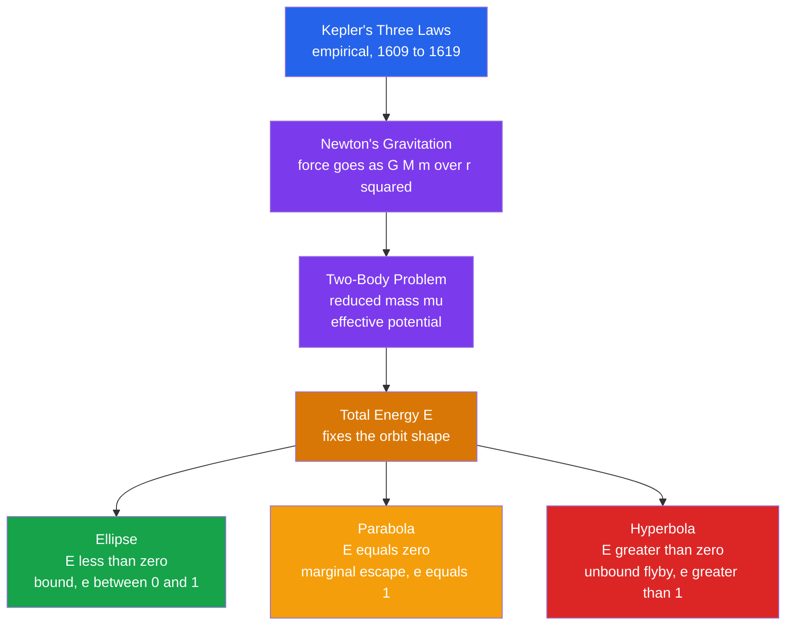

# 🛰️ Orbital Mechanics and Celestial Dynamics

> [!abstract] TL;DR
> **Orbital mechanics** is the physics of how bodies move under gravity. **Kepler** distilled Tycho Brahe's data into three empirical laws: orbits are **ellipses** with the Sun at one focus; the line to the Sun **sweeps equal areas in equal times** (conservation of angular momentum); and the period squared scales as the semi-major axis cubed ($P^2 \propto a^3$). **Newton** then *derived* all three from universal gravitation and the two-body problem, revealing orbits as **conic sections** whose shape is fixed by the total energy: ellipse for $E<0$, parabola for $E=0$, hyperbola for $E>0$. His generalized third law $P^2 = 4\pi^2 a^3 / [G(M_1+M_2)]$ lets us **weigh the cosmos** — planets from their moons, stars from binaries, the Galaxy from its rotation. The **vis-viva equation**, orbital elements, Lagrange points, resonances, tidal locking, and spaceflight transfers all follow from the same gravitational bookkeeping.

## Intuition — analogy FIRST

Swing a ball on a rubber band around your head. Pull it in and it whips around faster; let it out and it dawdles — that speeding-up-when-close is exactly Kepler's second law, and it is nothing more than angular momentum trying to stay constant. Now imagine throwing that ball horizontally faster and faster: a slow throw arcs to the ground (a "sub-orbital" ellipse into the Earth), a faster throw curves all the way around into a circle, faster still stretches into a long ellipse, and past a critical speed the ball never comes back at all — it escapes on a hyperbola.

That single mental picture — Newton's own "cannonball on a mountain" — is the whole subject. **One force (gravity) and one launch speed decide whether you fall back, circle, or escape forever.** Everything else (weighing planets, parking a telescope at L2, slingshotting past Jupiter) is bookkeeping on top of that idea.

---

## How It Works

Newton showed that any body moving under an inverse-square attraction follows a **conic section** with the central mass at one focus. Which conic you get depends only on the total mechanical energy $E$; the eccentricity $e$ and the shape follow directly.



---

## Key Concepts / Details

### Secondary Level

**Kepler's three laws (empirical).**

1. **Law of ellipses.** Each planet moves in an ellipse with the Sun at one **focus**. The ellipse is described by its **semi-major axis** $a$ (half the long axis) and **eccentricity** $e$ (how squashed it is, $0 =$ circle). Closest approach is **perihelion** $r_p = a(1-e)$; farthest is **aphelion** $r_a = a(1+e)$.
2. **Law of equal areas.** The line from Sun to planet sweeps out **equal areas in equal times**, so a planet moves *fastest at perihelion* and *slowest at aphelion*.
3. **Harmonic law.** $P^2 \propto a^3$. In convenient units (period in years, $a$ in astronomical units), this is simply $P^2 = a^3$.

| Planet | $a$ (AU) | $P$ (yr) | $P^2/a^3$ |
|--------|---------|---------|-----------|
| Earth | 1.000 | 1.000 | 1.000 |
| Mars | 1.524 | 1.881 | 1.000 |
| Jupiter | 5.203 | 11.86 | 1.000 |
| Neptune | 30.11 | 164.8 | 1.000 |

The constancy of the last column *is* Kepler's third law.

**Escape velocity.** To leave a body of mass $M$ from radius $r$ and never return: $v_\text{esc} = \sqrt{2GM/r}$. From Earth's surface this is $11.2\,\text{km/s}$; from the Sun's surface, $618\,\text{km/s}$.

### Undergraduate Level

**Newton's derivation and the two-body problem.** Two masses attract along the line joining them. Working in the centre-of-mass frame, the relative separation $\vec r$ obeys a one-body equation with the **reduced mass** $\mu$:

$$\mu\,\ddot{\vec r} = -\frac{G m_1 m_2}{r^2}\,\hat r, \qquad \mu = \frac{m_1 m_2}{m_1 + m_2}$$

Because the force is central, **angular momentum** $L = \mu r^2 \dot\nu$ is conserved — motion stays in a plane and $dA/dt = L/2\mu = \text{const}$, which is *exactly* Kepler's second law. Reducing the radial motion to one dimension introduces the **effective potential**:

$$V_\text{eff}(r) = -\frac{G m_1 m_2}{r} + \frac{L^2}{2\mu r^2}$$

The centrifugal barrier $L^2/2\mu r^2$ prevents collapse and, combined with the $-1/r$ well, produces a bound orbit. Solving the orbit equation gives a **conic section**:

$$r(\nu) = \frac{a(1-e^2)}{1 + e\cos\nu}, \qquad e = \sqrt{1 + \frac{2 E L^2}{\mu\,(G m_1 m_2)^2}}$$

The **total energy sets the shape**: $E = -\dfrac{G m_1 m_2}{2a}$, so

| Energy | Eccentricity | Orbit | Fate |
|--------|-------------|-------|------|
| $E<0$ | $0 \le e < 1$ | ellipse (circle if $e=0$) | bound |
| $E=0$ | $e=1$ | parabola | marginal escape |
| $E>0$ | $e>1$ | hyperbola | unbound flyby |

**Newton's generalized third law — weighing the cosmos.** Newton corrected Kepler by including *both* masses:

$$P^2 = \frac{4\pi^2 a^3}{G(M_1 + M_2)}$$

Rearranged, this is the astronomer's scale: measure a period and a separation, get a **mass**.
- **Planets** from their moons (Jupiter's mass from Io's orbit).
- **Stars** from binary systems (the primary way stellar masses are known).
- **The Galaxy** from its rotation: $M(<r) = v^2 r / G$ from a flat rotation curve — the calculation that revealed [[Dark_Matter]].

**Orbital elements.** Six numbers fully specify an orbit and a body's place on it:

| Element | Symbol | Role |
|---------|--------|------|
| Semi-major axis | $a$ | size / energy |
| Eccentricity | $e$ | shape |
| Inclination | $i$ | tilt of the orbital plane |
| Longitude of ascending node | $\Omega$ | swivel of the node line |
| Argument of periapsis | $\omega$ | orientation of the ellipse in-plane |
| True anomaly | $\nu$ | where the body is *now* |

**Vis-viva equation.** Energy conservation gives the speed at any point of an orbit purely from the current radius $r$ and the semi-major axis $a$:

$$v^2 = GM\left(\frac{2}{r} - \frac{1}{a}\right)$$

Special cases fall out immediately: circular orbit ($r=a$) gives $v_\text{circ} = \sqrt{GM/a}$; marginal escape ($a\to\infty$) gives $v_\text{esc} = \sqrt{2GM/r} = \sqrt2\,v_\text{circ}$.

**Spaceflight applications.** A **Hohmann transfer** is the cheapest two-burn ellipse between two circular orbits: burn to raise aphelion to the target radius ($a_t = (r_1+r_2)/2$), coast half an orbit, then burn to circularise. A **gravity assist** steals a sliver of a planet's orbital momentum — the spacecraft's speed is unchanged in the planet's frame but boosted (or cut) in the Sun's frame, how Voyager reached the outer planets and Parker Solar Probe dives toward the Sun.

### Graduate Level

**Lagrangian and Hamiltonian formulation.** With generalized coordinates $(r,\phi)$ the Kepler Lagrangian is

$$\mathcal{L} = \tfrac12\mu(\dot r^2 + r^2\dot\phi^2) + \frac{G m_1 m_2}{r}$$

$\phi$ is cyclic, so its conjugate momentum $p_\phi = \mu r^2\dot\phi = L$ is conserved — angular momentum drops out as a symmetry. The Hamiltonian $H = \dfrac{p_r^2}{2\mu} + \dfrac{p_\phi^2}{2\mu r^2} - \dfrac{G m_1 m_2}{r}$ is integrable (see [[Lagrangian_Mechanics]], [[Hamiltonian_Mechanics]]).

**The Laplace–Runge–Lenz vector.** The inverse-square law has a *hidden* symmetry beyond energy and angular momentum: the conserved vector

$$\vec A = \vec p \times \vec L - \mu k\,\hat r, \qquad k = G m_1 m_2, \qquad |\vec A| = \mu k\,e$$

points toward perihelion and has magnitude fixed by the eccentricity. Its conservation is *why* Kepler orbits close exactly — the perihelion does not drift. Any departure from $1/r$ (general relativity, an oblate primary, a third body) breaks the symmetry and makes $\vec A$ slowly rotate: **perihelion precession**. Mercury's anomalous $43''$ per century is the famous relativistic case (see [[Black_Hole_Physics]]).

**Restricted three-body problem and Lagrange points.** For a light body moving in the field of two massive ones on circular orbits, the co-rotating frame has a conserved **Jacobi integral** and five equilibrium points. The three **collinear** points $L_1, L_2, L_3$ are saddle points (unstable), yet cheap to *hold* with small corrections. The two **triangular** points $L_4, L_5$ are counter-intuitively **stable** — despite sitting at *maxima* of the effective potential — because the **Coriolis force** deflects any drift into a small looping orbit. Linear stability requires

$$\frac{M_1}{M_2} \ge \frac{25 + \sqrt{621}}{2} \approx 24.96$$

Sun–Jupiter satisfies this handily, trapping the **Trojan asteroids** at $L_4/L_5$.

**Resonances and chaos.** **Mean-motion resonances** (integer period ratios) can either protect or destroy orbits. Jupiter's resonances clear the **Kirkwood gaps** in the asteroid belt (at the $3{:}1$, $5{:}2$ commensurabilities), while the **Laplace resonance** ($1{:}2{:}4$ for Io–Europa–Ganymede) *locks* the Galilean moons and pumps the tidal heating that drives Io's volcanoes. **Secular perturbation theory** (Laplace–Lagrange) averages over orbital phase to follow the slow evolution of $e$ and $i$. Modern integrations (Laskar, Sussman & Wisdom) show the **inner Solar System is chaotic**, with a Lyapunov time of only $\sim 5$ Myr — positions are formally unpredictable beyond $\sim 100$ Myr, though gross stability likely survives the Sun's lifetime.

```python
import numpy as np

# Eight planets: semi-major axis a (AU) and sidereal period P (years)
planets = {
    "Mercury": (0.38710, 0.24085), "Venus":   (0.72333, 0.61520),
    "Earth":   (1.00000, 1.00002), "Mars":    (1.52368, 1.88085),
    "Jupiter": (5.20260, 11.8618),  "Saturn":  (9.55491, 29.4571),
    "Uranus":  (19.2184, 84.0205),  "Neptune": (30.1104, 164.770),
}
a = np.array([v[0] for v in planets.values()])
P = np.array([v[1] for v in planets.values()])

# Kepler's third law: P^2 = a^3  ->  log P = (3/2) log a
slope, intercept = np.polyfit(np.log10(a), np.log10(P), 1)
print(f"Fitted slope of log P vs log a = {slope:.4f}  (expected 1.5000)")
for name, (ai, Pi) in planets.items():
    print(f"{name:8s}  P^2/a^3 = {Pi**2 / ai**3:.4f}")   # ~1 for every planet

# Vis-viva: Earth's speed at perihelion and aphelion (e = 0.0167)
GM_sun = 1.32712440018e20      # m^3 / s^2
AU     = 1.495978707e11        # m
a_E, e_E = 1.00000 * AU, 0.01671
r_peri, r_apo = a_E * (1 - e_E), a_E * (1 + e_E)
v_peri = np.sqrt(GM_sun * (2/r_peri - 1/a_E))
v_apo  = np.sqrt(GM_sun * (2/r_apo  - 1/a_E))
print(f"Earth perihelion speed = {v_peri/1000:.3f} km/s (fastest)")
print(f"Earth aphelion   speed = {v_apo /1000:.3f} km/s (slowest)")
```

---

## Real-World Notes

- **Weighing the Solar System.** Every planetary mass in textbooks comes from Newton's third law applied to a moon or a flyby spacecraft; the Sun's mass follows from Earth's orbit. Where a body has no moon (Venus, Mercury pre-Mariner), its mass was uncertain until a probe flew past.
- **Parking spots in space.** The **James Webb Space Telescope** orbits the unstable Sun–Earth $L_2$ (always opposite the Sun, thermally quiet), **SOHO** sits at $L_1$ watching the Sun, and both need tiny station-keeping burns because collinear points are saddles.
- **Trojans and the Lucy mission.** Over a million asteroids share Jupiter's orbit at $L_4/L_5$; NASA's **Lucy** is touring them. Earth, Mars, and Neptune have their own Trojans, and the discovery of exoplanet Trojans is an active search.
- **Tidal locking and resonance.** The Moon keeps one face toward Earth; **Mercury** is caught in a $3{:}2$ spin–orbit resonance; **hot Jupiters** are tidally locked to their stars. The **Laplace resonance** of Io–Europa–Ganymede converts orbital energy into the heat that melts Io's interior.
- **Gravity assists.** Voyager 1 & 2, Cassini, and Parker Solar Probe all trade momentum with planets to reach destinations that no rocket could reach by brute thrust — pure vis-viva bookkeeping in a moving frame.
- **The chaotic Solar System.** Numerical integrations reveal that Mercury has a few-percent chance of a destabilising resonance with Jupiter over the next 5 Gyr — celestial mechanics is deterministic but *not* predictable in detail.

---

## Common Pitfalls

1. **Dropping the second mass in Kepler's third law.** $P^2 = 4\pi^2 a^3/[G(M_1+M_2)]$ — using only the central mass is fine for a planet round the Sun but *wrong for binary stars*, where the companion mass is comparable and must be kept.
2. **Confusing semi-major axis $a$ with radius $r$.** They coincide only for circles. In vis-viva, $r$ is the current distance while $a$ encodes the orbit's energy; mixing them gives nonsense speeds.
3. **Treating orbits as fixed ellipses.** The pure Keplerian ellipse is only a first approximation; real orbits precess and drift under perturbations from other bodies, oblateness, and relativity.
4. **Thinking $L_4/L_5$ are potential wells.** They are effective-potential *maxima*; stability is dynamical, supplied by the Coriolis force in the rotating frame — a subtlety that trips up many derivations.
5. **Sidereal vs synodic period.** The synodic period (return to the same Sun–Earth–planet geometry) is *not* the orbital period in Kepler's law; only the sidereal (inertial) period obeys $P^2 \propto a^3$.
6. **Escape velocity as a direction.** It is a *speed* set by energy, independent of launch direction (ignoring the atmosphere and other bodies) — not a velocity vector aimed "up".

---

## Related Concepts

- [[_MOC_Solar_System|↑ Section MOC]]
- [[Formation_of_the_Solar_System]] — angular momentum and resonances shaped the disc these orbits condensed from
- [[Terrestrial_Planets]] — spin–orbit coupling and tidal locking set their rotation states
- [[Giant_Planets_and_Their_Moons]] — the Galilean Laplace resonance and Trojan captures live here
- [[Small_Bodies_Asteroids_Comets_and_KBOs]] — Kirkwood gaps and resonant families are pure celestial dynamics
- [[Exoplanets_and_Detection_Methods]] — radial-velocity and transit-timing masses come straight from these laws
- [[Astrobiology_and_Habitability]] — orbital eccentricity and tidal heating gate where life could persist
- [[Black_Hole_Physics]] — relativistic corrections make the perihelion precess and orbits decay (same vault)
- [[Newtons_Laws_and_Kinematics]] — gravitation and the two-body problem are derived here (Physics vault)
- [[Work_Energy_and_Conservation]] — energy and angular-momentum conservation underlie vis-viva and equal areas (Physics vault)
- [[Lagrangian_Mechanics]] — the cyclic-coordinate route to conserved angular momentum (Physics vault)
- [[Hamiltonian_Mechanics]] — integrability, action-angle variables, and the road to chaos (Physics vault)
- [[_MOC_Mathematics_Master]] — conic sections, ODE integration, and perturbation theory (Mathematics vault)

---

## Review Questions

1. **Secondary**: An asteroid orbits the Sun with a semi-major axis of $4\,\text{AU}$. Using Kepler's third law, what is its orbital period in years? At which point in its orbit does it move fastest, and why?
2. **Undergraduate**: A spacecraft is in a circular low-Earth orbit at $6{,}780\,\text{km}$ radius. Use the vis-viva equation to find its speed, then compute the extra speed needed to reach escape. Sketch how a Hohmann transfer would raise it to geostationary radius ($42{,}164\,\text{km}$).
3. **Graduate**: Starting from the effective potential $V_\text{eff}(r) = -Gm_1m_2/r + L^2/2\mu r^2$, show that bound orbits are ellipses and that the energy sign selects the conic type. Then explain the role of the Laplace–Runge–Lenz vector in closing the orbit, and what its slow precession tells you about the underlying potential.

---

## Sources

- Murray & Dermott — *Solar System Dynamics* (Cambridge)
- Goldstein, Poole & Safko — *Classical Mechanics*, 3rd ed., Ch. 3 (Central Force Problem)
- Carroll & Ostlie — *An Introduction to Modern Astrophysics*, 2nd ed., Ch. 2
- Danby — *Fundamentals of Celestial Mechanics*, 2nd ed.
- Vallado — *Fundamentals of Astrodynamics and Applications*, 4th ed.
- Laskar, J. & Gastineau, M. (2009) — "Existence of collisional trajectories of Mercury..." *Nature* 459, 817

#astronomy #planetary-science #celestial-mechanics #kepler #two-body-problem #vis-viva #lagrange-points #orbital-resonance #secondary #undergraduate #graduate
