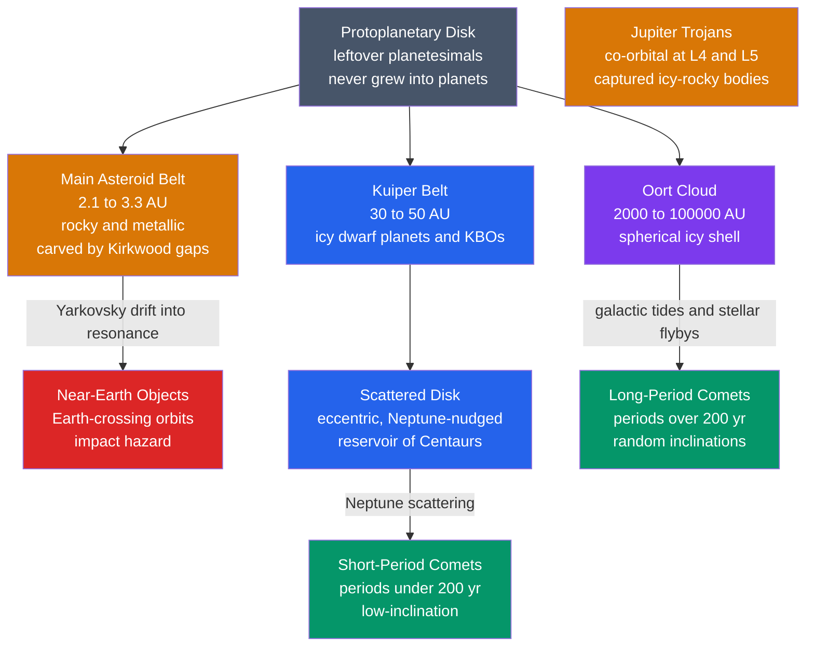

# ☄️ Small Bodies: Asteroids, Comets and KBOs

> [!abstract] TL;DR
> Small bodies are the **leftover planetesimals** the eight planets never swept up — and because they were never melted flat by planet-scale geology, they are the solar system's best-preserved fossils. **Asteroids** are rocky-metallic remnants concentrated in the main belt between Mars and Jupiter, sculpted by Jupiter's resonances into the **Kirkwood gaps**; their C, S and M spectral classes trace the temperature gradient of the disk. **Comets** are ices-and-dust "dirty snowballs" that grow a glowing coma and two tails — a curved dust tail and a straight anti-sunward ion tail — as their ices sublimate near the Sun. Beyond Neptune the **Kuiper Belt**, **scattered disk** and spherical **Oort Cloud** store frozen leftovers and feed short- and long-period comets. **Meteorites** that survive to the ground — especially primitive **chondrites** — date the solar system to $4.567$ Gyr, and impacts have shaped Earth's history up to the **K–Pg extinction**, motivating modern planetary defense.

## Intuition — analogy FIRST

Imagine a construction site after the house is finished. The builders (the planets) swept up most of the bricks and lumber, but scraps still sit in **piles** where the cleanup never reached: a big rubble heap in the side yard (the **main belt**), sawdust and ice shavings pushed to the far edge of the lot (the **Kuiper Belt**), and a faint dusting blown into a huge sphere all around the property (the **Oort Cloud**). Nobody re-melted these scraps, so they still bear the exact **grain and chemistry of the original materials** — the only untouched record of how the house was built.

That is why we spend billions to fly out and grab a handful: a comet or a primitive asteroid is a **time capsule from 4.6 billion years ago**, frozen at the moment of the solar system's birth, while the planets themselves have long since erased that record through melting, weathering and plate tectonics.

---

## How It Works

Small bodies live in **dynamical reservoirs** defined by where the early solar system parked them and which giant planet controls their orbits. Composition tracks *formation temperature*; orbit tracks *delivery history*.



---

## Key Concepts / Details

### Secondary Level

**Asteroids — rocky leftovers.** Most orbit in the **main belt** between Mars ($1.5$ AU) and Jupiter ($5.2$ AU). They are irregular chunks of rock and metal; the largest, **Ceres** ($\sim940$ km), is round enough to count as a **dwarf planet**. The belt is mostly empty — total mass is only about $4\%$ of the Moon — so the movie image of dodging boulders is wrong.

**Comets — dirty snowballs.** A comet's solid **nucleus** (a few km of ice, dust and frozen gas) is inert far from the Sun. As it approaches, sunlight vaporizes the ices, releasing gas and dust that form a glowing **coma** (fuzzy head) and two **tails**. Comets return from the cold outer solar system on long, stretched orbits.

**Meteoroid, meteor, meteorite.** A **meteoroid** is a small chunk in space; a **meteor** ("shooting star") is the streak of light as it burns in the atmosphere; a **meteorite** is the piece that survives to the ground. **Meteor showers** (Perseids, Leonids) happen when Earth plows through the dusty trail left by a comet.

**Pluto and dwarf planets.** In 2006 the IAU reclassified **Pluto** as a **dwarf planet** because it shares its orbital zone with countless other **Kuiper Belt objects** — it never "cleared its neighborhood." Its cousins include **Eris**, **Makemake** and **Haumea**.

### Undergraduate Level

**Kirkwood gaps and resonances.** The main belt is not smooth: it has depleted **Kirkwood gaps** at orbital periods that are simple fractions of Jupiter's. An asteroid at the **3:1 resonance** ($a \approx 2.5$ AU) gets a repeated kick at the same orbital phase, pumping up its eccentricity until it crosses a planet's orbit and is ejected. This is *why no fifth terrestrial planet formed here* — Jupiter's gravity stirred the planetesimals to destructive speeds. See [[Orbital_Mechanics_and_Celestial_Dynamics]].

**Compositional classes trace the disk temperature gradient.** Spectral type correlates with heliocentric distance:

| Class | Composition | Albedo | Belt location | Records |
|-------|-------------|--------|---------------|---------|
| **C-type** | Carbonaceous, hydrated, organics | Dark ($\sim0.05$) | Outer belt | Volatile-rich, cold formation |
| **S-type** | Silicate + Fe-Ni metal | Moderate ($\sim0.2$) | Inner belt | Heated, partly differentiated |
| **M-type** | Metallic (Fe-Ni) | Moderate | Mid belt | Cores of shattered parent bodies |

The trend reflects the **snow line**: inside it, ices could not condense, so inner bodies are dry and rocky; beyond it, volatiles survived.

**Rubble piles.** Many asteroids are not solid rock but gravitationally bound **rubble piles** — reaccumulated collisional debris with $30$–$50\%$ porosity, held by their own weak gravity. This matters for deflection: pushing a loose pile is very different from pushing a monolith.

**Comet tails and their geometry.** Two distinct tails form:

- **Dust tail** — micron-sized grains pushed out by radiation pressure; because grains keep orbital momentum, the tail is **broad and curved**, lagging the nucleus.
- **Ion (plasma) tail** — gas ionized by UV and swept by the **solar wind**; it points **straight anti-sunward** regardless of the comet's motion, and glows blue from CO$^{+}$.

Sublimation-driven activity ramps up steeply inside $\sim3$ AU, where water ice sublimates.

**Where comets come from.** **Short-period comets** (period $<200$ yr, low inclination) are **Jupiter-family comets** fed from the flattened **Kuiper Belt / scattered disk**. **Long-period comets** (period up to millions of years, *random* inclinations) fall in from the spherical **Oort Cloud**, nudged loose by galactic tides and passing stars. The **Tisserand parameter with respect to Jupiter** $T_J$ formally separates asteroids ($T_J > 3$) from comets ($T_J < 3$).

**Chondrites date the solar system.** Undifferentiated **chondritic** meteorites contain **calcium–aluminium-rich inclusions (CAIs)** — the first solids to condense. Radiometric ages of CAIs give $4.567$ Gyr, our anchor for $t=0$. See [[Radiometric_Dating]] and [[Formation_of_the_Solar_System]].

### Graduate Level

**The Yarkovsky effect — how NEOs are delivered.** A spinning asteroid absorbs sunlight and re-radiates it as thermal photons, but from the **afternoon side**, which has rotated past noon and is warmest. The recoil of those photons is a tiny, *asymmetric* thrust that slowly changes the semimajor axis:

$$\frac{da}{dt} \propto \frac{L_\odot \, R^2}{m\,a^2}\cos\gamma \sim \frac{1}{\rho R}$$

Smaller bodies drift faster (the effect scales as $1/R$). Over $\sim10^6$–$10^8$ yr, Yarkovsky drift walks belt asteroids into a resonance (e.g. 3:1 or $\nu_6$), which then pumps eccentricity and injects them onto **Earth-crossing (NEO)** orbits — solving the puzzle of why the belt keeps resupplying impactors despite short NEO lifetimes. The related **YORP effect** torques the *spin* and can spin rubble piles to fission.

**Non-gravitational forces on comets.** Anisotropic outgassing gives the nucleus a **rocket thrust**; the standard Marsden model adds radial and transverse acceleration terms $A_1, A_2$ scaling with a sublimation function $g(r)$. These non-gravitational terms shift comet return times by days and, for interstellar object 1I/'Oumuamua, produced a controversial unexplained acceleration.

**Impact energy and the size–frequency distribution.** The impactor population follows a power law $N(>D)\propto D^{-b}$; small impacts are common, giant ones rare. The kinetic energy delivered scales as $E \propto \rho D^3 v^2$ — a factor of $10$ in diameter is a factor of $1000$ in energy, which is why the hazard is dominated by the rare large end.

```python
# Impact kinetic energy (in megatons of TNT) vs impactor size and speed,
# benchmarked against real events. E = 0.5 * m * v^2, m = rho * (4/3) * pi * r^3.
import numpy as np

MT_TNT = 4.184e15          # joules per megaton of TNT

def impact_energy_Mt(diameter_m, velocity_kms, density=3000.0):
    r = diameter_m / 2.0
    volume = (4.0 / 3.0) * np.pi * r**3
    mass = density * volume            # kg
    v = velocity_kms * 1e3             # m/s
    E = 0.5 * mass * v**2              # joules
    return E / MT_TNT                  # megatons TNT

events = [
    #  name          D (m)     v (km/s)  rho (kg/m^3)
    ("Chelyabinsk",   19,       19,       3300),   # 2013 airburst, ~0.5 Mt
    ("Tunguska",      60,       20,       3000),   # 1908 airburst, flattened forest
    ("Meteor Crater", 45,       13,       7800),   # iron impactor, Arizona
    ("Chicxulub",     10_000,   20,       3000),   # K-Pg dinosaur killer
]

print(f"{'Event':<14}{'D (m)':>9}{'v (km/s)':>10}{'Energy (Mt TNT)':>20}")
for name, D, v, rho in events:
    E = impact_energy_Mt(D, v, rho)
    print(f"{name:<14}{D:>9}{v:>10}{E:>20.3g}")

# Rough scale references: Hiroshima ~ 0.015 Mt; largest H-bomb (Tsar) ~ 50 Mt.
```

Expected output (order-of-magnitude): Chelyabinsk $\sim0.6$ Mt, Tunguska $\sim16$ Mt, Meteor Crater $\sim10$ Mt, **Chicxulub $\sim7\times10^{7}$ Mt** — a hundred-million-Hiroshima blow that drove the K–Pg mass extinction.

---

## Real-World Notes

- **DART (2022) — planetary defense proven.** NASA's Double Asteroid Redirection Test slammed into the moonlet **Dimorphos**, shortening its orbit around **Didymos** by $\sim33$ minutes — the first demonstration that we can deflect an asteroid by kinetic impact.
- **OSIRIS-REx (2023) — sample return from Bennu.** Delivered $\sim120$ g of a **C-type** asteroid to Earth; Bennu proved to be a loose **rubble pile** rich in carbon and hydrated clays — raw ingredients of prebiotic chemistry.
- **Hayabusa & Hayabusa2 (JAXA).** Returned grains from **S-type Itokawa** (2010) and **C-type Ryugu** (2020); Ryugu samples contain amino acids and the nucleobase uracil, tying [[Astrobiology_and_Habitability]] to small bodies.
- **Rosetta (2014–2016).** Orbited comet **67P/Churyumov–Gerasimenko** and dropped the **Philae** lander; measured its bilobed "rubber duck" shape and a D/H ratio unlike Earth's oceans, complicating the "comets brought our water" story.
- **New Horizons (2015, 2019).** Flew past **Pluto** — revealing nitrogen-ice glaciers and a young surface — then the cold-classical KBO **Arrokoth**, a pristine contact-binary planetesimal.
- **K–Pg impact.** The $\sim10$ km Chicxulub impactor $\sim66$ Myr ago is the type example of an impact-driven **mass extinction**; the global iridium anomaly and shocked quartz are its fingerprints. See [[Mass_Extinctions_and_Paleoclimate]].

---

## Common Pitfalls

1. **Confusing meteoroid / meteor / meteorite.** They are *object in space* / *light streak* / *rock on the ground* — three names for three stages of one event, not synonyms.
2. **"Pluto was demoted for being small."** No — it is the *third* criterion that fails: Pluto has **not cleared its orbital neighborhood** of comparable bodies. Ceres and Eris are dwarf planets for the same reason, and Eris is actually more massive than Pluto.
3. **Drawing both comet tails pointing backward along the orbit.** The **ion tail always points anti-sunward**; only the heavier **dust tail** curves and lags behind the motion. Near perihelion a tail can even point *ahead* of the comet.
4. **Treating the asteroid belt as densely packed.** Average separation between sizable asteroids is $\sim1$ million km; spacecraft cross it routinely without collision risk.
5. **Assuming all comets are Oort-Cloud objects.** Short-period (Jupiter-family) comets come from the *flattened* Kuiper Belt / scattered disk; only long-period comets with random inclinations trace the *spherical* Oort Cloud.
6. **Ignoring density and porosity in impact/deflection estimates.** A porous rubble pile absorbs momentum differently than a solid; using bulk-rock density for a $30\%$-porous body over- or under-estimates both impact energy and deflection $\Delta v$.

---

## Related Concepts

- [[_MOC_Solar_System|↑ Section MOC]]
- [[Formation_of_the_Solar_System]] — small bodies are the surviving planetesimals; chondrite ages set the $t=0$ of the whole story
- [[Orbital_Mechanics_and_Celestial_Dynamics]] — resonances, Kirkwood gaps, Lagrange points (Trojans) and the Tisserand parameter govern where small bodies live
- [[Terrestrial_Planets]] — built from the same rocky planetesimals; impacts still resurface and cratered their histories
- [[Giant_Planets_and_Their_Moons]] — Jupiter's gravity dictates the belt's structure and scatters comets inward
- [[Exoplanets_and_Detection_Methods]] — debris disks and exocomets are the small-body reservoirs of other systems
- [[Astrobiology_and_Habitability]] — comets and carbonaceous asteroids may have delivered water and organics to early Earth
- [[Work_Energy_and_Conservation]] (Physics) — impact hazard is pure kinetic energy $\tfrac12 mv^2$ converted to blast
- [[Mass_Extinctions_and_Paleoclimate]] (Earth Science) — the K–Pg impact and its planetary-scale aftermath
- [[Radiometric_Dating]] (Earth Science) — how CAI and chondrite ages pin the solar system at $4.567$ Gyr
- [[_MOC_Mathematics_Master]] (Mathematics) — power-law size–frequency distributions and orbital dynamics

---

## Review Questions

1. **Secondary**: Explain the difference between a comet's coma, dust tail and ion tail, and describe how a comet changes as it moves from beyond Jupiter's orbit to close to the Sun and back.
2. **Undergraduate**: Why did no planet form in the asteroid belt, and how do the Kirkwood gaps arise? Contrast the dynamical origins of short-period versus long-period comets, and state one observable that distinguishes their populations.
3. **Graduate**: Describe the Yarkovsky effect and derive qualitatively why it scales as $1/R$. Explain how it, combined with mean-motion resonances, resupplies the near-Earth object population despite NEO dynamical lifetimes being only a few million years.

---

## Sources

- de Pater & Lissauer — *Planetary Sciences*, 2nd ed., Ch. 9–10 (small bodies, comets)
- Bottke et al. (2006) — "The Yarkovsky and YORP Effects," *Annu. Rev. Earth Planet. Sci.* 34, 157
- IAU Resolution B5 (2006) — definition of "planet" and "dwarf planet"
- Collins, Melosh & Marcus (2005) — "Earth Impact Effects Program," *Meteoritics & Planetary Science* 40, 817
- NASA — DART mission results; OSIRIS-REx Bennu sample analysis; New Horizons Pluto/Arrokoth flybys

#astronomy #planetary-science #asteroids #comets #kuiper-belt #meteorites #impacts #planetary-defense #secondary #undergraduate #graduate
