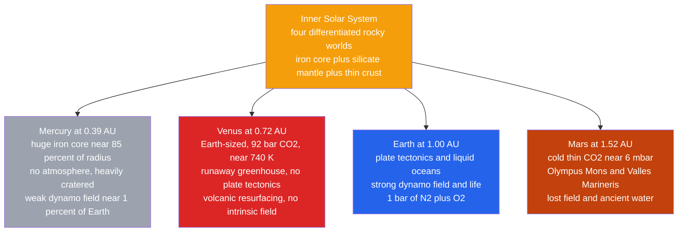

# 🌍 Terrestrial Planets

> [!abstract] TL;DR
> The four **terrestrial (rocky) planets** — Mercury, Venus, Earth, and Mars — share a common blueprint: a **differentiated interior** of a dense iron core, a silicate mantle, and a thin crust (see [[Earth_Internal_Structure]]). Yet they diverged dramatically. **Mercury** is a tiny, airless, iron-dominated cinder with a surprising weak magnetic field; **Venus** is Earth's near-twin in size but a runaway-greenhouse furnace at $\sim 740$ K under $\sim 92$ bar of $\mathrm{CO_2}$; **Earth** alone has plate tectonics, oceans, a strong dynamo, and life; **Mars** is a cold, half-sized world with the Solar System's largest volcano, ancient river valleys, and a long-dead magnetic field. Their differences are governed by three master variables: **distance from the Sun**, **planet size** (which controls how long an interior stays hot), and **atmospheric evolution** (greenhouse warming and escape).

## Intuition — analogy FIRST

Think of four campfires lit from the same pile of wood but of different sizes, set at different distances from a heat lamp. A **small** fire (Mercury, Mars) burns out fast — it has lots of surface to lose heat through and little bulk to store it, so it goes cold and geologically "dies." A **large** fire (Earth, Venus) holds its embers far longer and stays internally active for billions of years. Now wrap some of the fires in a blanket: the blanket is the **atmosphere**, and the greenhouse effect is how well it traps heat. Venus wears a suffocating thick blanket and roasts; Earth wears a light one and is comfortable; Mars's blanket is threadbare; Mercury has none at all.

Distance sets how much sunlight each receives; **size** sets how long its interior engine runs; and the **blanket** decides the surface climate. Almost every contrast among the rocky planets falls out of these three knobs.

---

## How It Works

All four formed by accretion inside the "snow line," where it was too warm for ices to condense, so they built from rock and metal (see [[Formation_of_the_Solar_System]]). Each grew hot enough to melt and **differentiate**: dense iron sank to form a core, lighter silicates floated up as mantle and crust. What happened next — whether the interior kept convecting, whether a dynamo ran, whether an atmosphere was held or lost — depended on size, distance, and chance.



---

## Key Concepts / Details

### Secondary Level

**A shared anatomy.** Every terrestrial planet is **differentiated**: a metallic iron–nickel core, a rocky silicate mantle, and a thin crust. High bulk **densities** ($\sim 4$–$5.5\ \mathrm{g\,cm^{-3}}$) reveal the metal; the giant planets, made of gas and ice, are far less dense.

| Property | Mercury | Venus | Earth | Mars |
|---|---|---|---|---|
| Distance $d$ (AU) | 0.39 | 0.72 | 1.00 | 1.52 |
| Radius (Earth $=1$) | 0.38 | 0.95 | 1.00 | 0.53 |
| Mass (Earth $=1$) | 0.055 | 0.815 | 1.00 | 0.107 |
| Density ($\mathrm{g\,cm^{-3}}$) | 5.43 | 5.24 | 5.51 | 3.93 |
| Atmosphere | none | $92$ bar $\mathrm{CO_2}$ | $1$ bar $\mathrm{N_2/O_2}$ | $6$ mbar $\mathrm{CO_2}$ |
| Mean surface $T$ (K) | $100$–$700$ | $737$ | $288$ | $210$ |
| Bond albedo $A$ | 0.088 | 0.76 | 0.31 | 0.25 |
| Rotation period | 58.6 d | 243 d (retro) | 23.9 h | 24.6 h |
| Magnetic field | weak ($\sim 1\%$) | none intrinsic | strong dynamo | crustal remnant |
| Moons | 0 | 0 | 1 | 2 |

**Planet by planet.**
- **Mercury** — the smallest planet, with an outsized iron core (about $85\%$ of its radius, likely a mantle stripped by a giant impact). Airless, so its dayside bakes near $700$ K while the nightside plunges to $\sim 100$ K — the largest day–night swing of any planet. Its heavily cratered face (the $1{,}550$-km Caloris Basin) preserves the ancient bombardment.
- **Venus** — Earth's "twin" in size and mass, but its $\sim 92$ bar $\mathrm{CO_2}$ atmosphere traps heat so effectively that the surface sits at $\sim 740$ K — hotter than Mercury despite being twice as far from the Sun. It rotates **backwards** and very slowly, has no plate tectonics, and was globally **resurfaced by volcanism** a few hundred million years ago.
- **Earth** — the only planet with **plate tectonics**, abundant **liquid water**, a strong **dynamo** magnetic field, and **life**. Its moderate greenhouse keeps the mean surface at a habitable $288$ K.
- **Mars** — cold and half Earth's size, with a wispy $\mathrm{CO_2}$ atmosphere near $6$ mbar. It hosts **Olympus Mons** (the tallest volcano, $\sim 22$ km) and **Valles Marineris** (a canyon $\sim 4{,}000$ km long), plus dry riverbeds and deltas showing ancient flowing water.

**Surfaces are shaped by four processes:** impact **cratering**, **volcanism** (see [[Volcanism_and_Volcanic_Hazards]]), **tectonics**, and **erosion** by wind or water. A crater-saturated surface (Mercury, the Moon) is old; a smooth one (Venus, most of Earth) has been recently resurfaced.

### Undergraduate Level

**Equilibrium temperature.** Balancing absorbed sunlight against thermal re-radiation gives a planet's **equilibrium temperature** — the temperature it would have with *no* atmosphere:

$$T_{eq} = T_\odot\sqrt{\frac{R_\odot}{2d}}\,(1-A)^{1/4}$$

where $A$ is the **Bond albedo** (fraction of sunlight reflected). Note $T_{eq}$ depends only on distance and reflectivity — **not** on planet size. Plugging in the numbers gives $T_{eq}\approx 437$ K (Mercury), $229$ K (Venus), $255$ K (Earth), $210$ K (Mars).

**Why Venus is hotter than Mercury.** Venus's equilibrium temperature ($229$ K) is actually *lower* than Mercury's because its bright clouds reflect $76\%$ of incoming light. The extra $\sim 500$ K comes entirely from the **greenhouse effect**: $\mathrm{CO_2}$ is transparent to visible sunlight but opaque to outgoing infrared, so heat is trapped. This is the single most dramatic climate contrast in the Solar System and a cautionary tale about runaway warming.

**Size controls geological longevity.** A planet's internal heat (primordial plus radioactive decay) scales with **volume** $\propto R^3$, but it is lost through the **surface** $\propto R^2$. The characteristic cooling time therefore scales as

$$\tau_{cool}\sim \frac{\text{heat content}}{\text{loss rate}}\propto \frac{R^3}{R^2}=R.$$

Bigger planets stay hot longer. Small **Mercury** and **Mars** froze their interiors early, shutting down volcanism, tectonics, and their dynamos; large **Earth** is still vigorously active.

**Magnetic fields and atmospheric retention.** A **dynamo** requires a convecting, electrically conducting liquid core (see [[Geomagnetism_and_Paleomagnetism]]). Earth's field deflects the solar wind and helps shield its atmosphere. **Mars** lost its dynamo $\sim 4$ billion years ago; the unshielded solar wind then stripped much of its air, leaving today's thin atmosphere. **Venus**, despite lacking an intrinsic field, retains a massive atmosphere thanks to its strong gravity and vast $\mathrm{CO_2}$ reservoir (an *induced* magnetosphere forms as the solar wind drapes over its ionosphere).

### Graduate Level

**Deriving the energy balance.** Equate the intercepted, absorbed stellar power to the emitted thermal power of a rapidly rotating (isothermal) blackbody sphere:

$$\underbrace{(1-A)\,\frac{L_\odot}{4\pi d^2}\,\pi R_p^2}_{\text{absorbed}}=\underbrace{4\pi R_p^2\,\sigma T_{eq}^4}_{\text{emitted}}$$

The planet radius $R_p$ cancels. Using $L_\odot=4\pi R_\odot^2\sigma T_\odot^4$,

$$T_{eq}=\left[\frac{(1-A)\,L_\odot}{16\pi\sigma d^2}\right]^{1/4}=T_\odot\sqrt{\frac{R_\odot}{2d}}\,(1-A)^{1/4}.$$

For a **slow rotator** (permanent dayside) the emitting area is $2\pi R_p^2$, raising the subsolar temperature by $2^{1/4}\approx 1.19$. This is the framework behind [[Laws_of_Thermodynamics]] applied to a planetary radiation budget.

**Greenhouse forcing.** In a single-layer grey model, an atmosphere opaque in the infrared re-radiates half its absorbed flux back down; solving the coupled surface–atmosphere balance gives a surface temperature

$$T_{surf}=(1+\tfrac{1}{2}\tau)^{1/4}\,T_{eq},$$

where $\tau$ is the infrared optical depth. Earth ($\tau\sim 1$) is warmed $\sim 33$ K; Venus ($\tau\sim 100$s) is warmed $\sim 500$ K. Once oceans evaporate, water vapour — itself a greenhouse gas — amplifies warming in a positive feedback: the **runaway greenhouse** that likely dried Venus.

**Thermal and impact history.** The rocky planets record a shared early **heavy bombardment** and internal heat driven by accretion, core formation, short-lived radionuclides ($^{26}\mathrm{Al}$), and long-lived $^{40}\mathrm{K},\,^{232}\mathrm{Th},\,^{235,238}\mathrm{U}$. Because $\tau_{cool}\propto R$, small bodies cooled fastest: Mars's volcanism dwindled while Earth's persists. **Venus** is the puzzle — Earth-sized yet with a **stagnant lid** rather than plate tectonics, possibly because a dry lithosphere is too strong to break into mobile plates (contrast [[Plate_Boundaries_and_Plate_Motions]]).

**Atmospheric escape.** Whether a planet keeps its air depends on the ratio of gravitational binding to thermal energy, the **Jeans escape parameter**

$$\lambda=\frac{v_{esc}^2}{2\,v_{th}^2}=\frac{G M_p m}{k_B T\,r},$$

with thermal (non-thermal, sputtering, hydrodynamic) losses added on top. Low-mass, warm Mars leaks light gases readily; massive Venus and Earth retain heavier molecules.

```python
import numpy as np

# --- Physical constants ---
T_sun = 5772.0      # Sun effective temperature, K
R_sun = 6.957e8     # Sun radius, m
AU    = 1.496e11    # astronomical unit, m

def equilibrium_temperature(distance_AU, bond_albedo):
    """Isothermal (fast-rotator) equilibrium temperature in K:
    T_eq = T_sun * sqrt(R_sun / (2 d)) * (1 - A)**(1/4)."""
    d = distance_AU * AU
    return T_sun * np.sqrt(R_sun / (2.0 * d)) * (1.0 - bond_albedo) ** 0.25

# distance (AU), Bond albedo, observed mean surface temperature (K)
planets = {
    "Mercury": (0.387, 0.088, 440.0),
    "Venus":   (0.723, 0.760, 737.0),
    "Earth":   (1.000, 0.306, 288.0),
    "Mars":    (1.524, 0.250, 210.0),
}

print(f"{'Planet':8}{'T_eq (K)':>10}{'T_obs (K)':>11}{'Greenhouse (K)':>16}")
for name, (d, A, T_obs) in planets.items():
    T_eq  = equilibrium_temperature(d, A)      # airless prediction
    green = T_obs - T_eq                        # greenhouse warming needed
    print(f"{name:8}{T_eq:10.0f}{T_obs:11.0f}{green:16.0f}")

# Venus is COOLER than Earth in equilibrium (bright clouds, A = 0.76),
# yet its ~92 bar CO2 blanket adds ~500 K -- the largest greenhouse in the Solar System.
```

Running it shows near-zero greenhouse for airless Mercury and thin-aired Mars, $\sim 33$ K for Earth, and a colossal $\sim 500$ K for Venus.

---

## Real-World Notes

- **MESSENGER** (2011–2015) mapped Mercury's weak, offset dipole field and confirmed its oversized core, supporting the giant-impact mantle-stripping hypothesis.
- **Venus resurfacing:** the near-uniform crater population imaged by **Magellan** implies a global volcanic resurfacing event $\sim 300$–$600$ Myr ago; the upcoming **VERITAS** and **DAVINCI** and **EnVision** missions will probe whether Venus is still volcanically active.
- **MAVEN** measured present-day atmospheric loss at Mars and, extrapolated back, showed the solar wind could have stripped a once-thick $\mathrm{CO_2}$ atmosphere after the dynamo died — linking magnetism to climate.
- **Mars water record:** rovers (Curiosity, Perseverance) found clay minerals, cross-bedded sediments, and ancient river deltas, confirming long-lived liquid water $\gtrsim 3.5$ Gyr ago when the atmosphere was thicker and warmer.
- **Earth as the control case:** only Earth couples a strong dynamo, plate tectonics, and a carbonate–silicate cycle that thermostats $\mathrm{CO_2}$ over geologic time — a stabilising feedback Venus and Mars both lack.
- **Comparative climatology** of these four worlds directly informs models of Earth's own greenhouse and the search for habitable exoplanets (see [[Exoplanets_and_Detection_Methods]]).

---

## Common Pitfalls

1. **"Closest to the Sun means hottest."** *Wrong:* Venus, farther out, is hotter than Mercury. The greenhouse effect and albedo dominate over raw distance.
2. **Confusing Bond and geometric albedo.** *Why it matters:* $T_{eq}$ requires the **Bond albedo** (total reflected fraction), not the geometric albedo. For Venus these differ ($0.76$ vs $0.69$) and the wrong one shifts $T_{eq}$ by tens of kelvin.
3. **Assuming size sets surface temperature.** *No:* $T_{eq}$ is independent of planet radius. Size instead controls **interior** longevity (cooling time $\propto R$), not the equilibrium climate.
4. **Thinking Venus's slow spin causes its heat.** *No:* the thick $\mathrm{CO_2}$ greenhouse does. Efficient atmospheric circulation keeps Venus nearly isothermal (day = night) despite its $243$-day rotation.
5. **"No magnetic field means no atmosphere."** *Not necessarily:* Venus has no intrinsic dynamo yet keeps a $92$ bar atmosphere. Retention depends on gravity, supply, and escape rates, not the field alone.
6. **Reading crater density backwards.** *Remember:* **more** craters means an **older**, undisturbed surface; a smooth surface is **young** because volcanism or erosion erased the record.

---

## Related Concepts

- [[_MOC_Solar_System|↑ Section MOC]]
- [[Formation_of_the_Solar_System]] — why rocky planets formed inside the snow line from metal and silicate
- [[Orbital_Mechanics_and_Celestial_Dynamics]] — the orbits and spin–orbit resonances (Mercury's 3:2, Venus's retrograde spin)
- [[Giant_Planets_and_Their_Moons]] — the gas and ice giants beyond, the terrestrial planets' structural opposites
- [[Small_Bodies_Asteroids_Comets_and_KBOs]] — the impactors that cratered these surfaces and delivered volatiles
- [[Exoplanets_and_Detection_Methods]] — rocky exoplanets are classified by analogy to these four worlds
- [[Astrobiology_and_Habitability]] — the habitable zone and why only Earth developed life
- [[Earth_Internal_Structure]] — the differentiated core–mantle–crust model, template for all four (Earth Science vault)
- [[Volcanism_and_Volcanic_Hazards]] — the resurfacing process seen on Venus, Mars, and Earth (Earth Science vault)
- [[Plate_Boundaries_and_Plate_Motions]] — the tectonic style unique to Earth among the four (Earth Science vault)
- [[Geomagnetism_and_Paleomagnetism]] — the dynamo behind planetary magnetic fields (Earth Science vault)
- [[Laws_of_Thermodynamics]] — the radiation-balance and greenhouse physics of planetary energy budgets (Physics vault)
- [[_MOC_Mathematics_Master]] — the algebra and calculus behind the energy-balance derivation (Mathematics vault)

---

## Review Questions

1. **Secondary**: Rank Mercury, Venus, Earth, and Mars by mean surface temperature, and explain in one sentence why the order is *not* simply by distance from the Sun.
2. **Undergraduate**: Using $T_{eq}=T_\odot\sqrt{R_\odot/2d}\,(1-A)^{1/4}$, compute Earth's equilibrium temperature ($A=0.31$, $d=1$ AU, $T_\odot=5772$ K, $R_\odot=6.96\times10^8$ m). Compare to the observed $288$ K and explain the difference.
3. **Graduate**: Derive $\tau_{cool}\propto R$ from a volume-heat / surface-loss argument, and use it to explain why Mars is volcanically near-dead while Earth remains active. Then discuss why Venus, despite being Earth-sized, has a stagnant lid rather than plate tectonics.

---

## Sources

- Carroll & Ostlie — *An Introduction to Modern Astrophysics*, 2nd ed., Ch. 19–23 (The Solar System)
- de Pater & Lissauer — *Planetary Sciences*, 2nd ed.
- Karttunen et al. — *Fundamental Astronomy*, 6th ed., Ch. 7 (The Solar System)
- NASA Planetary Fact Sheets — nssdc.gsfc.nasa.gov/planetary/factsheet
- Catling & Kasting — *Atmospheric Evolution on Inhabited and Lifeless Worlds*

#astronomy #planetary-science #terrestrial-planets #comparative-planetology #greenhouse-effect #equilibrium-temperature #mercury #venus #earth #mars #secondary #undergraduate #graduate
