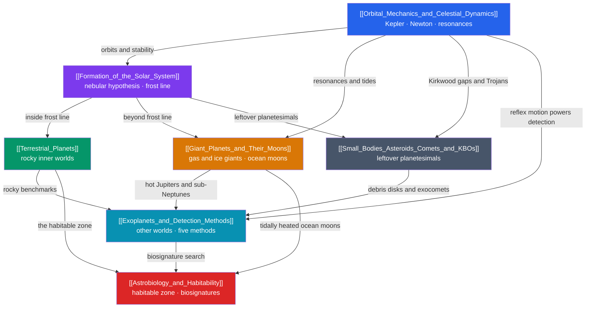

# 🪐 Solar System & Planetary Science — Map of Content

> [!abstract] What This Section Covers
> This section tours our own cosmic neighborhood from birth to biology. It opens with the **nebular hypothesis** — how a collapsing molecular cloud spun into a protoplanetary disk whose **frost line** split the inner rocky worlds from the outer giants — then lays down the **orbital mechanics** (Kepler, Newton, resonances, Lagrange points) that govern every body's motion. From there it surveys the **terrestrial planets** (Mercury, Venus, Earth, Mars and their divergent climates), the **giant planets and their ocean-bearing moons** (metallic hydrogen, tidal heating, the Galilean resonance), and the **small bodies** — asteroids, comets, and Kuiper Belt objects — that are the solar system's best-preserved fossils. It closes by turning outward to **exoplanets** and the five detection methods that revealed thousands of other worlds, and to **astrobiology**, which asks where in all of this life could arise. Every note opens at secondary level with an everyday analogy and deepens to graduate-level physics with worked Python.

## Concept Map

*(Purple = origin, blue = governing dynamics, green/orange/grey = the bodies themselves, teal = other systems, red = life.)*

## Learning Path

*Recommended order for a first pass through this section:*

1. [[Formation_of_the_Solar_System]] — start at the beginning: how one spinning cloud and a single frost line seeded every planet, moon, and comet that follows.
2. [[Orbital_Mechanics_and_Celestial_Dynamics]] — the physics of motion under gravity: Kepler's laws, Newton's derivation, vis-viva, Lagrange points, and resonances that shape everything else.
3. [[Terrestrial_Planets]] — the four rocky inner worlds, and why distance, size, and atmosphere made Earth habitable while Venus roasts and Mars froze.
4. [[Giant_Planets_and_Their_Moons]] — the gas and ice giants, metallic-hydrogen dynamos, and the tidally heated ocean moons that are their real wonders.
5. [[Small_Bodies_Asteroids_Comets_and_KBOs]] — the leftover planetesimals: asteroid belt, comets, the Kuiper Belt and Oort Cloud, meteorites, and impact hazard.
6. [[Exoplanets_and_Detection_Methods]] — turning outward: radial velocity, transits, imaging, microlensing, and astrometry, and the diverse worlds they revealed.
7. [[Astrobiology_and_Habitability]] — the payoff: the habitable zone, extremophiles, ocean worlds, biosignatures, and the Drake equation and Fermi paradox.

## All Notes at a Glance

| Note | Difficulty | What You'll Learn |
|------|------------|-------------------|
| [[Formation_of_the_Solar_System]] | Secondary → Graduate | Nebular hypothesis, protoplanetary disks, the frost line, planetesimal and core accretion, disk evolution, and planet migration (Nice, Grand Tack) |
| [[Orbital_Mechanics_and_Celestial_Dynamics]] | Secondary → Graduate | Kepler's laws, the two-body problem, conic-section orbits, vis-viva, orbital elements, Lagrange points, resonances, and orbital chaos |
| [[Terrestrial_Planets]] | Secondary → Graduate | Comparative planetology of Mercury/Venus/Earth/Mars, equilibrium temperature, the greenhouse effect, dynamos, and atmospheric escape |
| [[Giant_Planets_and_Their_Moons]] | Secondary → Graduate | Gas vs ice giants, metallic hydrogen and dynamos, internal heat, rings and the Roche limit, and tidal heating of ocean moons |
| [[Small_Bodies_Asteroids_Comets_and_KBOs]] | Secondary → Graduate | Asteroid belt and Kirkwood gaps, comet anatomy and tails, the Kuiper Belt and Oort Cloud, meteorites, the Yarkovsky effect, and impact hazard |
| [[Exoplanets_and_Detection_Methods]] | Secondary → Graduate | The five detection methods, transit depth and RV semi-amplitude, mass–radius–density, TTVs, atmospheric spectroscopy, and the radius gap |
| [[Astrobiology_and_Habitability]] | Secondary → Graduate | Requirements for life, the circumstellar habitable zone, extremophiles, ocean worlds, biosignatures, and the Drake equation and Fermi paradox |

## Key Questions This Section Answers

- Why are the inner planets small and rocky while the outer ones are gas- and ice-rich giants — and what single temperature boundary in the disk decides it?
- How does one force (gravity) and one launch speed determine whether a body falls back, circles, or escapes — and how do we "weigh the cosmos" from orbits?
- Why is Venus hotter than Mercury despite being farther from the Sun, and why is Earth the only rocky planet with plate tectonics, oceans, and life?
- How can a tiny moon five times farther from the Sun than Earth be the most volcanically active body in the solar system?
- Why is Pluto a dwarf planet, where do short- vs long-period comets come from, and how do belt asteroids get resupplied onto Earth-crossing orbits?
- If a star outshines its planets by a factor of $10^6$–$10^{10}$, how do we detect and characterize thousands of exoplanets — and where might life be hiding?

## Related Sections

- [[_MOC_Astronomy_Master|↑ Astronomy Master MOC]]
- [[_MOC_Observational_Astronomy|→ Observational Astronomy]] — the telescopes, spectroscopy, and photometry that make planetary and exoplanet detection possible
- [[_MOC_Stellar_Astrophysics|→ Stellar Astrophysics]] — the Sun and stellar habitable zones that set the stage for every planetary system
- **Physics** — [[Newtons_Laws_and_Kinematics]] and [[Rotational_Dynamics]] underlie orbits and disk spin-up; [[Laws_of_Thermodynamics]] governs planetary energy budgets
- **Earth Science** — [[Earth_Formation_and_Differentiation]] and [[Radiometric_Dating]] connect accretion and meteorite ages to our own planet's origin

#MOC #Astronomy #PlanetaryScience
