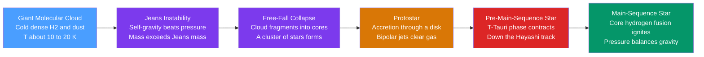

# 🌟 Star Formation

> [!abstract] TL;DR
> Stars are born inside cold, dense **giant molecular clouds** when a clump's self-gravity finally overcomes its internal pressure — the **Jeans instability**, triggered once the mass exceeds the **Jeans mass** $M_J \propto T^{3/2}\rho^{-1/2}$. The clump collapses in a **free-fall time** $t_{ff}\propto\rho^{-1/2}$, fragmenting into many cores (so stars form in clusters). At each center a **protostar** grows by accretion through an angular-momentum-conserving disk that launches **bipolar jets**. The young star then contracts as a **T-Tauri** pre-main-sequence object down the **Hayashi track** until hydrogen ignites and it settles onto the main sequence. Nature makes far more low-mass than high-mass stars — the **initial mass function** — bounded by the $\sim 0.08\,M_\odot$ hydrogen-burning limit below and $\sim 150\,M_\odot$ above.

## Intuition — analogy FIRST

Imagine a crowd in a stadium, everyone jostling and pushing outward — that outward pressure keeps the crowd spread out. Now imagine the crowd is also magnetically drawn toward its own center. As long as the jostling (heat) wins, the crowd stays puffed up. But cool everyone down, or pack in enough people, and gravity wins: the whole thing implodes toward the middle. A star is born when a patch of interstellar gas loses that tug-of-war between its own gravity pulling in and its thermal pressure pushing out.

The trick is that gravity scales with mass while pressure support does not — so there is always a **critical mass** above which any cold clump *must* collapse. Cool the gas or squeeze it denser, and that critical mass shrinks, so smaller and smaller pockets go unstable. That is why one collapsing cloud shatters into a whole nursery of stars rather than a single giant one.

---

## How It Works



### Secondary Level

Stars form from the raw material of the [[The_Interstellar_Medium|interstellar medium]] — specifically from the coldest, densest patches called **giant molecular clouds (GMCs)**: clouds of molecular hydrogen ($\mathrm{H_2}$) and dust, tens of parsecs across, with $10^4$–$10^6\,M_\odot$ of gas at just $10$–$20$ K.

1. **A clump gets over the threshold.** If a region is dense enough and cold enough, its gravity beats its pressure and it starts to fall inward. The critical mass for this is the **Jeans mass**.
2. **Gravitational (free-fall) collapse.** The clump falls in on itself, getting denser and denser at the center.
3. **A protostar forms.** Gas piles onto the center, which heats up into a glowing **protostar**. Because the cloud was slowly spinning, the infalling gas forms a flat **accretion disk** — the same physics as the [[Formation_of_the_Solar_System|birth of our solar system]].
4. **Jets clear the way.** The protostar fires twin **bipolar jets** out its poles, blasting away leftover gas and glowing where they slam into the cloud (**Herbig–Haro objects**).
5. **The star switches on.** The protostar keeps shrinking and heating until its core hits about $10^7$ K — hot enough to **fuse hydrogen into helium**. Fusion pressure now halts the collapse, and a stable **main-sequence** star is born (see [[Stellar_Properties_and_the_HR_Diagram]]).

Because a big cloud breaks into many collapsing cores at once, stars are born in **clusters**, not one at a time.

### Undergraduate Level

**The Jeans criterion.** Compare the thermal (kinetic) and gravitational energies of a uniform cloud of mass $M$, radius $R$, temperature $T$. Using the virial theorem, collapse occurs when $2K < |U|$, i.e. gravity wins. With $K = \tfrac{3}{2}\tfrac{M}{\mu m_H}k_B T$ and $U = -\tfrac{3}{5}\tfrac{GM^2}{R}$, the clump is unstable above the **Jeans mass**:

$$M_J = \left(\frac{5 k_B T}{G\,\mu m_H}\right)^{3/2}\left(\frac{3}{4\pi\rho}\right)^{1/2} \;\propto\; T^{3/2}\,\rho^{-1/2}$$

Equivalently, perturbations larger than the **Jeans length** are unstable (from the dispersion relation $\omega^2 = c_s^2 k^2 - 4\pi G\rho$, with isothermal sound speed $c_s = \sqrt{k_B T/\mu m_H}$):

$$\lambda_J = c_s\sqrt{\frac{\pi}{G\rho}} = \sqrt{\frac{\pi k_B T}{G\,\mu m_H\,\rho}} \;\propto\; T^{1/2}\,\rho^{-1/2}$$

(Order-unity prefactors are convention-dependent — virial vs. dispersion derivations differ by factors of a few.)

| Quantity | Scaling | Meaning |
|----------|---------|---------|
| Jeans mass $M_J$ | $\propto T^{3/2}\rho^{-1/2}$ | Minimum mass that collapses |
| Jeans length $\lambda_J$ | $\propto T^{1/2}\rho^{-1/2}$ | Minimum unstable size |
| Free-fall time $t_{ff}$ | $\propto \rho^{-1/2}$ | Collapse timescale |

**Fragmentation.** As an isothermal cloud collapses, $\rho$ rises but $T$ stays near $10$ K (efficient cooling by dust and molecular lines), so $M_J\propto\rho^{-1/2}$ *falls*. Sub-regions that were stable become unstable, so the cloud **fragments hierarchically** into ever-smaller cores — this is why one GMC yields a whole star cluster with a range of masses.

**Beyond thermal support.** Real clouds are also held up by **supersonic turbulence** and **magnetic fields**, not just thermal pressure. Turbulence supports a cloud globally but shocks it into dense filaments locally; magnetic tension resists collapse across field lines. The relevant magnetic criterion is the **mass-to-flux ratio** $M/\Phi$: *subcritical* cores ($M/\Phi$ small) are magnetically supported and cannot collapse, while *supercritical* cores can.

**The protostellar stages and pre-main-sequence contraction.** Infall conserves angular momentum, building an **accretion disk** that funnels mass inward and launches magnetocentrifugal **jets/outflows**. Once accretion tapers off, the object is a **T-Tauri star** (low mass) or **Herbig Ae/Be star** (intermediate mass): fully convective, it contracts on the **Kelvin–Helmholtz timescale**, radiating away gravitational energy. On the HR diagram it descends the nearly vertical **Hayashi track** (dropping in luminosity at almost fixed $T_\mathrm{eff}$), then may turn onto the horizontal **Henyey track** before hydrogen ignition lands it on the **main sequence**.

**The initial mass function (IMF).** The distribution of birth masses is steeply bottom-heavy. For $m \gtrsim 0.5\,M_\odot$, Salpeter (1955) found $\xi(m)\,dm \propto m^{-2.35}\,dm$ — many more small stars than large. Below the **hydrogen-burning limit** ($\approx 0.08\,M_\odot$), objects become **brown dwarfs** (they fuse deuterium but never hydrogen); the upper end reaches $\sim 150$–$300\,M_\odot$.

### Graduate Level

**Free-fall time.** For a pressureless uniform sphere, every mass shell reaches the center in

$$t_{ff} = \sqrt{\frac{3\pi}{32\,G\rho}} \;\approx\; 1\ \mathrm{Myr}\left(\frac{n}{10^3\,\mathrm{cm^{-3}}}\right)^{-1/2}$$

**The low star-formation efficiency.** If clouds simply collapsed in a free-fall time, the Galaxy would convert its entire $\sim 10^9\,M_\odot$ of molecular gas into stars within $\sim 10$–$100$ Myr, giving a Milky-Way star-formation rate $\sim 100$–$1000\,M_\odot\,\mathrm{yr^{-1}}$. The observed rate is only $\sim 1$–$2\,M_\odot\,\mathrm{yr^{-1}}$. Equivalently, the **star-formation efficiency per free-fall time** is only $\varepsilon_{ff}\sim 0.01$ (Krumholz & McKee 2005). Something strongly *regulates* collapse.

**The regulation debate.** Two (not mutually exclusive) pictures:
- **Magnetic regulation.** Clouds start magnetically subcritical; neutral gas slips past ions and the field through **ambipolar diffusion**, slowly raising $M/\Phi$ until cores go supercritical. This is quasi-static and slow, naturally giving low efficiency.
- **Turbulent regulation.** Supersonic turbulence both supports clouds and creates the dense, short-lived seeds of collapse; its rapid decay and continual driving (by feedback and shear) keep efficiency low. The density PDF is roughly **log-normal**, and only its high-density tail collapses.

**Fragmentation floor.** Fragmentation cannot continue forever: once a core becomes optically thick to its own cooling radiation, collapse turns nearly **adiabatic**, $T$ rises, and $M_J$ climbs again. This **opacity limit for fragmentation** sets a minimum fragment mass of $\sim 0.01\,M_\odot$, comparable to the brown-dwarf regime.

**Stellar feedback.** Massive stars pump energy back into their birth clouds through UV **radiation** (ionizing HII regions), **stellar winds**, radiation pressure, and finally **supernovae** (see [[Stellar_Remnants_White_Dwarfs_Neutron_Stars_Black_Holes]]). Feedback is a double-edged sword: it *disperses* clouds and quenches further star formation, yet expanding HII regions and supernova shocks can also *compress* neighboring gas and **trigger** the next generation (the "collect-and-collapse" mechanism). Because young clusters are still buried in dust, they are studied in the **infrared**, which penetrates the obscuring cloud.

```python
# Jeans mass, Jeans length, and free-fall time for molecular-cloud conditions.
#   M_J      = (5 k T / (G mu m_H))^(3/2) * (3 / (4 pi rho))^(1/2)  ~ T^(3/2) rho^(-1/2)
#   lambda_J = sqrt(pi k T / (G mu m_H rho))                        ~ T^(1/2) rho^(-1/2)
#   t_ff     = sqrt(3 pi / (32 G rho))                              ~ rho^(-1/2)
import numpy as np

k_B  = 1.381e-23     # Boltzmann constant, J/K
G    = 6.674e-11     # gravitational constant, SI
m_H  = 1.673e-27     # hydrogen mass, kg
mu   = 2.33          # mean molecular weight (molecular H2 + He)
Msun = 1.989e30      # kg
pc   = 3.086e16      # metres
Myr  = 3.156e13      # seconds

def jeans(T, n_cm3):
    rho  = mu * m_H * n_cm3 * 1e6                             # kg/m^3  (cm^-3 -> m^-3)
    M_J  = (5*k_B*T/(G*mu*m_H))**1.5 * (3/(4*np.pi*rho))**0.5
    lam  = np.sqrt(np.pi*k_B*T/(G*mu*m_H*rho))
    t_ff = np.sqrt(3*np.pi/(32*G*rho))
    return M_J/Msun, lam/pc, t_ff/Myr

print(f"{'T(K)':>5}{'n(cm^-3)':>11}{'M_J(Msun)':>11}{'lam(pc)':>9}{'t_ff(Myr)':>10}")
for T, n in [(10, 1e2), (10, 1e3), (10, 1e5), (20, 1e3), (50, 1e3)]:
    M, L, t = jeans(T, n)
    print(f"{T:5.0f}{n:11.0e}{M:11.2f}{L:9.3f}{t:10.3f}")

# Cooling (lower T) and higher density BOTH shrink M_J, so colder, denser
# gas fragments into smaller, more numerous collapsing cores -> a star cluster.
```

Running this shows a diffuse warm clump ($T=50$ K, $n=10^3$) needs $\sim 190\,M_\odot$ to collapse, while a cold dense core ($T=10$ K, $n=10^5$) goes unstable at just $\sim 1.7\,M_\odot$ — a Sun-like star's worth.

---

## Real-World Notes

- **The Orion Nebula (M42)** is the nearest massive star-forming region ($\sim 1350$ ly). Its **Trapezium** cluster of hot O/B stars ionizes the visible nebula, while embedded protostars and **proplyds** (photoevaporating protoplanetary disks) are seen in Hubble and JWST imaging.
- **The "Pillars of Creation"** in the Eagle Nebula are dense molecular columns being sculpted and photoevaporated by nearby massive stars — textbook feedback caught in the act, with young stars forming in their dusty tips.
- **Bok globules** are small, dark, isolated molecular clouds ($\sim 2$–$50\,M_\odot$) — clean laboratories for low-mass, often single-star collapse.
- **HH 47 and other Herbig–Haro objects** trace collimated protostellar jets ramming the surrounding ISM at hundreds of km/s, glowing in shock-excited emission lines.
- **Class 0/I/II/III classification** orders young stellar objects by their infrared spectral energy distribution — from deeply embedded, disk-dominated protostars (Class 0/I) to nearly bare pre-main-sequence stars (Class II/III).
- **JWST** penetrates natal dust to reveal embedded clusters, outflows, and disks that are invisible in optical light, directly testing accretion and feedback models.

---

## Common Pitfalls

1. **Confusing the Jeans *mass* with the Jeans *length*.** Collapse needs *both* enough mass ($M > M_J$) and a large enough region ($\lambda > \lambda_J$) — they are two faces of the same instability, related through $\rho$.
2. **Assuming only thermal pressure resists gravity.** In real GMCs, **turbulence** and **magnetic fields** dominate the support budget; the pure thermal Jeans mass is only a first approximation.
3. **"The whole cloud collapses into one star."** It fragments hierarchically because $M_J\propto\rho^{-1/2}$ falls as the isothermal gas densifies — hence **clusters**, and a spread of stellar masses.
4. **Expecting free-fall-fast star formation.** Observed efficiency is tiny ($\varepsilon_{ff}\sim 1\%$); clouds are *regulated*, not in unimpeded free fall. Ignoring this overpredicts the Galactic star-formation rate by $\sim 100\times$.
5. **Thinking a protostar shines by fusion.** Pre-main-sequence luminosity comes from **gravitational (Kelvin–Helmholtz) contraction**; hydrogen fusion only ignites at the *end*, defining arrival on the main sequence.
6. **Believing every collapsing clump becomes a star.** Below $\approx 0.08\,M_\odot$ the core never reaches hydrogen-ignition temperature and ends as a **brown dwarf**.

---

## Related Concepts

- [[_MOC_Stellar_Astrophysics|↑ Section MOC]]
- [[The_Sun]] — the end product: a middle-aged main-sequence star that once formed exactly this way
- [[Stellar_Properties_and_the_HR_Diagram]] — where protostars descend the Hayashi track and land on the main sequence
- [[Stellar_Structure_and_Energy_Generation]] — how the ignited core balances gravity and generates energy
- [[Stellar_Evolution]] — what happens after the main sequence, once the fuel set at birth runs down
- [[Stellar_Nucleosynthesis]] — the elements a star forges, seeded partly by the enriched cloud it formed from
- [[Stellar_Remnants_White_Dwarfs_Neutron_Stars_Black_Holes]] — massive-star supernova feedback that triggers and quenches new star formation
- [[The_Interstellar_Medium]] — the giant molecular clouds that are the raw material and cradle of star birth
- [[Formation_of_the_Solar_System]] — the angular-momentum-conserving accretion disk stage, seen up close for our own Sun
- **Physics** — [[Kinetic_Theory_of_Gases]] (thermal pressure and the sound speed that oppose collapse); [[Work_Energy_and_Conservation]] (gravitational energy released in contraction); [[Laws_of_Thermodynamics]] (isothermal vs. adiabatic collapse and the fragmentation floor)
- **Mathematics** — [[_MOC_Mathematics_Master]] (the virial argument, dispersion relations, and collapse ODEs)

---

## Review Questions

1. **Secondary**: Why do stars form in *clusters* rather than one at a time, and why does a giant molecular cloud have to be both cold and dense before it can collapse?
2. **Undergraduate**: Starting from the virial theorem, sketch the derivation of the Jeans mass $M_J\propto T^{3/2}\rho^{-1/2}$. Using this scaling, explain quantitatively why an isothermal collapsing cloud fragments into progressively smaller cores.
3. **Graduate**: The free-fall time gives a star-formation rate roughly $100\times$ the observed Galactic value. State the discrepancy quantitatively and contrast the magnetic (ambipolar-diffusion) and turbulent-regulation explanations for the low efficiency $\varepsilon_{ff}\sim 0.01$.

---

## Sources

- Stahler & Palla — *The Formation of Stars* (2004)
- Carroll & Ostlie — *An Introduction to Modern Astrophysics*, 2nd ed., Ch. 12
- Jeans, J. H. (1902) — "The Stability of a Spherical Nebula," *Phil. Trans. R. Soc. A* 199, 1
- Salpeter, E. E. (1955) — "The Luminosity Function and Stellar Evolution," *ApJ* 121, 161
- McKee & Ostriker (2007) — "Theory of Star Formation," *ARA&A* 45, 565
- Krumholz & McKee (2005) — "A General Theory of Turbulence-regulated Star Formation," *ApJ* 630, 250

#astronomy #stellar-astrophysics #star-formation #jeans-instability #molecular-clouds #protostar #initial-mass-function #secondary #undergraduate #graduate
