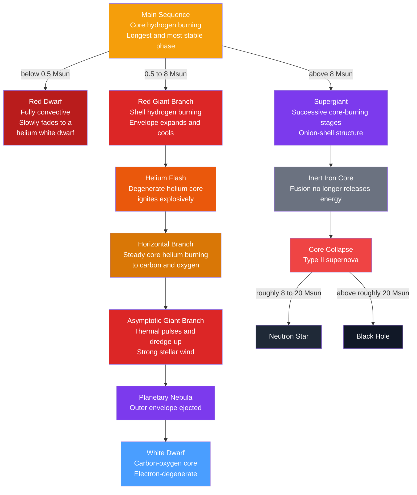

# 🌠 Stellar Evolution

> [!abstract] TL;DR
> A star's whole life story is written by one number at birth: its **mass**. On the **main sequence** it fuses hydrogen to helium in its core, and this stable phase lasts longest of all — but massive stars burn far more brightly and die far sooner ($t_{MS}\propto M^{-2.5}$). **Low- and intermediate-mass stars** (up to $\sim 8\,M_\odot$) swell into **red giants**, pass through the **helium flash** and horizontal branch, shed their envelopes as a **planetary nebula**, and leave a **white dwarf**. **High-mass stars** ($\gtrsim 8\,M_\odot$) fuse ever-heavier elements in an onion-shell structure up to an inert **iron core**, then collapse as a **core-collapse supernova**, leaving a **neutron star** or **black hole**. The main-sequence *turnoff* on a cluster's HR diagram acts as a clock to date the oldest stars in the Galaxy.

## Intuition — analogy FIRST

Think of a star as a candle that has to fight its own gravity. Burning fuel in the core pushes outward; gravity pulls inward. As long as the two balance, the star sits quietly on the **main sequence**, like a candle burning at a steady height. A big candle has vastly more wax but a *huge* flame — it blazes and gutters out in a flash. A small candle has little wax and a tiny flame, so it lasts far longer. That is exactly why a $25\,M_\odot$ star lives only a few million years while a red dwarf outlives the present age of the Universe.

When the core fuel runs out, the balance breaks. The core shrinks and heats while the outer layers billow out and cool — the candle sputters, flares, and reshapes itself. What happens next — a gentle fade to a white ember, or a catastrophic explosion — depends almost entirely on how much "wax" the star was born with.

---

## How It Works



### Secondary Level

A star spends most of its life on the **main sequence**, fusing hydrogen into helium in its core (see [[Stellar_Structure_and_Energy_Generation]]). This is the stable, hydrogen-burning phase you see for the [[The_Sun|Sun]] today.

**Massive stars live fast and die young.** A star with more mass has much more fuel, but it is *far* more luminous, so it burns that fuel much faster:

$$t_{MS} \approx 10\ \text{Gyr}\left(\frac{M}{M_\odot}\right)^{-2.5}$$

| Star | Mass | Main-sequence lifetime |
|------|------|------------------------|
| Red dwarf | $0.2\,M_\odot$ | $\sim 500$ Gyr — longer than the Universe's age |
| Sun | $1\,M_\odot$ | $\sim 10$ Gyr |
| Sirius A | $2\,M_\odot$ | $\sim 1.8$ Gyr |
| Blue giant | $10\,M_\odot$ | $\sim 30$ Myr |
| O star | $25\,M_\odot$ | $\sim 3$ Myr |

When core hydrogen runs out, the star leaves the main sequence and swells into a giant. What comes next splits sharply by mass — a quiet **white dwarf** for Sun-like stars, or a violent **supernova** for the heavyweights.

### Undergraduate Level

**Low- and intermediate-mass stars ($0.5$–$8\,M_\odot$).** After core hydrogen is exhausted, an inert helium core is left behind:

1. **Subgiant.** Hydrogen ignites in a shell around the contracting helium core; the envelope begins to expand.
2. **Red Giant Branch (RGB).** Shell burning grows the helium core while the envelope balloons and cools, so the star climbs to high luminosity at low surface temperature — a **red giant**. This is a track *up and to the right* on the [[Stellar_Properties_and_the_HR_Diagram|HR diagram]].
3. **Helium flash** (for $M \lesssim 2\,M_\odot$). The helium core becomes **electron-degenerate** before it is hot enough to fuse. When the triple-alpha process finally ignites at $T \approx 10^8$ K, degeneracy pressure barely responds to the temperature spike, so burning runs away in a thermonuclear **flash** until degeneracy is lifted (see [[Quantum_Statistical_Mechanics]]). It is hidden inside the star, not seen from outside.
4. **Horizontal Branch.** The core now fuses helium steadily to carbon and oxygen while hydrogen burns in a shell.
5. **Asymptotic Giant Branch (AGB).** With the core exhausted, helium- and hydrogen-burning shells alternate in **thermal pulses**. Convective **dredge-up** brings fusion products to the surface, and a powerful wind strips the envelope.
6. **Planetary nebula + white dwarf.** The ejected envelope, lit by the hot exposed core, glows as a **planetary nebula**; the leftover carbon-oxygen core cools forever as a **white dwarf** (see [[Stellar_Remnants_White_Dwarfs_Neutron_Stars_Black_Holes]]).

**High-mass stars ($\gtrsim 8\,M_\odot$).** Gravity forces each fuel to ignite in turn, building an **onion-shell** structure of successive burning layers (see [[Stellar_Nucleosynthesis]]):

| Stage | Fuel | Ignition $T$ | Duration ($\sim 25\,M_\odot$) |
|-------|------|--------------|-------------------------------|
| H burning | H $\to$ He | $4\times10^7$ K | $\sim 7$ Myr |
| He burning | He $\to$ C, O | $2\times10^8$ K | $\sim 0.7$ Myr |
| C burning | C $\to$ Ne, Mg | $8\times10^8$ K | $\sim 600$ yr |
| Ne burning | Ne $\to$ O, Mg | $1.6\times10^9$ K | $\sim 1$ yr |
| O burning | O $\to$ Si, S | $2\times10^9$ K | $\sim 6$ months |
| Si burning | Si $\to$ Fe | $3\times10^9$ K | $\sim 1$ day |

Fusion stops at **iron**: $^{56}$Fe is the most tightly bound nucleus, so fusing it *absorbs* energy instead of releasing it. The inert iron core grows until it exceeds the **Chandrasekhar mass** ($\approx 1.4\,M_\odot$), then **collapses** in under a second, rebounding as a **core-collapse (Type II) supernova** (see [[Supernovae_and_Gamma_Ray_Bursts]]). The remnant is a **neutron star** ($\sim 8$–$20\,M_\odot$ progenitors) or, for the most massive stars, a **black hole**.

**Reading age off the HR diagram.** All stars in a cluster share one age. The most massive stars peel off the main sequence first, so the **main-sequence turnoff** — the point where stars are just leaving — slides toward lower mass and luminosity over time. Its location is a **cluster clock**: young open clusters turn off high on the main sequence; ancient globular clusters turn off near a solar mass, giving ages of $\sim 12$–$13$ Gyr.

### Graduate Level

**Schönberg–Chandrasekhar limit.** An isothermal, non-degenerate helium core supported by ideal-gas pressure can hold up the overlying envelope only while it stays below a critical fraction of the total mass,

$$\frac{M_{core}}{M_\star} \lesssim q_{SC} \approx 0.37\left(\frac{\mu_{env}}{\mu_{core}}\right)^2 \approx 0.10,$$

where $\mu$ is the mean molecular weight. Once the core exceeds $q_{SC}$, it can no longer support the envelope by gas pressure alone and contracts on a Kelvin–Helmholtz (thermal) timescale — this rapid contraction drives the star quickly across the subgiant "Hertzsprung gap" onto the red giant branch. Low-mass cores instead become **degenerate** and are held up by electron degeneracy pressure, bypassing this limit.

**Degeneracy and the helium flash.** In a degenerate gas, pressure is nearly independent of temperature, $P \propto \rho^{5/3}$. When triple-alpha ignites, the released heat raises $T$ but *not* $P$, so the core cannot expand and cool. The reaction rate ($\propto T^{40}$ near ignition) skyrockets — a thermonuclear runaway reaching $\sim 10^{11}\,L_\odot$ momentarily, all absorbed internally — until $T$ rises enough to lift degeneracy and the core finally expands. Stars above $\sim 2\,M_\odot$ reach $10^8$ K *before* degenerating, so they ignite helium quietly with **no flash**.

**Mass thresholds for the endpoint.** Approximate initial-mass boundaries (they shift with metallicity, rotation, and mass loss):

| Initial mass | Endpoint |
|--------------|----------|
| $\lesssim 0.5\,M_\odot$ | (eventual) helium white dwarf |
| $0.5$–$8\,M_\odot$ | carbon-oxygen white dwarf via planetary nebula |
| $8$–$10\,M_\odot$ | O-Ne white dwarf or electron-capture supernova |
| $\sim 8$–$20\,M_\odot$ | neutron star via core-collapse SN |
| $\gtrsim 20$–$25\,M_\odot$ | black hole (some by direct collapse, no bright SN) |

**Binary-star evolution.** Roughly half of stars are in close binaries, where evolution can be rewired. When one star fills its **Roche lobe**, **mass transfer** reshapes both stars; if transfer is unstable the companion is engulfed in a **common envelope**, and drag drives an inspiral that ejects the envelope and dramatically tightens the orbit. These channels produce cataclysmic variables, X-ray binaries, and the compact-object mergers seen in gravitational waves. Crucially, a white dwarf that accretes toward the Chandrasekhar mass — or merges with another white dwarf — detonates as a **Type Ia supernova**, a thermonuclear (not core-collapse) event whose standardizable brightness underpins the discovery of cosmic acceleration.

```python
import numpy as np
import matplotlib.pyplot as plt

# Main-sequence lifetime scales as t ~ M / L with L ~ M^3.5, so t ~ M^-2.5.
# Anchor to the Sun at ~10 Gyr, then annotate the eventual remnant vs mass.
M = np.logspace(-1, 1.5, 300)          # 0.1 to ~30 solar masses
t_MS = 10.0 * M**(-2.5)                 # main-sequence lifetime, Gyr

def remnant(m):
    if m < 8:   return "White dwarf"
    if m < 20:  return "Neutron star"
    return "Black hole"

plt.figure(figsize=(7, 5))
plt.loglog(M, t_MS, lw=2, color="steelblue")
plt.axhline(13.8, ls="--", color="gray")
plt.text(0.11, 16, "age of the Universe (13.8 Gyr)", fontsize=8, color="gray")

for m in [0.3, 1.0, 3.0, 12.0, 25.0]:
    y = 10.0 * m**-2.5
    plt.scatter([m], [y], zorder=5, color="crimson")
    plt.annotate(f"{m} Msun\n{remnant(m)}", (m, y),
                 textcoords="offset points", xytext=(6, 6), fontsize=8)

plt.xlabel("Initial mass  (solar masses)")
plt.ylabel("Main-sequence lifetime  (Gyr)")
plt.title("Massive stars live fast and die young:  t ~ M^-2.5")
plt.grid(True, which="both", alpha=0.3)
plt.tight_layout()
plt.show()
```

---

## Real-World Notes

- **The Sun's future.** In $\sim 5$ Gyr the Sun will leave the main sequence, swell into a red giant that reaches near Earth's orbit, undergo a helium flash, then eject a planetary nebula and end as a $\sim 0.55\,M_\odot$ carbon-oxygen white dwarf. It is far too light to ever go supernova.
- **Betelgeuse.** This red supergiant ($\sim 15$–$20\,M_\odot$) in Orion has already left the main sequence and is fusing heavier elements; it will end as a nearby core-collapse supernova, briefly outshining the Moon.
- **Globular-cluster clocks.** Fitting the main-sequence turnoff of clusters like M92 gives ages of $\sim 12$–$13$ Gyr, making them among the oldest known objects and a hard lower bound on the age of the Universe.
- **SN 1987A.** The nearest naked-eye supernova in centuries, from a $\sim 20\,M_\odot$ blue supergiant in the Large Magellanic Cloud; its detected neutrino burst was direct confirmation that a stellar core had collapsed.
- **Planetary nebulae.** The Ring (M57) and Helix (NGC 7293) nebulae are snapshots of dying Sun-like stars — glowing shells ejected on the AGB, illuminated by the emerging white-dwarf core.
- **Type Ia as cosmic rulers.** Because they detonate near a fixed mass, Type Ia supernovae from binary white dwarfs are standardizable candles; two teams used them in 1998 to discover the accelerating expansion of the Universe.

---

## Common Pitfalls

1. **"Planetary nebulae are about planets."** A pure misnomer from 18th-century telescopes that showed round, planet-like disks. They are ejected stellar envelopes and have nothing to do with planets.
2. **"The helium flash blows the star apart."** It is entirely internal — the runaway energy goes into lifting core degeneracy, not into an outburst. It is invisible from outside, and only occurs in low-mass ($\lesssim 2\,M_\odot$) stars whose cores degenerate first.
3. **"The Sun will explode as a supernova."** Only stars above $\sim 8\,M_\odot$ reach core collapse. The Sun ends quietly as a white dwarf.
4. **Confusing Type Ia with core-collapse supernovae.** Type Ia is the *thermonuclear* detonation of a white dwarf in a binary; core-collapse (Type II/Ib/Ic) is the *gravitational* collapse of a massive star's iron core. Different progenitors, different physics.
5. **"Iron is the star's final fuel."** Iron is *ash*, not fuel: fusing it consumes energy because $^{56}$Fe is the most bound nucleus. The growing inert iron core is precisely what triggers collapse.
6. **Reversing the mass–lifetime relation.** More massive stars have *more* fuel yet *shorter* lives, because luminosity climbs much faster than mass ($L\propto M^{3.5}$), so the fuel is spent far more quickly.

---

## Related Concepts

- [[_MOC_Stellar_Astrophysics|↑ Section MOC]]
- [[The_Sun]] — a $1\,M_\odot$ star caught mid-main-sequence; the reference point for every timescale here
- [[Stellar_Properties_and_the_HR_Diagram]] — evolutionary tracks and the main-sequence turnoff as a cluster clock
- [[Stellar_Structure_and_Energy_Generation]] — the hydrostatic balance and fusion that set each phase
- [[Star_Formation]] — the collapse and pre-main-sequence stage that begins the story
- [[Stellar_Nucleosynthesis]] — the onion-shell burning stages that build elements up to iron
- [[Stellar_Remnants_White_Dwarfs_Neutron_Stars_Black_Holes]] — the endpoints: degenerate embers and gravitational graves
- [[Supernovae_and_Gamma_Ray_Bursts]] — the explosive deaths of massive stars and binary white dwarfs
- **Physics** — [[Nuclear_Reactions_Fission_Fusion]] (the fusion that powers every stage); [[Quantum_Statistical_Mechanics]] (electron degeneracy behind the helium flash and white dwarfs)
- **Mathematics** — [[_MOC_Mathematics_Master]] (the coupled ODEs of stellar structure that generate evolutionary tracks)

---

## Review Questions

1. **Secondary**: A $10\,M_\odot$ star and a $1\,M_\odot$ star are born together. Which leaves the main sequence first, and why does having *more* fuel not make it live longer? Estimate each lifetime using $t_{MS}\approx 10\,\text{Gyr}\,(M/M_\odot)^{-2.5}$.
2. **Undergraduate**: Trace the full post-main-sequence path of a $1\,M_\odot$ star, naming each phase (subgiant, RGB, helium flash, horizontal branch, AGB, planetary nebula, white dwarf) and the fusion or physics driving it. Contrast this with the endpoint of a $20\,M_\odot$ star.
3. **Graduate**: State the Schönberg–Chandrasekhar limit and explain why crossing it drives a star rapidly across the Hertzsprung gap. Separately, explain why low-mass stars undergo a helium *flash* while intermediate-mass stars ignite helium quiescently, using the temperature-independence of degeneracy pressure.

---

## Sources

- Prialnik — *An Introduction to the Theory of Stellar Structure and Evolution*, 2nd ed.
- Kippenhahn, Weigert & Weiss — *Stellar Structure and Evolution*, 2nd ed.
- Carroll & Ostlie — *An Introduction to Modern Astrophysics*, 2nd ed., Ch. 13
- Hansen, Kawaler & Trimble — *Stellar Interiors: Physical Principles, Structure, and Evolution*
- Schönberg & Chandrasekhar (1942) — "On the Evolution of the Main-Sequence Stars," *ApJ* 96, 161

#astronomy #stellar-astrophysics #stellar-evolution #main-sequence #red-giant #helium-flash #supernova #white-dwarf #secondary #undergraduate #graduate
