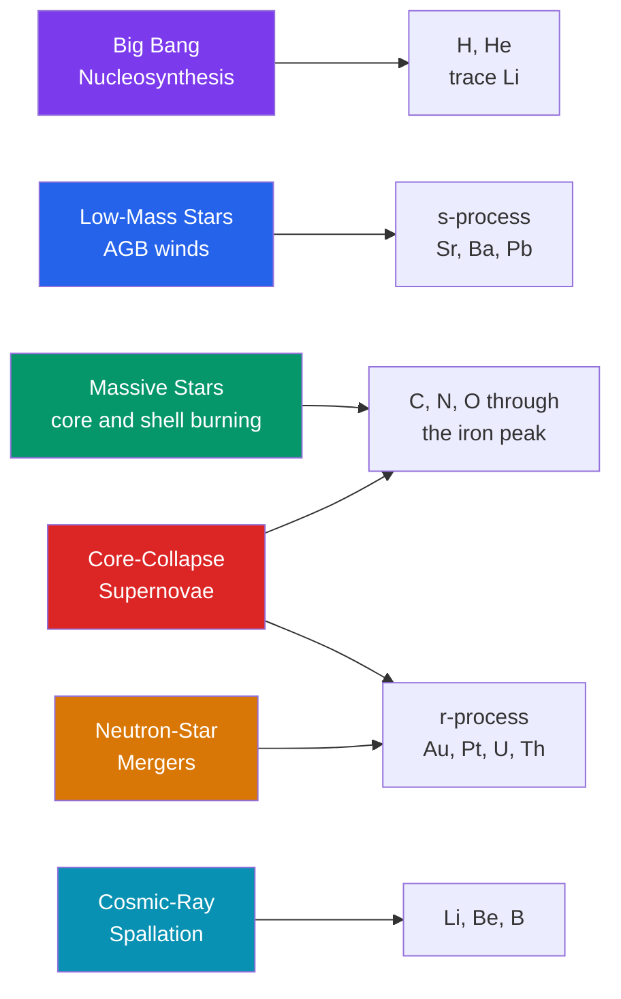

# ⚛️ Stellar Nucleosynthesis

> [!abstract] TL;DR
> Nucleosynthesis is the cosmic manufacturing of the chemical elements. The **binding-energy-per-nucleon curve peaks at the iron group** ($^{56}\text{Fe}$, $^{62}\text{Ni}$): fusing nuclei *lighter* than iron releases energy, while fusing anything *heavier* costs energy — so fusion cannot power a star past iron. The periodic table is assembled by a division of labor: the **Big Bang** made H, He, and a trace of Li; **stellar fusion** builds C, N, O and everything up to the iron peak through successive core and shell burning; elements **heavier than iron** form by **neutron capture** — the slow *s-process* in AGB stars and the rapid *r-process* in neutron-star mergers and supernovae; and the fragile Li, Be, B come mostly from **cosmic-ray spallation**. Supernovae and stellar winds scatter this enriched matter into the interstellar medium, seeding new stars and planets. In Carl Sagan's phrase, *we are made of star stuff.*

## Intuition — analogy FIRST

Think of nuclei as marbles rolling in a valley. Iron sits at the **very bottom** — the most stable, most tightly bound configuration a nucleus can reach. Light nuclei perched high on the near wall can roll *down* toward iron by **fusion**, releasing energy as they go; that downhill roll is what makes stars shine. Heavy nuclei on the far wall can roll down toward iron by **fission**, also releasing energy. But nothing rolls *uphill for free*: to build elements past iron you must *pay* energy in, and stars only do so in violent, fleeting moments — the crush of a collapsing core or the collision of two neutron stars.

So the story of the elements is a story of who paid the energy bill. The hydrogen in your water is a Big Bang relic 13.8 billion years old; the carbon in your cells and the oxygen you breathe were forged in the hearts of long-dead stars; and the gold in a wedding ring was minted in the split-second collision of two neutron stars, then blasted across the galaxy to end up on Earth.

---

## How It Works



---

## Key Concepts / Details

### Secondary Level

Almost every atom heavier than helium was made inside a star. The key idea is the **binding energy per nucleon**: how tightly the protons and neutrons in a nucleus are glued together. This binding rises as you build up from hydrogen, reaches a **maximum around iron**, then slowly falls for heavier elements.

- **Below iron:** joining light nuclei makes a *more* tightly bound product, so fusion **releases** energy. This powers stars.
- **At iron:** the nucleus is as bound as it can get — the "ash" at the bottom of the well.
- **Beyond iron:** fusion would make a *less* bound product, so it **absorbs** energy. Stars cannot do this to shine.

| Where it was made | Elements |
|-------------------|----------|
| The Big Bang | Hydrogen, most helium, a trace of lithium |
| Cores of ordinary stars | Helium, carbon, nitrogen, oxygen |
| Cores of massive stars | Neon, magnesium, silicon, up to iron |
| Supernovae and neutron-star mergers | Gold, silver, platinum, uranium |

When a massive star dies as a **supernova**, it hurls these elements into space, enriching the gas from which new stars and planets form. The Sun and Earth are built from the debris of earlier stellar generations.

### Undergraduate Level

**The master key — the binding energy curve.** For a nucleus of $Z$ protons and $N$ neutrons, the total binding energy is $B = (Zm_p + Nm_n - m_{\text{nucleus}})c^2$. Dividing by mass number $A = Z + N$ gives $B/A$, which rises steeply, peaks at $\approx 8.79\ \text{MeV/nucleon}$ near $^{56}\text{Fe}$ and $^{62}\text{Ni}$, then declines. A fusion reaction is exothermic only if the product sits *higher* on this curve than the reactants — true up to iron, false beyond it (see [[Nuclear_Structure]]).

**1. Big Bang nucleosynthesis (first 3 minutes).** Produced $\sim 75\%$ H and $\sim 25\%$ $^{4}\text{He}$ by mass, plus traces of D, $^{3}\text{He}$, and $^{7}\text{Li}$. Mass gaps at $A=5$ and $A=8$ (no stable nuclei) halted the chain — no carbon or heavier (see [[Big_Bang_Nucleosynthesis]]).

**2. Fusion in stars.** On the [[Stellar_Structure_and_Energy_Generation|main sequence]], hydrogen fuses to helium via the **p-p chain** (low-mass stars) or the catalytic **CNO cycle** (massive stars). Then:

- **Triple-alpha process:** $3\,{}^{4}\text{He} \rightarrow {}^{12}\text{C}$ at $T \approx 10^{8}\ \text{K}$, proceeding through an unstable $^{8}\text{Be}$ intermediary and Hoyle's predicted $^{12}\text{C}$ resonance.
- **Alpha capture:** ${}^{12}\text{C} + {}^{4}\text{He} \rightarrow {}^{16}\text{O}$, then on to $^{20}\text{Ne}$, $^{24}\text{Mg}$.

In **massive stars** ($\gtrsim 8\,M_\odot$), successive burning stages build an **onion-shell** structure:

| Stage | Fuel | Main products | Ignition $T$ | Duration ($25\,M_\odot$) |
|-------|------|---------------|--------------|--------------------------|
| H burning | H | He | $\sim 4\times10^{7}$ K | $\sim 7$ Myr |
| He burning | He | C, O | $\sim 2\times10^{8}$ K | $\sim 0.7$ Myr |
| C burning | C | Ne, Na, Mg | $\sim 8\times10^{8}$ K | $\sim 600$ yr |
| Ne burning | Ne | O, Mg | $\sim 1.5\times10^{9}$ K | $\sim 1$ yr |
| O burning | O | Si, S | $\sim 2\times10^{9}$ K | $\sim 6$ months |
| Si burning | Si | **iron peak** ($^{56}$Ni) | $\sim 3\times10^{9}$ K | $\sim 1$ day |

Silicon burning drives the material into **nuclear statistical equilibrium**, producing $^{56}\text{Ni}$, which later decays $^{56}\text{Ni}\rightarrow{}^{56}\text{Co}\rightarrow{}^{56}\text{Fe}$. With an inert iron core, fusion can extract no more energy, pressure support fails, and the core collapses — the trigger for a supernova (see [[Stellar_Evolution]]).

**3. Beyond iron — neutron capture.** With no Coulomb barrier, a nucleus can absorb a neutron, then $\beta^{-}$-decay a neutron into a proton, climbing the periodic table. Two regimes:

- **s-process (slow):** neutron capture *slower* than $\beta$-decay, so it hugs the valley of stability. Occurs in thermally pulsing **AGB stars** (neutron source $^{13}\text{C}(\alpha,n)^{16}\text{O}$). Builds $\sim$ half the elements past iron — Sr, Ba, Pb — terminating near Bi.
- **r-process (rapid):** neutron capture *far faster* than $\beta$-decay, driving nuclei to extreme neutron richness before they decay back. Needs enormous neutron fluxes — **neutron-star mergers** (confirmed by [[Supernovae_and_Gamma_Ray_Bursts|GW170817]]) and some core-collapse supernovae. Makes the heaviest, most neutron-rich nuclei: gold, platinum, the lanthanides, uranium, thorium.

**4. Light elements Li, Be, B.** Skipped by both the Big Bang and stellar fusion (they are destroyed, not made, in stellar interiors). They form when **galactic cosmic rays** smash into C, N, O in the interstellar medium — **spallation** — chipping off fragments.

**Metallicity and chemical evolution.** Astronomers call every element heavier than helium a **"metal."** Each stellar generation enriches the interstellar medium, so metallicity rises over cosmic time: **Population III** (primordial, metal-free) $\rightarrow$ **Pop II** (old, metal-poor) $\rightarrow$ **Pop I** (young, metal-rich, like the Sun). The result is the periodic table itself (see [[Periodic_Table_and_Periodic_Trends]]).

### Graduate Level

**The B2FH framework.** Burbidge, Burbidge, Fowler & Hoyle (1957) — with A. G. W. Cameron independently — laid out the processes still used today: hydrogen and helium burning, the $\alpha$-process, the $e$-process (equilibrium/iron peak), and the $s$-, $r$-, and $p$-processes for the trans-iron elements, plus the $x$-process (spallation) for Li/Be/B. Fowler received the 1983 Nobel Prize.

**Reaction networks.** The abundance of species $i$ (molar abundance $Y_i = X_i/A_i$) evolves under a stiff coupled ODE system:

$$\frac{dY_i}{dt} = \sum_j \lambda_j Y_j + \sum_{j,k} \rho N_A \langle\sigma v\rangle_{jk}\, Y_j Y_k + \sum_{j,k,l}\rho^2 N_A^2 \langle\sigma v\rangle_{jkl}\, Y_j Y_k Y_l$$

with one-body ($\beta$-decay, photodisintegration), two-body (captures), and three-body (triple-$\alpha$) terms. Thermally averaged rates $\langle\sigma v\rangle(T)$ come from Gamow-peak integrals of the astrophysical $S$-factor.

**Nuclear statistical equilibrium (NSE).** At $T \gtrsim 5\times10^{9}$ K, forward and reverse reactions balance and a Saha-like equation sets abundances from binding energies alone:

$$Y(Z,A) \propto Y_p^{Z}\,Y_n^{N}\,A^{3/2}\left(\frac{2\pi\hbar^2}{m_u k_B T}\right)^{3(A-1)/2}\!\! G(Z,A)\,\exp\!\left(\frac{B(Z,A)}{k_B T}\right)$$

The exponential dependence on $B$ funnels matter toward the iron peak. **$\alpha$-rich freeze-out** in the expanding, low-density ejecta favors $^{56}\text{Ni}$ (equal $Z=N=28$) over $^{56}\text{Fe}$, which is why supernovae eject $^{56}\text{Ni}$ that later powers the light curve.

**Fingerprinting the sites.** The solar abundance curve shows a clean **odd-even (Oddo-Harkins) zigzag** and twin $s$/$r$ peaks at the **neutron magic numbers** $N = 50, 82, 126$. Because the $s$-process captures on stable nuclei but the $r$-process captures far out in neutron-rich territory (later $\beta$-decaying back at roughly constant $A$), the $r$-process peaks sit at *lower* mass number:

| Magic $N$ | s-process peak | r-process peak |
|-----------|----------------|----------------|
| 50 | $A \approx 88$ (Sr, Y) | $A \approx 80$ (Se, Kr) |
| 82 | $A \approx 138$ (Ba) | $A \approx 130$ (Te, Xe) |
| 126 | $A \approx 208$ (Pb) | $A \approx 195$ (Pt, Os) |

Matching an observed abundance pattern to these templates is how the **site** of enrichment is identified — the technique that let GW170817's kilonova be read as an $r$-process furnace.

```python
# Binding energy per nucleon vs mass number from the semi-empirical (liquid-drop)
# mass formula, showing the iron peak that ends energy-releasing fusion.
import numpy as np
import matplotlib.pyplot as plt

# SEMF coefficients, in MeV (volume, surface, Coulomb, asymmetry, pairing)
a_V, a_S, a_C, a_A, a_P = 15.8, 18.3, 0.714, 23.2, 12.0

def binding_energy(A, Z):
    """Total nuclear binding energy (MeV) from the semi-empirical mass formula."""
    N = A - Z
    B = (a_V*A - a_S*A**(2/3) - a_C*Z*(Z-1)/A**(1/3) - a_A*(N - Z)**2/A)
    if Z % 2 == 0 and N % 2 == 0:      # even-even: extra binding
        B += a_P/np.sqrt(A)
    elif Z % 2 == 1 and N % 2 == 1:    # odd-odd: less binding
        B -= a_P/np.sqrt(A)
    return B

# For each mass number A, pick the most tightly bound (most stable) isobar
A_vals = np.arange(2, 240)
best_BA = np.array([max(binding_energy(A, Z) for Z in range(1, A)) / A
                    for A in A_vals])

A_peak = A_vals[np.argmax(best_BA)]
BA_Fe56 = binding_energy(56, 26) / 56
print(f"B/A peaks near A = {A_peak}  ({best_BA.max():.3f} MeV/nucleon)")
print(f"Fe-56 B/A = {BA_Fe56:.3f} MeV/nucleon")

plt.figure(figsize=(8, 5))
plt.plot(A_vals, best_BA, lw=2, color="#2563eb")
plt.scatter([56], [BA_Fe56], color="#dc2626", zorder=5, label="Fe-56 (iron peak)")
plt.axvline(56, color="#dc2626", ls="--", alpha=0.4)
plt.annotate("fusion RELEASES energy\n(light nuclei climb toward iron)",
             xy=(20, 7.7), fontsize=9)
plt.annotate("fusion COSTS energy\n(heavy elements only by neutron capture)",
             xy=(95, 7.35), fontsize=9)
plt.xlabel("Mass number A")
plt.ylabel("Binding energy per nucleon (MeV)")
plt.title("The iron peak: why fusion stops at iron")
plt.legend(); plt.grid(True, alpha=0.3); plt.tight_layout()
```

---

## Real-World Notes

- **The solar abundance curve** — measured from the photosphere and from primitive CI-chondrite meteorites — is the master data set. Its logarithmic decline from H to U, the Oddo-Harkins zigzag, and the iron and $s$/$r$ peaks are the pattern every nucleosynthesis theory must reproduce.
- **Technetium in stars** (Merrill, 1952): Tc has *no* stable isotope (longest half-life $\sim 4$ Myr), yet its lines appear in AGB-star spectra. It cannot be primordial, so this was direct proof that the $s$-process is happening *inside stars right now*.
- **The Hoyle state:** Fred Hoyle predicted a specific $7.65$ MeV resonance in $^{12}\text{C}$ purely because carbon (and hence life) exists — one of physics' rare successful anthropic predictions. Without it the triple-alpha bottleneck would starve the universe of carbon.
- **GW170817's kilonova** (AT2017gfo, 2017): a neutron-star merger whose red, rapidly fading optical/IR glow matched lanthanide-rich $r$-process ejecta — the first direct confirmation that mergers forge gold, platinum, and the heaviest elements.
- **Radioactive afterglow:** the light curves of Type Ia and core-collapse supernovae are powered by the decay $^{56}\text{Ni}\rightarrow{}^{56}\text{Co}\rightarrow{}^{56}\text{Fe}$; INTEGRAL has detected $^{44}\text{Ti}$ and $^{26}\text{Al}$ gamma-ray lines mapping fresh nucleosynthesis across the Galaxy.
- **Presolar grains:** microscopic SiC and graphite grains in meteorites carry wildly non-solar isotope ratios, each condensed in the wind of a specific ancient AGB star or supernova — physical samples of individual nucleosynthesis events predating the Sun.

---

## Common Pitfalls

1. **"Iron has the highest binding energy per nucleon."** Strictly, $^{62}\text{Ni}$ (and $^{58}\text{Fe}$) edge out $^{56}\text{Fe}$. $^{56}\text{Fe}$ is merely the *most abundant* iron-peak nucleus, because supernovae eject $^{56}\text{Ni}$ that decays to it. The "iron peak" is a region, not a single champion.
2. **"Supernovae make all the heavy elements."** About half the trans-iron elements come from the $s$-process in quietly dying AGB stars — no explosion at all — and much of the heaviest ($r$-process gold, platinum, uranium) comes from **neutron-star mergers**.
3. **"Fusion stops because iron cannot fuse."** Iron *can* fuse — but the reaction is *endothermic*. It drains energy from the core rather than supporting it, which is precisely what precipitates collapse.
4. **Confusing the mechanism past iron.** Elements heavier than iron are not built by charged-particle fusion (Coulomb barrier plus endothermicity) but by **neutron capture followed by $\beta$-decay**.
5. **The "metal" trap.** In astronomy a "metal" is *anything* heavier than helium — including carbon, nitrogen, and oxygen. This is unrelated to chemistry's definition of a metal.
6. **"The Sun made its own metals."** The Sun is a Population I star; its heavy elements were inherited from *earlier* generations. A star largely cannot enrich itself with the products locked in its inert core (dredge-up in giants is the partial exception).

---

## Related Concepts

- [[_MOC_Stellar_Astrophysics|↑ Section MOC]]
- [[Stellar_Structure_and_Energy_Generation]] — the hydrostatic, energy-generating engine where fusion actually occurs
- [[Stellar_Evolution]] — how burning stages and the onion-shell structure map onto a star's life and death
- [[The_Sun]] — the nearest working example, running the p-p chain
- [[Stellar_Properties_and_the_HR_Diagram]] — mass sets which burning stages a star can reach
- [[Star_Formation]] — enriched gas collapses into the next generation of stars and planets
- [[Stellar_Remnants_White_Dwarfs_Neutron_Stars_Black_Holes]] — the neutron stars whose mergers drive the $r$-process
- [[Supernovae_and_Gamma_Ray_Bursts]] — the explosions that disperse elements and host $r$-process synthesis
- [[Big_Bang_Nucleosynthesis]] — the primordial H, He, Li that everything else is built upon
- **Physics** — [[Nuclear_Structure]] (the binding-energy curve and iron peak), [[Nuclear_Reactions_Fission_Fusion]] (fusion and fission energetics)
- **Chemistry** — [[Periodic_Table_and_Periodic_Trends]] (the table nucleosynthesis assembles), [[Atomic_Structure_and_Subatomic_Particles]] (protons and neutrons as the raw material)
- **Mathematics** — [[_MOC_Mathematics_Master]] (stiff reaction-network ODEs and the statistics of abundance fitting)

---

## Review Questions

1. **Secondary**: Trace the origin of three things — the carbon in your body, the oxygen you breathe, and the gold in a ring. Name a *different* cosmic source for each and say roughly when it was made.
2. **Undergraduate**: Using the binding-energy-per-nucleon curve, explain quantitatively why fusion powers a star up to iron but not beyond, and why an inert iron core triggers collapse in a massive star. Then contrast the $s$- and $r$-processes: what physical quantity determines which one operates, and where does each occur?
3. **Graduate**: The solar $r$-process abundance peaks near $A \approx 80, 130, 195$ while the $s$-process peaks near $A \approx 88, 138, 208$. Explain the origin of *both* sets of peaks in terms of the neutron magic numbers $N = 50, 82, 126$, and account for why the $r$-process peaks are systematically shifted to lower mass number.

---

## Sources

- Burbidge, Burbidge, Fowler & Hoyle (1957) — "Synthesis of the Elements in Stars," *Rev. Mod. Phys.* 29, 547 (B2FH)
- Clayton — *Principles of Stellar Evolution and Nucleosynthesis*
- Iliadis — *Nuclear Physics of Stars*, 2nd ed.
- Kobayashi, Karakas & Lugaro (2020) — "The Origin of Elements from Carbon to Uranium," *ApJ* 900, 179
- Kasen et al. (2017) — "Origin of the heavy elements in binary neutron-star mergers from a gravitational-wave event," *Nature* 551, 80

#astronomy #stellar-astrophysics #nucleosynthesis #ironpeak #sprocess #rprocess #B2FH #metallicity #undergraduate #graduate
