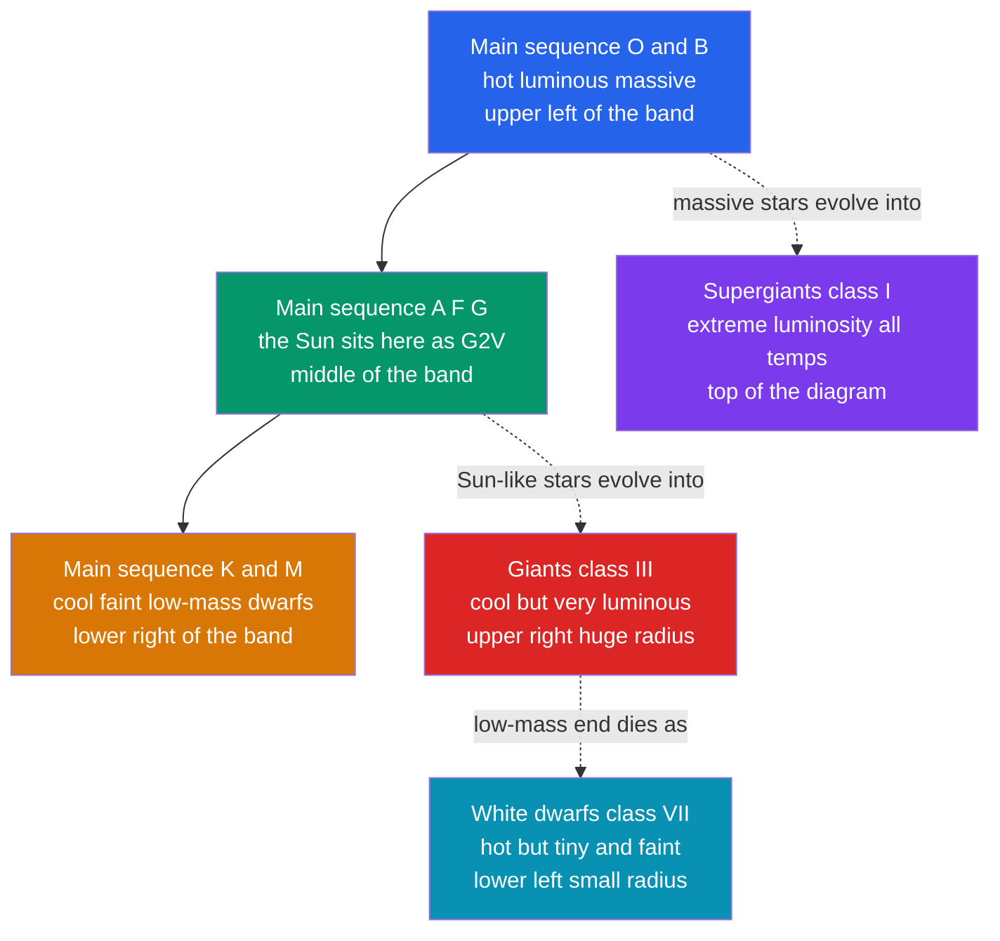

# 📊 Stellar Properties and the HR Diagram

> [!abstract] TL;DR
> A star is characterised by five measurable properties: **luminosity** $L$ (from flux plus distance), surface **temperature** $T_{\text{eff}}$ (from color or spectral type), **radius** $R$ (from $L = 4\pi R^2\sigma T_{\text{eff}}^4$), **mass** $M$ (measurable *only* from binary-star orbits), and **composition** (from spectral lines). Plotting luminosity against temperature — with temperature increasing *to the left* — produces the **Hertzsprung–Russell diagram**, the single most important chart in stellar astronomy. Stars are not scattered randomly: ~90% lie on the diagonal **main sequence** where they fuse hydrogen, with cool luminous **giants and supergiants** in the upper right and hot faint **white dwarfs** in the lower left. On the main sequence the **mass–luminosity relation** $L\propto M^{3.5}$ dictates that massive stars are wildly more luminous and burn out fast, giving a lifetime $t \propto M/L \propto M^{-2.5}$ — the basis for dating star clusters from their main-sequence turnoff.

## Intuition — analogy FIRST

Imagine a huge parking lot photographed from a blimp, with every car plotted by two numbers: engine power on the vertical axis and fuel efficiency on the horizontal. You would expect a formless cloud of dots — but instead almost every car falls on one tight diagonal stripe. That stripe is not a coincidence; it is a *law* connecting power to efficiency, and the few cars off the stripe (monster trucks up top, tiny scooters in the corner) are the interesting exceptions that tell you the rest of the story.

The HR diagram is exactly that photograph for stars. We plot each star by how much power it radiates (luminosity) against how hot its surface is (temperature). The overwhelming majority snap onto a single diagonal band — the **main sequence** — because a hydrogen-fusing star's brightness is set almost entirely by its mass. The stars *off* the band are the ones that have finished, or barely started, the main event.

---

## How It Works

A star's surface temperature fixes its **color** and **spectral type** (the OBAFGKM sequence); its luminosity fixes its vertical position. Where the two meet on the HR diagram reveals its evolutionary state, and — via $L=4\pi R^2\sigma T_{\text{eff}}^4$ — its radius. The diagram below shows the major regions and how they are connected by stellar evolution.



---

### Secondary Level

**What can we measure about a star?** We cannot visit one, but its light carries everything we need:

- **Brightness → luminosity.** How bright a star *looks* (its flux) plus its distance gives its true power output, its **luminosity** $L$. A faint-looking star may be a distant powerhouse (see [[Magnitudes_Luminosity_and_Flux]]).
- **Color → temperature.** Hot stars glow blue, cool stars glow red — the same reason a flame's blue tip is hotter than its orange base. Astronomers formalise color as the **spectral type**, the sequence **O B A F G K M** running from hottest (O, blue, >30,000 K) to coolest (M, red, ~3,000 K). A common mnemonic is *"Oh Be A Fine Girl/Guy, Kiss Me."* The Sun is a **G** star.

**The Hertzsprung–Russell diagram.** Around 1911–1913 Ejnar Hertzsprung and Henry Norris Russell independently plotted stars' luminosity against temperature. Two quirks define the chart:

- **Temperature increases to the LEFT** (a historical accident — spectral types were ordered before temperatures were understood).
- Luminosity increases **upward**, usually spanning a factor of a *billion* on a logarithmic scale.

Stars are not scattered randomly. Most fall on the diagonal **main sequence**; cool luminous **giants** sit in the upper right; hot faint **white dwarfs** sit in the lower left. The Sun is an unremarkable middle-of-the-band star.

### Undergraduate Level

**The five fundamental properties and how we obtain each:**

| Property | How it is measured | Key relation |
|----------|-------------------|--------------|
| Luminosity $L$ | flux $F$ + distance $d$ | $L = 4\pi d^2 F$ |
| Temperature $T_{\text{eff}}$ | color index or spectral type | Wien: $\lambda_{\max}T = 2.898\times10^{-3}$ m K |
| Radius $R$ | derived from $L$ and $T$ | $L = 4\pi R^2 \sigma T_{\text{eff}}^4$ |
| Mass $M$ | **binary-star orbits only** | Kepler III: $M_1+M_2 = a^3/P^2$ |
| Composition | strengths of spectral lines | Saha + curve of growth |

**Radius from Stefan–Boltzmann.** Treating the star as a blackbody of area $4\pi R^2$:

$$L = 4\pi R^2 \sigma T_{\text{eff}}^4 \quad\Longrightarrow\quad R = \sqrt{\frac{L}{4\pi\sigma T_{\text{eff}}^4}}$$

This is why the HR diagram encodes size: **lines of constant radius run diagonally**. At fixed temperature, a more luminous star must be larger — so the upper-right region (cool + very luminous) demands *enormous* radii (giants and supergiants), while the lower-left (hot + very faint) demands *tiny* radii (white dwarfs, Earth-sized).

**Mass needs a binary.** Unlike the other properties, mass cannot be read from a single star's light. It requires a **gravitational lever** — a companion in orbit. Applying Kepler's third law to a binary (in solar masses, AU, and years):

$$M_1 + M_2 = \frac{a^3}{P^2}$$

**Spectral and luminosity classes.** The two-dimensional **Morgan–Keenan (MK)** classification pins down both axes:

| Type | $T_{\text{eff}}$ (K) | Color | Prominent lines | Example |
|------|----------------------|-------|-----------------|---------|
| O | 30,000–50,000 | blue | ionised He, N, C | Alnitak |
| B | 10,000–30,000 | blue-white | neutral He, H | Rigel, Spica |
| A | 7,500–10,000 | white | strong H (Balmer) | Vega, Sirius A |
| F | 6,000–7,500 | yellow-white | H weaker, metals | Procyon |
| G | 5,200–6,000 | yellow | Ca II H&K, metals | **Sun** |
| K | 3,700–5,200 | orange | neutral metals | Arcturus |
| M | 2,400–3,700 | red | molecular TiO bands | Proxima Cen |

The **luminosity class** (Roman numeral) resolves the vertical ambiguity: **Ia/Ib** supergiants, **II** bright giants, **III** giants, **IV** subgiants, **V** main-sequence (dwarfs), **VII** white dwarfs. The Sun is **G2V**.

**Mass–luminosity relation.** For main-sequence stars, luminosity climbs steeply with mass:

$$L \propto M^{3.5}$$

(the exponent ranges from ~2.3 for the most massive to ~4 for low-mass stars; 3.5 is a serviceable average). The consequence is dramatic. Nuclear fuel scales as $M$ but is consumed at rate $L$, so the main-sequence **lifetime** is

$$t_{\text{MS}} \propto \frac{M}{L} \propto \frac{M}{M^{3.5}} = M^{-2.5}$$

A 30 $M_\odot$ O star blazes at $\sim10^5\,L_\odot$ and dies in only a few million years, while a 0.1 $M_\odot$ M dwarf sips its fuel for *trillions* of years — longer than the current age of the universe.

### Graduate Level

**The HR diagram is a snapshot of evolution.** A star sits on the main sequence only while it fuses hydrogen in its core (its longest, most stable phase, defined at birth by the **zero-age main sequence**, ZAMS). When core hydrogen is exhausted, it moves *off* the sequence — swelling and cooling into the giant/supergiant region, then (for low and intermediate masses) shedding its envelope to leave a white dwarf. The diagram is therefore not a family portrait of star *types* but a **statistical census**: regions are populated in proportion to the time stars spend there (see [[Stellar_Evolution]]).

**Cluster dating via the main-sequence turnoff.** All stars in a cluster form together, so a color-magnitude diagram of a single cluster shows a main sequence with its *top burned away*: the most massive stars have already evolved off. The **turnoff point** — the bluest, most luminous star still on the sequence — marks the mass whose lifetime equals the cluster's age. Fitting theoretical **isochrones** (loci of constant age across all masses) to the observed CMD yields the cluster's age, from ~1 Myr for young open clusters to ~13 Gyr for the oldest globular clusters. This is one of the primary clocks in astrophysics.

**The instability strip.** A nearly vertical band crossing the upper HR diagram (spectral types roughly F–G, from supergiants down to white-dwarf progenitors) marks where stars **pulsate** — Cepheids, RR Lyrae, and $\delta$ Scuti variables. Pulsation is driven by the **$\kappa$-mechanism**: in the partial-ionization zone of He II, opacity rises with compression, damming radiation, driving expansion, and creating a self-sustaining heat-engine oscillation. Because a Cepheid's pulsation *period* correlates tightly with its luminosity, these stars anchor the extragalactic distance scale.

**Observational vs theoretical planes.** Theorists plot the **theoretical HR diagram** ($\log L$ vs $\log T_{\text{eff}}$); observers plot the **color-magnitude diagram** (absolute magnitude vs $B-V$ or $G_{BP}-G_{RP}$). Converting between them requires bolometric corrections and a color–temperature calibration, both sensitive to metallicity, surface gravity, and interstellar reddening.

---

## Code Demo

```python
import numpy as np
import matplotlib.pyplot as plt

# --- Sample stars: (name, T_eff in K, luminosity in solar units) ---
stars = [
    ("Sun G2V",           5772, 1.0),
    ("Sirius A A1V",      9940, 25.4),
    ("Vega A0V",          9600, 40.0),
    ("Rigel B8Ia",       12100, 1.2e5),    # blue supergiant
    ("Betelgeuse M1Ia",   3600, 1.0e5),    # red supergiant
    ("Aldebaran K5III",   3900, 4.4e2),    # red giant
    ("Proxima M5V",       3040, 1.7e-3),   # red dwarf
    ("Sirius B DA-WD",   25000, 2.4e-3),   # white dwarf
]

# --- Panel 1: the HR diagram ---
T = np.array([s[1] for s in stars])
L = np.array([s[2] for s in stars])

plt.figure(figsize=(7, 6))
plt.scatter(T, L, s=60, zorder=5)
for name, t, lum in stars:
    plt.annotate(name, (t, lum), textcoords="offset points", xytext=(6, 4), fontsize=8)

# Schematic main sequence: hotter stars are more luminous (steep slope in L-T plane)
Tms = np.linspace(3000, 45000, 200)
Lms = (Tms / 5772.0) ** 4.5
plt.plot(Tms, Lms, "k--", alpha=0.5, label="schematic main sequence")

plt.xscale("log"); plt.yscale("log")
plt.gca().invert_xaxis()                      # temperature INCREASES to the left
plt.xlabel("Effective temperature T (K)  --  hotter to the left")
plt.ylabel("Luminosity L (solar units)")
plt.title("Hertzsprung-Russell Diagram")
plt.legend(); plt.grid(True, which="both", alpha=0.3)
plt.tight_layout()

# --- Panel 2: mass-luminosity relation and main-sequence lifetimes ---
# Main sequence: L = M^3.5 (solar units). Fuel ~ M, burn rate ~ L,
# so t_MS / t_sun = M / L = M^(1 - 3.5) = M^-2.5.  Take t_sun = 1.0e10 yr.
def ms_lifetime_years(M_solar, t_sun=1.0e10):
    L_solar = M_solar ** 3.5
    return t_sun * M_solar / L_solar          # = t_sun * M^-2.5

print(f"{'Mass':>6} {'Luminosity':>14} {'MS lifetime':>16}")
for M in [30.0, 3.0, 1.0, 0.3, 0.1]:
    print(f"{M:5.1f}M {M**3.5:12.2e}Lsun {ms_lifetime_years(M):14.2e} yr")
```

Expected output: the scatter shows the diagonal main sequence with Rigel/Betelgeuse floating far above it (supergiants) and Sirius B far below (a white dwarf). The lifetime table gives a 30 $M_\odot$ star $\sim2\times10^{6}$ yr, the Sun $10^{10}$ yr, and a 0.1 $M_\odot$ dwarf $\sim3\times10^{12}$ yr — a factor of a million spread in lifetime from a factor of 300 in mass.

---

## Real-World Notes

- **Gaia** has placed ~2 billion stars on a precise observational HR diagram, resolving the main sequence into fine substructure (a split lower main sequence, the white-dwarf cooling track) and mapping the Milky Way's stellar populations in unprecedented detail.
- **Globular-cluster ages** measured from main-sequence turnoffs (~12–13 Gyr) once *exceeded* early estimates of the age of the universe, a tension resolved only after the Hubble constant and dark energy were pinned down — a direct cosmological check from stellar astrophysics.
- **Eclipsing binaries** remain the gold standard for stellar masses and radii: combining the light curve with radial velocities yields both stars' masses to ~1%, calibrating the mass–luminosity relation empirically.
- **Cepheids and RR Lyrae** in the instability strip are the rungs of the [[Magnitudes_Luminosity_and_Flux|distance ladder]]; their period–luminosity relations underpin measurements of the Hubble constant.
- **Asteroseismology** (Kepler, TESS) reads the pulsation frequencies of ordinary stars to infer their interior structure, mass, and age — extending HR-diagram placement into three dimensions.
- **Brown dwarfs** (types L, T, Y) extend the sequence below the hydrogen-burning limit of ~0.08 $M_\odot$; they never reach the main sequence and simply cool along a track, blurring the star–planet boundary.

---

## Common Pitfalls

1. **Reading the temperature axis backwards.** Temperature *increases to the left*, so hot O/B stars are on the left and cool M stars on the right. Equivalently, color index $B-V$ increases to the right. Plotting temperature the "normal" way flips the whole diagram.
2. **Confusing the main sequence with an evolutionary track.** The main sequence is a *locus of stars of different masses*, not the path a single star follows. An individual star sits nearly still on the sequence for most of its life, then jumps off — it does not slide down the band as it ages.
3. **Thinking mass is read from spectra.** Spectral type gives temperature and composition, not mass. Mass comes *only* from a gravitational interaction — a binary orbit (or, statistically, from the mass–luminosity relation once a star is known to be main-sequence).
4. **Assuming luminosity classes are optional detail.** A "K star" could be a K dwarf (class V) or a K giant (class III) differing by a factor of ~100 in luminosity and radius. Without the luminosity class the HR position is ambiguous.
5. **Over-trusting a single mass–luminosity exponent.** $L\propto M^{3.5}$ is an average; the true slope steepens at low mass and flattens at high mass, where radiation pressure and convection change the physics. Using one exponent across all masses biases lifetimes.
6. **Ignoring reddening.** Interstellar dust shifts a star rightward (redder) and downward (fainter) on the observational CMD, mimicking a cooler, less luminous star and corrupting turnoff ages if not corrected.

---

## Related Concepts

- [[_MOC_Stellar_Astrophysics|↑ Section MOC]]
- [[The_Sun]] — the calibrating benchmark: a G2V main-sequence star whose $L_\odot$, $R_\odot$, $M_\odot$ set the units used across the HR diagram
- [[Stellar_Structure_and_Energy_Generation]] — hydrostatic equilibrium and core fusion explain *why* the main sequence is a mass sequence
- [[Star_Formation]] — how a protostar contracts down onto the zero-age main sequence
- [[Stellar_Evolution]] — the tracks that carry a star off the main sequence into the giant and white-dwarf regions; source of turnoff dating
- [[Stellar_Nucleosynthesis]] — the fusion reactions whose rates set luminosity and lifetime
- [[Stellar_Remnants_White_Dwarfs_Neutron_Stars_Black_Holes]] — the endpoints occupying the lower-left corner of the diagram
- [[Light_and_Astronomical_Spectroscopy]] — how spectra yield temperature, spectral type, and composition
- [[Magnitudes_Luminosity_and_Flux]] — absolute magnitude and color index $B-V$ are the two axes of the observational HR diagram
- [[Orbital_Mechanics_and_Celestial_Dynamics]] — Kepler's laws applied to binary stars, the only direct route to stellar mass
- [[Atomic_Models_and_Spectroscopy]] — the atomic energy levels behind spectral lines and blackbody radiation (Physics vault)
- [[_MOC_Mathematics_Master]] — logarithms and power laws behind the mass–luminosity relation (Mathematics vault)

---

## Review Questions

1. **Secondary:** On the HR diagram, where do you find (a) a hot, luminous, massive star, (b) the Sun, and (c) a cool but extremely luminous star? Which of these must be physically enormous, and why?
2. **Undergraduate:** A main-sequence star has luminosity $L = 100\,L_\odot$ and effective temperature $T_{\text{eff}} = 15{,}000$ K. Use $L = 4\pi R^2\sigma T_{\text{eff}}^4$ to estimate its radius in solar radii. Then use $L\propto M^{3.5}$ to estimate its mass and its main-sequence lifetime relative to the Sun's.
3. **Graduate:** Explain how the main-sequence turnoff of a star cluster is used to determine its age. Why do older clusters have *fainter, cooler* turnoff points, and what stellar-physics assumptions enter the isochrone fit?

---

## Sources

- Carroll & Ostlie — *An Introduction to Modern Astrophysics*, 2nd ed., Ch. 8 (The Classification of Stellar Spectra) and Ch. 13
- Kippenhahn, Weigert & Weiss — *Stellar Structure and Evolution*, 2nd ed.
- Morgan, Keenan & Kellman (1943) — *An Atlas of Stellar Spectra* (the MK system)
- Gaia Collaboration (2018) — "Observational Hertzsprung–Russell diagrams," *A&A* 616, A10
- Eker et al. (2018) — "Interrelated main-sequence mass–luminosity, mass–radius, and mass–effective temperature relations," *MNRAS* 479, 5491

---

#astronomy #stellar-astrophysics #hr-diagram #main-sequence #spectral-classification #mass-luminosity #stellar-properties #secondary #undergraduate #graduate
