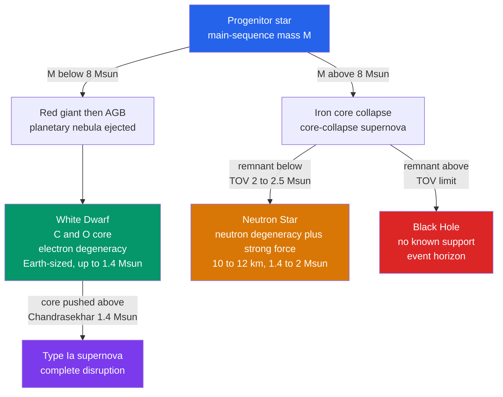

# ⚪ Stellar Remnants: White Dwarfs, Neutron Stars and Black Holes

> [!abstract] TL;DR
> When a star exhausts its nuclear fuel, gravity has nothing left to fight but the quantum pressure of tightly packed fermions. The **mass** of the leftover core decides its fate. Below the **Chandrasekhar limit** ($\sim 1.4\,M_\odot$), **electron degeneracy pressure** holds up an Earth-sized **white dwarf**. Push past it and electrons fail, the core collapses, and **neutron degeneracy pressure** (helped by the strong force) supports a $\sim 10$–$12$ km **neutron star** — up to the **Tolman–Oppenheimer–Volkoff (TOV) limit** ($\sim 2$–$2.5\,M_\odot$). Above that, no known force resists gravity: collapse is unstoppable and a stellar-mass **black hole** forms. All three thresholds trace back to one idea — degeneracy pressure from the Pauli exclusion principle, independent of temperature.

## Intuition — analogy FIRST

Imagine a crowded elevator. Once every "slot" is filled, forcing another person in doesn't just cost politeness — the quantum rules forbid two identical fermions from occupying the same state, so newcomers are shoved into higher-momentum states. That relentless jostling is a **pressure**, and crucially it does *not* need heat: even at absolute zero the elevator pushes back. This is **degeneracy pressure**.

A dead star's core is that elevator. Electrons resist compression well enough to hold up a white dwarf — until gravity forces them to nearly light speed, at which point their push weakens and the floor gives way. Then neutrons take over in a far smaller, far denser elevator. And if even the neutrons are overwhelmed, there is no elevator left — just a one-way trip through an event horizon.

---

## How It Works



### Secondary Level

When fusion stops, a star has no thermal pressure to resist its own weight. What saves a low-mass remnant is a purely quantum effect: identical fermions (electrons, then neutrons) cannot be squeezed into the same state, so packing them tightly forces high momenta and a **temperature-independent pressure**. The remnant's mass decides which floor of the elevator holds — and whether any holds at all.

| Remnant | Held up by | Typical mass | Radius | Density |
|---------|-----------|--------------|--------|---------|
| **White dwarf** | electron degeneracy | $\sim 0.6\,M_\odot$ | $\sim R_\oplus$ ($\sim 10^4$ km) | $\sim 10^6\ \mathrm{g\,cm^{-3}}$ |
| **Neutron star** | neutron degeneracy + strong force | $\sim 1.4\,M_\odot$ | $\sim 10$–$12$ km | $\sim 10^{14}\ \mathrm{g\,cm^{-3}}$ |
| **Black hole** | nothing | $\gtrsim 3\,M_\odot$ (stellar) | horizon $R_s = 2GM/c^2$ | — |

A teaspoon of white-dwarf matter weighs about a tonne; a teaspoon of neutron-star matter weighs about a billion tonnes — comparable to a mountain. A black hole is not "matter" at all in the ordinary sense: it is a region where escape velocity exceeds the speed of light.

### Undergraduate Level

**Degeneracy pressure from the uncertainty principle.** Confine $N$ fermions to a volume $V$ so that each occupies $\Delta x \sim n^{-1/3}$ where $n = N/V$. The uncertainty principle forces a momentum spread $\Delta p \sim \hbar\, n^{1/3}$. Estimating the pressure as $P \sim n\, (\Delta p)\, v$:

- **Non-relativistic** ($v = \Delta p/m$):  $\;P \sim \dfrac{\hbar^2}{m}\, n^{5/3} \propto \rho^{5/3}$
- **Ultra-relativistic** ($v \to c$):  $\;P \sim \hbar c\, n^{4/3} \propto \rho^{4/3}$

Both are set by density alone — **not temperature**. This is why a white dwarf can cool forever without collapsing.

**The counter-intuitive mass–radius relation.** Balancing non-relativistic degeneracy pressure against gravity ($P \sim GM^2/R^4$) with $P \propto (M/R^3)^{5/3}$ gives

$$R \propto M^{-1/3}.$$

**More massive white dwarfs are smaller.** Add mass and gravity compresses the star further, raising the density needed for the electrons to push back. Unlike a rock or a planet, there is no fixed "stuff" holding a set size — only quantum pressure.

**The Chandrasekhar limit.** As mass grows, electrons are squeezed to relativistic speeds and the equation of state softens from $\rho^{5/3}$ toward $\rho^{4/3}$. But $P \propto \rho^{4/3}$ has *exactly* the same radius-scaling as self-gravity — so the two no longer balance at a stable radius. Above a critical mass there is **no equilibrium**:

$$M_{\mathrm{Ch}} \approx \frac{1.44}{(\mu_e/2)^2}\,M_\odot \approx 1.4\,M_\odot ,$$

where $\mu_e \approx 2$ is the number of nucleons per electron for a C/O composition. A white dwarf pushed over $M_{\mathrm{Ch}}$ (e.g. by accretion in a binary) ignites carbon and detonates as a **Type Ia supernova**, leaving nothing behind.

**Neutron stars.** In a core-collapse supernova the core exceeds $M_{\mathrm{Ch}}$; electrons capture onto protons ($p + e^- \to n + \nu_e$), and the collapse halts when **neutron degeneracy pressure** plus strong-force repulsion stiffen the matter at nuclear density. The maximum mass is the **TOV limit**, $\sim 2$–$2.5\,M_\odot$, computed from general-relativistic hydrostatic equilibrium (the neutron-star analogue of $M_{\mathrm{Ch}}$).

**Black holes.** Above the TOV limit no known pressure can win. Collapse proceeds through the **Schwarzschild radius** $R_s = 2GM/c^2 \approx 3\ \mathrm{km}\times (M/M_\odot)$, forming an event horizon and a stellar-mass black hole.

### Graduate Level

**Chandrasekhar mass from fundamental constants.** Solving the ultra-relativistic ($n=3$) polytrope gives a mass independent of radius:

$$M_{\mathrm{Ch}} = \frac{\omega_3^{0}\sqrt{3\pi}}{2}\left(\frac{\hbar c}{G}\right)^{3/2}\frac{1}{(\mu_e m_H)^2}, \qquad \omega_3^{0} = 2.018,$$

so that $M_{\mathrm{Ch}} \propto (\hbar c/G)^{3/2}/m_p^{2}$. Because $(\hbar c/G)^{1/2} = M_{\mathrm{Pl}}$, this is a *purely quantum-gravitational* number:

$$N_{\mathrm{Ch}} = \frac{M_{\mathrm{Ch}}}{m_p} \sim \left(\frac{M_{\mathrm{Pl}}}{m_p}\right)^{3} = \alpha_G^{-3/2}\approx 2\times10^{57},\qquad \alpha_G \equiv \frac{Gm_p^2}{\hbar c}\approx 5.9\times10^{-39}.$$

The maximum number of nucleons a cold star can hold up is fixed by the gravitational fine-structure constant — a genuinely deep result.

**The neutron-star equation-of-state problem.** Above nuclear saturation density the composition and interactions are uncertain (nucleons, hyperons, meson condensates, possibly deconfined quark matter — the "hyperon puzzle"). Structure follows the **Tolman–Oppenheimer–Volkoff equation**:

$$\frac{dP}{dr} = -\frac{G\left(\rho + P/c^2\right)\left(m + 4\pi r^3 P/c^2\right)}{r^2\left(1 - 2Gm/rc^2\right)}.$$

A given EOS maps to a unique mass–radius curve, so the maximum mass and radii are direct probes of dense-matter physics. The measured $2.08\,M_\odot$ of PSR J0740+6620 rules out the softest EOSs, while the tidal deformability from **GW170817** caps how stiff the EOS can be — together bracketing $R_{1.4}\approx 11$–$12.5$ km. The original Oppenheimer–Volkoff calculation (pure ideal neutron gas) gave only $\sim 0.7\,M_\odot$; the strong-force stiffening is essential to reach the observed $\gtrsim 2\,M_\odot$.

**Mapping progenitor to remnant** is not one-to-one: mass loss (winds, metallicity-dependent), rotation, binary interaction, and non-monotonic "islands of explodability" all scramble it. Roughly, $M_{\mathrm{ZAMS}}\lesssim 8\,M_\odot \to$ white dwarf; $8$–$20\,M_\odot \to$ neutron star; $\gtrsim 20$–$25\,M_\odot \to$ black hole (often via fallback), with a debated "lower mass gap" near $2.5$–$5\,M_\odot$ that GW events like GW190814 have begun to populate.

---

## Code Demo

```python
import numpy as np

# ---- physical constants (SI) ----
hbar = 1.0546e-34      # reduced Planck constant, J*s
c    = 2.9979e8        # speed of light, m/s
G    = 6.674e-11       # gravitational constant
m_e  = 9.109e-31       # electron mass, kg
m_H  = 1.6726e-27      # nucleon (hydrogen) mass, kg
Msun = 1.989e30        # kg
Rearth = 6.371e6       # m
mu_e = 2.0             # nucleons per electron for a C/O white dwarf

# ---- non-relativistic electron-degeneracy polytrope (index n = 3/2) ----
# Degeneracy pressure  P = K_nr * rho**(5/3),  independent of temperature.
K_nr = (3*np.pi**2)**(2/3)/5 * hbar**2/m_e * (1/(mu_e*m_H))**(5/3)

# Lane-Emden n = 3/2 solution constants
xi1    = 3.65375       # first zero of theta(xi)
mtheta = 2.71406       # xi**2 * |theta'(xi)| evaluated at xi1
n = 1.5

# Mass-radius relation for an n = 3/2 polytrope  ->  R proportional to M**(-1/3)
coeff = xi1 * (4*np.pi*mtheta)**(1/3) * (n+1)*K_nr/(4*np.pi*G)
wd_radius = lambda M: coeff * M**(-1/3)          # metres

print("White-dwarf mass-radius relation (more mass -> smaller star):")
for Mfrac in [0.2, 0.4, 0.6, 0.8, 1.0]:
    R = wd_radius(Mfrac*Msun)
    print(f"  M = {Mfrac:0.1f} Msun  ->  R = {R/1e3:6.0f} km = {R/Rearth:4.2f} R_earth")

# ---- Chandrasekhar mass from the RELATIVISTIC polytrope (index n = 3) ----
# Fully relativistic electrons:  P = K_rel * rho**(4/3).  The n = 3 polytrope
# has a mass INDEPENDENT of radius -> a unique, hard maximum mass.
K_rel = (3*np.pi**2)**(1/3)/4 * hbar*c * (1/(mu_e*m_H))**(4/3)
M3 = 2.01824                                      # -xi**2 * theta' at xi1 for n = 3
M_Ch = 4*np.pi * (K_rel/(np.pi*G))**(3/2) * M3
print(f"\nChandrasekhar mass  M_Ch = {M_Ch/Msun:0.2f} Msun   (mu_e = {mu_e})")
```

Output: radius falls from $\sim 15{,}000$ km at $0.2\,M_\odot$ to $\sim 8900$ km at $1.0\,M_\odot$ (the $R\propto M^{-1/3}$ shrinkage), and $M_{\mathrm{Ch}}\approx 1.4\,M_\odot$.

---

## Real-World Notes

- **Sirius B** — the nearest white dwarf, roughly $1\,M_\odot$ packed into an Earth-sized ball. Its gravitational redshift (first hinted by W. Adams in 1925, pinned down by HST) is a textbook confirmation of general relativity and of degenerate matter.
- **Type Ia supernovae as cosmic rulers** — because the explosion is triggered at the near-universal Chandrasekhar mass, these SNe have a standardizable peak luminosity. They are the distance indicators that revealed cosmic acceleration and dark energy (see [[Supernovae_and_Gamma_Ray_Bursts]]).
- **The Crab pulsar** — a $\sim 30$ Hz rotating neutron star, the remnant of the SN observed in 1054 CE, whose spin-down powers the entire surrounding nebula (see [[Pulsars_Neutron_Stars_and_Magnetars]]).
- **Two-solar-mass pulsars** — PSR J0740+6620 ($2.08\,M_\odot$) plus NICER's $\sim 12.4$ km radius measurement rule out soft dense-matter equations of state and push the TOV limit upward.
- **GW170817** — a binary neutron-star merger seen in gravitational *and* electromagnetic waves; its tidal deformability constrains the EOS, and the kilonova forged heavy r-process elements (gold, platinum), tying remnants to [[Stellar_Nucleosynthesis]].
- **Cygnus X-1 and GW150914** — the first dynamically confirmed stellar-mass black hole ($\sim 21\,M_\odot$, an X-ray binary) and the first observed merger of two stellar black holes ($36 + 29\,M_\odot$).

---

## Common Pitfalls

1. **Degeneracy pressure is not thermal pressure.** It depends only on density, so a cold white dwarf resists gravity just as well as a hot one — cooling does not cause collapse.
2. **"Dead" does not mean "dark."** A new white dwarf is $\sim 10^5$ K and radiates for billions of years; the cooling time to a "black dwarf" exceeds the current age of the universe, so none exist yet.
3. **The Chandrasekhar mass is a maximum, not a typical mass.** Real white dwarfs average $\sim 0.6\,M_\odot$; the $\sim 1.4\,M_\odot$ figure also depends on composition through $\mu_e$.
4. **More mass means a smaller star** — the opposite of planets and ordinary solids. There is no fixed material scaffolding; the size is set entirely by the balance of quantum pressure and gravity.
5. **Neutron stars are not held up by neutron degeneracy alone.** Pure ideal-neutron-gas support caps at only $\sim 0.7\,M_\odot$ (Oppenheimer–Volkoff); reaching the observed $\gtrsim 2\,M_\odot$ requires strong-force repulsion stiffening the EOS.
6. **A black hole is not a "frozen star" or destroyed matter.** Its mass, charge, and angular momentum persist; what changes is that an event horizon of radius $R_s = 2GM/c^2$ now hides the interior.

---

## Related Concepts

- [[_MOC_Stellar_Astrophysics|↑ Section MOC]]
- [[Stellar_Evolution]] — the full life track whose endpoint this note describes; sets the progenitor mass that fixes the remnant.
- [[Stellar_Structure_and_Energy_Generation]] — hydrostatic equilibrium and the equation of state that also govern degenerate stars.
- [[Stellar_Nucleosynthesis]] — builds the C/O white-dwarf core and, via SNe and mergers, the heavy elements.
- [[The_Sun]] — a low-mass star destined to end as a C/O white dwarf.
- [[Stellar_Properties_and_the_HR_Diagram]] — white dwarfs occupy the lower-left cooling sequence of the HR diagram.
- [[Star_Formation]] — the birth end of the same mass-determined story.
- [[Black_Hole_Physics]] — the physics of the endpoint above the TOV limit: horizons, singularities, Kerr geometry.
- [[Pulsars_Neutron_Stars_and_Magnetars]] — how neutron stars are actually observed.
- [[Supernovae_and_Gamma_Ray_Bursts]] — Type Ia (white-dwarf) and core-collapse (neutron-star / black-hole) explosions.
- [[Quantum_Statistical_Mechanics]] — the Fermi–Dirac statistics behind degeneracy pressure.
- [[Wave_Particle_Duality_and_Uncertainty]] — the uncertainty principle from which degeneracy pressure is derived.
- [[Introduction_to_General_Relativity]] — the TOV equation, Schwarzschild radius, and event horizons.
- [[_MOC_Mathematics_Master]] — the polytrope / Lane–Emden differential equations used throughout.

---

## Review Questions

1. **Secondary**: Explain in your own words why a white dwarf does not collapse under gravity even after it stops producing energy. Why is this different from the pressure that holds up the Sun today?
2. **Undergraduate**: Starting from $P \propto \rho^{5/3}$ for non-relativistic degenerate electrons and hydrostatic equilibrium, derive $R \propto M^{-1/3}$. Then explain qualitatively why switching to the relativistic $P \propto \rho^{4/3}$ produces a maximum mass rather than a stable radius.
3. **Graduate**: The Chandrasekhar mass can be written as $M_{\mathrm{Ch}} \propto (\hbar c/G)^{3/2}/(\mu_e m_H)^2$. Interpret each fundamental constant's role, show that $N_{\mathrm{Ch}} \sim \alpha_G^{-3/2}$, and explain why the neutron-star TOV limit *cannot* be written so cleanly.

---

## Sources

- Carroll & Ostlie — *An Introduction to Modern Astrophysics*, 2nd ed., Ch. 16
- Shapiro & Teukolsky — *Black Holes, White Dwarfs, and Neutron Stars*
- Chandrasekhar, S. (1931) — "The Maximum Mass of Ideal White Dwarfs," *ApJ* 74, 81
- Prialnik — *An Introduction to the Theory of Stellar Structure and Evolution*, 2nd ed.
- Özel & Freire (2016) — "Masses, Radii, and the Equation of State of Neutron Stars," *ARA&A* 54, 401

#astronomy #astrophysics #stellarremnants #whitedwarfs #neutronstars #blackholes #degeneracypressure #Chandrasekhar #secondary #undergraduate #graduate
