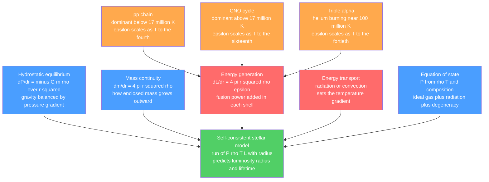

# ⚙️ Stellar Structure and Energy Generation

> [!abstract] TL;DR
> A star is a self-regulating ball of plasma held up by a standoff between two titans: **gravity** pulling every gram inward, and the **outward pressure gradient** of hot gas pushing back. That balance — **hydrostatic equilibrium**, $\tfrac{dP}{dr}=-\tfrac{Gm(r)\rho}{r^2}$ — forces the center to enormous pressure ($\sim10^{16}$ Pa) and temperature ($\sim1.5\times10^7$ K). Four coupled equations (hydrostatic equilibrium, mass continuity, energy generation, energy transport) plus an equation of state fix the entire internal run of $P$, $\rho$, $T$, and $L$. The **virial theorem** ($2K+U=0$) shows a contracting star *heats up* (negative heat capacity), so gravity alone (Kelvin-Helmholtz) can only power a star for tens of millions of years — the Sun's 4.6-billion-year age *demands* **nuclear fusion**, enabled at "only" ten million kelvin by quantum tunnelling through the Coulomb barrier.

## Intuition — analogy FIRST

Picture an enormous stack of mattresses. The bottom mattress is crushed flat, because it holds up the full weight of every mattress above it; the top one is barely compressed at all. A star works the same way: each shell of gas must support the weight of everything piled on top, so pressure, density, and temperature all rise steeply toward the center. The star does not collapse only because at every depth the *upward* push from the pressure difference across a shell exactly cancels the *downward* pull of gravity — a balance renewed continuously, everywhere, at once.

Now the twist that makes stars miraculous rather than merely heavy: squeezing a gas normally heats it, and hotter gas pushes back harder, which would seem to make a star fly apart. Instead the star settles into a self-correcting steady state, and once the center is hot enough, a nuclear furnace switches on to replace exactly the energy leaking out as starlight. The star becomes a thermostat that runs for billions of years.

---

## How It Works



---

## Key Concepts / Details

### Secondary Level

**What holds a star up.** Gravity relentlessly pulls the gas inward. What stops the collapse is *pressure*: the deeper gas is hotter and denser, so it pushes back harder than the gas above pushes down. This standoff is **hydrostatic equilibrium**, and it is why a star is a stable sphere rather than a collapsing cloud or an exploding bomb.

**What powers it.** Deep in the core, gravity compresses hydrogen to about **15 million kelvin**. There, nuclei fuse: four hydrogen nuclei combine into one helium nucleus, and because helium weighs about 0.7% less than the four protons, that missing mass becomes energy via $E=mc^2$. The Sun fuses roughly **600 million tonnes of hydrogen every second**, which is what makes it shine.

**Why it is stable.** If fusion briefly sped up, the core would heat, expand slightly, and *cool back down*, throttling the reaction. This built-in **thermostat** keeps the Sun burning steadily for about 10 billion years.

### Undergraduate Level

**The four equations of stellar structure** (functions of radius $r$, with enclosed mass $m$, density $\rho$, temperature $T$, luminosity $L$):

| # | Equation | Meaning |
|---|----------|---------|
| 1 | $\dfrac{dP}{dr} = -\dfrac{Gm\rho}{r^2}$ | Hydrostatic equilibrium |
| 2 | $\dfrac{dm}{dr} = 4\pi r^2 \rho$ | Mass continuity |
| 3 | $\dfrac{dL}{dr} = 4\pi r^2 \rho\,\varepsilon$ | Energy generation ($\varepsilon$ = power per kg) |
| 4 | $\dfrac{dT}{dr} = -\dfrac{3\kappa\rho L}{16\pi a c\, r^2 T^3}$ | Radiative energy transport |

Closed by an **equation of state**, e.g. the ideal gas $P = \dfrac{\rho k_B T}{\mu m_H}$, plus prescriptions for opacity $\kappa$ and generation rate $\varepsilon$.

**Central pressure.** Integrating equation 1 gives a rigorous lower bound $P_c > \dfrac{GM^2}{8\pi R^4}$; for the Sun this is $\sim10^{14}$ Pa, while detailed models give $\sim2.5\times10^{16}$ Pa (real stars are far more centrally concentrated than a uniform sphere). The corresponding central temperature is $\sim10^7$ K.

**Virial theorem.** For a self-gravitating gas in equilibrium, $2K + U = 0$, so the total energy $E = K + U = -K < 0$. A profound consequence: the star has a **negative heat capacity**. When it contracts, half the released gravitational energy is radiated away and *the other half heats the interior*. Losing energy makes a star hotter.

**Kelvin-Helmholtz timescale.** If gravitational contraction were the only power source, the star would last only
$$t_{KH} \sim \frac{GM^2}{RL} \approx 3\times10^7 \text{ yr (for the Sun)}.$$
Radiometric dating of meteorites gives a Solar System age of 4.6 Gyr — over a hundred times longer. Contraction alone cannot do it; sustained **nuclear fusion** is required (see [[Laws_of_Thermodynamics]] for the energy-accounting logic).

**Why fusion at "only" $10^7$ K.** Two protons repel via the Coulomb barrier, whose peak ($\sim$ MeV) corresponds classically to $\sim10^{10}$ K, a thousand times hotter than the core. Fusion happens anyway because of **quantum tunnelling**: a small fraction of nuclei penetrate the barrier. The reaction rate is set by the **Gamow peak** — the product of the sharply falling Maxwell-Boltzmann tail (few fast particles, see [[Kinetic_Theory_of_Gases]]) and the sharply rising tunnelling probability (see [[Nuclear_Reactions_Fission_Fusion]]).

**Hydrogen-burning pathways:**

| Pathway | Net reaction | Rate scaling | Dominates in |
|---------|-------------|--------------|--------------|
| pp chain | $4\,^1\!H \to\, ^4\!He + 2e^+ + 2\nu_e$ | $\varepsilon \propto \rho X^2 T^{\sim4}$ | Sun and cooler cores |
| CNO cycle | same net, C/N/O catalyse | $\varepsilon \propto \rho X X_{CNO} T^{\sim16-20}$ | hotter, more massive stars |

Both release $\approx 26.7$ MeV per helium (minus neutrino losses). Because CNO is so steeply temperature-dependent, the two cross over near **$T \approx 1.7\times10^7$ K**: the Sun's core (1.57×10^7 K) is ~99% pp, whereas a star above ~1.3 solar masses is CNO-dominated. Helium burning proceeds by the **triple-alpha process** ($3\,^4\!He \to\, ^{12}\!C$) near $10^8$ K, with a ferocious $\varepsilon \propto \rho^2 T^{\sim40}$.

**Energy transport — radiation vs convection.** Photons random-walk outward by diffusion, their progress throttled by **opacity** $\kappa$. If the required radiative gradient becomes too steep, the gas instead boils: convection. The **Schwarzschild criterion** says a layer is convective when
$$\nabla_{rad} > \nabla_{ad}, \qquad \nabla \equiv \frac{d\ln T}{d\ln P},$$
with $\nabla_{ad} = 0.4$ for an ideal monatomic gas. The Sun has a **radiative core and a convective envelope**; massive CNO-burning stars have **convective cores** (concentrated energy generation) and radiative envelopes; low-mass M dwarfs are fully convective.

**Mass-luminosity relation.** Combining the structure equations for radiative main-sequence stars yields the observed
$$L \propto M^{\alpha}, \quad \alpha \approx 3.5,$$
so a 10-solar-mass star is thousands of times more luminous — and burns out far faster.

### Graduate Level

**Polytropes and Lane-Emden.** Assuming $P = K\rho^{1+1/n}$ decouples mechanics from thermal detail. Substituting $\rho = \rho_c\theta^n$ and a dimensionless radius $\xi$ into hydrostatic equilibrium yields the **Lane-Emden equation**
$$\frac{1}{\xi^2}\frac{d}{d\xi}\!\left(\xi^2 \frac{d\theta}{d\xi}\right) = -\theta^n .$$
The $n=3$ polytrope is Eddington's "standard model" (radiative, radiation + gas pressure); $n=1.5$ describes convective zones and non-relativistic degenerate matter. Only $n = 0, 1, 5$ have closed-form solutions.

**Gamow peak, quantitatively.** The energy of maximum reaction probability is $E_0 = \left(\tfrac{b\,k_BT}{2}\right)^{2/3}$ with $b = \pi\alpha Z_1 Z_2\sqrt{2 m_r c^2}$; its width and height give the steep power-law $T$-dependence tabulated above.

**Degeneracy pressure.** When the electron de Broglie wavelength approaches the interparticle spacing, the Pauli exclusion principle supplies a pressure *independent of temperature*: $P \propto \rho^{5/3}$ (non-relativistic) or $\rho^{4/3}$ (relativistic) — see [[Quantum_Statistical_Mechanics]]. In a **degenerate** gas the thermostat breaks: heating no longer raises pressure, so ignition runs away (the helium flash in low-mass red-giant cores; Type Ia supernovae in white dwarfs).

**Eddington luminosity.** Radiation pressure on free electrons imposes a stability ceiling where outward radiation force equals gravity:
$$L_{Edd} = \frac{4\pi G M m_H c}{\sigma_T} \approx 3.2\times10^4 \left(\frac{M}{M_\odot}\right) L_\odot .$$
Stars near this limit drive powerful winds and cannot grow arbitrarily massive.

```python
import numpy as np

# --- Physical constants (SI) ---
G   = 6.674e-11    # gravitational constant [N m^2 / kg^2]
k_B = 1.381e-23    # Boltzmann constant [J/K]
m_H = 1.673e-27    # hydrogen mass [kg]
Msun, Rsun = 1.989e30, 6.957e8   # solar mass [kg], radius [m]

def central_pressure_uniform(M, R):
    """Central pressure of a UNIFORM-density self-gravitating sphere,
       obtained by integrating hydrostatic equilibrium dP/dr = -G m rho / r^2.
       Gives the order-of-magnitude scaling P_c ~ G M^2 / R^4."""
    return 3 * G * M**2 / (8 * np.pi * R**4)

def central_temperature(Pc, M, R, mu=0.6):
    """Ideal-gas temperature from P = rho k_B T / (mu m_H),
       using the mean density as an order-of-magnitude stand-in."""
    rho_mean = M / (4/3 * np.pi * R**3)
    return Pc * mu * m_H / (rho_mean * k_B)

Pc = central_pressure_uniform(Msun, Rsun)
Tc = central_temperature(Pc, Msun, Rsun)

print(f"Estimated solar central pressure    : {Pc:.2e} Pa   (detailed model ~2.5e16 Pa)")
print(f"Estimated solar central temperature : {Tc:.2e} K    (detailed model ~1.57e7 K)")
# The estimates land within ~2 orders of magnitude of the true values;
# the gap is entirely because a real star is far more centrally concentrated
# than a uniform sphere -- yet even this crude model already forces the core
# into the ~10^7 K regime where hydrogen fusion can ignite.
```

---

## Real-World Notes

- **The Sun** runs the pp chain at $T_c = 1.57\times10^7$ K, $\rho_c \approx 1.5\times10^5$ kg/m$^3$; it is ~99% pp, ~1% CNO. See [[The_Sun]].
- **Helioseismology** confirms the internal structure to ~0.1%: measured sound-speed and rotation profiles match models, and pin the base of the convective envelope at $0.713\,R_\odot$.
- **Solar neutrinos** are direct proof of core fusion. Borexino resolved individual pp, $^7$Be, and CNO neutrino fluxes, confirming both burning modes operate simultaneously.
- **The CNO crossover** explains the main-sequence morphology: stars below ~1.3 $M_\odot$ (pp, radiative cores) vs above (CNO, convective cores) differ in mixing, lifetime, and later evolution — see [[Stellar_Evolution]].
- **Triple-alpha** forged the carbon in every living thing; Fred Hoyle predicted the $^{12}$C resonance from the mere fact that carbon exists — a landmark of [[Stellar_Nucleosynthesis]].
- **The Eddington limit** caps how bright and massive stars can be and regulates accretion onto black holes and neutron stars.

---

## Common Pitfalls

1. **"Pressure holds a star up."** It is the pressure *gradient*, not pressure itself, that balances gravity. Uniform pressure exerts no net force. Only the difference across a shell counts.
2. **Confusing negative heat capacity with a paradox.** Losing energy makes a star *hotter* because gravity does the bookkeeping (virial theorem). This is real, not a sign error, and it underlies why fusion must eventually take over from contraction.
3. **Thinking $10^7$ K is enough to beat the Coulomb barrier head-on.** It is not — the barrier peak is ~1000× higher. Fusion survives only via quantum tunnelling in the Gamow peak; ignore tunnelling and the Sun goes dark.
4. **Assuming the Sun is convective in the core.** The Sun's *core is radiative* and its *envelope convective*. Massive stars are the reverse. Getting this backwards misplaces mixing and surface abundances.
5. **Treating the mass-luminosity exponent as universal.** $\alpha \approx 3.5$ is a rough average; it steepens for low-mass stars and flattens toward $\sim1$ for very massive stars approaching the Eddington limit.
6. **Applying the ideal-gas thermostat to degenerate matter.** In a degenerate core pressure is temperature-independent, so the self-regulation fails — the origin of the helium flash and Type Ia detonations.

---

## Related Concepts

- [[_MOC_Stellar_Astrophysics|↑ Section MOC]]
- [[The_Sun]] — the nearest worked example: measured core temperature, density, and neutrino output
- [[Stellar_Properties_and_the_HR_Diagram]] — the mass-luminosity relation places stars on the main sequence
- [[Star_Formation]] — Kelvin-Helmholtz contraction is the pre-main-sequence power source before fusion ignites
- [[Stellar_Evolution]] — what happens as each fuel is exhausted and the core contracts and reheats
- [[Stellar_Nucleosynthesis]] — the detailed reaction networks (pp, CNO, triple-alpha) that build the elements
- [[Stellar_Remnants_White_Dwarfs_Neutron_Stars_Black_Holes]] — degeneracy pressure as the final support against gravity
- [[Nuclear_Reactions_Fission_Fusion]] — Coulomb barrier, tunnelling, and fusion energetics (Physics vault)
- [[Laws_of_Thermodynamics]] — energy conservation and the virial energy budget of a star (Physics vault)
- [[Kinetic_Theory_of_Gases]] — the Maxwell-Boltzmann tail that feeds the Gamow peak (Physics vault)
- [[Quantum_Statistical_Mechanics]] — electron degeneracy pressure from the Pauli principle (Physics vault)
- [[_MOC_Mathematics_Master]] — coupled ODEs, boundary-value problems, and the Lane-Emden equation

---

## Review Questions

1. **Secondary**: A star is a balance between two opposing effects. Name them, and explain in one sentence each why the star neither collapses nor blows apart.
2. **Undergraduate**: The Kelvin-Helmholtz timescale for the Sun is ~30 million years, yet the Solar System is 4.6 billion years old. What does this discrepancy prove, and what physical process resolves it?
3. **Graduate**: The core of a low-mass red giant is electron-degenerate when helium ignites. Explain, using the equation of state, why this produces a runaway "helium flash" rather than the smooth, self-regulated burning seen on the main sequence.

---

## Sources

- Kippenhahn, Weigert & Weiss — *Stellar Structure and Evolution*, 2nd ed. (the standard graduate text)
- Prialnik — *An Introduction to the Theory of Stellar Structure and Evolution*, 2nd ed.
- Clayton — *Principles of Stellar Evolution and Nucleosynthesis* (Gamow peak, reaction rates)
- Hansen, Kawaler & Trimble — *Stellar Interiors: Physical Principles, Structure, and Evolution*

#astronomy #stellar-astrophysics #hydrostatic-equilibrium #virial-theorem #nuclear-fusion #ppchain #CNOcycle #convection #polytropes #secondary #undergraduate #graduate
