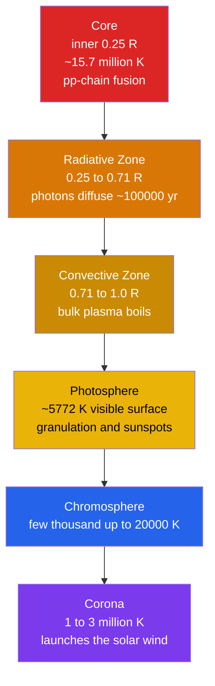

# ☀️ The Sun

> [!abstract] TL;DR
> The Sun is a middle-aged, main-sequence G2 star — a self-gravitating ball of hot plasma held up against its own gravity by the pressure of energy released when hydrogen fuses to helium in its core. It has a mass of $\sim2\times10^{30}$ kg, a radius of $\sim7\times10^8$ m, a luminosity of $3.828\times10^{26}$ W, an effective surface temperature of $5772$ K, an age of $\sim4.6$ Gyr, and a composition of about **73% H, 25% He, 2% heavier elements** by mass. Because it is the only star we can resolve in detail, the Sun is the calibration standard for all of stellar astrophysics: the [[Stellar_Structure_and_Energy_Generation|structure equations]], the [[Nuclear_Reactions_Fission_Fusion|proton–proton chain]], solar neutrinos, and magnetic activity all become directly observable here.

## Intuition — analogy FIRST

Imagine a stack of mattresses with a lead weight sitting on top. Gravity pulls the weight down; the springs push back. The stack settles where the two exactly balance. A star is that balance carried to an extreme: gravity relentlessly tries to crush $2\times10^{30}$ kg of gas into a point, and the only thing stopping it is the outward push of hot, high-pressure plasma. That pressure is continually leaking away as sunlight, so the star would deflate — except that fusion in the core keeps reheating the "springs." **The Sun is a slow, controlled hydrogen bomb whose explosion is perfectly contained by its own weight.**

That balance, called **hydrostatic equilibrium**, is why the Sun is stable for billions of years instead of exploding or collapsing. Everything else — the layered interior, the granulated surface, the million-degree corona — follows from energy trying to escape from a core held under enormous gravity.

---

## How It Works

The Sun is a series of nested shells. Energy is made in the tiny central core and then fights its way outward through changing physical regimes until it finally escapes as light at the surface.



---

## Key Concepts / Details

### Secondary Level

The Sun is an ordinary star that happens to be close. Every quantity below is a benchmark used to describe other stars in "solar units."

| Property | Value | Note |
|----------|-------|------|
| Mass $M_\odot$ | $1.989\times10^{30}$ kg | $\sim$333,000 Earths |
| Radius $R_\odot$ | $6.96\times10^8$ m | $\sim$109 Earths across |
| Luminosity $L_\odot$ | $3.828\times10^{26}$ W | energy output per second |
| Surface temperature | $5772$ K | the photosphere |
| Core temperature | $\sim1.57\times10^7$ K | where fusion happens |
| Age | $\sim4.6$ Gyr | roughly half its life |
| Composition (mass) | 73% H, 25% He, 2% metals | "metals" = everything past He |
| Distance from Earth | $1.496\times10^{11}$ m | 1 astronomical unit, light takes 8 min 20 s |

**Energy from fusion, not fire.** In the core, four hydrogen nuclei combine into one helium nucleus. The helium weighs about **0.7% less** than the four hydrogens; that missing mass becomes energy via $E=mc^2$. Chemical burning could power the Sun for only a few thousand years — fusion powers it for ten billion.

**Getting out is slow.** A packet of energy made in the core takes roughly **100,000 years** to random-walk out through the dense radiative zone, then rides rising blobs of plasma through the convective zone, and finally escapes the photosphere as light that reaches Earth 8 minutes later.

**A magnetic Sun.** Dark **sunspots** are cooler regions ($\sim3800$ K) where strong magnetic fields choke off convection. Their number rises and falls over an **~11-year cycle**.

### Undergraduate Level

**Hydrostatic equilibrium.** At every radius, the pressure gradient balances gravity:

$$\frac{dP}{dr} = -\frac{G\,M(r)\,\rho(r)}{r^2}$$

Integrating gives a central pressure of $\sim2.5\times10^{16}$ Pa and central density $\sim1.5\times10^{5}$ kg/m³ — denser than lead, yet still a gas because the temperature is so high.

**Luminosity from the surface (Stefan–Boltzmann).** Treating the photosphere as a blackbody:

$$L_\odot = 4\pi R_\odot^2\,\sigma T_{\text{eff}}^4$$

With $R_\odot=6.96\times10^8$ m and $T_{\text{eff}}=5772$ K this yields $3.8\times10^{26}$ W — a self-consistency check that defines the **effective temperature**.

**Energy generation — the pp chain.** The dominant reaction is

$$4\,{}^1\text{H} \;\rightarrow\; {}^4\text{He} + 2e^+ + 2\nu_e + 2\gamma$$

releasing **26.73 MeV** per helium nucleus (of which $\sim0.6$ MeV escapes invisibly as neutrinos). See [[Stellar_Structure_and_Energy_Generation]] and [[Nuclear_Reactions_Fission_Fusion]].

**Solar neutrinos — direct proof of core fusion.** Neutrinos barely interact, so they stream straight out of the core in $\sim2$ s, carrying a live signal from the fusion site. Early detectors (Homestake) counted only **one-third** the predicted flux — the **solar neutrino problem**. The resolution was profound: neutrinos *oscillate* between flavors in transit, so electron-neutrinos from the Sun partly convert to muon/tau flavors that older detectors could not see. SNO measured the total flux across all flavors and found it matched the solar model exactly. See [[Multi_Messenger_Astronomy]].

**Magnetic activity and the dynamo.** Differential rotation (the equator spins faster than the poles) winds up the internal magnetic field, driving the **~11-year sunspot cycle** and the **~22-year Hale magnetic cycle** (the field's polarity flips each sunspot cycle). Twisted field lines release energy in **flares** and eject billion-tonne plasma clouds as **coronal mass ejections (CMEs)**. The continuous outflow of plasma is the **solar wind** ($\sim400$–$700$ km/s). Their impact on Earth is **space weather**. See [[Magnetism_and_Biot_Savart]].

### Graduate Level

**The Standard Solar Model (SSM).** The SSM integrates four coupled equations — hydrostatic equilibrium, mass continuity, energy transport, and energy generation — together with input microphysics (radiative opacities, the equation of state, and nuclear reaction rates). A single free parameter, the initial helium abundance and mixing length, is calibrated so the model reproduces the observed $L_\odot$, $R_\odot$, and surface composition at the known age of 4.6 Gyr. The SSM's predictions were spectacularly confirmed by both neutrinos and helioseismology.

**Energy-transport regimes.** Energy moves outward by radiative diffusion where the gas is transparent enough, and by convection where the radiative gradient becomes too steep. The **Schwarzschild criterion** sets the boundary — convection sets in when

$$\left(\frac{d\ln T}{d\ln P}\right)_{\text{rad}} > \left(\frac{d\ln T}{d\ln P}\right)_{\text{ad}}$$

In the Sun this switch occurs near $0.71\,R_\odot$, marking the base of the convective zone.

**pp chain vs CNO cycle.** Both fuse H to He, but with very different temperature sensitivity:

| Channel | Rate scaling | Solar contribution | Dominant when |
|---------|--------------|--------------------|---------------|
| pp chain | $\propto T^{4}$ | $\sim99\%$ | $T \lesssim 1.7\times10^7$ K |
| CNO cycle | $\propto T^{17\text{–}20}$ | $\sim1\%$ | $T \gtrsim 1.7\times10^7$ K, $M\gtrsim1.3\,M_\odot$ |

The Sun's core is just below the crossover, so it is overwhelmingly pp-powered; more massive stars run on CNO.

**The coronal heating problem.** The photosphere is 5772 K, yet the overlying corona is 1–3 **million** K. Ordinary conduction cannot heat a hot gas from a cooler one, so the energy must arrive non-thermally along magnetic fields. The two leading mechanisms are **nanoflares** (many tiny magnetic-reconnection events) and the dissipation of **Alfvén / MHD waves**. It remains an active, unsolved problem.

**Helioseismology.** The Sun rings like a bell: trapped acoustic (p-mode) oscillations with a characteristic 5-minute period reveal the interior sound-speed and rotation profiles, much as seismology reveals Earth's interior. These measurements confirmed the depth of the convective zone and validated the SSM to fractions of a percent.

---

## Code Demo

```python
import numpy as np

# --- Physical constants (SI) ---
c     = 2.99792458e8      # speed of light, m/s
u     = 1.66053907e-27    # atomic mass unit, kg
MeV   = 1.602176634e-13   # 1 MeV in joules
L_sun = 3.828e26          # solar luminosity, W
M_sun = 1.989e30          # solar mass, kg
Gyr   = 3.1557e16         # seconds in a gigayear

# --- Mass defect of the pp chain: 4 H -> He-4 + 2 e+ + 2 nu ---
# Use neutral ATOMIC masses so the electron/positron bookkeeping cancels cleanly.
m_H   = 1.007825 * u      # hydrogen-1 atom
m_He4 = 4.002602 * u      # helium-4 atom
dm    = 4 * m_H - m_He4    # mass converted to energy per He-4 formed

E_per_He   = dm * c**2            # joules released per He-4 nucleus
efficiency = dm / (4 * m_H)       # fraction of mass turned into energy

print(f"Mass defect per He-4 : {dm/u:.5f} u")
print(f"Energy per He-4      : {E_per_He/MeV:.2f} MeV = {E_per_He:.3e} J")
print(f"Mass-to-energy eff.  : {efficiency*100:.3f} %")

# --- How many fusion cycles per second power the Sun? ---
rate_He      = L_sun / E_per_He        # He-4 nuclei formed per second
rate_H       = 4 * rate_He             # protons consumed per second
mass_H_per_s = rate_H * m_H            # kg of hydrogen fused per second

print(f"\nHe-4 formed / s      : {rate_He:.3e}")
print(f"Hydrogen fused / s   : {mass_H_per_s:.3e} kg  (~{mass_H_per_s/1e9:.0f} million tonnes)")
print(f"Mass lost / s (E/c^2): {L_sun/c**2:.3e} kg   (~{L_sun/c**2/1e9:.1f} million tonnes)")

# --- Main-sequence lifetime: only the core (~10% of the mass) ever burns ---
core_fraction = 0.10                              # fuel reservoir as fraction of M_sun
E_available   = efficiency * core_fraction * M_sun * c**2
t_MS          = E_available / L_sun

print(f"\nMain-sequence H-burning lifetime: {t_MS/Gyr:.1f} Gyr")

# Expected output:
#   Energy per He-4      : 26.73 MeV = 4.283e-12 J
#   Mass-to-energy eff.  : 0.712 %
#   Hydrogen fused / s   : ~600 million tonnes ; Mass lost / s ~ 4.3 million tonnes
#   Main-sequence H-burning lifetime: ~10.5 Gyr
```

---

## Real-World Notes

- **Space weather.** The 1859 **Carrington Event** (a giant flare + CME) set telegraph wires sparking; a 1989 CME collapsed the **Hydro-Québec** power grid in 90 seconds. Modern CMEs threaten satellites, GPS, aviation, and power infrastructure — the practical stakes of solar magnetism.
- **Nobel-winning neutrinos.** Ray Davis's Homestake experiment (Nobel 2002) first detected solar neutrinos; Kajita and McDonald (Nobel 2015) proved neutrino oscillation, resolving the solar neutrino problem and revealing that neutrinos have mass.
- **Touching the Sun.** NASA's **Parker Solar Probe** flies directly through the corona, sampling the plasma where the solar wind is born and probing the coronal-heating problem in situ.
- **The faint young Sun.** Stellar models say the newborn Sun was only $\sim70\%$ as luminous as today. That early Earth stayed warm enough for liquid water (the "faint young Sun paradox") constrains ancient atmospheric greenhouse gases.
- **Continuous monitoring.** Space observatories (SOHO, SDO) and ground networks (GONG) watch the Sun around the clock, feeding both space-weather forecasting and helioseismic inversions of the interior.

---

## Common Pitfalls

1. **"The Sun is burning / on fire."** It is not chemical combustion — it is nuclear fusion. Chemical energy would exhaust the Sun in a few thousand years; fusion sustains it for $\sim10$ Gyr.
2. **Confusing surface and core temperature.** The photosphere is $5772$ K; the fusing core is $\sim1.57\times10^7$ K — a factor of nearly 3000 apart. Only the surface temperature sets the color of sunlight.
3. **"Sunlight takes 8 minutes."** True for a photon's trip from the *surface* to Earth. But the *energy* took $\sim10^5$ years to random-walk out of the radiative zone — the photon leaving now was made long before humans existed.
4. **The hot corona seems to break thermodynamics.** A million-degree corona above a 5772 K surface does not violate the second law: the energy is delivered non-thermally by magnetic fields and waves, not conducted up from the cooler photosphere.
5. **Sunspots are not black.** They are simply *cooler* ($\sim3800$ K) and so look dark only by contrast; in isolation a sunspot would glow brighter than an arc lamp.
6. **The Sun will not go supernova.** At $1\,M_\odot$ it is far too light. It will swell into a red giant and end as a slowly cooling white dwarf — see [[Stellar_Evolution]].

---

## Related Concepts

- [[_MOC_Stellar_Astrophysics|↑ Section MOC]]
- [[Stellar_Structure_and_Energy_Generation]] — the structure equations and fusion physics the Sun exemplifies
- [[Stellar_Properties_and_the_HR_Diagram]] — where the Sun sits on the main sequence as a G2 dwarf
- [[Star_Formation]] — how a star like the Sun condenses from a molecular cloud
- [[Stellar_Evolution]] — the Sun's future as a red giant and white dwarf
- [[Stellar_Nucleosynthesis]] — the pp chain and CNO cycle in full
- [[Stellar_Remnants_White_Dwarfs_Neutron_Stars_Black_Holes]] — the endpoint awaiting the Sun
- [[Multi_Messenger_Astronomy]] — solar neutrinos as a non-photonic messenger from the core
- [[Nuclear_Reactions_Fission_Fusion]] — Physics vault: the underlying fusion reactions and mass defect
- [[Laws_of_Thermodynamics]] — Physics vault: hydrostatic and thermal balance in the interior
- [[Magnetism_and_Biot_Savart]] — Physics vault: the fields behind the solar dynamo and space weather
- [[_MOC_Mathematics_Master]] — Math vault: the differential equations of stellar structure

---

## Review Questions

1. **Secondary**: Sunlight reaches Earth in about 8 minutes, yet astronomers say the energy took roughly 100,000 years to escape the Sun. Explain why these two very different times are both correct.
2. **Undergraduate**: Using the Stefan–Boltzmann law with $R_\odot = 6.96\times10^8$ m and $T_{\text{eff}} = 5772$ K, show that the solar luminosity is $\approx3.8\times10^{26}$ W. Then estimate the solar constant (flux at 1 AU).
3. **Graduate**: State the solar neutrino problem and explain precisely how neutrino oscillation — confirmed by SNO's neutral-current measurement — resolved it without altering the standard solar model. What does the resolution imply for neutrino mass?

---

## Sources

- Carroll & Ostlie — *An Introduction to Modern Astrophysics*, 2nd ed., Ch. 10–11
- Prialnik — *An Introduction to the Theory of Stellar Structure and Evolution*, 2nd ed.
- Bahcall — *Neutrino Astrophysics* (Cambridge); SNO Collaboration, *PRL* 89, 011301 (2002)
- Christensen-Dalsgaard — "Helioseismology," *Rev. Mod. Phys.* 74, 1073 (2002)
- NASA SDO / Parker Solar Probe mission pages; IAU 2015 nominal solar values

#astronomy #stellar-astrophysics #the-sun #ppchain #solar-neutrinos #helioseismology #space-weather #secondary #undergraduate #graduate
