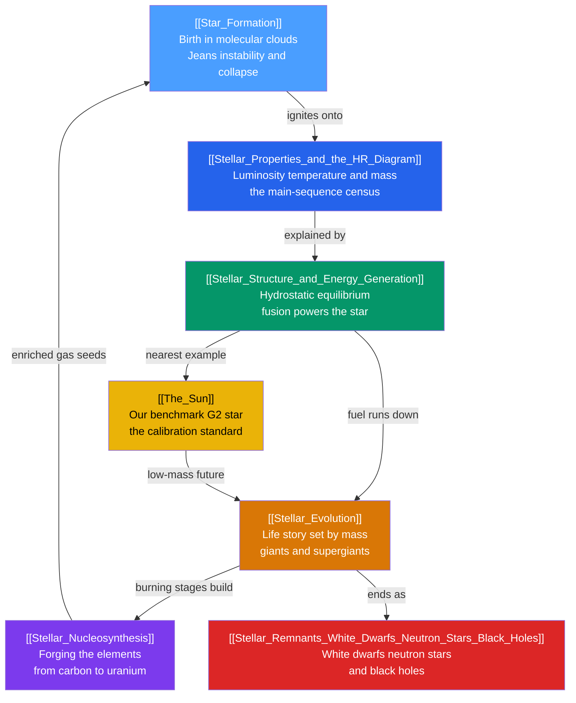

# ⭐ Stellar Astrophysics — Map of Content

> [!abstract] What This Section Covers
> Stellar astrophysics is the physics of how stars are born, live, and die. This section follows the full life cycle of a star: cold [[Star_Formation|molecular clouds]] collapse under gravity, ignite hydrogen fusion, and settle onto the main sequence, where the balance of gravity against pressure — the [[Stellar_Structure_and_Energy_Generation|structure equations]] — governs everything. A star's single most important attribute, its birth **mass**, fixes its place on the [[Stellar_Properties_and_the_HR_Diagram|Hertzsprung–Russell diagram]], its luminosity and lifetime, and its ultimate fate. Our own [[The_Sun|Sun]] is the one star we can resolve in detail, the calibration standard for all the rest. As fuel runs down, stars swell into giants, forge the chemical elements through [[Stellar_Nucleosynthesis|nucleosynthesis]], and end as one of three [[Stellar_Remnants_White_Dwarfs_Neutron_Stars_Black_Holes|remnants]] — a white dwarf, a neutron star, or a black hole — before scattering enriched matter that seeds the next stellar generation. Every note opens at secondary level and deepens to graduate-level formalism.

## Concept Map — The Life Cycle of a Star

*(Blue = birth and characterisation, green = the engine, yellow = the nearest example, orange/purple = aging and element-building, red = the endpoints. The arrow back to Star Formation closes the cosmic recycling loop.)*

---

## Learning Path

*Recommended order for a first pass through the lives of stars:*

1. [[The_Sun]] — start with the one star we can resolve in detail: its layered interior, fusion core, neutrinos, and magnetic activity set the benchmarks for everything else.
2. [[Stellar_Properties_and_the_HR_Diagram]] — the five measurable properties (luminosity, temperature, radius, mass, composition) and the single most important chart in stellar astronomy.
3. [[Stellar_Structure_and_Energy_Generation]] — hydrostatic equilibrium, the four structure equations, the virial theorem, and why fusion must power a star.
4. [[Star_Formation]] — how a molecular cloud goes unstable (Jeans mass), fragments into clusters, and contracts down onto the main sequence.
5. [[Stellar_Evolution]] — the life story written by birth mass: red giants, the helium flash, supergiants, and the split between quiet and catastrophic deaths.
6. [[Stellar_Nucleosynthesis]] — the cosmic manufacturing of the elements, from the triple-alpha process and the iron peak to s- and r-process neutron capture.
7. [[Stellar_Remnants_White_Dwarfs_Neutron_Stars_Black_Holes]] — the endpoints: degeneracy pressure, the Chandrasekhar and TOV limits, and the three possible graves of a star.

---

## All Notes at a Glance

| Note | Core Idea | Difficulty |
|------|-----------|------------|
| [[The_Sun]] | Our middle-aged G2 main-sequence star — its layered interior, pp-chain core, solar neutrinos, and magnetic activity, the calibration standard for all of stellar astrophysics. | Secondary → Graduate |
| [[Stellar_Properties_and_the_HR_Diagram]] | The five measurable stellar properties and how plotting luminosity against temperature reveals the main sequence, giants, white dwarfs, and the mass–luminosity relation. | Secondary → Graduate |
| [[Stellar_Structure_and_Energy_Generation]] | Hydrostatic equilibrium, the four coupled structure equations, the virial theorem and negative heat capacity, and fusion via quantum tunnelling through the Coulomb barrier. | Secondary → Graduate |
| [[Star_Formation]] | Jeans instability and collapse of giant molecular clouds, fragmentation into clusters, protostars and jets, T-Tauri contraction, and the initial mass function. | Secondary → Graduate |
| [[Stellar_Evolution]] | The life story set by birth mass: red giants, the helium flash, planetary nebulae, onion-shell burning, iron cores, and the split into white dwarfs, neutron stars, or black holes. | Secondary → Graduate |
| [[Stellar_Nucleosynthesis]] | The origin of the elements — the binding-energy curve and iron peak, stellar and explosive fusion, s- and r-process neutron capture, and cosmic-ray spallation. | Secondary → Graduate |
| [[Stellar_Remnants_White_Dwarfs_Neutron_Stars_Black_Holes]] | Degeneracy pressure and the mass thresholds that decide a remnant's fate: white dwarfs below Chandrasekhar, neutron stars below TOV, and black holes above it. | Secondary → Graduate |

---

## Key Questions This Section Answers

- What holds a star up for billions of years, and why must nuclear fusion — not gravitational contraction — be its power source?
- Why does the entire life story of a star follow from a single number, its birth mass?
- Why do the vast majority of stars fall on one diagonal band, the main sequence, on the HR diagram?
- Where do the chemical elements come from — the carbon in your cells, the oxygen you breathe, the gold in a ring?
- Why does fusion stop at iron, and what happens to a star's core once it can extract no more energy?
- What decides whether a dead star becomes a white dwarf, a neutron star, or a black hole?

---

## Related Sections

- [[_MOC_Astronomy_Master|↑ Astronomy Master MOC]]
- [[_MOC_Observational_Astronomy|→ Observational Astronomy]] — spectroscopy, magnitudes, and the distance ladder that let us measure the stellar properties charted here
- [[_MOC_Galaxies_ISM|→ Galaxies & the ISM]] — the interstellar medium is both the cradle of star birth and the sink for stellar death; stellar populations build galaxies
- [[_MOC_High_Energy_Astrophysics|→ High-Energy & Relativistic Astrophysics]] — supernovae, pulsars, gravitational waves, and black-hole physics carry the story of remnants further
- [[_MOC_Cosmology|→ Cosmology]] — Big Bang nucleosynthesis provides the primordial H and He on which stellar nucleosynthesis builds

#MOC #Astronomy #StellarAstrophysics
