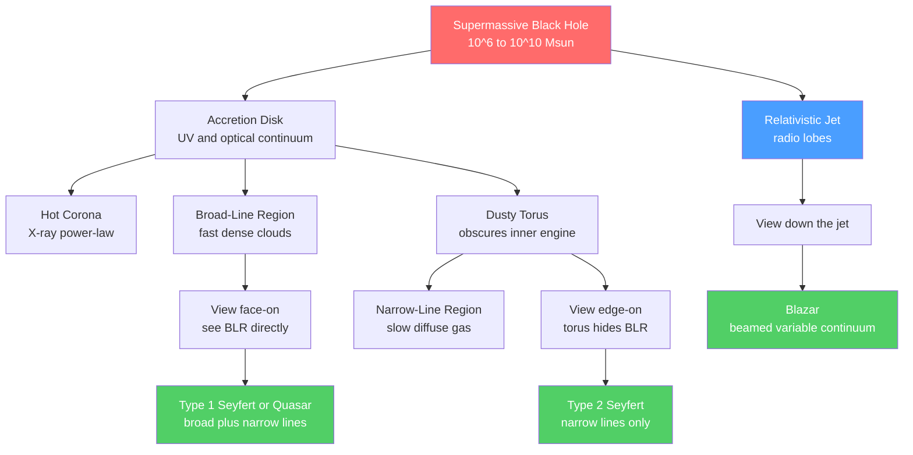

# 💥 Active Galactic Nuclei and Quasars

> [!abstract] TL;DR
> An Active Galactic Nucleus (AGN) is a compact, extraordinarily luminous central region powered not by stars but by a **supermassive black hole** ($10^6$–$10^{10}\,M_\odot$) accreting gas through an **accretion disk**. Because accretion near a black hole releases up to ~10% of the infalling matter's rest-mass energy — more than ten times the efficiency of nuclear fusion — an AGN can outshine its entire host galaxy from a region smaller than the Solar System. The diverse "AGN zoo" (Seyferts, quasars, radio galaxies, blazars) is largely explained by the **Unified Model**: the same central engine viewed at different orientations. The **Eddington luminosity** sets the natural brightness ceiling, and the **M–σ relation** ties black-hole mass to the host galaxy — evidence for co-evolution and AGN feedback.

## Intuition — analogy FIRST

Imagine water swirling down a drain. The closer it gets, the faster it spins and the more energy it dumps out. Now replace the drain with a supermassive black hole. Gas spiraling inward converts a large fraction of its rest-mass energy ($E = mc^2$) into light *before* it vanishes past the horizon — the most efficient power plant nature builds. The result is a source no bigger than the Solar System that outshines a hundred billion stars combined.

The zoo of names — Seyfert, quasar, blazar — is mostly about **viewing angle**. Picture a lighthouse: from the side you see a steady glow; when the beam sweeps directly at you, it is blinding. An AGN's dusty doughnut hides the bright inner engine from some angles, while its jet blazes only when pointed near your line of sight.

---

## How It Works



---

## Key Concepts / Details

### Secondary Level

An AGN is a galaxy whose **nucleus** shines far brighter than all its stars, across the whole electromagnetic spectrum. **Quasars** (quasi-stellar objects, QSOs) are the most extreme and distant examples — so pointlike that early astronomers mistook them for stars, until their huge **redshifts** revealed they lie billions of light-years away and must therefore be intrinsically enormous (up to $\sim 10^{14}\,L_\odot$).

Two clues pin down the engine:

- **It is tiny.** AGN brightness can double or halve in hours to days. Nothing can vary coherently faster than light crosses it, so the emitting region is at most a few light-days across — smaller than the Solar System.
- **It is heavy.** Only a supermassive black hole packs enough gravity into that volume to power such output for millions of years.

Gas falling toward the black hole forms a hot, spinning **accretion disk**; friction heats it to $10^5$ K, radiating the ultraviolet and optical glow we see.

### Undergraduate Level

**Why accretion is so powerful.** The luminosity of an accreting engine is

$$L = \eta\,\dot{M}\,c^2$$

where $\dot{M}$ is the mass accretion rate and $\eta$ is the **radiative efficiency**. For accretion onto a black hole $\eta \approx 0.06$ (non-spinning) up to $\approx 0.42$ (maximally spinning), with a canonical average $\eta \sim 0.1$. Compare this to hydrogen fusion, which converts only $0.007$ of rest mass — accretion is **more than ten times more efficient** per kilogram.

**The Eddington luminosity.** As luminosity rises, outward radiation pressure on electrons (via Thomson scattering) competes with the inward gravity on the coupled protons. Setting them equal gives a maximum steady luminosity:

$$L_{\rm Edd} = \frac{4\pi G M m_p c}{\sigma_T} \approx 1.26\times10^{31}\left(\frac{M}{M_\odot}\right)\ \text{W}$$

Above $L_{\rm Edd}$ radiation blows the fuel away, so $L_{\rm Edd}\propto M$ effectively caps the accretion rate. The **Eddington ratio** $\lambda = L/L_{\rm Edd}$ measures how hard an AGN is working (quasars have $\lambda \sim 0.1$–$1$).

**Size from variability.** A source varying on timescale $\Delta t$ has radius $R \lesssim c\,\Delta t$. Day-scale flickering implies $R \lesssim 10^{-3}$ pc — the entire optical engine fits inside Neptune's orbit.

**The AGN components** (the Unified Model ingredients):

| Component | Size scale | Emission | Signature |
|-----------|-----------|----------|-----------|
| Accretion disk | $\sim 10^{-3}$ pc | UV/optical | "Big Blue Bump" continuum |
| Hot corona | few $R_g$ | X-rays | power-law + Fe Kα line |
| Broad-line region (BLR) | $\sim 0.01$–$0.1$ pc | broad emission lines | FWHM $\sim 10^3$–$10^4$ km/s |
| Dusty torus | $\sim 1$–$10$ pc | infrared | obscuration, IR bump |
| Narrow-line region (NLR) | $\sim 10^2$–$10^3$ pc | narrow forbidden lines | FWHM $\sim 10^2$ km/s |
| Relativistic jet | up to Mpc | radio–γ (synchrotron + IC) | radio lobes, superluminal motion |

**The AGN zoo and Unified Model.** Whether broad lines are visible depends on orientation relative to the torus; whether radio jets dominate depends on radio-loudness and viewing the jet:

| Class | Radio | Orientation | Broad lines? |
|-------|-------|-------------|--------------|
| Seyfert 1 / QSO | quiet | face-on, see BLR | yes |
| Seyfert 2 | quiet | edge-on, torus blocks BLR | hidden (seen in polarized light) |
| Radio galaxy (FR I / FR II) | loud | edge-on | narrow only |
| Radio-loud quasar | loud | intermediate | yes |
| Blazar (BL Lac / FSRQ) | loud | jet pointed at us | beamed, highly variable |

**The M–σ relation.** Black-hole mass correlates tightly with the stellar velocity dispersion $\sigma$ of the host bulge:

$$M_{\rm BH} \approx 10^{8}\left(\frac{\sigma}{200\ \text{km/s}}\right)^{4}\ M_\odot$$

Since the BLR ($<0.1$ pc) has no causal knowledge of the bulge (kpc), this correlation implies **co-evolution**: AGN feedback and galaxy growth regulate each other.

### Graduate Level

**Reverberation mapping.** The BLR is unresolved, but it *echoes* continuum variability with a light-travel delay $\tau$, giving $R_{\rm BLR} = c\,\tau$. Combined with the line width $v$ (from FWHM), the virial mass is

$$M_{\rm BH} = f\,\frac{R_{\rm BLR}\,v^2}{G}$$

where $f\sim 1$–$5$ is a geometry factor. An empirical $R_{\rm BLR}$–$L$ relation then enables **single-epoch** mass estimates for distant quasars.

**Radiative efficiency and spin.** $\eta$ is fixed by the radius of the innermost stable circular orbit (ISCO), which shrinks with black-hole spin $a$: $\eta \approx 0.057$ (Schwarzschild) to $\approx 0.42$ (extremal Kerr). The **Soltan argument** compares the integrated quasar light to the local mass density of dormant black holes, yielding a population-averaged $\eta \approx 0.1$ — implying most black holes are moderately spinning.

**Accretion states / luminosity classification.** At high Eddington ratio, a geometrically thin, optically thick **Shakura–Sunyaev disk** radiates efficiently (quasars, Seyferts). At low $\lambda \lesssim 0.01$, the flow becomes a hot, **radiatively inefficient accretion flow** (RIAF/ADAF) — advecting energy across the horizon instead of radiating it (Sgr A*, LINERs, FR I galaxies). This drives two **feedback modes**: a radiative/"quasar" mode (winds) at high $\lambda$ and a kinetic/"radio" mode (jets) at low $\lambda$. "Changing-look" AGN caught switching states test these transitions.

```python
import numpy as np

# --- Physical constants (SI) ---
G       = 6.674e-11    # m^3 kg^-1 s^-2
m_p     = 1.673e-27    # kg   (proton mass)
c       = 2.998e8      # m/s
sigma_T = 6.652e-29    # m^2  (Thomson cross-section)
M_sun   = 1.989e30     # kg
L_sun   = 3.828e26     # W
year    = 3.156e7      # s

def eddington_luminosity(M_bh_solar):
    """Eddington luminosity (W) for a black hole of mass M/M_sun."""
    M = M_bh_solar * M_sun
    return 4 * np.pi * G * M * m_p * c / sigma_T

# Masses spanning Seyfert nuclei to the most massive quasars
masses = np.array([1e6, 1e7, 1e8, 1e9, 1e10])   # solar masses

print(f"{'M_BH [Msun]':>12} {'L_Edd [W]':>12} {'L_Edd [Lsun]':>14}")
for M in masses:
    L = eddington_luminosity(M)
    print(f"{M:12.0e} {L:12.3e} {L/L_sun:14.3e}")

# Sanity check: prefactor should be ~1.26e31 W per solar mass
print(f"\nPrefactor: {eddington_luminosity(1):.3e} W per solar mass")

# --- Accretion rate to power a luminous quasar:  L = eta * Mdot * c^2 ---
L_quasar = 1e40        # W   (~2.6e13 Lsun, a bright quasar)
eta      = 0.1         # radiative efficiency (~10%)
Mdot     = L_quasar / (eta * c**2)          # kg/s
print(f"\nQuasar L = {L_quasar:.1e} W")
print(f"Accretion rate = {Mdot:.3e} kg/s = {Mdot*year/M_sun:.2f} Msun/yr")

# Accretion vs hydrogen fusion (eta ~ 0.007)
print(f"Accretion at eta=10% yields ~{0.1/0.007:.0f}x more energy per kg than fusion")
```

---

## Real-World Notes

- **3C 273** — the first identified quasar (1963). Its redshift $z=0.158$ placed it ~2.4 billion ly away, forcing astronomers to accept a luminosity of $\sim 4\times10^{12}\,L_\odot$ from a starlike point, and helped birth the black-hole accretion paradigm.
- **Sagittarius A\*** — the Milky Way's own $4\times10^6\,M_\odot$ black hole is a **dormant, radiatively inefficient** AGN accreting far below Eddington. The Event Horizon Telescope imaged its shadow in 2022; see [[The_Milky_Way_Galaxy]].
- **Superluminal jets** — blazars like M87 and 3C 279 show blobs appearing to move faster than light — a relativistic projection effect from jets pointed near our line of sight, confirming bulk motion at Lorentz factors $\Gamma \sim 10$.
- **Cosmic beacons** — quasars peaked in number around $z\sim 2$–3, tracing the epoch of fastest black-hole growth. Their light backlights the intervening universe: absorption lines (the **Lyman-α forest**, metal systems) map intergalactic gas along the sightline.
- **Reionization probes** — the most distant quasars ($z>7$) already host $\sim 10^9\,M_\odot$ black holes, a challenge for models of early black-hole seeding and growth.
- **AGN feedback in simulations** — modern galaxy-formation models (see [[Galaxy_Formation_and_Evolution]]) *require* AGN energy injection to quench star formation in massive galaxies and reproduce the M–σ relation.

---

## Common Pitfalls

1. **Confusing "quasar" with a distinct object class.** A quasar is simply a high-luminosity AGN; the same black hole seen fainter, obscured, or beamed would be labeled a Seyfert, a Type 2, or a blazar. Orientation and luminosity — not fundamentally different engines — drive most of the taxonomy.
2. **Thinking the black hole radiates.** The light comes from the *accretion disk, corona, and jet* outside the horizon, not the black hole itself. The horizon is dark; the fuel on its way in is what shines.
3. **Misapplying the Eddington limit as a hard ceiling.** $L_{\rm Edd}$ assumes spherical, ionized, Thomson-dominated accretion. Super-Eddington accretion is possible in disks with anisotropic radiation and photon trapping, and is invoked to grow early quasars quickly.
4. **Assuming variability size equals the black hole's size.** $R \lesssim c\,\Delta t$ bounds the *emitting region*, which is typically many gravitational radii — larger than the horizon, but still Solar-System-scale.
5. **Reading M–σ as causation in one direction.** The correlation reflects mutual regulation (feedback + shared gas supply), not simply the black hole dictating the bulge or vice versa.
6. **Equating radio-loud with pointing at us.** Only *blazars* have jets aligned near the line of sight; most radio-loud AGN (radio galaxies) are viewed at large angles and show no beaming.

---

## Related Concepts

- [[_MOC_Galaxies_ISM|↑ Section MOC]]
- [[The_Milky_Way_Galaxy]] — our Galaxy hosts a dormant supermassive black hole (Sgr A*) at its center
- [[Types_of_Galaxies]] — AGN occur preferentially in specific host morphologies and environments
- [[Galaxy_Formation_and_Evolution]] — AGN feedback and M–σ co-evolution shape galaxy growth
- [[The_Interstellar_Medium]] — jets and radiative winds inject energy and momentum into the ISM
- [[Dark_Matter]] — sets the deep potential wells within which galaxies and their black holes assemble
- [[Black_Hole_Physics]] — the central engine: event horizon, ISCO, and spin that fix efficiency
- [[Accretion_Disks_and_X_ray_Binaries]] — identical accretion physics at stellar-mass scale
- Physics: [[Introduction_to_General_Relativity]] — strong-gravity regime governing the ISCO and jet launching
- Physics: [[Electromagnetic_Waves_and_Radiation]] — synchrotron and inverse-Compton mechanisms behind AGN spectra
- Math: [[_MOC_Mathematics_Master]] — radiative transfer, power-law spectral fitting, and virial mass estimators

---

## Review Questions

1. **Secondary**: A quasar's brightness changes noticeably over a single day. What does this tell you about the maximum size of the region producing the light, and why?
2. **Undergraduate**: A quasar shines at $L = 10^{40}$ W. (a) Assuming radiative efficiency $\eta = 0.1$, what accretion rate (in $M_\odot$/yr) does this require? (b) What minimum black-hole mass keeps this luminosity below the Eddington limit?
3. **Graduate**: Explain how reverberation mapping yields a black-hole mass. Which measured quantities feed into $M_{\rm BH} = f R_{\rm BLR} v^2 / G$, what physical assumption underlies the virial factor $f$, and what are the dominant systematic uncertainties?

---

## Sources

- Netzer — *The Physics and Evolution of Active Galactic Nuclei* (2013)
- Krolik — *Active Galactic Nuclei* (1999)
- Antonucci (1993) — "Unified Models for AGN," *ARA&A* 31, 473
- Kormendy & Ho (2013) — "Coevolution of SMBHs and Host Galaxies," *ARA&A* 51, 511
- Soltan (1982) — *MNRAS* 200, 115 (accretion efficiency argument)

#astronomy #astrophysics #galaxies #agn #quasars #blackholes #accretion #secondary #undergraduate #graduate
