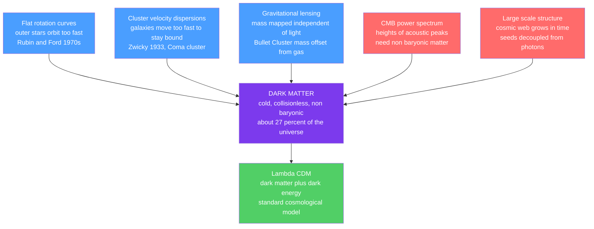

# 🕳️ Dark Matter

> [!abstract] TL;DR
> **Dark matter** is an invisible form of mass that neither emits nor absorbs light, revealed only through its **gravity**. Five independent lines of evidence — flat galaxy **rotation curves**, the **velocity dispersions** of galaxies in clusters, gravitational **lensing** (dramatically the **Bullet Cluster**), the **cosmic microwave background** power spectrum, and the growth of **large-scale structure** — all demand far more matter than the stars and gas we can see. It makes up about **27 percent** of the universe's energy density and roughly **85 percent of all matter**, yet it is **non-baryonic**: not gas, dust, dead stars, or ordinary atoms. Leading candidates are **WIMPs**, **axions**, **sterile neutrinos**, and **primordial black holes**. Decades of direct, indirect, and collider searches have returned null results, and the main alternative — **modified gravity (MOND)** — cannot explain the Bullet Cluster or the CMB. Cold dark matter is the load-bearing scaffold of the standard **ΛCDM** cosmology.

## Intuition — analogy FIRST

In our Solar System the outer planets crawl: Neptune takes 165 years to lap the Sun while Mercury takes 88 days, because gravity weakens with distance and orbital speed falls off as $v \propto 1/\sqrt{r}$ (Kepler). Now imagine you discover a solar system where Neptune whips around **just as fast as Mercury**. You would be forced to conclude that a vast amount of unseen mass is spread throughout the system, holding the outer planets in place at such improbable speeds.

That is exactly what galaxies do. Stars in the far outskirts of a spinning galaxy orbit *just as fast* as stars halfway in, even though almost no visible matter lies out there. The only escape is a huge, invisible **halo** of mass enveloping the galaxy — felt only through its pull, like wind felt only through the leaves it moves.

---

## How It Works

Every piece of evidence for dark matter is **gravitational**: we never "see" it, we only see things it moves or bends light around.



---

## Key Concepts / Details

### Secondary Level

**The rotation-curve clue.** For a star orbiting at radius $r$, gravity supplies the centripetal force, so the circular speed is $v(r) = \sqrt{G\,M(<r)/r}$. Outside the visible galaxy, if all the mass were the stars we see, $M(<r)$ would stop growing and $v$ would fall off as $1/\sqrt{r}$ — a **Keplerian decline**. Instead, **Vera Rubin and Kent Ford** measured in the 1970s that rotation curves stay **flat** out to the last measurable point. Flat $v$ requires $M(<r)\propto r$ — mass keeps piling up where there is almost no light.

**The cluster clue.** In 1933 **Fritz Zwicky** measured how fast galaxies fly around inside the **Coma cluster**. They were moving so fast that the cluster's visible galaxies could not gravitationally hold them together — the cluster should have flown apart long ago. He inferred huge amounts of *dunkle Materie* ("dark matter"). Modern measurements confirm clusters contain about **5 to 10 times** more mass than their stars and hot gas.

**What it is not.** Dark matter is **not** ordinary faint stuff — not cold gas, dust, dead stars, or black holes made of normal atoms. Those would be **baryonic**, and two independent arguments (Big Bang nucleosynthesis and the CMB) cap the total baryon budget far below the required mass. Searches for **MACHOs** (dim compact halo objects) via gravitational microlensing found far too few to account for the halo.

### Undergraduate Level

**Rotation curve, quantitatively.** Setting the enclosed dark halo mass to $M(<r)\propto r$ gives a density profile $\rho \propto r^{-2}$ (a "singular isothermal sphere"), which produces a **constant** $v_{\rm flat}$. The mass discrepancy grows with radius: for the Milky Way, the dynamical mass within about $30$ kpc is $\sim 3\times10^{11}\,M_\odot$, several times its stellar mass.

**Gravitational lensing.** Mass bends light regardless of whether it shines. **Weak lensing** measures the statistical distortion of background galaxy shapes to reconstruct a cluster's total mass map; **strong lensing** produces arcs and multiple images. Because lensing traces *all* the mass, it is independent of the luminous-mass assumptions.

**The Bullet Cluster (1E 0657-56).** Two galaxy clusters collided. The **hot X-ray gas** — which is most of the *baryonic* mass — collided, felt ram pressure, and was slowed, ending up lagging in the middle. The **galaxies**, essentially collisionless, sailed through. Crucially, the **lensing mass** is centered on the *galaxies*, spatially **offset** from the gas. The dominant gravitating mass is therefore collisionless and not tied to the baryons — a near-decisive result for **collisionless dark matter** over modified gravity.

**Not baryonic (BBN + CMB).** Big Bang nucleosynthesis fixes the baryon-to-photon ratio from primordial deuterium and helium; the CMB acoustic peaks independently give $\Omega_b h^2 \approx 0.022$. Both agree that baryons are only about **5 percent** of the energy density, while total matter is about **31.5 percent** — the missing $\sim 27$ percent is non-baryonic dark matter (Planck 2018).

| Component | $\Omega$ (fraction of total) | Nature |
|-----------|------------------------------|--------|
| Dark energy | $\approx 0.685$ | drives acceleration |
| Dark matter | $\approx 0.265$ | non-baryonic, gravitating |
| Baryonic matter | $\approx 0.049$ | stars, gas, dust, us |

**Candidates.** No Standard Model particle fits, so new physics is needed:

| Candidate | Mass scale | Idea |
|-----------|-----------|------|
| WIMP | GeV to TeV | weak-scale relic; "WIMP miracle" gives right abundance |
| Axion | $\mu$eV to meV | solves the strong-CP problem; ultralight boson |
| Sterile neutrino | keV | "warm" dark matter; mixes with active neutrinos |
| Primordial black hole | wide range | forms in the early universe; mostly constrained |

**Detection strategies.** (1) **Direct** — ultra-quiet underground detectors (XENONnT, LUX-ZEPLIN, PandaX) watch for a dark-matter particle **recoiling off a nucleus**. (2) **Indirect** — telescopes hunt for **annihilation or decay products** (gamma rays from Fermi-LAT, neutrinos from IceCube, antimatter from AMS-02). (3) **Collider** — the LHC could **produce** dark matter, seen as missing transverse momentum. All have returned **null results**; direct searches are now approaching the irreducible "neutrino fog."

### Graduate Level

**Collisionless dynamics.** Dark matter is described by a phase-space density $f(\mathbf{x},\mathbf{v},t)$ obeying the **collisionless Boltzmann (Vlasov) equation**:

$$\frac{\partial f}{\partial t} + \mathbf{v}\cdot\nabla_{\mathbf{x}} f - \nabla\Phi\cdot\nabla_{\mathbf{v}} f = 0, \qquad \nabla^2\Phi = 4\pi G \rho.$$

Taking velocity moments yields the **Jeans equations**. For a spherical, steady system the mass is inferred from the velocity dispersion $\sigma_r$ and anisotropy $\beta$:

$$M(<r) = -\frac{r\,\sigma_r^2}{G}\left(\frac{d\ln\nu}{d\ln r} + \frac{d\ln\sigma_r^2}{d\ln r} + 2\beta\right),$$

which is the rigorous basis for Zwicky's cluster argument and for weighing dwarf galaxies.

**Halo profiles (NFW).** Cosmological N-body simulations of cold dark matter find a near-universal density profile (Navarro, Frenk & White 1996):

$$\rho_{\rm NFW}(r) = \frac{\rho_s}{(r/r_s)\,(1 + r/r_s)^2},$$

with an inner **cusp** $\rho\propto r^{-1}$ and outer falloff $\rho\propto r^{-3}$. The concentration $c = r_{200}/r_s$ correlates with halo mass and formation time.

**The "WIMP miracle."** A stable particle in thermal equilibrium in the early universe freezes out when annihilation cannot keep pace with expansion. The relic abundance scales inversely with the annihilation cross-section, $\Omega_\chi h^2 \propto \langle\sigma v\rangle^{-1}$. A weak-scale cross-section $\langle\sigma v\rangle \sim 3\times10^{-26}\,\mathrm{cm^3\,s^{-1}}$ *naturally* yields $\Omega_\chi h^2 \approx 0.12$ — the observed value.

**Small-scale challenges to CDM.**
- **Cusp–core problem** — simulations predict cuspy NFW centers, but many dwarf and low-surface-brightness galaxies show flat, cored central densities. Baryonic feedback (supernova-driven gas outflows) may soften cusps into cores.
- **Missing satellites** — CDM predicts far more subhalos than the observed number of Milky Way satellites; ultra-faint dwarf discoveries and reionization suppression partly close the gap.
- **Too-big-to-fail** — the densest predicted subhalos are too massive to have failed to form visible stars, yet are not observed as bright satellites.

**The MOND alternative.** **Modified Newtonian Dynamics** (Milgrom 1983) posits that below an acceleration $a_0 \approx 1.2\times10^{-10}\,\mathrm{m\,s^{-2}}$ gravity strengthens, giving $v^4 = G M a_0$ — reproducing flat rotation curves and the baryonic **Tully–Fisher relation** with *no* dark matter. But MOND still needs extra unseen mass in galaxy **clusters**, struggles with the **CMB peak heights**, and cannot explain the **Bullet Cluster** offset. Its relativistic extensions (e.g. TeVeS) are heavily constrained by gravitational-wave speed measurements. Most cosmologists therefore favor particle dark matter.

```python
# Galaxy rotation curve: a declining visible disk+bulge alone cannot stay flat;
# only adding a dark halo reproduces the observed flat curve. Then infer the
# dark-matter mass fraction by fitting the halo to a synthetic flat rotation curve.
import numpy as np
from scipy.optimize import curve_fit

# G in galaxy-friendly units: v^2[(km/s)^2] = G * M[Msun] / r[kpc]
G = 4.30091e-6

# --- Visible matter (bulge + disk): enclosed mass saturates -> Keplerian fall-off ---
M_vis = 6.0e10   # total luminous mass (Msun)
R_d   = 3.0      # disk scale radius (kpc)
def M_visible(r):  return M_vis * r**3 / (r**3 + R_d**3)   # rises then levels off
def v_visible(r):  return np.sqrt(G * M_visible(r) / r)

# --- Dark halo: pseudo-isothermal sphere -> flat rotation curve at large r ---
def M_halo(r, rho0, rc):  return 4*np.pi*rho0*rc**3 * (r/rc - np.arctan(r/rc))
def v_halo(r, rho0, rc):  return np.sqrt(G * M_halo(r, rho0, rc) / r)
def v_total(r, rho0, rc): return np.sqrt(v_visible(r)**2 + v_halo(r, rho0, rc)**2)

# --- Synthetic "observed" rotation curve: flat near 200 km/s with noise ---
r_obs = np.linspace(1.0, 30.0, 30)
rng   = np.random.default_rng(42)
v_obs = 200.0 + rng.normal(0, 6, size=r_obs.size)

# --- Fit only the halo (visible matter fixed) to the flat curve ---
popt, _ = curve_fit(v_total, r_obs, v_obs, p0=[1e7, 5.0],
                    bounds=([1e5, 0.5], [1e9, 50.0]), maxfev=10000)
rho0, rc = popt

# --- Mass budget within 30 kpc -> dark-matter fraction ---
R = 30.0
Mv, Md = M_visible(R), M_halo(R, rho0, rc)
print(f"Fitted halo: rho0 = {rho0:.2e} Msun/kpc^3, rc = {rc:.1f} kpc")
print(f"Within {R:.0f} kpc:  M_visible = {Mv:.2e}  M_dark = {Md:.2e}  Msun")
print(f"Dark-matter mass fraction = {100*Md/(Mv+Md):.0f}%")
# Visible-only curve peaks then declines (Keplerian); the fitted halo dominates
# the outskirts and flattens the total curve -> ~80% dark within 30 kpc.
```

---

## Real-World Notes

- **Vera Rubin's galaxies** — systematic optical spectroscopy of spiral galaxies (Andromeda and dozens of others) turned the flat rotation curve from a curiosity into an unavoidable, repeatable fact, making dark matter mainstream by the late 1970s.
- **The Bullet Cluster** — routinely cited as the single cleanest empirical argument that gravity tracks something *other than* the visible baryons; the lensing-mass and X-ray-gas maps are literally offset on the sky.
- **Gaia and the Milky Way** — precision stellar kinematics from ESA's Gaia mission map our own Galaxy's rotation and local dark-matter density (roughly $0.01\,M_\odot\,\mathrm{pc^{-3}}$, about $0.4\ \mathrm{GeV\,cm^{-3}}$), the input to every direct-detection experiment.
- **Direct-detection frontier** — LUX-ZEPLIN and XENONnT now probe WIMP-nucleon cross-sections deep into the theoretically motivated range, tightening (but not confirming) the WIMP hypothesis and nearing the neutrino fog.
- **Bullet-free tests of MOND** — the "train-wreck" cluster Abell 520 and dark-matter-deficient galaxies like NGC 1052-DF2 keep both dark matter and MOND under active observational pressure.
- **Simulations** — Millennium, IllustrisTNG, and EAGLE evolve billions of dark-matter particles under gravity to grow the cosmic web, and their statistics match galaxy surveys strikingly well under ΛCDM.

---

## Common Pitfalls

1. **"Dark matter is just dim normal matter."** No — BBN and the CMB independently cap baryons at about 5 percent of the energy density, and microlensing rules out MACHOs. The bulk must be **non-baryonic**.
2. **Confusing dark matter with dark energy.** Dark matter **clumps** and pulls structure together (gravitationally attractive); dark energy is smooth and drives **accelerated expansion**. Different phenomena, different evidence — see [[Dark_Energy_and_the_Accelerating_Universe]].
3. **Assuming a flat rotation curve means constant enclosed mass.** It is the opposite: flat $v$ requires $M(<r)\propto r$, i.e. mass keeps *increasing* linearly with radius through the halo.
4. **Thinking MOND is dead or that it explains everything.** MOND fits galaxy rotation curves elegantly but fails on clusters, the CMB, and the Bullet Cluster; conversely, ΛCDM still faces unresolved small-scale puzzles. Neither is a closed case at every scale.
5. **Treating "cold" as a temperature.** "Cold" means the particles are **non-relativistic** when structure forms, so they clump on small scales (bottom-up). "Hot" dark matter (relativistic, e.g. light neutrinos) free-streams and erases small structure — ruled out as the dominant component.
6. **Equating null direct-detection results with "no dark matter."** Null results **constrain the particle's mass and couplings**; the gravitational evidence for the mass itself is overwhelming and independent of any lab detection.

---

## Related Concepts

- [[_MOC_Galaxies_ISM|↑ Section MOC]]
- [[The_Milky_Way_Galaxy]] — our Galaxy's flat rotation curve and its extended dark halo
- [[The_Interstellar_Medium]] — the *baryonic* gas and dust, distinct from the dark halo it sits inside
- [[Types_of_Galaxies]] — dark-matter halos set the scale and dynamics of every galaxy type
- [[Galaxy_Formation_and_Evolution]] — halos are the gravitational scaffolding galaxies grow within
- [[Active_Galactic_Nuclei_and_Quasars]] — powered by baryons falling into halo-hosted supermassive black holes
- [[Large_Scale_Structure_and_Structure_Formation]] — cold dark matter grows the cosmic web
- [[The_Big_Bang_and_Cosmic_Microwave_Background]] — acoustic peaks demand non-baryonic matter
- [[Dark_Energy_and_the_Accelerating_Universe]] — the other dark component of ΛCDM
- [[Newtons_Laws_and_Kinematics]] — orbital dynamics behind rotation curves (Physics vault)
- [[Standard_Model_Overview]] — why no known particle fits the bill (Physics vault)
- [[Beyond_Standard_Model]] — WIMPs, axions, and sterile neutrinos as candidates (Physics vault)
- [[_MOC_Mathematics_Master]] — the calculus, statistics, and differential equations used throughout (Mathematics vault)

---

## Review Questions

1. **Secondary** — A star orbits at $r = 20$ kpc with $v = 200$ km/s. Using $M(<r) = v^2 r / G$, estimate the enclosed mass. Why does the fact that $v$ stays constant to even larger radii imply unseen mass?
2. **Undergraduate** — Explain how the Bullet Cluster distinguishes collisionless dark matter from modified gravity. Specifically, why does the *offset* between the lensing mass and the X-ray gas favor dark matter?
3. **Graduate** — Starting from the collisionless Boltzmann equation, sketch the derivation of the spherical Jeans mass estimator. Then discuss how the NFW cusp–core tension and the missing-satellites problem challenge pure cold dark matter, and what baryonic physics might resolve them.

---

## Sources

- Rubin, V. & Ford, W. K. (1970) — "Rotation of the Andromeda Nebula," *ApJ* 159, 379
- Zwicky, F. (1933) — "Die Rotverschiebung von extragalaktischen Nebeln," *Helv. Phys. Acta* 6, 110
- Clowe, D. et al. (2006) — "A Direct Empirical Proof of the Existence of Dark Matter" (Bullet Cluster), *ApJ* 648, L109
- Navarro, Frenk & White (1996) — "The Structure of Cold Dark Matter Halos," *ApJ* 462, 563
- Planck Collaboration (2018) — "Planck 2018 Results VI: Cosmological Parameters," *A&A* 641, A6
- Bertone, G. & Hooper, D. (2018) — "History of Dark Matter," *Rev. Mod. Phys.* 90, 045002

#astronomy #galaxies #cosmology #darkmatter #rotationcurves #bulletcluster #LambdaCDM #WIMPs #undergraduate #graduate
