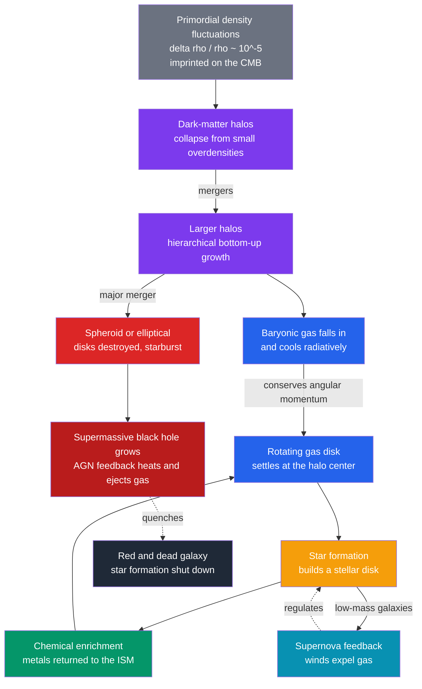

# 🌀 Galaxy Formation and Evolution

> [!abstract] TL;DR
> Galaxies grew **bottom-up**: in the $\Lambda$CDM paradigm, tiny density ripples ($\delta\rho/\rho\sim10^{-5}$, imprinted on the CMB) collapsed first into **dark-matter halos**, which merged hierarchically into ever-larger structures. **Baryonic gas** fell into these halos, cooled radiatively, and — conserving angular momentum — settled into rotating **disks** that formed stars. Galaxies grow by **smooth accretion** (cold vs hot mode) and by **mergers**: minor mergers add mass, while gas-rich **major mergers** destroy disks into spheroids and ignite starbursts. The cosmic **star-formation-rate density** peaked at **cosmic noon** ($z\!\sim\!2$, $\sim\!10$ Gyr ago) and has declined tenfold since. **Feedback** shuts star formation down — supernova winds in low-mass galaxies, and **AGN** feedback from central supermassive black holes in massive ones — producing the red/blue **color bimodality** and the black-hole–galaxy co-evolution. Star formation is globally **inefficient**: even at its peak, halos convert only $\sim\!20\%$ of available baryons into stars.

## Intuition — analogy FIRST

Think of a river delta forming over millions of years. Rain first collects in tiny gullies; gullies merge into streams, streams into rivers, rivers into a great basin — **small things assemble into big things**. Sediment (the gas) is carried downhill, pools in the low spots (the halos), and where it settles thickly, new land is built (stars form). Occasionally two rivers collide head-on and churn their neat channels into a shapeless floodplain — that is a **major merger** turning two spiral disks into one elliptical blob.

But the basin does not fill forever. A powerful spring at the center — the **supermassive black hole** — can blast the incoming water back out, keeping the delta dry and barren. That is **feedback**, and it is why the biggest galaxies today are "red and dead" rather than still building. The whole history of a galaxy is a tug-of-war between **gravity pulling gas in to make stars** and **feedback pushing it back out**.

---

## How It Works



### Secondary Level

Galaxies were not always here. Just after the Big Bang, matter was almost perfectly smooth, with only **tiny ripples** — about one part in $10^{5}$ — that we still see frozen into the cosmic microwave background (see [[The_Big_Bang_and_Cosmic_Microwave_Background]]). Gravity amplified those ripples.

Growth was **bottom-up** ("hierarchical"): invisible **dark matter** clumped first into small **halos** (see [[Dark_Matter]]), and small halos merged into bigger ones, weaving the [[Large_Scale_Structure_and_Structure_Formation|cosmic web]]. Ordinary gas then fell into these halos, cooled, and lit up as stars.

A galaxy grows two ways: by **swallowing fresh gas** and by **colliding with other galaxies**. A big head-on collision — a **major merger** — can scramble two graceful spirals into a single featureless **elliptical** blob (see [[Types_of_Galaxies]]).

Star formation across the whole Universe **peaked long ago**, at "cosmic noon" ($z\!\sim\!2$, roughly $10$ billion years ago), and has faded ever since — today's Universe builds stars about **ten times more slowly** than at the peak. And each generation of stars seeds the gas with heavier elements (see [[Stellar_Nucleosynthesis]]), so later galaxies are more chemically enriched than the first ones.

### Undergraduate Level

**Gravitational collapse of halos.** In the matter-dominated era, small overdensities grow linearly with the scale factor, $\delta\propto a$. Spherical-collapse theory says a region collapses and **virializes** once its linearly-extrapolated overdensity crosses $\delta_c\approx1.686$, settling at $\sim\!200\times$ the mean density. A virialized halo of mass $M$ has a characteristic **virial temperature**

$$T_{vir}=\frac{\mu m_p}{2k_B}\,V_c^{2}\approx10^{6}\,\text{K}\left(\frac{M}{10^{12}\,M_\odot}\right)^{2/3},\qquad V_c=\sqrt{GM/R_{vir}}.$$

**Gas cooling sets the galaxy scale.** Gas can condense into stars only if it can **radiate away** its gravitational energy faster than the halo collapses, i.e. $t_{cool}<t_{dyn}$, where

$$t_{cool}=\frac{3\,n\,k_B T}{2\,n_H n_e\,\Lambda(T)}.$$

The cooling function $\Lambda(T)$ peaks near $10^{4}$–$10^{7}$ K (H, He, and metal line emission); above that, cooling is slow bremsstrahlung. This criterion (Rees & Ostriker 1977; White & Rees 1978) explains why galaxies top out near $\sim\!10^{12}\,M_\odot$: bigger halos have gas too hot to cool efficiently.

**Disks from angular momentum.** Tidal torques from neighbors spin up each halo (dimensionless spin $\lambda\approx0.035$). As gas cools and contracts while **conserving angular momentum**, it settles into a **rotationally supported disk** (Fall & Efstathiou 1980) — the origin of spiral galaxies.

**Two accretion modes.** Below $\sim\!10^{12}\,M_\odot$, gas streams in **cold** along filaments, never shock-heating (**cold mode**); above it, a stable virial shock heats gas to $T_{vir}$, forming a hot halo that cools only slowly (**hot mode**; Dekel & Birnboim 2006). This threshold is central to why massive galaxies quench.

| Growth channel | Effect on galaxy |
|----------------|------------------|
| Smooth cold accretion | Fuels steady disk star formation |
| Minor merger ($<1{:}4$) | Adds mass, builds stellar halo, thickens disk |
| Major merger ($>1{:}4$) | Destroys disks → spheroid; violent relaxation (Toomre 1972) |
| Wet (gas-rich) merger | Funnels gas inward → **starburst** (ULIRG) and feeds the AGN |
| Dry (gas-poor) merger | Grows a massive elliptical with little new star formation |

**Quenching and feedback.** Galaxies split into a star-forming **blue cloud** and a passive **red sequence**, with a sparse **green valley** between — a **color bimodality**. What shuts star formation off is **feedback**: in low-mass galaxies, **supernova** winds eject gas from shallow potential wells; in massive galaxies, **AGN feedback** from the central black hole heats and expels the gas (see [[Active_Galactic_Nuclei_and_Quasars]]).

**Environment.** In dense clusters, galaxies are redder and more elliptical (the morphology–density relation, Dressler 1980). A galaxy plowing through the hot intracluster medium at speed $v$ feels a **ram pressure** $P_{ram}=\rho_{ICM}\,v^{2}$ that can strip its cold gas (Gunn & Gott 1972), starving it of fuel.

### Graduate Level

**The stellar-mass function and inefficiency.** The galaxy stellar-mass function is well fit by a Schechter form,

$$\phi(M)\,dM=\phi^{\ast}\left(\frac{M}{M^{\ast}}\right)^{\alpha}e^{-M/M^{\ast}}\,\frac{dM}{M^{\ast}},\qquad M^{\ast}\sim10^{10.7}\,M_\odot,\ \ \alpha\approx-1.2.$$

The **dark-matter halo mass function** has a much shallower faint end and no sharp exponential cutoff, so galaxies are *rarer* than halos at both extremes. **Abundance matching** (rank-ordering galaxies and halos by number density; Behroozi, Moster) yields the stellar-to-halo mass relation: the integrated **star-formation efficiency** $M_\star/(f_b M_{halo})$ peaks at only $\sim\!20\%$ near $M_{halo}\sim10^{12}\,M_\odot$ and falls off sharply on both sides — **supernova feedback** suppressing low-mass halos, **AGN feedback** suppressing high-mass ones. Star formation is globally very inefficient; most baryons never become stars.

**Black-hole–galaxy co-evolution.** The tight $M_{BH}$–$\sigma$ relation,

$$M_{BH}\approx1.3\times10^{8}\,M_\odot\left(\frac{\sigma}{200\,\text{km s}^{-1}}\right)^{4.4},$$

links a black hole to stars far outside its gravitational reach — strong evidence that **AGN feedback self-regulates** growth: the hole grows until its energy output unbinds the fuel supply, halting both its own and the galaxy's growth.

**Chemical evolution.** In the simple closed-box model, metallicity rises as gas is consumed, $Z=y\ln(1/\mu_{gas})$ with yield $y$. Real galaxies overproduce metal-poor stars relative to this ("**G-dwarf problem**"), requiring continuous **gas inflow**. The result is a **mass–metallicity relation** (Tremonti 2004): more massive galaxies are more enriched, because deeper potentials retain metals against feedback winds.

**Downsizing.** Although dark-matter growth is hierarchical, the **stars** in the most massive galaxies formed **earliest and fastest** (archaeological "downsizing") — an apparently anti-hierarchical trend that feedback and quenching must reproduce. Massive ellipticals assemble in **two phases**: a compact in-situ starburst, then size growth by later **dry minor mergers**.

**The high-redshift frontier.** JWST (2022–) has found surprisingly **bright, apparently massive** galaxies at $z\gtrsim10$ (e.g. JADES-GS-z14-0 at $z\approx14.3$), pushing the first galaxies to $<300$ Myr after the Big Bang. Some seem to strain the stellar mass $\Lambda$CDM can assemble so early; likely resolutions include bursty star formation, a top-heavy IMF, AGN contamination, or reduced dust attenuation — an active area of research.

```python
import numpy as np
import matplotlib.pyplot as plt

# --- Flat LCDM cosmology ---
H0 = 70.0                          # km/s/Mpc
Om, OL = 0.3, 0.7
Gyr_s   = 3.1557e16                # seconds per Gyr
Mpc_km  = 3.0857e19               # km per Mpc
H0_iGyr = H0 / Mpc_km * Gyr_s     # Hubble constant in 1/Gyr

def E(z):                          # dimensionless Hubble rate
    return np.sqrt(Om*(1+z)**3 + OL)

def age_at_z(z, zmax=3000.0, n=20000):
    # Age of the universe at redshift z:  t = (1/H0) * int_z^inf dz'/[(1+z')E(z')]
    zz = np.linspace(z, zmax, n)
    return np.trapz(1.0/((1+zz)*E(zz)), zz) / H0_iGyr      # Gyr

def sfrd(z):
    # Cosmic star-formation-rate density, Madau & Dickinson (2014) fit
    return 0.015*(1+z)**2.7 / (1 + ((1+z)/2.9)**5.6)       # Msun/yr/Mpc^3

# Sample from early times (high z) to today (z = 0)
z   = np.linspace(10, 0, 400)
t   = np.array([age_at_z(zi) for zi in z])                 # Gyr since Big Bang (increasing)
psi = sfrd(z)

# Integrate SFRD over cosmic TIME to build up the stellar-mass density
dt_yr = np.diff(t) * 1e9                                    # Gyr -> yr
rho   = np.concatenate([[0], np.cumsum(0.5*(psi[1:]+psi[:-1])*dt_yr)])
frac  = rho / rho[-1]                                       # fraction of present stellar mass

t_half = np.interp(0.5, frac, t)
z_half = np.interp(t_half, t, z)
print(f"Peak SFRD at z ~ {z[np.argmax(psi)]:.1f}")
print(f"Half of today's stars were in place by t ~ {t_half:.1f} Gyr (z ~ {z_half:.1f})")

fig, ax = plt.subplots(1, 2, figsize=(11, 4.4))
ax[0].plot(z, psi, lw=2, color="crimson")
ax[0].axvline(1.9, ls="--", color="gray"); ax[0].text(2.1, 0.02, "cosmic noon", color="gray")
ax[0].set_xlabel("redshift z"); ax[0].set_ylabel("SFRD  [Msun / yr / Mpc^3]")
ax[0].set_title("Cosmic star-formation history"); ax[0].invert_xaxis()

ax[1].plot(t, frac, lw=2, color="steelblue")
ax[1].axhline(0.5, ls="--", color="gray"); ax[1].axvline(t_half, ls="--", color="gray")
ax[1].set_xlabel("cosmic time  [Gyr]"); ax[1].set_ylabel("fraction of present stellar mass")
ax[1].set_title("Buildup of stellar mass")
plt.tight_layout(); plt.show()
```

---

## Real-World Notes

- **The Madau–Dickinson curve.** Compiled from UV and infrared surveys, the cosmic SFR density rose steeply, peaked at $z\!\approx\!1.9$, and has fallen $\sim\!10\times$ since. About **half of today's stars** were already in place by $z\!\approx\!1.3$ ($\sim\!8$–$9$ Gyr ago).
- **The Antennae (NGC 4038/4039).** A textbook ongoing **major merger** of two spirals, with tidal tails and merger-triggered starbursts — a live snapshot of how ellipticals form.
- **The Milky Way's history.** Our Galaxy grew hierarchically: the *Gaia*-Enceladus merger ($\sim\!10$ Gyr ago) built much of the stellar halo, and streams like Sagittarius show minor mergers continuing today (see [[The_Milky_Way_Galaxy]]).
- **Red-and-dead ellipticals.** Giant cluster ellipticals stopped forming stars billions of years ago; their hot X-ray halos "should" cool and reignite star formation, but **AGN radio jets** keep the gas hot — the clearest case of maintenance-mode feedback.
- **JWST's early galaxies.** JWST detects UV-bright galaxies at $z>10$, some more luminous than pre-launch models expected — probing the very first generation of galaxy assembly (see [[The_Big_Bang_and_Cosmic_Microwave_Background]]).
- **Jellyfish galaxies.** Cluster spirals with trailing tails of stripped gas are **ram-pressure stripping** caught in the act, showing how environment quenches infalling galaxies.

---

## Common Pitfalls

1. **"Hierarchical means galaxies also grow smallest-first."** The *dark-matter* assembly is bottom-up, but the *stars* show **downsizing** — the most massive galaxies formed their stars earliest and fastest. Halo growth and stellar growth run in opposite senses.
2. **"Gravity alone builds galaxies."** Without **feedback**, simulations overcool gas and make galaxies far too massive (the "overcooling problem"). Supernova and AGN feedback are essential, not decorative.
3. **"Mergers always make stars."** Only **gas-rich (wet)** mergers trigger starbursts. **Dry** mergers of gas-poor galaxies grow mass and size with little new star formation.
4. **"AGN feedback matters for all galaxies."** AGN feedback dominates quenching in **massive** galaxies; **supernova** feedback regulates **low-mass** ones. Applying the wrong mechanism at the wrong mass scale is a common error.
5. **"Quenching = running out of gas."** A galaxy can quench while still holding gas if that gas is kept **too hot to cool** (maintenance-mode AGN heating) or is **prevented from accreting** (strangulation) — not only by outright removal.
6. **"Redshift is simply distance."** Here $z$ is used as a **clock**: higher $z$ means earlier cosmic time. "Cosmic noon at $z\!\sim\!2$" means $\sim\!10$ Gyr ago, not merely "far away."

---

## Related Concepts

- [[_MOC_Galaxies_ISM|↑ Section MOC]]
- [[Dark_Matter]] — the collisionless halos whose hierarchical merging is the scaffold for all galaxy assembly
- [[Large_Scale_Structure_and_Structure_Formation]] — the cosmic web and gravitational-instability growth that halos and galaxies trace
- [[Types_of_Galaxies]] — the disks, spheroids, and ellipticals that this evolutionary sequence produces
- [[Active_Galactic_Nuclei_and_Quasars]] — the central black holes whose feedback quenches massive galaxies
- [[The_Milky_Way_Galaxy]] — our own galaxy as a case study in accretion, mergers, and disk buildup
- [[The_Interstellar_Medium]] — the gas reservoir that cools, forms stars, and is enriched and expelled by feedback
- [[Stellar_Nucleosynthesis]] — the origin of the metals that drive chemical evolution and cooling
- [[The_Big_Bang_and_Cosmic_Microwave_Background]] — the primordial fluctuations that seeded every halo and galaxy
- **Mathematics** — [[_MOC_Mathematics_Master]] (the perturbation theory, Press-Schechter statistics, and Schechter/mass-function fits behind structure formation)

---

## Review Questions

1. **Secondary**: Explain in your own words why we say galaxies formed "bottom-up." When did cosmic star formation peak, and is the Universe making stars faster or slower today than then?
2. **Undergraduate**: Using the cooling criterion $t_{cool}<t_{dyn}$ and the virial temperature $T_{vir}\propto M^{2/3}$, argue why galaxies have a characteristic maximum mass near $10^{12}\,M_\odot$. How do cold- and hot-mode accretion relate to this scale?
3. **Graduate**: The peak star-formation efficiency $M_\star/(f_b M_{halo})$ is only $\sim\!20\%$ and declines at both low and high halo mass. Identify the feedback mechanism responsible on each side, and explain how abundance matching reveals this from the mismatch between the galaxy stellar-mass function and the halo mass function.

---

## Sources

- Mo, van den Bosch & White — *Galaxy Formation and Evolution* (Cambridge)
- Madau & Dickinson (2014) — "Cosmic Star-Formation History," *ARA&A* 52, 415
- White & Rees (1978) — "Core Condensation in Heavy Halos," *MNRAS* 183, 341
- Dekel & Birnboim (2006) — "Galaxy Bimodality due to Cold Flows and Shock Heating," *MNRAS* 368, 2
- Somerville & Davé (2015) — "Physical Models of Galaxy Formation," *ARA&A* 53, 51
- Carroll & Ostlie — *An Introduction to Modern Astrophysics*, 2nd ed., Ch. 25–26

#astronomy #galaxies #cosmology #galaxy-formation #cosmic-noon #feedback #quenching #secondary #undergraduate #graduate
