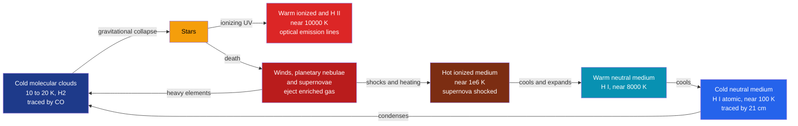

# 🌫️ The Interstellar Medium

> [!abstract] TL;DR
> The **interstellar medium (ISM)** is the diffuse gas and dust filling the space between the stars — roughly **99% gas** (mostly hydrogen and helium) and **1% dust** (silicate and carbonaceous grains). It is not uniform but a **multi-phase** system in rough pressure balance: cold **molecular** clouds ($10$–$20$ K, the birthplaces of stars), cold and warm **neutral atomic** gas (H I, traced by the $21\,$cm line), the **warm ionized** medium and H II regions (gas lit up by hot young stars), and a **hot ionized** medium ($\sim10^6$ K) carved out by supernovae. Dust **dims and reddens** starlight (interstellar extinction), catalyzes molecule formation, and radiates in the infrared. Above all, the ISM is a **recycling engine**: stars condense out of it, then return chemically enriched material via winds, planetary nebulae, and supernovae — driving the galactic baryon cycle and chemical evolution.

## Intuition — analogy FIRST

Picture walking down a foggy city street at night. Distant streetlamps look **dimmer** than nearby ones, and they take on a faint **orange** tint, while a nearby lamp stays crisp and white. The fog is doing two things at once: it *removes* light (dimming) and it removes the *blue* part more strongly than the red (reddening). Interstellar **dust** does exactly this to starlight, which is why an astronomer must always ask "how much fog is between me and that star?" before trusting its brightness or color.

Now zoom out. That same fog is not inert — it is the raw material of the city itself. Buildings (stars) are built from it, and when they are demolished (supernovae) the rubble is returned to the streets, enriched with new materials, to be built again. The ISM is simultaneously the **fog** that obscures our view and the **recycling yard** from which the next generation of stars is made.

---

## How It Works

The ISM is organized into several **phases** that trade places in a great loop. Cold dense gas collapses into stars; stars heat, ionize, and eventually blow the gas back out, enriched with heavy elements; the ejected gas cools and condenses again. This is the **baryon cycle**.



---

## Key Concepts / Details

### Secondary Level

**What is between the stars?** Space is not empty. The average ISM density is about **1 atom per cubic centimetre** — compare that with the $\sim2.5\times10^{19}$ molecules per cubic centimetre in the air you breathe. Yet spread across thousands of light-years, this tenuous gas adds up to a large fraction of a galaxy's ordinary matter, and giant molecular clouds can hold up to $10^6$ solar masses.

**Nebulae — the ISM made visible.** Clumps of the ISM appear as glowing or dark clouds called nebulae:

| Nebula type | What we see | Why | Example |
|---|---|---|---|
| **Emission** | Pink/red glow | Hot young stars ionize the gas, which re-emits (H$\alpha$) | Orion Nebula |
| **Reflection** | Blue haze | Dust *scatters* nearby starlight (blue scatters best) | Pleiades |
| **Dark** | Black silhouette | Dense dust blocks the light behind it | Horsehead Nebula |
| **Planetary** | Glowing shell | A dying Sun-like star sheds its outer layers | Ring Nebula |
| **Supernova remnant** | Filaments/shock | Expanding debris from an exploded massive star | Crab Nebula |

**Dust dims and reddens starlight.** Just like the foggy street, dust makes stars fainter (**extinction**) and redder (**reddening**), and the effect is stronger for blue light. Correcting for this is one of the most important routine tasks in observational astronomy.

### Undergraduate Level

**The multi-phase ISM.** The classic picture is several phases sitting near a common *pressure*, so that $P/k = nT \approx 3000$–$4000\ \mathrm{K\,cm^{-3}}$ is roughly constant while $n$ and $T$ vary enormously:

| Phase | $T$ (K) | $n$ (cm$^{-3}$) | State | Main tracer |
|---|---|---|---|---|
| Molecular (H$_2$) | $10$–$20$ | $10^2$–$10^6$ | H$_2$, molecules | CO rotational lines |
| Cold neutral (CNM) | $\sim100$ | $\sim30$ | H I atomic | $21\,$cm absorption |
| Warm neutral (WNM) | $\sim8000$ | $\sim0.3$ | H I atomic | $21\,$cm emission |
| Warm ionized (WIM, H II) | $\sim10^4$ | $0.1$–$10^3$ | H$^+$ (photoionized) | H$\alpha$, [O III] |
| Hot ionized (HIM) | $\sim10^6$ | $\sim10^{-3}$ | H$^+$ (collisional) | X-rays, O VI |

**How we observe each phase.**
- **H I** emits the $21\,$cm hyperfine (spin-flip) line at $1420\,$MHz — a radio transition that penetrates dust and maps the whole Galaxy. For optically thin gas the column density is
$$N_{\rm H\,I} = 1.823\times10^{18}\int T_B(v)\,dv\ \ \mathrm{cm^{-2}},$$
with $T_B$ in K and velocity $v$ in km s$^{-1}$.
- **Molecular gas** is dominated by H$_2$, but H$_2$ has no permanent dipole and stays dark at $10$ K, so we use **CO** rotational lines as a proxy tracer (see [[Molecular_Spectroscopy_and_Symmetry]]).
- **H II regions** shine in optical **emission lines** (Balmer H$\alpha$, forbidden [O III], [N II]).
- **Dust** re-radiates absorbed starlight as thermal **infrared/submillimetre** emission.

**Extinction and reddening.** A dust column of optical depth $\tau_\lambda$ dims a star by
$$A_\lambda = 1.086\,\tau_\lambda\ \ \text{(magnitudes)},$$
and because grains scatter/absorb blue light more strongly, $A_\lambda$ rises toward short wavelengths (roughly $A_\lambda \propto 1/\lambda$ in the optical). The *color* change is the **color excess**
$$E(B-V) = A_B - A_V,\qquad R_V \equiv \frac{A_V}{E(B-V)} \approx 3.1$$
for the diffuse ISM. See [[Light_and_Astronomical_Spectroscopy]] for how spectra are affected.

**Dust as chemistry.** Grains ($\sim0.1\,\mu$m silicates and carbon) are not just obstacles: their surfaces are the **catalyst** on which two H atoms combine into H$_2$ (impossible efficiently in the gas phase), and they are an important **coolant**, letting clouds shed heat and collapse into stars (see [[Star_Formation]]).

### Graduate Level

**Thermal instability and the two-phase model.** Field (1965) showed that gas in a certain temperature range is **thermally unstable**: an isobaric perturbation runs away because the net cooling function makes a compressed parcel cool *faster*. The stable end-states are the cold CNM and warm WNM, which is why atomic gas naturally settles into **two phases** in pressure equilibrium (Field, Goldsmith & Habing 1969).

**The three-phase model.** McKee & Ostriker (1977) added the crucial role of **supernovae**: repeated blast waves shock-heat gas to $\sim10^6$ K, creating a pervasive **hot ionized medium** with a high volume filling factor, threaded by tunnels connecting supernova remnants. Cold clouds are embedded in warm coronae inside this hot substrate — a self-regulating, feedback-driven ISM.

**The CO-to-H$_2$ conversion factor.** Since H$_2$ is invisible, molecular masses are inferred from CO via
$$N_{\rm H_2} = X_{\rm CO}\,W_{\rm CO},\qquad X_{\rm CO}\approx 2\times10^{20}\ \mathrm{cm^{-2}\,(K\,km\,s^{-1})^{-1}}.$$
This factor is only approximately universal: it rises in low-metallicity galaxies, and a substantial reservoir of **CO-dark H$_2$** hides in cloud envelopes where C is ionized but H$_2$ is self-shielded.

**Fields, rays, and pressure support.** The ISM is magnetized (**$B \sim$ a few $\mu$G**, measured by Zeeman splitting, Faraday rotation, and starlight polarization) and permeated by **cosmic rays**. In the diffuse ISM the energy densities of thermal gas, turbulence, magnetic fields, and cosmic rays are all comparable ($\sim1\ \mathrm{eV\,cm^{-3}}$) — a rough **equipartition** that means magnetic and cosmic-ray pressure help support clouds against gravity, not just thermal pressure.

**Chemical evolution.** Each generation of stars fuses light elements into heavier ones (see [[Stellar_Nucleosynthesis]]) and returns them to the ISM, so the metallicity of a galaxy climbs over cosmic time. The interplay of star formation, enrichment, outflows, and gas inflow is the heart of galactic **chemical evolution**.

```python
import numpy as np
import matplotlib.pyplot as plt

# Model interstellar extinction with a simple "1/lambda" law.
# Normalise so that A = A_V at the V band (550 nm): A_lambda = A_V * lam_V / lam.

A_V   = 1.0     # magnitudes of visual extinction along the sight line
lam_V = 550.0   # nm, V-band reference wavelength

# Johnson band effective wavelengths (nm)
bands = {"U": 365, "B": 445, "V": 550, "R": 658, "I": 806}
A = {b: A_V * lam_V / lam for b, lam in bands.items()}

# Reddening: colour excess E(B-V) = A_B - A_V, and the implied R_V
E_BV = A["B"] - A["V"]
R_V  = A_V / E_BV
print(f"A_B = {A['B']:.3f} mag, A_V = {A['V']:.3f} mag")
print(f"E(B-V) = A_B - A_V = {E_BV:.3f} mag  ->  R_V = {R_V:.2f}")
# A pure 1/lambda law gives R_V ~ 4.2; the real diffuse ISM has R_V ~ 3.1.

lam     = np.linspace(300, 900, 400)      # nm
A_curve = A_V * lam_V / lam               # A_lambda in magnitudes

fig, ax = plt.subplots(1, 2, figsize=(11, 4.5))
ax[0].plot(lam, A_curve, lw=2)
for b, l in bands.items():
    ax[0].scatter([l], [A_V * lam_V / l], zorder=5)
    ax[0].annotate(b, (l, A_V * lam_V / l),
                   textcoords="offset points", xytext=(5, 4))
ax[0].set_xlabel("Wavelength  (nm)")
ax[0].set_ylabel("Extinction  A_lambda  (mag)")
ax[0].set_title(f"Dust dims blue light most  (A_V = {A_V} mag)")
ax[0].grid(alpha=0.3)

ax[1].plot(1000.0 / lam, A_curve, lw=2)   # 1/lambda in inverse microns
ax[1].set_xlabel("1 / lambda  (1/micron)")
ax[1].set_ylabel("Extinction  A_lambda  (mag)")
ax[1].set_title("Straight line confirms A ~ 1/lambda")
ax[1].grid(alpha=0.3)

plt.tight_layout()
plt.show()
```

---

## Real-World Notes

- **All-sky H I surveys** (HI4PI, the Leiden/Argentine/Bonn survey) map the $21\,$cm line across the whole Galaxy, tracing spiral arms and Galactic rotation because radio waves pass straight through dust.
- **CO surveys** (Dame et al.) chart giant molecular clouds; nearby examples like the Orion and Taurus clouds are the closest laboratories for star formation.
- **The Orion Nebula (M42)** is the textbook H II region — gas photoionized by the hot O-type stars of the Trapezium cluster, glowing in H$\alpha$ and forbidden lines.
- **Reddening corrections are unavoidable** in precision astronomy: dust maps (Schlegel–Finkbeiner–Davis, Planck) are applied to everything from Type Ia supernova cosmology to photometric redshifts.
- **Infrared and submm observatories** (Spitzer, Herschel, JWST, ALMA) reveal the cold dust filaments and molecular gas that optical light cannot penetrate.
- **The Local Bubble**: the Sun sits inside a low-density cavity of hot ionized medium, blown by supernovae a few million years ago — direct evidence of the three-phase ISM in our own neighbourhood.

---

## Common Pitfalls

1. **"Space is empty."** The ISM has a tiny *density* but an enormous *total mass* — roughly $10$–$15\%$ of the Milky Way's baryons, and individual molecular clouds reach $10^6$ solar masses.
2. **Extinction vs reddening.** *Extinction* $A_\lambda$ is the total dimming at a wavelength; *reddening* $E(B-V)$ is only the wavelength-*dependent* part. A grey (wavelength-independent) component would dim without reddening — do not treat them as identical.
3. **Extrapolating $A_\lambda \propto 1/\lambda$ too far.** A pure $1/\lambda$ law implies $R_V\approx4.2$, but the diffuse ISM has $R_V\approx3.1$; the real curve steepens in the UV, has the $2175\,$Å bump, and flattens in the infrared.
4. **H$_2$ is invisible in cold clouds.** With no permanent dipole and $T\sim10$ K, molecular hydrogen barely emits; we rely on CO as a proxy, but $X_{\rm CO}$ varies with metallicity and misses CO-dark gas.
5. **The $21\,$cm column-density formula assumes optically thin gas.** In dense, cold CNM the line self-absorbs, so the standard $N_{\rm H\,I}=1.823\times10^{18}\int T_B\,dv$ **underestimates** the true column.
6. **"Ionized means hot" — not necessarily.** The WIM is *photoionized* yet only $\sim10^4$ K, while the HIM is *collisionally* ionized at $\sim10^6$ K. Same ionization state, wildly different physics.

---

## Related Concepts

- [[_MOC_Galaxies_ISM|↑ Section MOC]]
- [[The_Milky_Way_Galaxy]] — our home galaxy is the best-resolved laboratory for every ISM phase
- [[Types_of_Galaxies]] — gas-rich spirals versus gas-poor ellipticals reflect their ISM and star-formation history
- [[Galaxy_Formation_and_Evolution]] — the baryon cycle and chemical enrichment shape how galaxies grow
- [[Active_Galactic_Nuclei_and_Quasars]] — AGN feedback heats and expels the ISM, regulating star formation
- [[Dark_Matter]] — the gravitational scaffolding within which the baryonic ISM settles
- [[Star_Formation]] — cold molecular clouds are the direct raw material for making stars
- [[Stellar_Nucleosynthesis]] — supplies the heavy elements that enrich the ISM and form dust
- [[Light_and_Astronomical_Spectroscopy]] — emission, absorption, and reddening of spectra decode the gas
- [[Atomic_Models_and_Spectroscopy]] (Physics) — hyperfine structure behind the $21\,$cm line
- [[Electromagnetic_Waves_and_Radiation]] (Physics) — radiative transfer, extinction, and thermal emission
- [[Molecular_Spectroscopy_and_Symmetry]] (Chemistry) — CO and H$_2$ transitions used to trace molecular gas
- [[_MOC_Mathematics_Master]] (Mathematics) — integrals and statistics behind column densities and extinction laws

---

## Review Questions

1. **Secondary**: Name the five main types of nebulae and, for each, explain in one sentence why it appears bright, dark, or colored.
2. **Undergraduate**: A sightline shows $\int T_B\,dv = 200\ \mathrm{K\,km\,s^{-1}}$ in the $21\,$cm line. Estimate $N_{\rm H\,I}$. Separately, if a star has $A_V = 1.5$ mag and $R_V = 3.1$, what is its color excess $E(B-V)$, and by how many magnitudes is $B$ dimmed?
3. **Graduate**: Explain thermal instability and how it leads to a two-phase atomic ISM. Then describe what McKee & Ostriker's three-phase model adds, and why supernova feedback is essential to it.

---

## Sources

- Draine, B. T. — *Physics of the Interstellar and Intergalactic Medium* (2011), Ch. 1–30
- Tielens, A. G. G. M. — *The Physics and Chemistry of the Interstellar Medium* (2005)
- McKee, C. F. & Ostriker, J. P. (1977) — "A theory of the interstellar medium," *ApJ* 218, 148
- Field, G. B., Goldsmith, D. W. & Habing, H. J. (1969) — *ApJ Letters* 155, L149
- Carroll, B. W. & Ostlie, D. A. — *An Introduction to Modern Astrophysics*, 2nd ed., Ch. 12

#astronomy #ism #galaxies #nebulae #extinction #21cm #molecularclouds #baryoncycle #secondary #undergraduate #graduate
