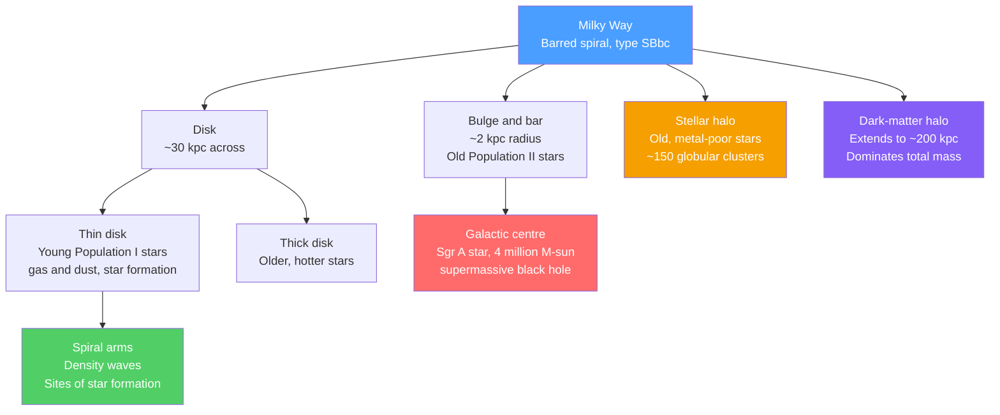

# 🌌 The Milky Way Galaxy

> [!abstract] TL;DR
> The Milky Way is our home galaxy — a **barred spiral** of ~100–400 billion stars spanning a disk ~30 kpc across, which we see edge-on as a band of light because we live *inside* it, about **8 kpc** from the centre. It is built from a thin and thick **disk** (with spiral arms where stars form), a central **bulge and bar**, an old stellar **halo** with ~150 globular clusters, and a vast **dark-matter halo** that dominates the mass. Its rotation curve stays **flat** to large radii instead of falling off as Kepler predicts — the classic dynamical evidence for dark matter — and its centre hosts **Sagittarius A\***, a ~4×10⁶ M☉ black hole whose mass was weighed from stellar orbits (2020 Nobel Prize).

## Intuition — analogy FIRST

Imagine trying to map the layout of a forest while standing in the middle of it, at night, with fog hanging between the trees. You cannot fly above and look down; you can only see the trees near you, and the distant ones are hidden by fog. That is exactly our situation with the Milky Way: we are embedded in the disk, and interstellar **dust** is the fog that blocks the optical light of distant stars.

So astronomers cheat. Radio waves cut straight through the fog, so we map the galaxy using the **21 cm line of hydrogen** and **CO emission** from molecular clouds, and now **Gaia's** precise positions and velocities for ~1.5 billion stars. Piecing those together reveals a spinning pinwheel of stars and gas — and, unexpectedly, that the pinwheel spins *too fast* at its edges to be held together by the matter we can see.

---

## How It Works



---

## Key Concepts / Details

### Secondary Level

The Milky Way is a **barred spiral galaxy**. Because the Sun sits inside its flattened disk, we see the combined light of billions of distant disk stars as a hazy **band across the night sky** — the "milky" path that gives the galaxy its name.

**Our place and scale:**

| Quantity | Value | In everyday terms |
|----------|-------|-------------------|
| Sun's distance from centre | ~8 kpc (≈26,000 light-years) | far out in the suburbs |
| Orbital speed of the Sun | ~220 km/s | one "galactic year" ≈ 230 Myr |
| Disk diameter | ~30 kpc | ~100,000 light-years |
| Number of stars | ~100–400 billion | more stars than humans who ever lived |
| Total mass with dark halo | ~1–1.5 ×10¹² M☉ | most of it *not* visible |

The galaxy has four main ingredients: a flat **disk** of stars, gas, and dust wound into **spiral arms** (where new stars are born); a central **bulge** and elongated **bar**; a spherical **halo** of very old stars and ~150 tightly bound **globular clusters**; and an invisible **dark-matter halo** that outweighs everything else.

### Undergraduate Level

**Stellar populations** encode the galaxy's history. Baade (1944) split stars into two families:

| | Population I | Population II |
|---|---|---|
| Age | Young (< few Gyr) | Old (~10–13 Gyr) |
| Metallicity | Metal-rich (Z ≳ Z☉) | Metal-poor (Z ≪ Z☉) |
| Location | Thin disk, spiral arms | Halo, bulge, globular clusters |
| Orbits | Nearly circular, in-plane | Eccentric, randomly inclined |
| Meaning | Formed from enriched gas | Formed early, before enrichment |

Because heavy elements are forged in earlier generations of stars, metal-poor Population II stars are relics of the galaxy's **earliest epochs**, while metal-rich Population I stars trace ongoing formation in the disk.

**Mapping a galaxy from inside.** Optical light is blocked by dust ($A_V$ can exceed 30 magnitudes toward the centre), so structure is traced at other wavelengths:
- **21 cm H I line** — neutral atomic hydrogen; a hyperfine spin-flip transition that penetrates dust and reveals large-scale gas kinematics.
- **CO rotational lines** (2.6 mm) — trace cold molecular clouds, the sites of star formation. See [[The_Interstellar_Medium]].
- **Gaia astrometry** — parallaxes and proper motions for ~1.5 billion stars give a 3-D, moving map of the disk.

**The Galactic Centre.** At the dynamical centre lies **Sagittarius A\*** (Sgr A\*). Tracking individual stars (notably **S2**) on Keplerian orbits around an invisible point gave a mass of $M \approx 4\times10^{6}\,M_\odot$ packed inside the orbit's perihelion — far too dense to be anything but a **supermassive black hole**. This work earned Genzel and Ghez a share of the **2020 Nobel Prize in Physics**. See [[Black_Hole_Physics]] and [[Active_Galactic_Nuclei_and_Quasars]].

**The Local Group.** The Milky Way is one of two large galaxies in the **Local Group**, alongside **Andromeda (M31)** and the smaller **Triangulum (M33)**, plus dozens of dwarfs including the **Large and Small Magellanic Clouds**. Andromeda is approaching at ~110 km/s and will **merge** with the Milky Way in ~4.5 Gyr to form an elliptical galaxy sometimes nicknamed "Milkomeda."

**The rotation curve.** For a mass concentrated toward the centre (like the visible stars), Kepler's laws predict orbital speed should fall as $v \propto r^{-1/2}$ beyond the bulk of the mass. Instead, the observed curve stays **flat** at ~220 km/s out to the largest measured radii — implying large amounts of unseen mass at large radius. See [[Newtons_Laws_and_Kinematics]] and [[Dark_Matter]].

### Graduate Level

**Enclosed mass from dynamics.** For a test star on a circular orbit, balancing gravity against centripetal acceleration gives

$$\frac{v^2}{r} = \frac{G\,M(<r)}{r^2} \quad\Longrightarrow\quad M(<r) = \frac{v^2\, r}{G}.$$

A **flat** curve, $v(r)\approx\text{const}$, therefore requires $M(<r) \propto r$ — the enclosed mass keeps growing linearly even where the light has faded out. Differentiating, the required density profile is

$$\rho(r) = \frac{1}{4\pi r^2}\frac{dM}{dr} \propto r^{-2},$$

the **isothermal-sphere** halo. Real halos are better fit by the **NFW profile** $\rho(r) \propto \left[(r/r_s)(1+r/r_s)^2\right]^{-1}$ from cosmological simulations. See [[Dark_Matter]].

**Local kinematics — Oort constants.** The differential rotation of the disk near the Sun is captured by

$$A = \tfrac{1}{2}\!\left(\frac{V_0}{R_0} - \left.\frac{dV}{dR}\right|_{R_0}\right),\qquad B = -\tfrac{1}{2}\!\left(\frac{V_0}{R_0} + \left.\frac{dV}{dR}\right|_{R_0}\right),$$

with observed $A \approx 15$ and $B \approx -12$ km/s/kpc, so $V_0 = (A-B)R_0 \approx 220$ km/s and $dV/dR \approx 0$ — confirming a locally flat curve.

**Galactic archaeology.** Because dynamical times in the halo are long, past **merger** events survive as coherent **stellar streams**. Gaia revealed the **Gaia-Enceladus/Sausage** merger (~10 Gyr ago), and the **Sagittarius stream** wraps around the whole galaxy — a slow-motion tidal disruption in progress. Chemical abundances plus 6-D phase-space data let us reconstruct the assembly history of the Milky Way star by star.

---

## Rotation Curve Demo

```python
# Compare the Keplerian prediction (visible mass only) with a flat observed
# curve, then infer the extra "dark" mass required as a function of radius.
import numpy as np
import matplotlib.pyplot as plt

G   = 6.674e-11     # gravitational constant, m^3 kg^-1 s^-2
Msun = 1.989e30     # solar mass, kg
kpc  = 3.086e19     # kiloparsec, m

r_kpc = np.linspace(1, 30, 300)
r     = r_kpc * kpc

# Visible mass: bulge + disk that saturates beyond a few kpc (most light is central)
M_vis_inf = 1.0e11 * Msun
r_scale   = 4.0 * kpc
M_vis = M_vis_inf * (1 - np.exp(-r / r_scale) * (1 + r / r_scale))

# Keplerian prediction from visible mass: v declines once the mass is enclosed
v_kepler = np.sqrt(G * M_vis / r) / 1000.0          # km/s

# Observed curve: rises then stays flat at ~220 km/s
v_flat = 220.0
v_obs  = v_flat * (1 - np.exp(-r_kpc / 2.5))         # km/s

# Enclosed mass implied by the observed curve: M(<r) = v^2 r / G
M_dyn  = (v_obs * 1000.0) ** 2 * r / G               # kg
M_dark = np.clip(M_dyn - M_vis, 0, None)             # missing (dark) mass

i = np.argmin(np.abs(r_kpc - 8))
print(f"At R = 8 kpc (Sun's orbit):")
print(f"  visible enclosed mass : {M_vis[i]/Msun:.2e} Msun")
print(f"  dynamical enclosed    : {M_dyn[i]/Msun:.2e} Msun")
print(f"  dark fraction         : {M_dark[i]/M_dyn[i]*100:.0f}%")

fig, ax = plt.subplots(1, 2, figsize=(11, 4))
ax[0].plot(r_kpc, v_kepler, '--', label='Keplerian (visible mass only)')
ax[0].plot(r_kpc, v_obs, lw=2, label='Observed (flat)')
ax[0].axvline(8, color='gray', ls=':'); ax[0].set_xlabel('R (kpc)')
ax[0].set_ylabel('v (km/s)'); ax[0].set_title('Rotation curve'); ax[0].legend()

ax[1].plot(r_kpc, M_vis / Msun, label='Visible mass')
ax[1].plot(r_kpc, M_dyn / Msun, lw=2, label='Dynamical (total)')
ax[1].set_xlabel('R (kpc)'); ax[1].set_ylabel('M(<R)  [Msun]')
ax[1].set_yscale('log'); ax[1].set_title('Enclosed mass'); ax[1].legend()
plt.tight_layout()
```

The dynamical mass keeps rising while the visible mass flattens — the gap is the dark halo.

---

## Real-World Notes

- **Weighing a black hole with orbits.** The star S2 orbits Sgr A\* every ~16 years; measuring its full ellipse (including relativistic perihelion precession, detected by GRAVITY in 2020) pins the central mass at ~4.15×10⁶ M☉ within a light-day — the cleanest supermassive-black-hole mass in existence.
- **Vera Rubin's spirals.** Rubin and Ford's 1970s measurements of flat rotation curves in Andromeda and other spirals turned dark matter from a peculiarity into a mainstream problem; the Milky Way's own curve tells the same story.
- **Gaia's revolution.** ESA's Gaia mission (2013–) transformed galactic astronomy, revealing the disk's warp, spiral-arm structure, and the fossil merger **Gaia-Enceladus** hidden in stellar velocities.
- **The Sun's slow orbit.** In the ~4.6 Gyr since the Sun formed, it has completed only about **20 orbits** of the galaxy — a "galactic year" is ~230 Myr, so dinosaurs lived roughly one galactic year ago.
- **Radio maps of spiral arms.** H I 21 cm and CO surveys, combined with kinematic distances, produced the modern picture of the Milky Way as a **four-arm barred spiral** (Perseus, Sagittarius, Scutum-Centaurus, Norma arms). See [[The_Interstellar_Medium]].
- **A galaxy in slow collision.** The Sagittarius dwarf galaxy is currently being shredded, its stars strung into a stream that passes through the disk — direct evidence of ongoing hierarchical growth.

---

## Common Pitfalls

1. **"We can photograph the whole Milky Way from outside."** No — every all-sky image of the galaxy is a mosaic taken *from inside*. Face-on artist's impressions are models inferred from radio and Gaia data, not photographs.
2. **Confusing the flat curve with 'no mass out there'.** A flat curve does *not* mean the mass stops; it means $M(<r)\propto r$ — mass keeps accumulating, but as unseen dark matter, not light.
3. **Kepler's laws never fail.** The flat curve is not a breakdown of Newtonian gravity in mainstream interpretation; it signals *extra mass*. Kepler's $v\propto r^{-1/2}$ only applies once (nearly) all the mass is interior to the orbit.
4. **Mixing up the halos.** The **stellar halo** (old stars + globular clusters, ~10⁹ M☉) and the **dark-matter halo** (~10¹² M☉, extending far beyond the stars) are different structures — the dark halo dominates the mass budget.
5. **Population I vs II labels feel backwards.** Population **I** is the *younger*, metal-rich disk population; Population **II** is *older* and metal-poor. The numbering reflects discovery order, not age order.
6. **Bulge = bar = center is oversimplified.** The Milky Way has a boxy/peanut **bulge** and a distinct **bar**; Sgr A\* sits at the dynamical center but is a tiny fraction of the bulge's mass.

---

## Related Concepts

- [[_MOC_Galaxies_ISM|↑ Section MOC]]
- [[The_Interstellar_Medium]] — the gas and dust between the stars; 21 cm and CO lines that let us map the disk
- [[Types_of_Galaxies]] — where barred spirals like the Milky Way sit in the Hubble sequence
- [[Galaxy_Formation_and_Evolution]] — hierarchical assembly, mergers, and stellar streams
- [[Active_Galactic_Nuclei_and_Quasars]] — what a *feeding* central black hole looks like; Sgr A\* is currently quiescent
- [[Dark_Matter]] — the invisible halo demanded by the flat rotation curve
- [[Black_Hole_Physics]] — the physics of Sgr A\* and how orbital dynamics weigh it
- [[Stellar_Properties_and_the_HR_Diagram]] — the stellar populations that make up each galactic component
- [[Newtons_Laws_and_Kinematics]] — the circular-orbit dynamics behind $v^2 = GM(<r)/r$
- [[Rotational_Dynamics]] — angular momentum and differential rotation of the disk
- [[_MOC_Mathematics_Master|Mathematics MOC]] — calculus and vector methods used in galactic dynamics

---

## Review Questions

1. **Secondary**: The Sun orbits ~8 kpc from the galactic centre at ~220 km/s. Estimate the length of one "galactic year" in millions of years, and explain why we see the Milky Way as a band across the sky.
2. **Undergraduate**: Sketch (a) the Keplerian rotation curve expected from the visible mass and (b) the observed flat curve. Explain what the difference implies, and why we must use 21 cm and CO radio observations rather than optical light to map the disk.
3. **Graduate**: Starting from $v^2 = GM(<r)/r$, show that a flat rotation curve implies $M(<r)\propto r$ and a halo density $\rho\propto r^{-2}$. Contrast this isothermal profile with the NFW profile, and describe how stellar streams and Oort constants provide independent constraints on the mass distribution.

---

## Sources

- Binney & Tremaine — *Galactic Dynamics*, 2nd ed. (Princeton) — Ch. 1, 2, 6
- Sparke & Gallagher — *Galaxies in the Universe*, 2nd ed. — Ch. 2 (the Milky Way)
- GRAVITY Collaboration (2019, 2020) — geometric distance to and orbit around Sgr A\*, *A&A*
- Rubin & Ford (1970) — rotation of the Andromeda nebula, *ApJ* 159, 379
- Nobel Prize in Physics 2020 — Genzel & Ghez, "a supermassive compact object at the centre of our galaxy"

---

#astronomy #galaxies #milkyway #darkmatter #rotationcurve #galacticcenter #stellarpopulations #secondary #undergraduate #graduate
