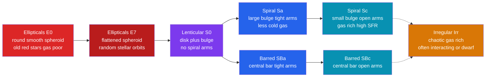

# 🌠 Types of Galaxies

> [!abstract] TL;DR
> Galaxies fall into a handful of shapes captured by the **Hubble sequence** ("tuning fork"): **ellipticals** (E0–E7, smooth spheroids of old red stars, gas-poor, supported by random stellar motions), **lenticulars** (S0, a disk with no spiral arms), **spirals** (Sa→Sc and barred SBa→SBc, cold-gas disks with arms and ongoing star formation on ordered rotation, like the Milky Way), and **irregulars** (Irr, chaotic and gas-rich). Crucially the sequence is a **classification, not an evolutionary track**. Morphology correlates with physical properties — mass, color, gas content, star-formation rate — producing the observed **color bimodality**: a star-forming **blue cloud** (spirals) and a passive **red sequence** (ellipticals), bridged by *quenching*. Type-specific **scaling relations** double as distance indicators: **Tully–Fisher** ($L\propto v_{\rm rot}^4$) for spirals and the **Faber–Jackson / fundamental plane** for ellipticals.

## Intuition — analogy FIRST

Imagine emptying a giant box of seashells onto a table to sort them. Some are smooth featureless ovals, ranging from nearly spherical to squashed like a flat football. Others are graceful flat pinwheels with spiraling ridges — a few with a straight bar running through the center. And a handful are just chaotic broken fragments. You would naturally lay them out on a two-pronged rack: the smooth ovals along the handle, and the pinwheels splitting into two parallel prongs.

That is almost exactly the arrangement **Edwin Hubble** drew for galaxies in 1926. The shape of a galaxy is not decoration — it encodes how the galaxy is *built* (a puffy 3-D swarm of orbits versus a thin spinning disk) and what it is *doing* (quietly aging versus actively forming new stars from cold gas).

---

## How It Works

A galaxy's morphology reflects two physical facts: **how its stars orbit** (random 3-D motions → spheroid; ordered rotation → thin disk) and **whether it still holds cold gas** to make new stars. The Hubble "tuning fork" arranges the types along a smooth continuum. The handle holds the pressure-supported ellipticals; the fork's junction holds the transitional lenticulars; and the two prongs hold the rotation-supported spirals — normal on one prong, barred on the other.



---

### Secondary Level

**The Hubble sequence.** Galaxies come in four broad families:

- **Ellipticals (E).** Smooth, egg-shaped balls of stars with no disk and no arms. They are dominated by **old, red stars**, hold **little gas or dust**, and make **few new stars**. Sizes span an enormous range — from monstrous **cD galaxies** at cluster centers down to faint **dwarf ellipticals**.
- **Lenticulars (S0).** In-between objects: they have a flat **disk and a central bulge** like a spiral, but **no spiral arms** and little cold gas.
- **Spirals (S).** A flat rotating **disk with spiral arms**, a central **bulge**, and plenty of **cold gas and dust** feeding **ongoing star formation**. Many, including the **Milky Way**, have a central **bar** (barred spirals, SB). Their bright arms glow blue with newborn stars.
- **Irregulars (Irr).** No organized shape at all — chaotic, gas-rich, and often small (dwarfs) or distorted by a collision with a neighbor.

**One big warning.** Hubble labeled ellipticals "early-type" and spirals "late-type." This is *just terminology* — galaxies do **not** slide down the fork from elliptical to spiral (or vice-versa) as they age. The sequence sorts shapes; it is **not a timeline**.

### Undergraduate Level

**Quantifying the classes.**

| Type | Notation | Shape rule | Stars & gas | Kinematics |
|------|----------|-----------|-------------|------------|
| Elliptical | E0–E7 | $En$ with $n = 10\,(1 - b/a)$ | old, red; gas-poor | random (dispersion) |
| Lenticular | S0 | disk + bulge, no arms | intermediate; gas-poor | rotating disk |
| Spiral | Sa→Sc | bulge/disk ratio falls, arms open | young + old; gas-rich | ordered rotation |
| Barred spiral | SBa→SBc | as above + central bar | as spirals | rotation + bar |
| Irregular | Irr | none | very gas-rich, blue | disturbed |

**Ellipticity.** An E$n$ galaxy has apparent axis ratio $b/a$; e.g. **E7** is the flattest allowed, with $b/a = 0.3$. This is *projected* shape — a round-looking E0 could be an elongated system seen end-on.

**The Sa→Sc progression.** Moving along a prong, the **bulge-to-disk ratio decreases**, the arms grow **more open (loosely wound)**, and the **cold-gas fraction and star-formation rate rise**. About **two-thirds of disk galaxies host a bar** (the Milky Way included), so the barred prong is not exotic.

**Color bimodality.** Plot galaxies by color versus luminosity and they split into two clumps, not one:

- the **blue cloud** — star-forming spirals and irregulars, still turning cold gas into hot young (blue) stars;
- the **red sequence** — passive ellipticals and S0s, whose stars are old and red because star formation has stopped.

The sparsely populated gap between them is the **green valley**. A galaxy that stops forming stars — **quenching** — reddens and migrates from blue cloud to red sequence. Because massive early-types cluster on the red sequence and gas-rich late-types on the blue cloud, *color and morphology are tightly linked*.

**Scaling relations (which double as distance indicators).**

- **Spirals — Tully–Fisher (1977):** luminosity tracks how fast the disk spins,
$$L \propto v_{\rm rot}^{4}\qquad\Longleftrightarrow\qquad M \approx -10\log_{10} v_{\rm rot} + \text{const}.$$
Measure the rotation speed from the **HI 21 cm** line width, read off $L$, compare to apparent brightness → **distance**. See [[The_Cosmic_Distance_Ladder]].
- **Ellipticals — Faber–Jackson (1976):** $L \propto \sigma^{4}$, where $\sigma$ is the central stellar **velocity dispersion**.

**Environment.** Galaxies live in **groups** and **clusters**. Interactions and **mergers** transform them: two spirals colliding can scramble their disks into an elliptical, and **dwarf galaxies are by far the most numerous type** in the universe (see [[Galaxy_Formation_and_Evolution]]).

### Graduate Level

**Surface-brightness profiles — the Sérsic law.** Both disks and spheroids are described by
$$I(R) = I_e \exp\!\Big[-b_n\big((R/R_e)^{1/n} - 1\big)\Big],\qquad b_n \approx 2n - \tfrac{1}{3},$$
where $R_e$ is the half-light radius and $n$ the **Sérsic index**. **Exponential disks** have $n = 1$; classical **elliptical galaxies and bulges** follow the **de Vaucouleurs $n = 4$** profile (steep core, extended wings). **Bulge/disk decomposition** fits a two-component ($n=4$ bulge + $n=1$ disk) model to recover morphology quantitatively rather than by eye.

**The fundamental plane.** Faber–Jackson is really the edge-on projection of a tight 2-D relation among ellipticals:
$$\log R_e = a\,\log \sigma + b\,\langle\mu\rangle_e + c,$$
(empirically $R_e \propto \sigma^{1.2}\,I_e^{-0.8}$). The **fundamental plane** has ~$0.05$ dex thickness, making it a superb standard-ruler distance indicator and a probe of the mass-to-light ratio and structural homology of ellipticals.

**Kinematic classification.** Modern integral-field surveys (SAURON, ATLAS$^{3D}$, MaNGA) reclassify early-types by the ratio of ordered rotation to random motion, $V/\sigma$: **fast rotators** (most "ellipticals" are actually flattened, disky, rotation-supported systems) versus **slow rotators** (genuinely triaxial, dispersion-dominated giants). Shape alone hides this.

**The morphology–density relation (Dressler 1980).** The **elliptical + S0 fraction rises steeply with local galaxy density**, while spirals dominate the low-density field. Physical drivers of the correlated quenching include **ram-pressure stripping** of a galaxy's gas by the hot intracluster medium, **strangulation** (cutoff of fresh gas supply), **galaxy harassment**, and internally **AGN feedback** (see [[Active_Galactic_Nuclei_and_Quasars]]). The Tully–Fisher and fundamental-plane relations ultimately reflect the underlying **dark-matter halos** that set a galaxy's potential well (see [[Dark_Matter]]).

```python
# Tully-Fisher relation for spirals: L ~ v_rot^4, and its use as a distance rung.
import numpy as np
import matplotlib.pyplot as plt

rng = np.random.default_rng(7)

# Rotation speeds from HI 21 cm line widths (km/s) for a sample of spirals
v_rot = rng.uniform(70, 350, 50)
logv  = np.log10(v_rot)

# L propto v^4  <=>  a factor 4 in luminosity is 2.5*4 = 10 magnitudes per decade in v
slope_L = 4.0
M_abs = -2.5 * slope_L * (logv - np.log10(200)) - 21.0     # I-band, ~ -21 at v=200 km/s
M_abs += rng.normal(0, 0.30, v_rot.size)                    # intrinsic scatter ~0.3 mag

# Fit the calibrating relation (nearby spirals with known distances)
A = np.vstack([logv, np.ones_like(logv)]).T
mag_slope, mag_zpt = np.linalg.lstsq(A, M_abs, rcond=None)[0]
print(f"Fitted slope = {mag_slope:.1f} mag/dex  ->  L propto v^{-mag_slope/2.5:.1f}")
print(f"Scatter = {(M_abs - (mag_slope*logv + mag_zpt)).std():.2f} mag "
      f"-> distances good to ~{10**(0.2*0.3) - 1:.0%}")

# Use it as a DISTANCE INDICATOR for a spiral of unknown distance
v_obs, m_app = 180.0, 12.4                                  # measured rotation & apparent mag
M_pred = mag_slope * np.log10(v_obs) + mag_zpt             # TF predicts absolute magnitude
mu     = m_app - M_pred                                     # distance modulus
d_Mpc  = 10**((mu + 5) / 5) / 1e6
print(f"Predicted M = {M_pred:.2f}, mu = {mu:.2f}  ->  distance = {d_Mpc:.1f} Mpc")

plt.figure(figsize=(7, 5))
plt.scatter(logv, M_abs, s=28, label="calibrating spirals")
xx = np.linspace(logv.min(), logv.max(), 100)
plt.plot(xx, mag_slope*xx + mag_zpt, 'r-', lw=2, label=f"fit: {mag_slope:.1f} mag/dex")
plt.gca().invert_yaxis()                                    # brighter (more negative) upward
plt.xlabel(r"$\log_{10}\, v_{\rm rot}$  [km/s]")
plt.ylabel(r"absolute magnitude  $M$")
plt.title("Tully-Fisher relation as a distance-ladder rung")
plt.legend(); plt.grid(alpha=0.3); plt.tight_layout()
plt.show()
```

---

## Real-World Notes

- **The Milky Way** is a barred spiral, classified **SBbc** — an intermediate case between Sb and Sc with a modest bar (see [[The_Milky_Way_Galaxy]]).
- **M87**, the giant elliptical at the heart of the Virgo cluster, is a slow-rotating cD galaxy whose supermassive black hole gave us the first Event Horizon Telescope image (2019).
- **The Antennae (NGC 4038/4039)** are two spirals caught mid-merger — a textbook example of an interaction en route to building an elliptical.
- **The Large and Small Magellanic Clouds**, satellites of the Milky Way, are gas-rich irregular/dwarf galaxies distorted by tidal forces.
- Ellipticals are gas-poor in *cold* gas but are often filled with **hot, X-ray-emitting ionized gas** held in their deep potential wells — "gas-poor" refers to the star-forming cold phase (see [[The_Interstellar_Medium]]).
- SDSS galaxy-image citizen science (**Galaxy Zoo**) and CNN classifiers now assign morphologies to millions of galaxies, confirming the color bimodality and morphology–density trends statistically.

---

## Common Pitfalls

1. **Treating the tuning fork as a timeline.** "Early-type" and "late-type" are historical labels; a galaxy does **not** evolve from elliptical → spiral. If anything, *mergers* push disks toward ellipticals — the opposite direction.
2. **Confusing projected E$n$ with true 3-D shape.** The ellipticity index measures *apparent* flattening on the sky; a nearly spherical galaxy seen edge-on and a genuinely flat one seen face-on can look identical.
3. **Equating "elliptical" with "dispersion-supported."** Kinematic surveys show most so-called ellipticals are actually **fast rotators** — flattened, rotating, disky systems. Shape does not uniquely fix dynamics.
4. **Assuming all spirals have a bar or none do.** Barred and unbarred spirals occupy *separate prongs*; roughly two-thirds of spirals are barred, and bars can form, dissolve, and reform.
5. **Ignoring environment.** Morphology correlates with local density (the morphology–density relation) — you cannot interpret a galaxy's type without knowing whether it sits in a rich cluster or the empty field.
6. **Reading Tully–Fisher off inclination-uncorrected velocities.** The observed line width must be corrected for disk inclination ($v_{\rm rot} = W_{\rm obs}/(2\sin i)$); skipping this corrupts the distance estimate.

---

## Related Concepts

- [[_MOC_Galaxies_ISM|↑ Section MOC]]
- [[The_Milky_Way_Galaxy]] — our home galaxy is a barred spiral (SBbc), the reference point for the whole sequence
- [[The_Interstellar_Medium]] — cold gas and dust are the fuel that distinguishes gas-rich spirals from gas-poor ellipticals
- [[Galaxy_Formation_and_Evolution]] — how mergers, gas accretion, and quenching move galaxies across the sequence
- [[Active_Galactic_Nuclei_and_Quasars]] — AGN feedback is a leading quenching mechanism that builds the red sequence
- [[Dark_Matter]] — halos set the potential wells behind the Tully–Fisher and fundamental-plane scaling relations
- [[The_Cosmic_Distance_Ladder]] — Tully–Fisher and the fundamental plane are secondary distance indicators calibrated on it
- [[Stellar_Properties_and_the_HR_Diagram]] — the old-red vs young-blue stellar populations behind the color bimodality
- [[Magnitudes_Luminosity_and_Flux]] — the luminosity, flux, and magnitude machinery used in every scaling relation
- [[_MOC_Mathematics_Master]] — power-law fits, log–log regression, and the least-squares plane behind these relations

---

## Review Questions

1. **Secondary:** Describe the four main families of the Hubble sequence and one physical property (stars, gas, or motion) that distinguishes each. Why is it wrong to call the sequence an "evolutionary track"?
2. **Undergraduate:** A spiral galaxy has an HI line width giving $v_{\rm rot} = 220$ km/s and apparent magnitude $m = 11.8$. Using $M \approx -10\log_{10}v_{\rm rot} + 2.0$, estimate its absolute magnitude and distance in Mpc. What is the dominant source of uncertainty?
3. **Graduate:** Explain how the Faber–Jackson relation is a projection of the fundamental plane, and why the fundamental plane's thinness (~0.05 dex) implies structural regularity among ellipticals. How do kinematic surveys (fast vs slow rotators) complicate the classical elliptical/spiral dichotomy?

---

## Sources

- Hubble, E. (1926) — "Extragalactic Nebulae," *ApJ* 64, 321 (the original tuning-fork classification)
- Binney & Merrifield — *Galactic Astronomy*, Ch. 4 (morphology and photometry)
- Mo, van den Bosch & White — *Galaxy Formation and Evolution*, Ch. 2 & 11
- Tully & Fisher (1977) — *A&A* 54, 661; Faber & Jackson (1976) — *ApJ* 204, 668
- Dressler, A. (1980) — "Galaxy morphology in rich clusters," *ApJ* 236, 351
- Cappellari et al. (2011) — ATLAS$^{3D}$: fast and slow rotators, *MNRAS* 413, 813

---

#astronomy #galaxies #hubblesequence #ellipticals #spirals #tullyfisher #fundamentalplane #colorbimodality #secondary #undergraduate #graduate
