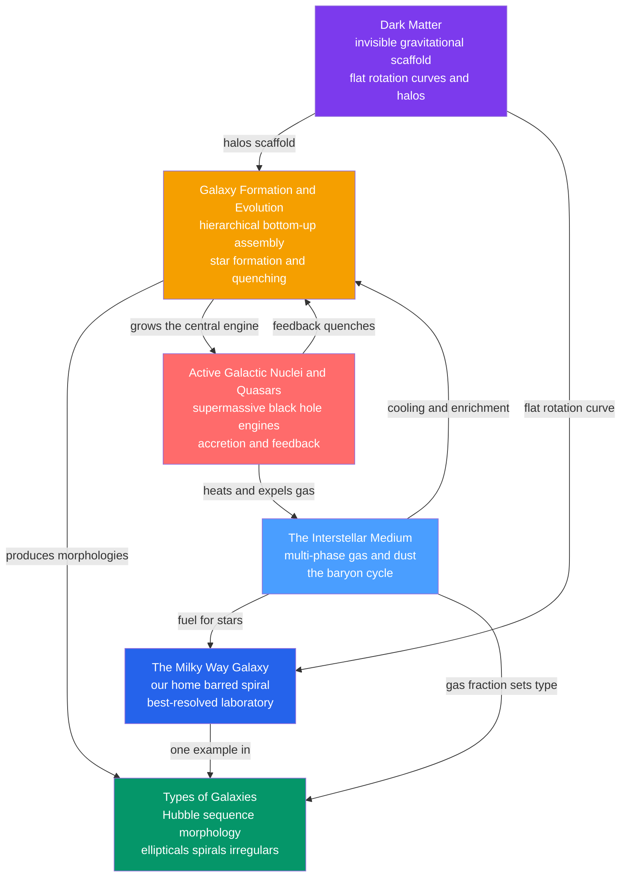

# 🌌 Galaxies & the Interstellar Medium — Map of Content

> [!abstract] What This Section Covers
> This section zooms out from single stars to the **island universes** they inhabit. It begins with the diffuse **interstellar medium** — the multi-phase gas and dust whose baryon cycle turns stars into new stars — then maps our home **Milky Way**, the best-resolved galaxy we have, whose flat rotation curve first exposed the missing mass. From there it classifies galaxies along the **Hubble sequence**, traces their **hierarchical formation and evolution** from primordial ripples to the red/blue color bimodality, and confronts the two invisible protagonists: the **supermassive black holes** that power active galactic nuclei and quasars, and the **dark matter** that provides the gravitational scaffolding for everything. Six notes weave gas, stars, black holes, and dark halos into one story of how galaxies are built and regulated, each opening at secondary level and deepening to graduate formalism.

## Concept Map

*(Blue/purple = the raw ingredients — gas and dark matter; green/orange = the galaxies and their assembly; red = the extreme AGN engine. Arrows read as "feeds," "scaffolds," or "regulates.")*

## Learning Path

*Recommended order for a first pass through this section:*

1. [[The_Interstellar_Medium]] — Start with the raw material: the multi-phase gas and dust, nebulae, extinction and reddening, and the baryon cycle that recycles stars.
2. [[The_Milky_Way_Galaxy]] — Anchor everything in our home galaxy: disk, bulge, bar, halo, Sgr A\*, and the flat rotation curve that hints at unseen mass.
3. [[Types_of_Galaxies]] — Step outward to the whole population: the Hubble sequence, color bimodality, and the Tully–Fisher and fundamental-plane scaling relations.
4. [[Dark_Matter]] — Confront the missing mass head-on: five lines of evidence, the Bullet Cluster, candidates, and ΛCDM.
5. [[Galaxy_Formation_and_Evolution]] — Assemble it all in time: hierarchical growth, gas cooling, mergers, cosmic noon, and feedback-driven quenching.
6. [[Active_Galactic_Nuclei_and_Quasars]] — Finish with the central engine: accretion power, the Eddington limit, the unified model, and the M–σ co-evolution that ties black holes to their hosts.

## All Notes at a Glance

| Note | Difficulty | Core Idea |
|------|------------|-----------|
| [[The_Interstellar_Medium]] | Secondary → Graduate | The diffuse gas and dust between stars — a multi-phase, pressure-balanced system (molecular, neutral, ionized) that dims and reddens starlight and recycles matter through the baryon cycle. |
| [[The_Milky_Way_Galaxy]] | Secondary → Graduate | Our home barred spiral: disk, bulge/bar, stellar and dark halos, the Sgr A\* black hole, and a flat rotation curve mapped through dust with 21 cm, CO, and Gaia. |
| [[Types_of_Galaxies]] | Secondary → Graduate | The Hubble tuning-fork classification (ellipticals, lenticulars, spirals, irregulars), color bimodality, and scaling relations like Tully–Fisher and the fundamental plane. |
| [[Galaxy_Formation_and_Evolution]] | Undergraduate → Graduate | Bottom-up hierarchical assembly in ΛCDM: gas cooling into disks, mergers, cosmic-noon star formation, and supernova/AGN feedback that quenches galaxies. |
| [[Active_Galactic_Nuclei_and_Quasars]] | Undergraduate → Graduate | Supermassive-black-hole engines powered by accretion — the Eddington limit, the orientation-based unified model, and the M–σ relation linking hole to host. |
| [[Dark_Matter]] | Secondary → Graduate | The invisible, non-baryonic mass revealed only by gravity — rotation curves, cluster dynamics, lensing, the CMB, and structure — and the scaffold of ΛCDM. |

## Key Questions This Section Answers

- What actually fills the "empty" space between stars, and why must astronomers correct for dust before trusting any brightness or color?
- Why do the outskirts of galaxies rotate *too fast* for the visible matter, and what five independent clues force us to invoke dark matter?
- How do we classify galaxies, and why is the Hubble tuning fork a sorting of shapes rather than an evolutionary timeline?
- How did galaxies grow from one-part-in-100,000 ripples in the CMB into today's spirals and ellipticals, and when did the universe make most of its stars?
- How can a region smaller than the Solar System outshine a hundred billion stars, and why does a central black hole's mass track the whole host galaxy?
- What regulates star formation — what turns a blue, gas-rich spiral into a "red and dead" elliptical?

## Related Sections

- [[_MOC_Astronomy_Master|↑ Astronomy Master MOC]]
- [[_MOC_Stellar_Astrophysics|→ Stellar Astrophysics]] — [[Star_Formation]] consumes the ISM and [[Stellar_Nucleosynthesis]] enriches it, driving galactic chemical evolution.
- [[_MOC_Cosmology|→ Cosmology]] — the same [[Dark_Matter]] and hierarchical growth build the [[Large_Scale_Structure_and_Structure_Formation|cosmic web]] from [[The_Big_Bang_and_Cosmic_Microwave_Background|CMB]] ripples.
- [[_MOC_High_Energy_Astrophysics|→ High-Energy Astrophysics]] — [[Black_Hole_Physics]] and [[Accretion_Disks_and_X_ray_Binaries]] supply the engine behind AGN and Sgr A\*.

#MOC #Astronomy #Galaxies
