# ⚛️ Big Bang Nucleosynthesis

> [!abstract] TL;DR
> In its first three minutes the universe was a nuclear furnace. The **neutron-to-proton ratio** was fixed by the mass difference $\Delta m c^2 = 1.293\ \text{MeV}$ through the Boltzmann factor $n/p = e^{-\Delta m c^2/kT}$, held in equilibrium by weak interactions until those reactions **froze out** at $kT \approx 0.8\ \text{MeV}$ ($t \approx 1\ \text{s}$), locking $n/p \approx 1/6$. Free-neutron decay trimmed this to $\approx 1/7$ before fusion could begin. A **deuterium bottleneck** — photodissociation destroying deuterium faster than it forms — delayed synthesis until $kT \approx 0.07\ \text{MeV}$ ($t \approx 3\ \text{min}$), whereupon nearly every surviving neutron was swept into **helium-4**, giving a predicted primordial mass fraction $Y_p \approx 0.25$: about **25% helium, 75% hydrogen**, plus trace deuterium, $^3\text{He}$, and $^7\text{Li}$. No stable nucleus at mass 5 or 8 blocked the road to carbon — heavier elements had to wait for stars. That these predictions match observation across ten orders of magnitude is one of the great triumphs of the hot Big Bang, pinning the cosmic **baryon density** and constraining the number of neutrino species.

## Intuition — analogy FIRST

Imagine a factory that can only assemble its product during a brief, closing window — and the doors are slamming shut as the building cools and empties out. The raw parts are **protons and neutrons**. The product is **helium**. Two constraints decide the yield: *how many neutrons made it to the assembly line* (neutrons are the rare, precious ingredient because they are slightly heavier and keep decaying), and *whether the glue sets before the doors close* (fusion cannot start while energetic photons keep smashing apart the first weld, deuterium).

Run the numbers on the back of an envelope. When the assembly window opens there is roughly **one neutron for every seven protons**. Helium-4 needs two of each. So essentially all the neutrons pair off with protons into helium, and the leftover protons stay as bare hydrogen. Count the mass: two neutrons plus two protons per helium, versus the mob of spare protons — and you get **about a quarter of the mass in helium, three quarters in hydrogen**. That single ratio, forged in three minutes 13.8 billion years ago, is still written into every star and galaxy we observe.

---

## How It Works

```mermaid
graph LR
    EQ["First second<br/>Hot equilibrium soup<br/>p, n, e, nu, gamma"]
    WK["Weak reactions balance<br/>n plus nu &harr; p plus e<br/>ratio set by Boltzmann factor"]
    FO["Freeze-out<br/>kT approx 0.8 MeV, t approx 1 s<br/>n to p locks near 1 in 6"]
    DEC["Free-neutron decay<br/>n to p drifts toward 1 in 7<br/>tau approx 880 s"]
    BN["Deuterium bottleneck<br/>kT approx 0.07 MeV, t approx 3 min<br/>D survives photodissociation"]
    HE["Rapid fusion<br/>nearly all neutrons into He-4<br/>Yp approx 0.25"]
    TR["Frozen-in traces<br/>D, He-3, Li-7"]

    EQ --> WK
    WK --> FO
    FO --> DEC
    DEC --> BN
    BN --> HE
    HE --> TR

    style EQ fill:#7c3aed,color:#fff
    style WK fill:#6366f1,color:#fff
    style FO fill:#2563eb,color:#fff
    style DEC fill:#0891b2,color:#fff
    style BN fill:#d97706,color:#fff
    style HE fill:#dc2626,color:#fff
    style TR fill:#059669,color:#fff
```



---

## Key Concepts / Details

### Secondary Level

Rewind the expanding universe and it gets hotter and denser. In the **first second** it was a searing plasma of protons, neutrons, electrons, photons, and neutrinos, far too hot for any nucleus to hold together — every attempt was instantly blasted apart.

As it cooled, particles could finally begin to stick. But this was a **race against expansion**: the universe was thinning and cooling by the second. In roughly the **first three minutes**, protons and neutrons fused into **helium** — and then the furnace shut down. The result was strikingly simple:

| Element | Fraction of ordinary matter (by mass) |
|---------|----------------------------------------|
| Hydrogen ($^1\text{H}$) | $\approx 75\%$ |
| Helium ($^4\text{He}$) | $\approx 25\%$ |
| Everything else (D, $^3\text{He}$, $^7\text{Li}$) | trace amounts |

No carbon, no oxygen, no iron — there was **no time**, and gaps in the nuclear ladder blocked the way. Everything heavier had to wait billions of years to be built inside stars (see [[Stellar_Nucleosynthesis]]). The remarkable part: wherever astronomers look — the oldest stars, the most distant gas clouds — they find **about 25% helium**, exactly as predicted. It is a fossil from the universe's first three minutes.

### Undergraduate Level

**The neutron-to-proton ratio.** Protons and neutrons interconvert through weak reactions that keep them in thermal equilibrium:

$$n + \nu_e \leftrightarrow p + e^-, \qquad n + e^+ \leftrightarrow p + \bar\nu_e, \qquad n \leftrightarrow p + e^- + \bar\nu_e$$

Because the neutron is heavier than the proton by $\Delta m c^2 = 1.293\ \text{MeV}$, equilibrium favors protons with a **Boltzmann factor**:

$$\frac{n_n}{n_p} = \exp\!\left(-\frac{\Delta m c^2}{kT}\right)$$

At high $T$ this is near unity; as the universe cools the ratio slides toward zero.

**Freeze-out.** The weak reaction rate scales as $\Gamma \propto G_F^2 T^5$, while the Hubble expansion rate scales as $H \propto T^2$ (see [[The_Friedmann_Equations_and_Cosmological_Models]]). Because $\Gamma$ falls faster than $H$, the reactions can no longer keep up once $\Gamma \approx H$, at $kT \approx 0.8\ \text{MeV}$ ($t \approx 1\ \text{s}$). The ratio **freezes** near

$$\frac{n}{p}\Big|_{\text{freeze}} \approx \frac{1}{6}.$$

**Neutron decay.** Frozen-out neutrons are not fully safe — the free neutron $\beta$-decays with mean lifetime $\tau_n \approx 880\ \text{s}$. In the few minutes before fusion starts, enough decay to lower the ratio to

$$\frac{n}{p}\Big|_{\text{fusion}} \approx \frac{1}{7}.$$

**The deuterium bottleneck.** The obvious first step is $p + n \rightarrow d + \gamma$, but the deuteron's binding energy is only $2.22\ \text{MeV}$. With $\sim 10^9$ photons per baryon, the high-energy tail of the photon distribution **photodissociates** deuterium as fast as it forms. Fusion stalls until the temperature drops to $kT \approx 0.07\ \text{MeV}$ ($t \approx 3\ \text{min}$), when deuterium finally survives. Then a rapid chain runs to completion:

$$d + d \rightarrow {}^3\text{He} + n, \quad d + d \rightarrow t + p, \quad {}^3\text{He} + d \rightarrow {}^4\text{He} + p, \quad t + d \rightarrow {}^4\text{He} + n$$

Because $^4\text{He}$ is by far the most tightly bound light nucleus, essentially **every surviving neutron ends up locked in helium-4**. Counting two neutrons and two protons per $^4\text{He}$, the primordial helium mass fraction is

$$Y_p = \frac{2(n/p)}{1 + (n/p)} \approx \frac{2(1/7)}{1 + 1/7} = \frac{2}{8} = 0.25.$$

**Predicted primordial abundances** (standard BBN with baryon-to-photon ratio $\eta \approx 6\times 10^{-10}$):

| Species | Predicted | Observed | Sensitivity |
|---------|-----------|----------|-------------|
| $Y_p$ ($^4\text{He}$ mass fraction) | $\approx 0.247$ | $0.245 \pm 0.004$ | weak (logarithmic) in $\eta$; sensitive to $N_\nu$, $\tau_n$ |
| $\text{D}/\text{H}$ | $\approx 2.5\times 10^{-5}$ | $2.53\times 10^{-5}$ | **strong**, $\propto \eta^{-1.6}$ — the "baryometer" |
| $^3\text{He}/\text{H}$ | $\approx 1.0\times 10^{-5}$ | $\sim 1.1\times 10^{-5}$ | mild |
| $^7\text{Li}/\text{H}$ | $\approx 5\times 10^{-10}$ | $\sim 1.6\times 10^{-10}$ | strong; **factor-3 discrepancy** |

**Why nothing heavier forms.** There is **no stable nucleus at mass number 5** ($^5\text{He}$, $^5\text{Li}$ are unbound) and **none at mass 8** ($^8\text{Be}$ decays in $\sim 10^{-16}\ \text{s}$). In stars the triple-alpha process leaps the $A=8$ gap by sheer density; in the fast-thinning early universe the density is far too low. So synthesis dead-ends at $^7\text{Li}$, and the periodic table beyond must await stellar cores (see [[Stellar_Nucleosynthesis]], and [[Nuclear_Reactions_Fission_Fusion]] for the energetics).

### Graduate Level

**Deuterium as the baryometer.** Of all the light elements, deuterium is the sharpest probe of the baryon density. More baryons mean fusion proceeds more efficiently and burns deuterium more completely toward $^4\text{He}$, so the leftover $\text{D}/\text{H}$ falls steeply, roughly $\propto \eta^{-1.6}$. Measuring $\text{D}/\text{H}$ in pristine, metal-poor gas along quasar sightlines yields the **baryon-to-photon ratio**

$$\eta \equiv \frac{n_b}{n_\gamma} \approx 6.1\times 10^{-10}, \qquad \Omega_b h^2 \approx 0.0224.$$

Astonishingly, this BBN value agrees with the **entirely independent** determination from the cosmic microwave background acoustic peaks (see [[The_Big_Bang_and_Cosmic_Microwave_Background]]). Two probes of physics separated by 380,000 years give the same baryon budget — a landmark consistency check of the hot Big Bang.

**Non-baryonic matter.** Because $\Omega_b h^2 \approx 0.022$ accounts for only $\sim 5\%$ of the critical density, yet the total matter density is $\Omega_m \approx 0.31$, **most matter cannot be baryonic** — BBN is one of the pillars of the case for [[Dark_Matter]] (see [[Standard_Model_Overview]] for the particle candidates).

**Counting neutrino species.** The expansion rate at freeze-out depends on the relativistic energy density, hence on the effective number of neutrino species $N_{\text{eff}}$. Extra species speed up expansion, freeze $n/p$ out **earlier** at a higher value, and raise $Y_p$. BBN thus weighs light, relativistic degrees of freedom:

$$N_{\text{eff}} = 2.9 \pm 0.3 \quad (\text{BBN}),$$

consistent with the three Standard-Model neutrinos and tightly limiting any fourth "sterile" species — a laboratory-free constraint on particle physics.

**BBN as a probe beyond the Standard Model.** The abundances are sensitive to the neutron lifetime $\tau_n$, the gravitational constant $G$, possible variation of fundamental constants, and any exotic relics decaying during synthesis. The persistent **lithium problem** — predicted $^7\text{Li}$ roughly three times the value seen in old halo stars — remains unresolved and is a live hunt for either stellar-depletion astrophysics or new physics.

```python
# Big Bang Nucleosynthesis: from the neutron-to-proton ratio to the
# primordial helium-4 mass fraction Y_p.
#
# Chain: (1) equilibrium n/p from the Boltzmann factor at weak freeze-out,
#        (2) free-neutron decay until fusion begins,
#        (3) lock the surviving neutrons into He-4  ->  Y_p = 2(n/p)/(1+n/p).
import numpy as np

# --- Physical inputs ---
dm        = 1.293    # neutron-proton mass difference, MeV  (Delta m c^2)
kT_freeze = 0.72     # weak-interaction freeze-out temperature, MeV  (~1 s)
tau_n     = 880.0    # free-neutron mean lifetime, seconds
t_freeze  = 1.0      # time at freeze-out, seconds
t_fusion  = 130.0    # time the deuterium bottleneck breaks, seconds (~2-3 min)

# 1) Equilibrium neutron-to-proton ratio at freeze-out (Boltzmann factor)
np_freeze = np.exp(-dm / kT_freeze)
print(f"n/p at freeze-out : {np_freeze:.3f}  (about 1 in {1/np_freeze:.1f})")

# 2) Free neutrons beta-decay (n -> p + e- + nu) until fusion starts.
#    Baryon number is conserved: each decayed neutron becomes a proton.
survive = np.exp(-(t_fusion - t_freeze) / tau_n)
n = np_freeze * survive
p = 1.0 + np_freeze * (1.0 - survive)
np_fusion = n / p
print(f"n/p at fusion     : {np_fusion:.3f}  (about 1 in {1/np_fusion:.1f})")

# 3) Essentially all surviving neutrons are captured into He-4 (2 n + 2 p);
#    leftover protons remain as hydrogen.  Helium-4 mass fraction:
Yp = 2.0 * np_fusion / (1.0 + np_fusion)
print(f"He-4 mass fraction Y_p : {Yp:.3f}   (observed ~ 0.245)")
print(f"Hydrogen mass fraction : {1 - Yp:.3f}")

# Output:
#   n/p at freeze-out : 0.166  (about 1 in 6.0)
#   n/p at fusion     : 0.140  (about 1 in 7.1)
#   He-4 mass fraction Y_p : 0.246   (observed ~ 0.245)
#   Hydrogen mass fraction : 0.754
```

---

## Real-World Notes

- **Alpher, Bethe & Gamow (1948).** The "$\alpha\beta\gamma$" paper first computed primordial element formation in a hot early universe. Gamow's student Ralph Alpher and Robert Herman went on to predict a relic radiation bath — the future CMB — a decade before its discovery.
- **The Hoyle irony.** Fred Hoyle coined "Big Bang" derisively, favoring a steady-state universe, yet BBN's successful helium prediction became one of the strongest arguments against his own model.
- **The 25% floor.** No galaxy, star, or gas cloud is ever found with helium much below $\approx 24\%$ by mass. Stellar fusion only *adds* helium, so this universal floor is the primordial BBN yield showing through — a fossil abundance.
- **The baryometer, in practice.** Deuterium is measured in Lyman-limit absorption systems against distant quasars, in gas so pristine that stars have not yet polluted it. The inferred $\eta$ matches the CMB to a few percent.
- **The lithium problem.** Metal-poor Population II halo stars sit on the flat "Spite plateau" of lithium, at roughly one-third the BBN prediction — one of the sharpest unexplained tensions in standard cosmology.
- **A particle-physics laboratory.** Before any accelerator, BBN had already constrained the number of neutrino families to $\approx 3$, later confirmed by the $Z$-boson width measured at LEP.

---

## Common Pitfalls

1. **Confusing BBN with stellar nucleosynthesis.** BBN makes only the *lightest* nuclei (H, He, and traces of Li) in the first minutes; carbon, oxygen, iron, and everything heavier are forged much later in stars (see [[Stellar_Nucleosynthesis]]).
2. **Thinking helium is "cooked" gradually like in a star.** The $n/p$ ratio is set *before* fusion by weak freeze-out and neutron decay; the actual fusion is a near-instantaneous sweep of the leftover neutrons into $^4\text{He}$ once the deuterium bottleneck breaks.
3. **Ignoring the deuterium bottleneck.** Naively fusion "should" start at $\sim 2\ \text{MeV}$ (deuterium's binding energy), but the enormous photon-to-baryon ratio delays it to $\sim 0.07\ \text{MeV}$. Overlooking this gives far too much helium.
4. **Forgetting neutron decay.** Using the freeze-out ratio $1/6$ instead of the decayed $\approx 1/7$ overpredicts $Y_p$. The few minutes of waiting for fusion cost real neutrons.
5. **Assuming heavier elements simply "didn't have time."** The deeper reason is nuclear: the unstable $A=5$ and $A=8$ gaps break the chain, and the density is too low to bridge them as stars do.
6. **Reading $Y_p$ as a *number* fraction.** $Y_p \approx 0.25$ is a **mass** fraction. By *number* of atoms, helium is only about 1 in 12, since each helium atom is four times as massive as hydrogen.

---

## Related Concepts

- [[_MOC_Cosmology|↑ Section MOC]]
- [[The_Big_Bang_and_Cosmic_Microwave_Background]] — the same hot early universe; the CMB independently measures the baryon density BBN predicts
- [[The_Friedmann_Equations_and_Cosmological_Models]] — the expansion rate $H(T)$ that sets freeze-out and the synthesis clock
- [[Cosmic_Inflation_and_the_Early_Universe]] — sets the initial conditions and baryon content that BBN then processes
- [[The_Expanding_Universe_and_Hubbles_Law]] — the cooling, thinning expansion that shuts the nuclear furnace
- [[Dark_Energy_and_the_Accelerating_Universe]] — the later-era energy budget complementing BBN's matter census
- [[Large_Scale_Structure_and_Structure_Formation]] — the baryon fraction fixed here seeds later structure growth
- [[Stellar_Nucleosynthesis]] — takes over where BBN stops, building everything past lithium
- [[Dark_Matter]] — BBN's low baryon density implies most matter is non-baryonic
- **Physics** — [[Nuclear_Reactions_Fission_Fusion]] (fusion energetics of the light-element chain), [[Nuclear_Structure]] (binding energies, the $A=5,8$ gaps), [[Standard_Model_Overview]] (weak interactions and the neutrino count)
- **Mathematics** — [[_MOC_Mathematics_Master]] (Boltzmann statistics and the stiff reaction-network ODEs behind full BBN codes)

---

## Review Questions

1. **Secondary**: The universe emerged from its first three minutes with about 25% of its ordinary matter as helium and 75% as hydrogen. Why do we still see roughly this helium fraction everywhere today, even though stars also make helium?
2. **Undergraduate**: Starting from the equilibrium ratio $n/p = e^{-\Delta m c^2/kT}$ with $\Delta m c^2 = 1.293\ \text{MeV}$, estimate $n/p$ at the freeze-out temperature $kT \approx 0.8\ \text{MeV}$. Explain how neutron decay and the deuterium bottleneck then lead to $n/p \approx 1/7$ at fusion, and use $Y_p = 2(n/p)/(1+(n/p))$ to obtain the primordial helium mass fraction.
3. **Graduate**: Explain why deuterium is a far better "baryometer" than helium-4, and why increasing the number of relativistic neutrino species raises the predicted $Y_p$. How does the agreement between BBN and the CMB determinations of $\eta$ constrain non-baryonic dark matter?

---

## Sources

- Alpher, Bethe & Gamow (1948) — "The Origin of Chemical Elements," *Phys. Rev.* 73, 803
- Weinberg — *The First Three Minutes* (classic popular account) and *Cosmology* (2008), Ch. 3
- Ryden — *Introduction to Cosmology*, 2nd ed., Ch. 10 (Nucleosynthesis and the Early Universe)
- Cyburt, Fields, Olive & Yeh (2016) — "Big Bang Nucleosynthesis: Present Status," *Rev. Mod. Phys.* 88, 015004
- Particle Data Group — *Review of Particle Physics*, Big-Bang Nucleosynthesis chapter

#astronomy #cosmology #nucleosynthesis #BBN #primordialhelium #deuterium #baryondensity #earlyuniverse #secondary #undergraduate #graduate
