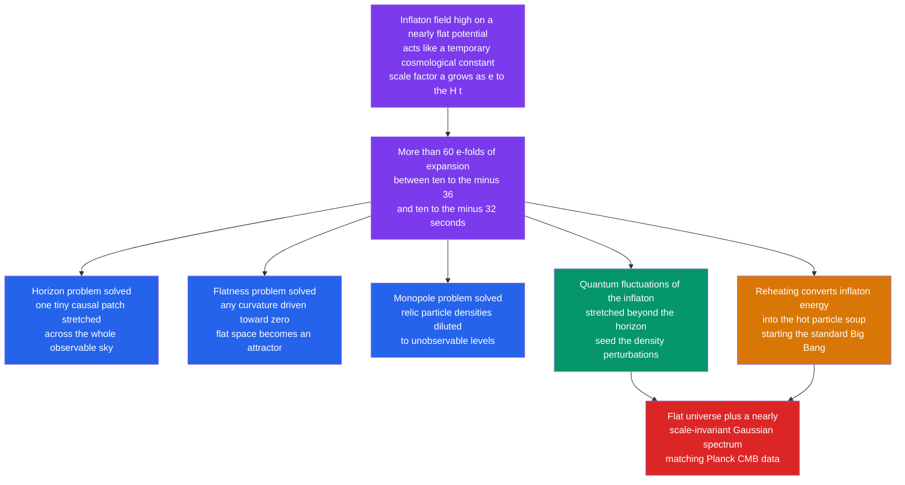

# 💥 Cosmic Inflation and the Early Universe

> [!abstract] TL;DR
> **Inflation** (Guth 1981; Linde and Albrecht–Steinhardt 1982) posits that between roughly $10^{-36}$ and $10^{-32}$ s the universe underwent a burst of **exponential expansion**, $a \propto e^{Ht}$, blowing up by at least $e^{60} \sim 10^{26}$ in linear size. A scalar **inflaton** field trapped high on a nearly flat potential acts like a temporary cosmological constant, driving de Sitter-like growth. This single idea cures three diseases of the plain hot Big Bang — the **horizon**, **flatness**, and **monopole** problems — by stretching one tiny causal patch across the whole sky, flattening any curvature, and diluting relic particles. Its profound bonus: **quantum fluctuations** of the inflaton, frozen and stretched to cosmic scales, become the **primordial density perturbations** that seed the CMB anisotropies and every galaxy. Inflation predicts a **flat** universe and a nearly **scale-invariant, Gaussian, adiabatic** spectrum ($n_s \approx 0.965$, confirmed by Planck); its still-sought signature is primordial **gravitational waves** imprinted as CMB **B-mode** polarization.

## Intuition — analogy FIRST

Take a **wrinkled, deflated balloon** covered in ink dots and scribbles, and inflate it to the size of the Earth in an instant. Two things happen. First, any patch of rubber you can see becomes so enormously magnified that its curvature vanishes — it looks perfectly **flat**, and neighbouring scribbles are flung so far apart they leave your view entirely. Second, the whole visible surface came from **one tiny original patch** whose points had all been touching, so they share the same temperature and texture — no mystery why distant regions match.

Swap the rubber for **space itself** and the inflating breath for the energy of the **inflaton field**, and you have cosmic inflation. A microscopic, causally connected, hot region is stretched in a heartbeat into something vastly larger than everything we can now see. That is why the sky is uniform (horizon), why space is flat (flatness), and why exotic relics are nowhere to be found (monopole) — all at once. And the faint microscopic **quantum jitters** on that original patch, stretched to astronomical size, survive as the seeds of galaxies.

---

## How It Works

The engine is a scalar field with a nearly flat potential; its almost-constant energy density mimics a cosmological constant, forcing accelerated expansion until the field rolls off the flat region and **reheats** the universe into the hot Big Bang.



---

## Key Concepts / Details

### Secondary Level

**A blink of runaway growth.** In its first fraction of a second the universe expanded not steadily but explosively, doubling its size dozens of times over in about $10^{-34}$ s — a total blow-up of at least $10^{26}$ in every direction. After this brief episode it settled into the ordinary, gentle expansion we still see today (see [[The_Expanding_Universe_and_Hubbles_Law]]).

**Why cosmologists invented it.** Run the plain hot Big Bang forward and you hit three puzzles that inflation fixes in one stroke:

- **Horizon:** the cosmic microwave background is the same temperature ($2.725$ K, matching to $1$ part in $100{,}000$) even in opposite directions of the sky that were never close enough to exchange heat. Inflation says the whole sky grew from **one tiny patch that *was* in contact** before being stretched apart (see [[The_Big_Bang_and_Cosmic_Microwave_Background]]).
- **Flatness:** space is geometrically **flat** to high precision — an unnatural knife-edge condition. Inflation stretches any curved space so vastly that it *must* look flat, like a magnified balloon surface.
- **Monopole:** early-universe physics predicts heavy leftover particles (magnetic monopoles) we have never found. Inflation **dilutes** them until essentially none remain in the visible universe.

**The gift of the galaxies.** Tiny **quantum jitters** in the inflaton, magnified to cosmic size, became the slightly-denser-than-average regions where gravity later pulled matter together into galaxies and clusters (see [[Large_Scale_Structure_and_Structure_Formation]]).

### Undergraduate Level

**The three problems, quantified.**

| Problem | Statement | Inflation's fix |
|---------|-----------|-----------------|
| Horizon | The causal horizon at recombination subtends only $\sim 1$–$2^{\circ}$, so the sky holds $\sim 10^{4}$ regions never in contact, yet all share one temperature | All grew from a single pre-inflation causal patch |
| Flatness | $\lvert\Omega-1\rvert = \dfrac{k c^2}{a^2 H^2}$ grows in a decelerating universe, so $\lvert\Omega-1\rvert \lesssim 10^{-60}$ at the Planck time was required | Accelerated growth drives $\Omega \to 1$ |
| Monopole | GUT phase transitions at $\sim 10^{16}$ GeV overproduce monopoles that would overclose the universe | Their number density is diluted by $e^{3N}$ |

**The mechanism: an inflaton field.** Model the early universe with a scalar field $\phi$ (the **inflaton**) and potential $V(\phi)$. If the field sits on a nearly **flat** part of $V$, its energy is dominated by potential rather than kinetic energy, so it behaves like a cosmological constant with $\rho \approx V \approx \text{const}$. The Friedmann equation (see [[The_Friedmann_Equations_and_Cosmological_Models]]) then gives an almost constant Hubble rate,

$$H^2 = \frac{8\pi G}{3}\,V \approx \text{const} \quad\Longrightarrow\quad a(t) \propto e^{Ht},$$

a **de Sitter-like** exponential expansion. Growth is measured in **e-folds**:

$$N \equiv \ln\!\frac{a_{\text{end}}}{a_{\text{start}}} = \int_{t_\text{start}}^{t_\text{end}} H\,dt.$$

Solving the horizon and flatness problems requires at least $N \gtrsim 60$ (typically $50$–$60$, depending on the reheating temperature).

**How each cure works.** *Horizon:* a region smaller than the pre-inflation Hubble radius is inflated to encompass everything we now see, so uniformity is inherited from prior causal contact. *Flatness:* during inflation $aH$ **increases**, so $\lvert\Omega-1\rvert = kc^2/(a^2H^2) \to 0$ — flatness becomes an attractor rather than a fine-tuning. *Monopole:* any relic density is diluted by the volume factor $e^{3N} \sim 10^{78}$.

**Reheating.** Inflation must end. As $\phi$ finally rolls down to the minimum of $V$, it oscillates and **decays** into Standard-Model particles, dumping its energy as heat — **reheating** launches the hot Big Bang and its familiar sequence (nucleosynthesis, recombination; see [[Big_Bang_Nucleosynthesis]]).

**Quantum seeds.** Sub-horizon **quantum fluctuations** $\delta\phi$ of the inflaton are stretched past the Hubble radius, where they "freeze" as classical curvature perturbations (see [[Wave_Particle_Duality_and_Uncertainty]]). Because each mode exits the horizon under nearly identical conditions, the resulting spectrum is nearly **scale-invariant**, **Gaussian**, and **adiabatic** — exactly the statistics the CMB shows.

### Graduate Level

**Slow-roll dynamics.** A homogeneous inflaton obeys

$$\ddot\phi + 3H\dot\phi + V'(\phi) = 0, \qquad H^2 = \frac{8\pi G}{3}\!\left(\tfrac12\dot\phi^2 + V\right).$$

The **slow-roll** regime ($\dot\phi^2 \ll V$, $\ddot\phi$ negligible) gives $3H\dot\phi \approx -V'$ and $H^2 \approx \tfrac{8\pi G}{3}V$. Its validity is governed by two dimensionless **slow-roll parameters** (with reduced Planck mass $M_{Pl} \equiv (8\pi G)^{-1/2}$):

$$\epsilon \equiv \frac{M_{Pl}^2}{2}\!\left(\frac{V'}{V}\right)^{\!2}, \qquad \eta \equiv M_{Pl}^2\,\frac{V''}{V}.$$

Inflation proceeds while $\epsilon, \lvert\eta\rvert \ll 1$ and **ends** when $\epsilon \simeq 1$. The e-fold count is

$$N = \int H\,dt = \frac{1}{M_{Pl}^2}\int_{\phi_\text{end}}^{\phi_\text{start}} \frac{V}{V'}\,d\phi.$$

**Observable predictions.** Perturbation theory ties the primordial spectra directly to the slow-roll parameters:

| Observable | Slow-roll expression | Planck / BICEP–Keck value |
|-----------|----------------------|---------------------------|
| Scalar spectral index | $n_s - 1 = -6\epsilon + 2\eta$ | $n_s = 0.9649 \pm 0.0042$ |
| Tensor-to-scalar ratio | $r = 16\epsilon$ | $r < 0.036$ (95% CL) |
| Consistency relation | $r = -8\,n_t$ | untested (needs $r$) |

The measured **red tilt** ($n_s < 1$ at $>8\sigma$) is a genuine inflationary success: exact scale invariance ($n_s = 1$) is excluded, matching the small departure predicted by finite slow roll.

**Primordial gravitational waves.** Tensor metric perturbations generated during inflation propagate as a stochastic **gravitational-wave** background (see [[Gravitational_Waves]]) and imprint a curl ("**B-mode**") pattern in CMB polarization. A detection would fix $r$ and hence the **energy scale** of inflation, $V^{1/4} \sim 10^{16}\,(r/0.01)^{1/4}$ GeV — a direct probe of GUT-scale physics far beyond any collider (see [[Beyond_Standard_Model]]).

**Eternal inflation and the multiverse.** In many potentials, quantum fluctuations push the field *up* the potential in some Hubble patches faster than classical rolling drags it down, so inflation **never fully ends** globally: it continually spawns "pocket universes" while ending locally. This **eternal inflation** underlies the cosmological multiverse (Vilenkin, Linde, Guth) and the anthropic string landscape — powerful, but plagued by the unresolved **measure problem** and by questions of predictivity.

```python
import numpy as np

# --- Inflation modelled as a near-constant Hubble rate H (de Sitter-like) ---
c = 2.998e8          # speed of light, m/s
H = 1.0e36           # Hubble rate during inflation, 1/s (illustrative GUT-era value)
N_required = 60.0    # e-folds needed to solve the horizon + flatness problems

# Since a(t) ~ exp(H t), the duration to reach N e-folds is N / H:
duration = N_required / H
print(f"Inflation duration for N=60 : {duration:.2e} s")

# --- Scale factor grows exponentially: a(t) = a0 * exp(H t), a0 = 1 ---
t = np.linspace(0.0, duration, 7)
a = np.exp(H * t)
N = np.log(a / a[0])                     # e-folds elapsed = ln(a / a_start)
for ti, ai, Ni in zip(t, a, N):
    print(f"t = {ti:.2e} s   a/a0 = {ai:.3e}   N = {Ni:5.1f}")

expansion = np.exp(N_required)           # total linear stretch = e^60
print(f"\nTotal linear stretch a_end/a_start = e^60 = {expansion:.2e}")

# --- A causal patch is stretched far beyond the Hubble (horizon) radius ---
R_H  = c / H                             # Hubble radius, ~constant while H is constant
L0   = R_H                               # start: one causally connected patch
Lend = L0 * expansion                    # its physical size after 60 e-folds
print(f"\nHubble radius during inflation : {R_H:.2e} m")
print(f"Patch size after 60 e-folds    : {Lend:.2e} m")
print(f"Patch / Hubble radius          : {Lend/R_H:.2e}  (now super-horizon)")
```

Expected output: a duration of $\approx 6\times10^{-35}$ s, a total stretch $e^{60} \approx 1.14\times10^{26}$, a Hubble radius of $\approx 3\times10^{-28}$ m, and a causal patch that ends up $\approx 10^{26}$ times larger than the horizon — so everything we observe descends from a single, once-connected region.

---

## Real-World Notes

- **Planck confirms the framework.** The Planck satellite measures spatial flatness ($\Omega_k = 0.001 \pm 0.002$) and a red-tilted, Gaussian, adiabatic spectrum ($n_s = 0.965$) — three predictions of inflation vindicated at once.
- **Acoustic peaks encode the seeds.** The CMB temperature power spectrum (see [[The_Big_Bang_and_Cosmic_Microwave_Background]]) shows the harmonic peaks expected from **adiabatic** perturbations laid down at a single early epoch, disfavouring rival "active" seeds like cosmic strings as the dominant source.
- **The B-mode hunt continues.** BICEP/Keck plus Planck bound $r < 0.036$; the 2014 BICEP2 "detection" turned out to be Galactic dust. LiteBIRD, CMB-S4, and the Simons Observatory aim to reach $r \sim 0.001$.
- **Amplitude matches, too.** COBE, WMAP, and Planck all find fluctuation amplitude $\delta T/T \sim 10^{-5}$, consistent with the small perturbation level inflation naturally produces.
- **A window on GUT energies.** If tensor modes are found, the inferred energy scale ($\sim 10^{16}$ GeV) probes physics a trillion times beyond the LHC — inflation is our only observational lever on that regime (see [[Beyond_Standard_Model]]).
- **Same math, different epoch.** Today's dark-energy acceleration (see [[Dark_Energy_and_the_Accelerating_Universe]]) is de Sitter-like *just as inflation was*, but at an energy density ~$10^{120}$ times lower — a striking, unexplained echo.

---

## Common Pitfalls

1. **Inflation is not "the Big Bang explosion."** It is an *epoch* of accelerated metric expansion that *precedes and sets up* the hot Big Bang; space does not expand *into* anything, and there is no central blast point.
2. **Superluminal ≠ relativity violation.** Comoving points separate faster than light during inflation, but that is stretching of the metric, not motion *through* space, so special relativity is untouched (cf. [[The_Expanding_Universe_and_Hubbles_Law]]).
3. **The inflaton is a role, not a confirmed particle.** No known field is definitively the inflaton (the Higgs works only in specially coupled "Higgs inflation" variants). Inflation is a *class* of models, not a single settled theory.
4. **It does not explain the initial singularity.** Inflation still requires its own starting conditions (a suitable patch already in slow roll); it pushes the "beginning" question back rather than answering it.
5. **"Inflation is proven" overstates the case.** Flatness, $n_s < 1$, and Gaussianity strongly favour it, but the decisive test — primordial tensor B-modes — is undetected, and some cosmologists pursue bouncing or ekpyrotic alternatives.
6. **Do not conflate it with dark energy.** Both are accelerated expansion, but inflation ran at $\sim 10^{16}$ GeV for $\sim 10^{-32}$ s and *ended*, whereas dark energy dominates today at vastly lower energy and is (so far) ongoing.

---

## Related Concepts

- [[_MOC_Cosmology|↑ Section MOC]]
- [[The_Expanding_Universe_and_Hubbles_Law]] — the gentle expansion that inflation transitions into after reheating
- [[The_Big_Bang_and_Cosmic_Microwave_Background]] — the horizon problem lives in the CMB's uniformity, and its anisotropies are inflation's frozen quantum seeds
- [[Big_Bang_Nucleosynthesis]] — the hot Big Bang that reheating ignites, forging the light elements minutes later
- [[The_Friedmann_Equations_and_Cosmological_Models]] — the dynamics of $a(t)$ that a constant-$V$ inflaton drives into de Sitter growth
- [[Dark_Energy_and_the_Accelerating_Universe]] — today's low-energy echo of the same accelerated-expansion physics
- [[Large_Scale_Structure_and_Structure_Formation]] — how the primordial perturbations grow into the cosmic web
- [[Gravitational_Waves]] — primordial tensor modes and the sought-after CMB B-mode signature
- [[Cosmology_and_Expanding_Universe]] — Physics-vault treatment of the expanding-spacetime background
- [[Beyond_Standard_Model]] — GUT-scale monopoles, the inflaton, and the multiverse connect inflation to new physics
- [[Wave_Particle_Duality_and_Uncertainty]] — the quantum fluctuations that seed all structure
- [[_MOC_Mathematics_Master]] — the differential equations, exponentials, and perturbation theory behind slow roll

---

## Review Questions

1. **Secondary:** In one sentence each, state the horizon, flatness, and monopole problems, and explain intuitively how a brief burst of enormous expansion resolves all three at once.
2. **Undergraduate:** Inflation expands the universe by $N = 60$ e-folds. (a) By what linear factor does the scale factor grow? (b) By what factor is the number density of any pre-existing relic particle reduced? (c) Explain why $\lvert\Omega - 1\rvert$ is driven toward zero during inflation but *grows* during ordinary matter- or radiation-dominated expansion.
3. **Graduate:** Define the slow-roll parameters $\epsilon$ and $\eta$ and state the conditions for inflation and for its end. Derive (schematically) how they fix the observables $n_s$ and $r$, and explain what a measurement of primordial B-mode polarization would reveal about the physics of inflation.

---

## Sources

- Guth, A. H. (1981) — "Inflationary universe: A possible solution to the horizon and flatness problems," *Phys. Rev. D* 23, 347
- Linde, A. D. (1982) — "A new inflationary universe scenario," *Phys. Lett. B* 108, 389
- Albrecht, A. & Steinhardt, P. J. (1982) — "Cosmology for grand unified theories with radiatively induced symmetry breaking," *PRL* 48, 1220
- Mukhanov, V. & Chibisov, G. (1981); Guth, A. & Pi, S.-Y. (1982) — quantum fluctuations as the origin of structure
- Planck Collaboration (2020) — *Planck 2018 results. X. Constraints on inflation*, *A&A* 641, A10
- BICEP/Keck Collaboration (2021) — "Improved Constraints on Primordial Gravitational Waves," *PRL* 127, 151301
- Baumann, D. (2009) — "TASI Lectures on Inflation," arXiv:0907.5424

#astronomy #cosmology #inflation #inflaton #horizon-problem #flatness-problem #slow-roll #primordial-gravitational-waves #undergraduate #graduate
