# 🌑 Dark Energy and the Accelerating Universe

> [!abstract] TL;DR
> In 1998 two teams — Saul **Perlmutter**'s Supernova Cosmology Project and Brian **Schmidt** & Adam **Riess**'s High-z team (2011 Nobel Prize) — used **Type Ia supernovae** as standard candles and found that distant explosions look **fainter** (hence *farther*) than any decelerating, matter-only universe allows. The expansion is **accelerating**. The cause is **dark energy**: a component with **negative pressure** that gravitationally *repels*. The acceleration equation shows any fluid with $p < -\rho c^2/3$ speeds up expansion. The leading model is Einstein's **cosmological constant** $\Lambda$ (vacuum energy) with equation of state $w = p/(\rho c^2) \approx -1$ and *constant* density as space grows. Dark energy is **~68%** of the cosmic budget (matter ~27%, baryons ~5%), and its dominance is **recent** — matter–$\Lambda$ density equality at $z\sim 0.3$, so acceleration began only a few billion years ago. It faces two deep puzzles — the **cosmological constant problem** (a $\sim 10^{120}$ mismatch with quantum field theory) and the **coincidence problem** — and it likely dictates the universe's fate: eternal expansion and heat death.

## Intuition — analogy FIRST

Throw a ball straight up. Gravity pulls it back, so it **slows down** — that is what everyone before 1998 expected the universe to do, its own gravity gently braking the expansion left over from the Big Bang. Now imagine you toss the ball up and, instead of slowing, it **speeds away faster and faster**, as if the empty space beneath it were pushing it upward. Something built into the vacuum itself must be shoving outward.

That something is **dark energy**. Ordinary matter and radiation *attract* and decelerate the cosmos; dark energy has **negative pressure** — a kind of tension woven into empty space — and in Einstein's gravity, negative pressure **repels**. Because a fixed amount of vacuum energy fills *every* cubic metre, expanding space makes *more* of it, so its push grows relative to thinning matter until, a few billion years ago, repulsion won and the universe started to accelerate.

---

## How It Works

Standard-candle supernovae measure how distance grows with redshift; the surprise was that distances are *too large* for a decelerating cosmos, forcing a repulsive component into the equations.

```mermaid
graph LR
    A["Type Ia supernovae<br/>standard candles<br/>known peak luminosity"]
    B["Distant SNe look fainter<br/>than a decelerating<br/>matter-only universe predicts"]
    C["They lie farther away<br/>expansion has sped up<br/>acceleration found 1998"]
    D["Cause: energy with<br/>negative pressure<br/>p below minus rho c-squared over 3"]
    E["Cosmological constant Lambda<br/>vacuum energy<br/>equation of state w near minus 1"]
    F["Budget today<br/>68 percent dark energy<br/>27 percent dark matter"]
    G["Fate: eternal expansion<br/>de Sitter future<br/>cosmic heat death"]

    A --> B --> C --> D --> E --> F --> G

    style A fill:#2563eb,color:#fff
    style B fill:#7c3aed,color:#fff
    style C fill:#7c3aed,color:#fff
    style D fill:#059669,color:#fff
    style E fill:#059669,color:#fff
    style F fill:#d97706,color:#fff
    style G fill:#dc2626,color:#fff
```



---

## Key Concepts / Details

### Secondary Level

**Standard candles.** A **Type Ia supernova** is a white dwarf that detonates when it reaches a fixed mass, so every one peaks at nearly the **same true brightness** — a "standard candle" (see [[Supernovae_and_Gamma_Ray_Bursts]]). Compare how bright it *looks* to how bright it *truly is*, and you get its distance, just like judging a lamp's distance from its dimness.

**The 1998 surprise.** Two rival teams measured dozens of distant Type Ia supernovae. If gravity were slowing the expansion, those far-off explosions should appear a certain brightness. Instead they were **dimmer** — meaning **farther away** — than a slowing universe allows. The only explanation: the expansion has been **speeding up**. Perlmutter, Schmidt, and Riess shared the **2011 Nobel Prize** for the discovery.

**Dark energy.** The stuff driving the acceleration is called **dark energy**. We cannot see it or touch it, yet it makes up about **68%** of everything — more than dark matter (~27%) and ordinary atoms (~5%) combined (see [[Dark_Matter]]). Its effect only became noticeable a few billion years ago.

**The fate.** If dark energy keeps pushing, the universe expands **forever**, growing ever colder, darker, and emptier as galaxies race apart beyond view.

### Undergraduate Level

**Type Ia as standardizable candles.** A carbon–oxygen white dwarf accreting toward the **Chandrasekhar mass** ($\sim 1.4\,M_\odot$) undergoes thermonuclear runaway. Peak absolute magnitude $M_B \approx -19.3$, and the **Phillips relation** (brighter peaks have broader light curves) reduces the scatter to $\sim 0.1$–$0.15$ mag — good to $\sim 7\%$ in distance (see [[The_Cosmic_Distance_Ladder]]). Plotting distance modulus $\mu = 5\log_{10}(d_L/10\,\text{pc})$ against redshift extends the **Hubble diagram** to $z > 1$, where the *shape* of the curve reveals the expansion history.

**The acceleration equation.** The second Friedmann equation (see [[The_Friedmann_Equations_and_Cosmological_Models]]) governs $\ddot a$:

$$\frac{\ddot a}{a} = -\frac{4\pi G}{3}\left(\rho + \frac{3p}{c^2}\right) + \frac{\Lambda c^2}{3}$$

Pressure *gravitates*. A fluid accelerates expansion ($\ddot a > 0$) when

$$p < -\frac{\rho c^2}{3}, \qquad\text{i.e. equation of state}\quad w \equiv \frac{p}{\rho c^2} < -\frac{1}{3}.$$

Ordinary matter ($w=0$) and radiation ($w=+1/3$) decelerate; **dark energy needs strongly negative pressure**.

**Components and their dilution.** Each fluid dilutes as $\rho \propto a^{-3(1+w)}$:

| Component | $w$ | Density scaling | $\Omega$ today |
|-----------|-----|-----------------|----------------|
| Radiation | $+1/3$ | $\rho \propto a^{-4}$ | $\sim 9\times10^{-5}$ |
| Matter (dark + baryonic) | $0$ | $\rho \propto a^{-3}$ | $0.315$ |
| Dark energy ($\Lambda$) | $-1$ | $\rho \propto a^{0}$ (constant) | $0.685$ |

Because vacuum energy density stays constant while matter thins out, dark energy **inevitably comes to dominate**. Density equality ($\rho_\Lambda = \rho_m$) occurs at $z \approx 0.3$; the switch from deceleration to acceleration ($\ddot a = 0$) happened earlier, at $z \approx 0.6$, roughly 6 Gyr ago.

**Concordance.** Three independent probes agree on $\Omega_\Lambda \approx 0.7$: (1) supernovae measure acceleration directly; (2) the **CMB** shows the universe is spatially **flat** ($\Omega_\text{tot}\approx 1$), yet matter supplies only $\sim 0.3$, leaving $\sim 0.7$ for dark energy; (3) **baryon acoustic oscillations (BAO)** provide a standard ruler that traces expansion. Their intersection defines the **$\Lambda$CDM** model.

### Graduate Level

**The cosmological constant problem.** In quantum field theory the vacuum has zero-point energy $\rho_\text{vac} \sim E_\text{cutoff}^4$. A Planck-scale cutoff predicts $\rho_\text{vac} \sim 10^{112}\ \text{erg cm}^{-3}$, versus the observed $\rho_\Lambda \sim 10^{-8}\ \text{erg cm}^{-3}$ — a discrepancy of $\sim 10^{120}$. Even a supersymmetry-breaking cutoff leaves $\sim 10^{60}$. This is the largest quantitative failure in physics, and no accepted mechanism cancels it to the tiny observed value.

**The coincidence problem.** Why is $\rho_\Lambda$ (constant) comparable to $\rho_m$ (falling as $a^{-3}$) *right now*? For all but a narrow window of cosmic history one utterly dominates the other. We appear to live suspiciously near the crossover.

**Measuring the equation of state.** Is $w$ exactly $-1$? A dynamical **Chevallier–Polarski–Linder** parametrization allows evolution:

$$w(a) = w_0 + w_a(1-a),$$

and the deceleration parameter today is $q_0 = \tfrac{1}{2}\sum_i \Omega_i(1+3w_i) \approx \tfrac{1}{2}\Omega_m - \Omega_\Lambda \approx -0.53$. A pure constant is $(w_0, w_a) = (-1, 0)$. Combined **DESI** BAO + CMB + Type Ia data (2024–2025) hint at *evolving* dark energy with $w_0 > -1$ and $w_a < 0$, in mild $\sim 2$–$4\sigma$ tension with $\Lambda$ — a result under active scrutiny.

**Alternatives.** If $w \neq -1$, candidates include **quintessence** (a slowly rolling scalar field, $-1 < w < -1/3$), **phantom energy** ($w < -1$, density grows without bound), **k-essence**, and **modified gravity** ($f(R)$, DGP braneworlds) that alters Einstein gravity on cosmic scales — though the near-luminal speed of GW170817 ruled out many such models.

**The fate.**

| Model | Equation of state | Late-time behaviour | Ultimate fate |
|-------|-------------------|---------------------|---------------|
| Cosmological constant | $w = -1$ | de Sitter, $a \propto e^{Ht}$ | Heat death, cosmic event horizon |
| Quintessence | $-1 < w < -1/3$ | sub-exponential acceleration | Eternal expansion, possibly halts |
| Phantom energy | $w < -1$ | $\rho$ diverges in finite time | **Big Rip** — structures torn apart |

```python
import numpy as np

# Distance modulus mu(z) for two FLAT cosmologies via numerical integration.
# E(z) = sqrt(Om (1+z)^3 + OL);  d_L = (1+z)(c/H0) * integral_0^z dz'/E(z').
c, H0 = 299_792.458, 70.0                      # km/s , km/s/Mpc

def mu(z, Om, OL, n=2000):
    zz = np.linspace(0.0, z, n)
    Dc = (c / H0) * np.trapz(1.0 / np.sqrt(Om * (1 + zz) ** 3 + OL), zz)  # Mpc
    dL = (1 + z) * Dc                                                     # Mpc
    return 5 * np.log10(dL * 1e6 / 10.0)        # mu = 5 log10(d_L / 10 pc)

# At each redshift, accelerating LCDM predicts a LARGER distance -> FAINTER SN.
for z in (0.3, 0.6, 1.0):
    lam = mu(z, 0.3, 0.7)      # accelerating Lambda-CDM
    eds = mu(z, 1.0, 0.0)      # decelerating, matter-only (Einstein-de Sitter)
    print(f"z={z:>4}:  mu_LCDM={lam:6.3f}  mu_EdS={eds:6.3f}  fainter by {lam-eds:+.3f} mag")

# Mock survey: observed SNe scatter about LCDM, sitting ABOVE the decel. model
zgrid  = np.linspace(0.05, 1.1, 30)
rng    = np.random.default_rng(1998)
mu_obs = np.array([mu(z, 0.3, 0.7) for z in zgrid]) + rng.normal(0, 0.15, zgrid.size)
print(f"\nHigh-z SNe lie ~0.2-0.5 mag above the matter-only curve: the dark-energy signal.")
```

Expected output: the gap between the models **grows with redshift** (roughly $+0.2$ mag near $z=0.5$, approaching $+0.5$ mag by $z=1$), so distant Type Ia supernovae appear systematically fainter than any decelerating universe predicts — exactly the excess that revealed dark energy.

---

## Real-World Notes

- **The two discovery teams.** The Supernova Cosmology Project (Perlmutter 1999, *ApJ*) and the High-z Supernova Search Team (Riess 1998, *AJ*) reached the same conclusion independently — a textbook case of cross-checking that earned the 2011 Nobel Prize.
- **Planck's budget.** The *Planck* 2018 CMB fit gives $\Omega_\Lambda = 0.685$, $\Omega_m = 0.315$ (of which baryons $\Omega_b \approx 0.049$), $H_0 = 67.4$ km/s/Mpc, and a universe consistent with **spatially flat** to sub-percent precision.
- **BAO as a ruler.** SDSS, eBOSS, and now **DESI** use the $\sim 150$ Mpc baryon-acoustic scale imprinted at recombination as a standard ruler, independently confirming acceleration without supernovae.
- **DESI results.** DESI's first data releases (2024–2025) combine millions of galaxy and quasar redshifts; the hint of $w_0 > -1$, $w_a < 0$ has become one of the most-watched anomalies in cosmology.
- **Lambda's return.** Einstein introduced $\Lambda$ in 1917 to force a static universe, then abandoned it after Hubble's expansion. Dark energy resurrected it eight decades later — with the opposite sign of effect, driving *acceleration* rather than balancing gravity.
- **Not the same as dark matter.** Dark matter *clumps* and *attracts* (holding galaxies together); dark energy is *smooth* and *repels* (pushing space apart). They are distinct components that happen to dominate different eras (see [[Dark_Matter]]).

---

## Common Pitfalls

1. **Confusing dark energy with dark matter.** Dark matter adds gravitational *attraction* and clusters; dark energy adds negative-pressure *repulsion* and is uniform. Different physics, different roles.
2. **Thinking acceleration means galaxies gain speed through space.** It is the **scale factor** $a(t)$ whose growth accelerates ($\ddot a > 0$); galaxies are carried by expanding space, not propelled through it (see [[The_Expanding_Universe_and_Hubbles_Law]]).
3. **Believing dark energy always dominated.** Its density is constant while matter dilutes, so early on matter *decelerated* the universe. Acceleration is **recent** — it began around $z\sim 0.6$.
4. **Assuming "energy" implies dilution.** Vacuum energy has $w=-1$, so $\rho$ stays constant as space grows: doubling the volume doubles the total dark energy. This is exactly what negative pressure does thermodynamically.
5. **Equating $\Lambda$ with the QFT vacuum.** The measured $\Lambda$ is $\sim 10^{120}$ times *smaller* than the naive quantum-field-theory vacuum energy — the unsolved cosmological constant problem, not a confirmation.
6. **Reading acceleration as anti-gravity magic.** It is ordinary general relativity: in the acceleration equation, pressure gravitates, and sufficiently negative pressure ($p < -\rho c^2/3$) produces a repulsive gravitational effect.

---

## Related Concepts

- [[_MOC_Cosmology|↑ Section MOC]]
- [[The_Expanding_Universe_and_Hubbles_Law]] — the expansion whose *rate of change* dark energy now increases
- [[The_Big_Bang_and_Cosmic_Microwave_Background]] — the CMB flatness measurement that pins $\Omega_\Lambda \approx 0.7$
- [[Big_Bang_Nucleosynthesis]] — fixes the baryon fraction, sharpening the "missing energy" that dark energy fills
- [[The_Friedmann_Equations_and_Cosmological_Models]] — the acceleration equation and the $w<-1/3$ condition come from here
- [[Cosmic_Inflation_and_the_Early_Universe]] — an earlier bout of accelerated, vacuum-driven expansion; a possible analogue of dark energy
- [[Large_Scale_Structure_and_Structure_Formation]] — dark energy freezes cosmic web growth once it dominates; BAO trace both
- [[The_Cosmic_Distance_Ladder]] — how Type Ia supernova distances are calibrated
- [[Supernovae_and_Gamma_Ray_Bursts]] — the Type Ia explosions used as standard candles
- [[Dark_Matter]] — the attracting, clustering dark component that dark energy is often confused with
- [[Cosmology_and_Expanding_Universe]] — Physics-vault treatment of $\Lambda$ within general relativity
- [[Introduction_to_General_Relativity]] — the field equations in which $\Lambda$ and pressure-as-source appear
- [[_MOC_Mathematics_Master]] — the differential equations and numerical integration behind $a(t)$ and $d_L(z)$

---

## Review Questions

1. **Secondary:** Type Ia supernovae are called "standard candles." Explain what that means and how comparing a supernova's apparent brightness to its true brightness reveals that the universe's expansion is speeding up rather than slowing down.
2. **Undergraduate:** Starting from the acceleration equation $\ddot a/a = -\tfrac{4\pi G}{3}(\rho + 3p/c^2)$, show that a fluid drives acceleration only if $w < -1/3$. Why does a cosmological constant ($w=-1$) keep a *constant* energy density as space expands, and why does this guarantee it eventually dominates over matter?
3. **Graduate:** State the cosmological constant problem quantitatively and explain why supersymmetry does not resolve it. Then describe how the $(w_0, w_a)$ parametrization is used to test whether dark energy is a true constant, and what a measurement of $w_0 > -1$, $w_a < 0$ (as hinted by DESI) would imply for the ultimate fate of the universe.

---

## Sources

- Riess, A. G. et al. (1998) — "Observational Evidence from Supernovae for an Accelerating Universe and a Cosmological Constant," *AJ* 116, 1009
- Perlmutter, S. et al. (1999) — "Measurements of $\Omega$ and $\Lambda$ from 42 High-Redshift Supernovae," *ApJ* 517, 565
- Planck Collaboration (2020) — *Planck 2018 results. VI. Cosmological parameters*, *A&A* 641, A6
- Weinberg, S. (1989) — "The cosmological constant problem," *Rev. Mod. Phys.* 61, 1
- Carroll, S. M. (2001) — "The Cosmological Constant," *Living Rev. Relativity* 4, 1
- DESI Collaboration (2024, 2025) — DESI DR1/DR2 BAO cosmological constraints, *arXiv*:2404.03002, *arXiv*:2503.14738

#astronomy #cosmology #dark-energy #cosmological-constant #accelerating-universe #type-ia-supernovae #lambda-cdm #quintessence #secondary #undergraduate #graduate
