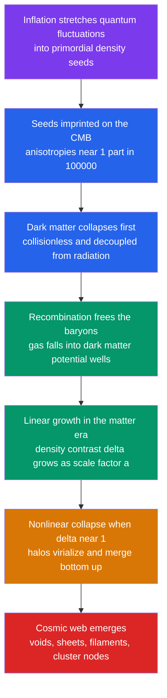

# 🕸️ Large-Scale Structure and Structure Formation

> [!abstract] TL;DR
> The universe began almost perfectly smooth — density varied by only about **1 part in 100,000**, as frozen into the CMB. But gravity is **unstable**: any overdense patch pulls in surrounding matter, growing denser while the expansion carries emptier regions apart. Over $13.8$ Gyr this **gravitational instability** amplified the primordial seeds (planted by [[Cosmic_Inflation_and_the_Early_Universe|inflation]]) into the **cosmic web** — a foam of near-empty **voids** bounded by **sheets** and **filaments**, with galaxy **clusters and superclusters** strung at the **nodes**, the largest structures in existence. **Cold dark matter** is essential: decoupled from radiation, it began collapsing *before* recombination and built the gravitational scaffolding that baryons later fell into. In the matter era the density contrast grows linearly, $\delta \propto a$, until $\delta \sim 1$ triggers nonlinear collapse and **hierarchical, bottom-up** assembly. The statistics of the web — the **power spectrum**, the **correlation function**, the $\sim 150$ Mpc **baryon-acoustic-oscillation** ruler, and $\sigma_8$ — are precision cosmological probes, reproduced in **N-body simulations** such as Millennium.

## Intuition — analogy FIRST

Blow a head of **soap foam** and look closely. Almost all the volume is trapped inside big empty **bubbles**; the soapy liquid is squeezed into thin **films** between them, into **edges** where films meet, and into fat **junction knots** where edges cross. The middle of a bubble holds essentially nothing. The universe looks astonishingly similar: galaxies shun the huge empty **voids** and collect into the **sheets**, **filaments**, and dense **cluster** knots between them — the cosmic web.

Why does it organize this way? Because gravity is a **runaway process**, like water beading on a cold window. Condensation starts nearly uniform, but a droplet a hair bigger than its neighbours pulls in more water and grows faster, draining the glass around it dry. Slightly overdense regions of the early universe did exactly this — pulling in more matter, growing denser, while the gaps between them emptied. The rich got richer until a smooth cosmos curdled into a web.

---

## How It Works

Tiny seeds from inflation are recorded as CMB ripples; dark matter collapses first and paves the way; baryons fall in after recombination; linear growth turns nonlinear; the web appears.



---

## Key Concepts / Details

### Secondary Level

**What the web looks like.** Map the 3-D positions of galaxies — using redshift as distance (see [[The_Expanding_Universe_and_Hubbles_Law]]) — and a foam-like pattern appears. **Galaxy redshift surveys** made this famous:

| Survey | Era | Galaxies | Landmark discovery |
|--------|-----|----------|--------------------|
| CfA2 (Harvard) | 1980s | $\sim 18{,}000$ | the "Stick Man" slice, the CfA **Great Wall** |
| 2dF (2dFGRS) | 2003 | $\sim 220{,}000$ | statistical clustering, hints of BAO |
| SDSS (Sloan) | 2000s+ | millions | the **Sloan Great Wall** ($\sim 420$ Mpc), first clear BAO |

**The building blocks.** The web sorts matter into a hierarchy of densities:

| Component | Size | Density vs. average | Example |
|-----------|------|---------------------|---------|
| Voids | $20$–$100$ Mpc | $\sim 10\%$ of mean | Boötes Void |
| Sheets / walls | up to hundreds of Mpc | a few $\times$ mean | CfA Great Wall |
| Filaments | tens of Mpc | $\sim 10\times$ mean | inter-cluster bridges |
| Clusters (nodes) | $1$–$3$ Mpc | $100$–$1000\times$ mean | Coma, Virgo |
| Superclusters | $\sim 100$ Mpc | mild overdensity | Laniakea |

**The origin.** The CMB shows temperature ripples of only $\sim 1$ part in $100{,}000$ (see [[The_Big_Bang_and_Cosmic_Microwave_Background]]) — the density map of the infant universe. Gravity amplified them: overdense spots pulled in more matter and collapsed; underdense spots expanded and emptied. Given $13.8$ Gyr, seeds of $10^{-5}$ grew into galaxies, clusters, and the web.

### Undergraduate Level

**Gravitational (Jeans) instability.** Perturb a self-gravitating fluid of mean density $\bar\rho$ and the density contrast $\delta \equiv \delta\rho/\bar\rho$ obeys

$$\ddot\delta + 2H\dot\delta - 4\pi G\,\bar\rho_m\,\delta = 0.$$

The middle term is **Hubble drag** (expansion fights collapse); the last term is self-gravity. Pressure resists collapse below the **Jeans length** $\lambda_J = c_s\sqrt{\pi/(G\bar\rho)}$, but dark matter is pressureless, so *all* scales above its free-streaming length can grow.

**Linear growth: $\delta \propto a$.** In a flat matter-dominated (Einstein–de Sitter) universe, $H = 2/(3t)$ and $4\pi G\bar\rho_m = 2/(3t^2)$. The equation admits a **growing mode** $\delta \propto t^{2/3} \propto a$ and a decaying mode $\delta \propto t^{-1}$. So during the matter era the density contrast simply tracks the **scale factor**: the universe grew by $\sim 1100$ since recombination, so a seed of $10^{-5}$ grows to $\sim 10^{-2}$ — unless something got a head start.

**Why dark matter is essential.** Baryons were locked to photons by Thomson scattering until **recombination** ($z\approx 1100$); radiation pressure forced their perturbations to *oscillate* as sound waves rather than grow. Cold **dark matter**, decoupled from radiation, began growing from **matter–radiation equality** ($z_{\rm eq}\approx 3400$). By recombination it had already dug potential wells far deeper than the baryons could have on their own. After recombination the freed gas simply **fell into the ready-made dark-matter scaffolding** and caught up fast. Without dark matter, structure could not have formed in the time available — see [[Dark_Matter]].

**Going nonlinear.** Linear theory breaks when $\delta \sim 1$. The **spherical collapse** model shows a top-hat overdensity turns around and virializes when its *linearly extrapolated* contrast reaches $\delta_c \approx 1.686$, ending at a virial overdensity $\Delta_c \approx 178$ times the mean. Collapse is **hierarchical / bottom-up**: small halos form first and merge into larger ones, seeding [[Galaxy_Formation_and_Evolution|galaxy formation]] inside them.

**Measuring the web.** Two-point statistics compress the pattern. The **correlation function** $\xi(r)$ — the excess probability of finding a galaxy pair separated by $r$ — is well fit by $\xi(r) \approx (r/r_0)^{-1.8}$ with $r_0 \approx 5\,h^{-1}$ Mpc. Its Fourier transform is the **matter power spectrum** $P(k)$. Superposed on both is the **baryon acoustic oscillation (BAO)** feature: a bump at $\sim 150$ Mpc, the frozen size of the pre-recombination sound horizon, used as a **standard ruler** to measure the expansion history and [[Dark_Energy_and_the_Accelerating_Universe|dark energy]].

### Graduate Level

**The general growth factor.** For any expansion history $H(a)$, the growing-mode solution of the growth equation is

$$D(a) \propto H(a)\int_0^a \frac{da'}{\big[a'\,H(a')\big]^3}, \qquad \delta(\mathbf{x},a) = D(a)\,\delta(\mathbf{x},a_i).$$

In matter domination $D\propto a$; once **dark energy dominates**, $H$ stays high while $\bar\rho_m$ dilutes, so growth is **suppressed** and $D$ freezes toward a constant. The **growth rate** is captured by

$$f \equiv \frac{d\ln D}{d\ln a} \approx \Omega_m(a)^{\gamma}, \qquad \gamma \approx 0.55 \ (\Lambda\mathrm{CDM}).$$

Today $f\approx 0.31^{0.55}\approx 0.53$: expansion has throttled growth to about half the EdS rate.

**Anisotropic collapse (Zel'dovich).** First-order Lagrangian perturbation theory maps particles as $\mathbf{x}(\mathbf{q},t) = \mathbf{q} + D(t)\,\boldsymbol{\psi}(\mathbf{q})$. Collapse along the axis of the largest tidal eigenvalue first, so matter drains onto **pancakes (sheets)**, then along a second axis into **filaments**, and finally into **nodes** — the geometric origin of the web.

**Redshift-space distortions (RSD).** Peculiar velocities shift observed redshifts, distorting clustering along the line of sight. On large scales coherent infall **squashes** structures (the Kaiser effect, $P_s = (1+\beta\mu^2)^2 P_r$ with $\beta = f/b$); on small scales virial motions smear clusters into radial **"Fingers of God."** Measuring the anisotropy yields the combination $f\sigma_8$ — a direct test of gravity on cosmic scales.

**Normalization and the $S_8$ tension.** The clustering amplitude is set by

$$\sigma_8^2 = \int\frac{d^3k}{(2\pi)^3}\,P(k)\,|W(kR_8)|^2, \qquad R_8 = 8\,h^{-1}\,\mathrm{Mpc},$$

with $\sigma_8 \approx 0.81$ (Planck). Weak-lensing surveys instead constrain $S_8 \equiv \sigma_8\sqrt{\Omega_m/0.3}$, and low-redshift lensing (KiDS, DES) tends to find $S_8 \approx 0.76$ against Planck's $\approx 0.83$ — a persistent $2$–$3\sigma$ **$S_8$ tension** hinting at suppressed late-time growth or new physics. The primordial spectrum $P(k)\propto k^{n_s}$ ($n_s\approx 0.965$) is bent by a **turnover** at $k_{\rm eq}$, where sub-horizon modes stagnated (the Mészáros effect) during the radiation era.

```python
# Linear growth of a matter density perturbation delta(a).
# Matter era: delta grows as delta proportional to a. Once dark energy dominates,
# growth is suppressed and delta freezes toward a constant. Requires scipy.
import numpy as np
from scipy.integrate import solve_ivp

Om, OL = 0.31, 0.69                                 # flat LambdaCDM (radiation ignored)

def E(a):    return np.sqrt(Om*a**-3 + OL)          # H(a)/H0
def dlnE(a): return -1.5*Om*a**-4 / E(a)**2         # E'(a)/E(a)

# Growth ODE in scale factor a:  D'' + (3/a + E'/E) D' - (3/2) Om(a)/a^2 D = 0
def rhs(a, y):
    D, dD = y
    Om_a = Om*a**-3 / E(a)**2                        # matter fraction at a
    ddD  = -(3/a + dlnE(a))*dD + 1.5*Om_a/a**2 * D
    return [dD, ddD]

a_i = 1e-3
sol = solve_ivp(rhs, [a_i, 1.0], [a_i, 1.0],        # start in matter era: D=a, D'=1
                dense_output=True, rtol=1e-8, atol=1e-10)

a     = np.logspace(np.log10(a_i), 0, 400)
D     = sol.sol(a)[0]
D_EdS = a                                           # matter-only growth: delta proportional to a
f     = np.gradient(np.log(D), np.log(a))           # growth rate dlnD/dlna

print(f"D(a=1) LambdaCDM      = {D[-1]:.3f}   (matter-only EdS would give {a[-1]:.3f})")
print(f"growth suppression    = {D[-1]/a[-1]:.3f}  (dark energy freezes structure)")
print(f"growth rate f today   = {f[-1]:.3f}   (Om^0.55 = {Om**0.55:.3f})")
# Typical output: D(a=1) ~ 0.78, suppression ~ 0.78, f ~ 0.53 -> growth is ~22% below EdS.
```

---

## Real-World Notes

- **The CfA "Stick Man" (1986).** de Lapparent, Geller & Huchra's first thin survey slice revealed that galaxies trace bubble walls around empty voids — the moment the cosmic web went from theory to picture.
- **Millennium and friends.** The Millennium Simulation (Springel et al. 2005) evolved $\sim 10^{10}$ dark-matter particles under gravity and reproduced the observed web in exquisite detail; successors (IllustrisTNG, EAGLE) add gas and feedback.
- **BAO as a ruler.** SDSS/BOSS/eBOSS and DESI measure the $\sim 150$ Mpc BAO scale at many redshifts, charting the expansion history and constraining dark energy independently of the distance ladder.
- **Laniakea, our home.** Velocity-flow mapping (Tully et al. 2014) defines the Laniakea Supercluster — $\sim 500$ million light-years wide — with the Milky Way on a filament draining toward the Great Attractor.
- **Voids as laboratories.** The largest under-densities test modified gravity and dark energy with almost no messy baryonic astrophysics; the integrated Sachs–Wolfe imprint of voids on the CMB is a real detection.
- **Web from the CMB alone.** Given the measured $10^{-5}$ CMB seeds and $\Lambda$CDM, simulations grow *exactly* the clustering that surveys observe — one of cosmology's great quantitative successes.

---

## Common Pitfalls

1. **"Galaxies formed, then clustered."** The order is reversed: **dark-matter halos** formed the gravitational scaffolding first, and galaxies condensed inside them. The web is a dark-matter structure that light merely traces.
2. **Ignoring dark matter's head start.** Baryons could not grow structure before recombination — radiation pressure held them in acoustic oscillation. Only the collisionless dark matter's early growth makes today's structure possible in the available time.
3. **Confusing $\delta \propto a$ with "structure forms slowly forever."** Linear growth is only the *early* phase; once $\delta\sim 1$, collapse runs away nonlinearly. And once dark energy dominates, growth is **suppressed**, not accelerated.
4. **Treating expansion velocity as motion causing clustering.** Clustering is driven by **peculiar velocities** (local infall under gravity), superposed on the smooth Hubble flow — the two are physically distinct (see [[The_Expanding_Universe_and_Hubbles_Law]]).
5. **Reading redshift-space maps as real space.** Peculiar velocities distort the maps — Fingers of God and the Kaiser squashing are *artifacts of using redshift as distance*, not intrinsic shapes.
6. **Calling superclusters "bound objects."** Superclusters are mild overdensities still expanding with the universe; they are **not** virialized and will be torn apart by accelerating expansion. Only clusters and smaller are gravitationally bound.

---

## Related Concepts

- [[_MOC_Cosmology|↑ Section MOC]]
- [[The_Expanding_Universe_and_Hubbles_Law]] — the smooth Hubble flow on which peculiar velocities and clustering are superposed
- [[The_Big_Bang_and_Cosmic_Microwave_Background]] — the $10^{-5}$ CMB anisotropies are the seed map for all structure
- [[Big_Bang_Nucleosynthesis]] — fixes the baryon budget that must fall into the dark-matter scaffolding
- [[The_Friedmann_Equations_and_Cosmological_Models]] — supplies $H(a)$ that sets the growth factor $D(a)$
- [[Dark_Energy_and_the_Accelerating_Universe]] — why late-time growth is suppressed and the BAO ruler is so valuable
- [[Cosmic_Inflation_and_the_Early_Universe]] — the origin of the near-scale-invariant primordial seeds
- [[Dark_Matter]] — collisionless cold dark matter is the load-bearing scaffold of the cosmic web
- [[Galaxy_Formation_and_Evolution]] — galaxies condense hierarchically inside collapsing halos
- [[Newtons_Laws_and_Kinematics]] — the gravitational instability at the heart of collapse (Physics vault)
- [[Classical_Statistical_Mechanics]] — the phase-space and fluctuation language behind the power spectrum (Physics vault)
- [[_MOC_Mathematics_Master]] — the Fourier analysis, ODEs, and statistics behind $P(k)$, $\xi(r)$, and $D(a)$ (Mathematics vault)

---

## Review Questions

1. **Secondary:** Redshift surveys show galaxies arranged in walls and filaments around huge empty voids. In one or two sentences, explain qualitatively how a nearly smooth early universe produced this pattern.
2. **Undergraduate:** Starting from $\delta \propto a$ in the matter era, estimate how much a $10^{-5}$ density seed grows between recombination ($z\approx 1100$) and today. Why does this *require* dark matter to have started growing earlier, and what physically prevented the baryons from doing so?
3. **Graduate:** Define the growth rate $f = d\ln D/d\ln a$ and explain why $f\approx\Omega_m(a)^{0.55}$ falls below unity today. Describe how redshift-space distortions let a galaxy survey measure $f\sigma_8$, and connect this to the $S_8$ tension between weak lensing and Planck.

---

## Sources

- Peebles, P. J. E. (1980) — *The Large-Scale Structure of the Universe*, Princeton
- de Lapparent, Geller & Huchra (1986) — "A Slice of the Universe," *ApJ* 302, L1
- Springel, V. et al. (2005) — "Simulations of the formation... the Millennium Simulation," *Nature* 435, 629
- Eisenstein, D. J. et al. (2005) — "Detection of the Baryon Acoustic Peak in the SDSS," *ApJ* 633, 560
- Mo, van den Bosch & White (2010) — *Galaxy Formation and Evolution*, CUP, Ch. 4, 7
- Planck Collaboration (2020) — "Planck 2018 Results VI: Cosmological Parameters," *A&A* 641, A6

#astronomy #cosmology #large-scale-structure #cosmic-web #structure-formation #gravitational-instability #power-spectrum #baryon-acoustic-oscillations #dark-matter #undergraduate #graduate
