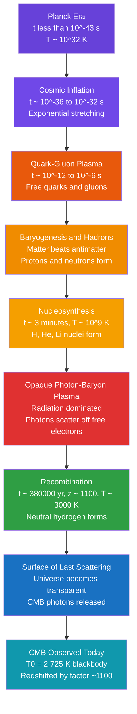

# 🔥 The Big Bang and Cosmic Microwave Background

> [!abstract] TL;DR
> Run the cosmic expansion backward and every galaxy crowds together into a hotter, denser past — the **hot Big Bang**. For its first ~380,000 years the universe was an opaque plasma of nuclei, electrons, and trapped photons. When it cooled to ~3000 K, electrons bound to protons to make neutral hydrogen (**recombination**), and the freed photons have streamed unimpeded ever since. Stretched by a factor of ~1100 by expansion, they reach us today as the **cosmic microwave background (CMB)** — a near-perfect blackbody at $T_0 = 2.725$ K whose one-part-in-100,000 temperature ripples encode the geometry and contents of the entire universe.

## Intuition — analogy FIRST

Think of a foggy morning. Inside thick fog you cannot see anything: sunlight scatters off water droplets before it ever reaches your eyes. As the fog burns off, there is a moment when the last layer of droplets clears and suddenly the whole landscape snaps into view. The **CMB is that last wall of fog** in the history of the universe. Before recombination, photons bounced endlessly off free electrons — the cosmos was a glowing, opaque fog. The instant electrons got captured into atoms, the fog lifted, and the light released at that "surface of last scattering" is still traveling. We see it in every direction as a faint microwave glow — a baby photograph of the universe at 380,000 years old.

---

## How It Works



### Secondary Level

**Running the film backward.** Galaxies are receding, and the more distant ones recede faster (see [[The_Expanding_Universe_and_Hubbles_Law]]). Rewind that expansion and everything converges: the universe was smaller, denser, and — because compressing a gas heats it — much hotter. Extrapolated to ~13.8 billion years ago, this gives the **hot Big Bang**: not an explosion *in* space but an expansion *of* space itself.

**The discovery (1965).** Arno Penzias and Robert Wilson, testing a radio antenna at Bell Labs, found an inexplicable microwave hiss coming from every direction, day and night. It was not equipment noise or pigeon droppings — it was the CMB, predicted decades earlier. They shared the 1978 Nobel Prize.

**Recombination.** When the universe cooled to about **3000 K**, free electrons combined with protons to form neutral hydrogen. Neutral gas does not scatter light the way free electrons do, so the universe became **transparent**. The photons set loose at that moment are the CMB.

**A stretched blackbody.** Those photons started as visible/infrared light from 3000 K gas. Expansion has since stretched their wavelengths by ~1100, cooling the spectrum to a perfect thermal glow at $T_0 = 2.725$ K, which peaks in the **microwave** band (~1 mm). The redshift and temperature are linked simply:

$$T \propto \frac{1}{a} \propto (1+z)$$

### Undergraduate Level

**Temperature–redshift scaling.** As space expands by scale factor $a$, wavelengths stretch as $\lambda \propto a$, so a blackbody at temperature $T$ remains a blackbody at $T \propto 1/a = 1+z$. From $T_0 = 2.725$ K to recombination at $T_{\rm rec}\approx 3000$ K:

$$1+z_{\rm rec} = \frac{T_{\rm rec}}{T_0} \approx \frac{3000}{2.725} \approx 1100$$

**Why 3000 K and not 158,000 K?** Hydrogen's ionization energy is 13.6 eV, corresponding to $\sim1.6\times10^5$ K. Recombination is delayed to much lower temperature because photons outnumber baryons by $\eta^{-1}\sim 10^{9}$; even the exponentially rare high-energy tail of the blackbody keeps hydrogen ionized until $k_BT$ falls well below 13.6 eV. The **Saha equation** locates the transition near 0.3 eV.

**A timeline of key epochs:**

| Epoch | Time | Temperature | Event |
|-------|------|-------------|-------|
| Planck era | $<10^{-43}$ s | $\sim10^{32}$ K | Quantum gravity unknown |
| Inflation | $\sim10^{-34}$ s | — | Superluminal stretching ([[Cosmic_Inflation_and_the_Early_Universe]]) |
| Electroweak | $\sim10^{-12}$ s | $10^{15}$ K | Forces separate |
| Nucleosynthesis | $\sim3$ min | $10^{9}$ K | H, He, Li form ([[Big_Bang_Nucleosynthesis]]) |
| Matter–radiation equality | $\sim50{,}000$ yr | $\sim9000$ K | Matter starts to dominate |
| Recombination | $\sim380{,}000$ yr | $\sim3000$ K | Atoms form, $z\approx1100$ |
| Last scattering | $\sim380{,}000$ yr | $\sim3000$ K | CMB released |

**Anisotropies.** The CMB is astonishingly uniform, but not perfectly so. Beyond a $\sim3.4$ mK **dipole** (our motion relative to the CMB rest frame at ~370 km/s), there are intrinsic temperature fluctuations of only **~1 part in 100,000** (~18 μK rms). COBE (1992) first detected them; WMAP (2003) and **Planck** (2013–2018) mapped them to exquisite precision. These ripples are the seeds of all later structure ([[Large_Scale_Structure_and_Structure_Formation]]).

**The horizon and flatness problems.** The standard hot Big Bang cannot explain *why* regions of the sky that were never in causal contact have the same temperature (**horizon problem**), nor why the universe is so precisely spatially flat today (**flatness problem**). Both are naturally resolved by a brief early burst of accelerated expansion — cosmic inflation.

### Graduate Level

**Acoustic peaks.** Before recombination, dark matter potential wells pulled the photon–baryon fluid inward while radiation pressure pushed out, driving **standing sound waves**. Recombination froze these oscillations in place, imprinting a series of peaks in the CMB temperature **angular power spectrum** $C_\ell$. The first peak sits at multipole $\ell \approx 220$; its angular scale measures the sound horizon against known physics and reveals that the universe is spatially **flat** ($\Omega_k \approx 0$). Peak *heights* weigh the ingredients:

| Parameter | Planck 2018 value | Meaning |
|-----------|-------------------|---------|
| $\Omega_b h^2$ | $\approx 0.0224$ | Baryon (ordinary matter) density |
| $\Omega_c h^2$ | $\approx 0.120$ | Cold dark matter density ([[Dark_Matter]]) |
| $\Omega_\Lambda$ | $\approx 0.685$ | Dark energy fraction |
| $H_0$ | $\approx 67.4$ km/s/Mpc | Expansion rate today |
| $z_*$ | $\approx 1090$ | Redshift of last scattering |

Together these fix the pillars of the **ΛCDM** concordance model: ~5% baryons, ~27% dark matter, ~68% dark energy ([[Dark_Energy_and_the_Accelerating_Universe]]).

**Sachs–Wolfe effect.** On the largest scales, temperature fluctuations trace gravitational potentials at last scattering: photons climbing out of an overdensity are redshifted, giving $\Delta T/T = \tfrac{1}{3}\,\Phi/c^2$. The **integrated Sachs–Wolfe** effect adds a contribution from potentials decaying along the line of sight in a dark-energy-dominated universe.

**Baryon acoustic oscillations (BAO).** The same sound horizon ($\sim150$ Mpc comoving) leaves a preferred separation between galaxies — a **standard ruler** measurable in galaxy surveys, cross-checking the CMB geometry at low redshift.

**Polarization.** Thomson scattering at last scattering produces linear polarization. Decomposed into **E-modes** (curl-free, from density perturbations, detected) and **B-modes** (curl, sourced by primordial gravitational waves from inflation, or by gravitational lensing). A confirmed primordial B-mode signal would be a smoking gun for inflation.

```python
import numpy as np
import matplotlib.pyplot as plt

# Physical constants (SI)
h   = 6.62607015e-34   # Planck constant, J*s
c   = 2.99792458e8     # speed of light, m/s
k_B = 1.380649e-23     # Boltzmann constant, J/K

T0 = 2.725             # CMB temperature today, K

def planck_lambda(lam, T):
    """Planck spectral radiance B_lambda(T) in W/m^2/sr/m."""
    a = 2.0 * h * c**2 / lam**5
    x = h * c / (lam * k_B * T)
    return a / np.expm1(x)          # expm1 is stable for small x

# Wavelength grid: 0.1 mm to 20 mm (the microwave band)
lam = np.linspace(0.1e-3, 20e-3, 2000)   # metres
B   = planck_lambda(lam, T0)

# Wien's displacement law: lambda_peak * T = b_wien
b_wien   = 2.897771955e-3                  # m*K
lam_peak = b_wien / T0
print(f"Wien peak wavelength : {lam_peak*1e3:.3f} mm  (microwave)")

# Temperature scales as 1/a = (1+z). Recombination at ~3000 K:
T_rec = 3000.0
z_rec = T_rec / T0 - 1.0
print(f"Recombination redshift z_rec = {z_rec:.0f}")
print(f"Universe was {(1+z_rec):.0f}x hotter and smaller at last scattering")

plt.figure(figsize=(7, 5))
plt.plot(lam*1e3, B/np.max(B), lw=2)
plt.axvline(lam_peak*1e3, ls='--', color='r',
            label=f'Wien peak = {lam_peak*1e3:.2f} mm')
plt.xlabel('Wavelength (mm)')
plt.ylabel('Normalised spectral radiance')
plt.title(f'CMB Blackbody Spectrum at T = {T0} K')
plt.legend(); plt.grid(True, alpha=0.3); plt.tight_layout()
```

---

## Real-World Notes

- **FIRAS on COBE** measured the CMB spectrum as the most perfect blackbody ever seen in nature: deviations from $T_0 = 2.72548$ K are below 50 parts per million — a triumphant confirmation of the hot Big Bang over steady-state rivals.
- **The CMB is everywhere and free to detect**: roughly 411 photons per cubic centimetre fill all of space, and a small fraction of the static "snow" on old analogue TVs tuned between channels was genuine CMB.
- **A cosmic speedometer**: the dipole anisotropy shows the Local Group moving at ~630 km/s relative to the CMB rest frame — the CMB defines a preferred cosmic frame (without violating relativity).
- **Planck satellite (2009–2013)** delivered the definitive full-sky maps, pinning down ΛCDM parameters to percent-level precision and anchoring modern cosmology.
- **The Hubble tension**: the CMB-inferred $H_0 \approx 67.4$ km/s/Mpc disagrees at ~5σ with local distance-ladder measurements of ~73 km/s/Mpc — one of today's hottest open problems ([[The_Cosmic_Distance_Ladder]]).
- **B-mode hunt**: experiments like BICEP/Keck and the Simons Observatory chase primordial B-mode polarization to test inflation directly.

---

## Common Pitfalls

1. **"The Big Bang was an explosion somewhere."** It was not a point blast in pre-existing space; it was a hot, dense *state of all space*, expanding everywhere at once. There is no center and no edge.
2. **"The CMB comes from a specific place."** The surface of last scattering is not a location but a *time* — a spherical shell at fixed lookback distance around every observer. New CMB reaches us continuously from ever-farther shells.
3. **Confusing recombination with reionization.** Recombination ($z\approx1100$) made the universe neutral and transparent. Much later, the first stars *re*-ionized the gas ($z\approx6$–$10$) — a distinct event.
4. **Thinking redshift "tires" the light.** The blackbody stays a perfect blackbody; expansion cools it as $T\propto(1+z)$ without destroying its thermal shape. This is not "tired light."
5. **Reading the acoustic peaks as sound we can hear.** They are frozen density oscillations imprinted as *angular* temperature patterns on the sky, not present-day acoustic waves.
6. **Equating the CMB dipole with intrinsic anisotropy.** The dominant dipole is a Doppler artifact of our motion and is subtracted before studying the true ~$10^{-5}$ primordial fluctuations.

---

## Related Concepts

- [[_MOC_Cosmology|↑ Section MOC]]
- [[The_Expanding_Universe_and_Hubbles_Law]] — rewinding this expansion is the whole argument for a hot, dense past
- [[Big_Bang_Nucleosynthesis]] — the ~3-minute forging of light elements, and an independent baryon-density check
- [[The_Friedmann_Equations_and_Cosmological_Models]] — the GR dynamics that set the expansion history and epoch timings
- [[Dark_Energy_and_the_Accelerating_Universe]] — the ~68% dark-energy budget the CMB peaks measure
- [[Cosmic_Inflation_and_the_Early_Universe]] — the fix for the horizon and flatness problems the hot Big Bang leaves open
- [[Large_Scale_Structure_and_Structure_Formation]] — the CMB ripples are the seeds these grow from
- [[Dark_Matter]] — the CMB power spectrum weighs it precisely as ~27% of the cosmos
- [[Light_and_Astronomical_Spectroscopy]] — how blackbody spectra and redshift are read
- [[Cosmology_and_Expanding_Universe]] (Physics) — the relativistic expansion picture
- [[Laws_of_Thermodynamics]] (Physics) — blackbody radiation and the thermal-equilibrium origin of the CMB spectrum
- [[Photoelectric_Effect_and_Compton]] (Physics) — Thomson/Compton scattering that made the early plasma opaque
- [[_MOC_Mathematics_Master]] (Math) — the Fourier/spherical-harmonic tools behind the power spectrum

---

## Review Questions

1. **Secondary**: The CMB was released when the universe was about 3000 K but we observe it at 2.725 K. By roughly what factor has space expanded since then, and why has the light shifted from visible into the microwave band?
2. **Undergraduate**: Hydrogen's ionization energy is 13.6 eV (~158,000 K), yet recombination happened near 3000 K. Explain qualitatively, using the photon-to-baryon ratio, why atoms formed so much later than a naive $k_BT = 13.6$ eV estimate suggests.
3. **Graduate**: The first acoustic peak lies at $\ell\approx220$. Explain how its angular position tests spatial flatness, and how the relative heights of the first and second peaks separate the baryon density from the dark-matter density.

---

## Sources

- Dodelson & Schmidt — *Modern Cosmology*, 2nd ed. (acoustic peaks, transfer functions)
- Ryden — *Introduction to Cosmology*, 2nd ed. (recombination, CMB basics)
- Penzias & Wilson (1965) — "A Measurement of Excess Antenna Temperature at 4080 Mc/s," *ApJ* 142, 419
- Planck Collaboration (2020) — "Planck 2018 results. VI. Cosmological parameters," *A&A* 641, A6
- Fixsen (2009) — "The Temperature of the Cosmic Microwave Background," *ApJ* 707, 916

#astronomy #cosmology #bigbang #CMB #recombination #blackbody #anisotropies #LambdaCDM #inflation #secondary #undergraduate #graduate
