# 🎈 The Expanding Universe and Hubble's Law

> [!abstract] TL;DR
> In the 1910s Vesto Slipher found that most spiral nebulae are **redshifted**, and in 1929 Edwin Hubble showed their recession velocity grows **linearly with distance** — **Hubble's law**, $v = H_0\,d$ (derived independently by Lemaître in 1927). The deep meaning is not that galaxies fly through space but that **space itself stretches**: cosmological redshift is the wavelength being carried along by a growing **scale factor** $a(t)$, with $1+z = a_0/a_e = \lambda_{\text{obs}}/\lambda_{\text{emit}}$. The **Hubble constant** $H_0 \approx 70\ \mathrm{km\,s^{-1}\,Mpc^{-1}}$ sets a **Hubble time** $1/H_0 \approx 14$ Gyr and a **Hubble distance** $c/H_0$. There is **no center and no edge** — every observer sees the same recession (the Copernican principle). Today early-universe ($\sim 67$) and late-universe ($\sim 73$) measurements disagree: the **Hubble tension**.

## Intuition — analogy FIRST

Picture **raisin bread dough rising** in the oven. As the dough swells, every raisin moves away from every other raisin. Sit on any one raisin and look around: nearby raisins drift away slowly, distant raisins recede fast — twice as far means twice the speed. No raisin is the "center"; they *all* see the same picture, because it is the **dough between them** that grows, not the raisins moving through it.

Swap raisins for **galaxies** and dough for **space**, and you have the expanding universe. Galaxies are (mostly) not speeding through space; the space between them is being manufactured everywhere at once. Light crossing that swelling space gets **stretched to longer, redder wavelengths** — the cosmological redshift. The farther the light has travelled, the more space grew along the way, so redshift rises with distance exactly as Hubble found.

---

## How It Works

A photon leaves a distant galaxy, crosses billions of light-years of **expanding** space, and arrives stretched. Reading that stretch backwards recovers the expansion history.

```mermaid
graph LR
    A["Distant galaxy emits light<br/>at wavelength lambda_emit"]
    B["Space between us expands<br/>scale factor a grows with time"]
    C["Wavelength stretched in transit<br/>lambda_obs greater than lambda_emit"]
    D["Measured redshift<br/>1 plus z equals a_now over a_emit"]
    E["Apparent recession velocity<br/>v approx c z for small z"]
    F["Hubble-Lemaitre law<br/>v equals H0 times d"]
    G["Universe is expanding<br/>Hubble time equals 1 over H0"]

    A --> B --> C --> D --> E --> F --> G

    style A fill:#2563eb,color:#fff
    style B fill:#7c3aed,color:#fff
    style C fill:#7c3aed,color:#fff
    style D fill:#059669,color:#fff
    style E fill:#059669,color:#fff
    style F fill:#d97706,color:#fff
    style G fill:#dc2626,color:#fff
```



---

## Key Concepts / Details

### Secondary Level

**The discovery.** Galaxies show **spectral lines shifted toward the red** — their light is stretched to longer wavelengths (see [[Light_and_Astronomical_Spectroscopy]]). Hubble plotted each galaxy's recession speed against its distance and found a straight line through the origin:

$$v = H_0\, d$$

A galaxy twice as far away recedes twice as fast. $H_0$ (the **Hubble constant**) is the slope, about $70\ \mathrm{km\,s^{-1}\,Mpc^{-1}}$: roughly $70$ km/s of extra recession for every megaparsec of distance.

**It is space, not motion.** The redshift is **not** the ordinary Doppler effect of a galaxy racing away through space. Space itself is expanding, carrying galaxies apart and stretching the light in flight — like dots drawn on an inflating balloon drifting apart as the rubber grows.

**No center.** Because *every* observer sees everything receding, there is no special "middle" of the universe and no edge. Run the expansion backwards and everything was closer together — the seed of the **Big Bang** idea.

**A rough age.** If galaxies have always receded at today's rate, the time since everything was together is the **Hubble time** $1/H_0 \approx 14$ billion years — remarkably close to the true age, $13.8$ Gyr.

### Undergraduate Level

**A short history.** Vesto **Slipher** (1912–1917) measured radial velocities of spiral nebulae and found most were receding at hundreds of km/s. Georges **Lemaître** (1927) combined these with distances to derive a linear velocity–distance law and predict expansion from general relativity. Edwin **Hubble** (1929), using **Cepheid** distances (see [[The_Cosmic_Distance_Ladder]]), published the empirical law. The IAU now calls it the **Hubble–Lemaître law**. Hubble's original slope, $\sim 500$ km/s/Mpc, was seven times too high because his distance calibration was badly off — a cautionary tale about the distance ladder.

**Cosmological redshift and the scale factor.** Describe cosmic distances by a dimensionless **scale factor** $a(t)$, normalised to $a_0 = 1$ today. As space expands, every wavelength is stretched by the same factor, so a photon emitted at $a_e$ and observed now satisfies

$$1 + z = \frac{\lambda_{\text{obs}}}{\lambda_{\text{emit}}} = \frac{a_0}{a_e} = \frac{1}{a_e}.$$

Redshift is therefore a **direct measurement of how much the universe has grown** since the light left: $z = 1$ means space has doubled ($a_e = 1/2$); $z = 9$ means it has grown tenfold.

**The Hubble parameter.** The expansion rate is defined as

$$H(t) \equiv \frac{\dot a}{a}, \qquad H_0 \equiv H(t_0),$$

the present value being the Hubble *constant*. Two quantities follow immediately:

| Quantity | Definition | Value at $H_0 = 70$ |
|----------|-----------|---------------------|
| Hubble time | $t_H = 1/H_0$ | $\approx 13.97$ Gyr |
| Hubble distance | $D_H = c/H_0$ | $\approx 4280$ Mpc $\approx 14$ Gly |
| Hubble tension range | $67.4$ vs $73.0$ | $\sim 5\sigma$ apart |

A handy identity: $1/H_0 = 977.8/H_0[\mathrm{km\,s^{-1}\,Mpc^{-1}}]$ Gyr.

**Velocity from redshift.** For nearby galaxies ($z \ll 1$) the recession velocity is $v \approx c z$, so Hubble's law reads $c z = H_0 d$. This low-$z$ approximation is *not* valid for distant galaxies, where the exact relation between $z$ and velocity requires the expansion history (see Graduate Level).

**Why there is no center.** Suppose the distance between any two galaxies scales as $d(t) = a(t)\,\chi$, where $\chi$ is a fixed **comoving** separation. Then $v = \dot d = \dot a\,\chi = (\dot a/a)\,d = H\,d$ — a Hubble law about *any* galaxy you choose to sit on. Homogeneity guarantees every observer sees the identical linear recession: the raisin-bread result made exact.

### Graduate Level

**Proper vs comoving distance.** Comoving coordinates $\chi$ are fixed to the expanding grid; the physical (**proper**) distance is $D(t) = a(t)\,\chi$. Differentiating gives the **recession velocity**

$$v_{\text{rec}} = \dot D = \dot a\, \chi = H(t)\, D,$$

which is the *exact* Hubble–Lemaître law for proper distance, valid at all $D$ — not a small-$z$ approximation. What an observer actually measures is the sum of Hubble flow and a **peculiar velocity** (local motion through space driven by gravity):

$$v_{\text{total}} = H_0 D + v_{\text{pec}}.$$

Peculiar velocities of $\sim 300$ km/s make Hubble's law unreliable below $\sim 20$ Mpc, and the redshift decomposes as $(1+z_{\text{obs}}) = (1+z_{\text{cos}})(1+z_{\text{pec}})$.

**Superluminal recession is allowed.** Beyond the **Hubble sphere** at $D_H = c/H_0$, the proper recession velocity $v_{\text{rec}} = H_0 D$ **exceeds $c$**. This violates nothing in relativity, which forbids only *local* motion through space faster than light; the recession is the stretching of space, not transport through it. Galaxies with $z \gtrsim 1.5$ recede superluminally today, yet we still receive their light because the Hubble sphere itself grows. The Hubble radius is therefore **not** the particle horizon.

**$H_0$ is not constant in time.** Despite the name, $H = \dot a/a$ **evolves**. The Friedmann equations (see [[The_Friedmann_Equations_and_Cosmological_Models]]) give $H^2 = \tfrac{8\pi G}{3}\rho - \tfrac{k c^2}{a^2} + \tfrac{\Lambda c^2}{3}$, so $H$ falls as matter dilutes and approaches a constant in a $\Lambda$-dominated (de Sitter) future. The **deceleration parameter** $q_0 = -\ddot a\, a/\dot a^2$ is negative today: the expansion is *accelerating* (see [[Dark_Energy_and_the_Accelerating_Universe]]). Because $H$ was larger in the past, the naive Hubble time $1/H_0$ only *approximates* the true age $t_0 = \int_0^1 da/(a H)$.

**The Hubble tension.** Two independent, mature measurements disagree:

| Method | Probe | $H_0$ (km/s/Mpc) |
|--------|-------|------------------|
| Late universe (local) | Cepheid + Type Ia ladder, SH0ES | $73.0 \pm 1.0$ |
| Early universe | CMB + $\Lambda$CDM, Planck | $67.4 \pm 0.5$ |
| Intermediate | TRGB ladder (CCHP) | $\sim 69.8 \pm 1.9$ |

The $\sim 5\sigma$ gap resists known systematics and may signal new physics — early dark energy, extra relativistic species, or evolving dark energy. The ladder side is detailed in [[The_Cosmic_Distance_Ladder]].

```python
import numpy as np

# --- Synthetic "Hubble diagram" data: (distance in Mpc, velocity in km/s) ---
# True H0 = 70; add ~350 km/s peculiar-velocity scatter to mimic real galaxies.
rng = np.random.default_rng(42)
d_Mpc = np.linspace(50, 500, 25)            # clean Hubble-flow regime
v_kms = 70.0 * d_Mpc + rng.normal(0, 350, d_Mpc.size)

# --- Fit Hubble's law v = H0 * d, forcing the line through the origin ---
# Least squares through origin: H0 = sum(d*v) / sum(d*d)
H0 = np.sum(d_Mpc * v_kms) / np.sum(d_Mpc * d_Mpc)      # km/s/Mpc

# --- Derived quantities ---
c = 299_792.458                              # km/s
tH_Gyr = 977.8 / H0                          # Hubble time (1/H0) in Gyr
D_H_Mpc = c / H0                             # Hubble distance c/H0 in Mpc

print(f"Recovered H0     : {H0:5.1f} km/s/Mpc")
print(f"Hubble time 1/H0 : {tH_Gyr:5.2f} Gyr")
print(f"Hubble distance  : {D_H_Mpc:6.0f} Mpc  (~{D_H_Mpc*3.262e-3:.1f} Gly)")

# --- The Hubble tension: two anchor values bracket the truth ---
for name, H in [("Planck / CMB (early)", 67.4), ("SH0ES ladder (late)", 73.0)]:
    print(f"{name:22s}: H0 = {H:4.1f}  ->  age ~ {977.8/H:5.2f} Gyr")
```

Expected output: a recovered $H_0 \approx 70$ km/s/Mpc, a Hubble time of $\approx 14$ Gyr, a Hubble distance of $\approx 4280$ Mpc, and the two tension anchors giving ages of $\approx 14.5$ Gyr (Planck) and $\approx 13.4$ Gyr (SH0ES).

---

## Real-World Notes

- **The Hubble diagram lives on.** Modern versions extend Hubble's 1929 plot from $\sim 2$ Mpc to redshifts $z > 1$ using Type Ia supernovae — the very extension that revealed cosmic acceleration and dark energy in 1998.
- **Redshift as a clock and ruler.** Because $1+z = 1/a_e$, a quasar at $z = 6$ is seen as the universe was at $a = 1/7$ of its present size, under a billion years after the Big Bang. Redshift is astronomy's master coordinate for lookback time.
- **The CMB redshift.** The cosmic microwave background was emitted at $z \approx 1100$, so its light has been stretched $\sim 1100$-fold, cooling from a $\sim 3000$ K glow to today's $2.725$ K microwaves (see [[The_Big_Bang_and_Cosmic_Microwave_Background]]).
- **Local Group exception.** Andromeda is **blueshifted** — it is falling toward the Milky Way. Within gravitationally bound systems, local motions overwhelm the Hubble flow, which is why Hubble's law only emerges statistically at $\gtrsim 20$ Mpc.
- **Naming justice.** In 2018 the IAU voted to call it the **Hubble–Lemaître law**, recognising Lemaître's 1927 derivation two years before Hubble's paper.
- **Precision era.** Gaia parallaxes, JWST Cepheids, and CMB maps have shrunk statistical errors so far that the residual $67$-vs-$73$ disagreement is now a systematics-and-new-physics problem, not a data-quality one.

---

## Common Pitfalls

1. **Calling it a Doppler shift.** Cosmological redshift is the **stretching of space**, not motion through space. The naive Doppler formula and the "galaxies flying through a static void" picture both break down at large $z$.
2. **Imagining a center or an edge.** Expansion looks the same from every galaxy; there is no point everything flies away *from* and no boundary it flies *into*. The Big Bang happened everywhere at once.
3. **Thinking expansion stretches everything.** Bound systems — atoms, the Solar System, galaxies, galaxy clusters — do **not** expand. Local gravity and electromagnetism vastly dominate; the Hubble flow only manifests where matter is dilute, between clusters.
4. **Believing $v < c$ always.** Distant galaxies recede **faster than light** ($v_{\text{rec}} = H_0 D > c$ beyond the Hubble sphere) with no violation of relativity, which limits only local speeds through space.
5. **Treating $H_0$ as eternal.** $H = \dot a/a$ changes with time; it was far larger in the early universe. The "Hubble constant" is constant only in *space* at a given epoch, not in time.
6. **Using $1/H_0$ as the exact age.** It equals the true age only for an empty, freely coasting universe. Real matter and dark energy make $t_0 = \int_0^1 da/(aH)$, which for $\Lambda$CDM gives $13.8$ Gyr, close to $1/H_0$ by coincidence.

---

## Related Concepts

- [[_MOC_Cosmology|↑ Section MOC]]
- [[The_Big_Bang_and_Cosmic_Microwave_Background]] — running the expansion backwards leads to a hot, dense origin and its relic radiation
- [[Big_Bang_Nucleosynthesis]] — the first minutes of the expanding universe forged the light elements
- [[The_Friedmann_Equations_and_Cosmological_Models]] — the general-relativistic dynamics of $a(t)$ that Hubble's law samples at $t_0$
- [[Dark_Energy_and_the_Accelerating_Universe]] — why $\dot a$ is now increasing and $H$ approaches a constant
- [[Cosmic_Inflation_and_the_Early_Universe]] — an early epoch of exponential expansion that seeds the smooth, flat universe
- [[Large_Scale_Structure_and_Structure_Formation]] — the cosmic web whose galaxies trace the Hubble flow
- [[The_Cosmic_Distance_Ladder]] — how the distances in $v = H_0 d$ are measured, and the origin of the Hubble tension
- [[Light_and_Astronomical_Spectroscopy]] — how redshifts $z$ are read from shifted spectral lines
- [[Cosmology_and_Expanding_Universe]] — Physics-vault treatment of the same expansion from a relativity standpoint
- [[Introduction_to_General_Relativity]] — the curved-spacetime framework underlying an expanding metric
- [[_MOC_Mathematics_Master]] — the calculus, differential equations, and regression behind $H = \dot a/a$ and the Hubble fit

---

## Review Questions

1. **Secondary:** A galaxy recedes at $v = 7000$ km/s. Using $H_0 = 70\ \mathrm{km\,s^{-1}\,Mpc^{-1}}$, how far away is it in Mpc? Explain in one sentence why an observer in *that* galaxy would say the Milky Way is receding at the same speed.
2. **Undergraduate:** A spectral line emitted at $\lambda_{\text{emit}} = 500$ nm is observed at $650$ nm. Compute the redshift $z$, the scale factor $a_e$ at emission, and the approximate recession velocity for small $z$. Why is $v = cz$ unreliable if instead $z = 6$?
3. **Graduate:** Distinguish recession velocity from peculiar velocity and proper from comoving distance. Show that $v_{\text{rec}} = H D$ follows exactly from $D = a\chi$, explain how galaxies can recede faster than light without violating relativity, and outline why the naive Hubble time $1/H_0$ differs from the true age $t_0$.

---

## Sources

- Hubble, E. (1929) — "A Relation between Distance and Radial Velocity among Extra-Galactic Nebulae," *PNAS* 15, 168
- Lemaître, G. (1927) — "Un univers homogène de masse constante et de rayon croissant," *Ann. Soc. Sci. Bruxelles* A47, 49
- Slipher, V. M. (1917) — "Nebulae," *Proc. Am. Phil. Soc.* 56, 403
- Riess, A. G. et al. (2022) — SH0ES local $H_0$ measurement, *ApJL* 934, L7
- Planck Collaboration (2020) — *Planck 2018 results. VI. Cosmological parameters*, *A&A* 641, A6
- Davis, T. M. & Lineweaver, C. H. (2004) — "Expanding Confusion: superluminal recession and the cosmic horizons," *PASA* 21, 97

#astronomy #cosmology #hubbles-law #cosmological-redshift #scale-factor #hubble-constant #hubble-tension #expanding-universe #secondary #undergraduate #graduate
