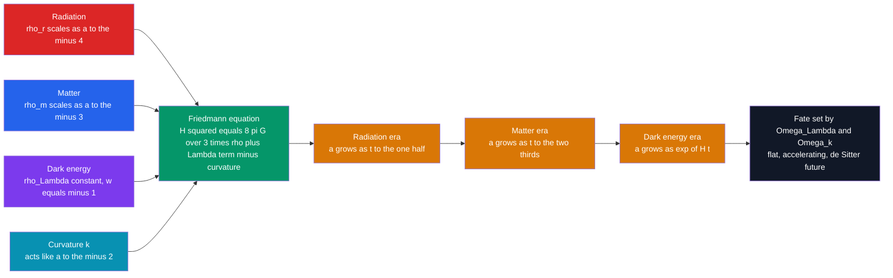

# 📐 The Friedmann Equations and Cosmological Models

> [!abstract] TL;DR
> Assume the universe is the same everywhere and in every direction (the **cosmological principle**: homogeneity + isotropy), and general relativity forces the geometry into the **FLRW metric**, described by a single **scale factor** $a(t)$ and a curvature constant $k$. Plugging FLRW into Einstein's equations yields the **Friedmann equations**, which turn the entire dynamics of the cosmos into one first-order energy balance, $\left(\dot a/a\right)^2 = \tfrac{8\pi G}{3}\rho - \tfrac{kc^2}{a^2} + \tfrac{\Lambda c^2}{3}$, plus an acceleration equation in which **pressure gravitates**. The total energy density measured against the **critical density** $\rho_c = 3H^2/8\pi G$ gives the **density parameters** $\Omega_m,\Omega_r,\Omega_\Lambda,\Omega_k$ (summing to 1), whose values fix both the **geometry** (open / flat / closed) and the **fate** of the universe. Because radiation dilutes as $a^{-4}$, matter as $a^{-3}$, and dark energy stays constant, cosmic history splits into a **radiation era → matter era → dark-energy era**. The **concordance $\Lambda$CDM model** ($\Omega_m \approx 0.31$, $\Omega_\Lambda \approx 0.69$, flat) fits the data and predicts an accelerating future.

## Intuition — analogy FIRST

Throw a ball straight up. Whether it falls back, coasts to a stop at infinity, or sails away forever is decided by a single number: its speed compared with the planet's **escape velocity**. The gravity of everything below fights the outward throw, and the outcome is a tug-of-war between kinetic energy and gravitational pull.

The universe plays the same game on cosmic scale. The Big Bang is the "throw," the combined gravity of all matter and radiation is the "planet pulling back," and the **scale factor** $a(t)$ is the ball's height. The **Friedmann equation is Newton's energy conservation written for the whole cosmos**: expansion kinetic energy on one side, gravitational potential energy on the other, and a curvature constant playing the role of total energy. The twist relativity adds is that **pressure also gravitates** and that empty space can carry a repulsive energy ($\Lambda$) that eventually reverses the throw into runaway flight.

---

## How It Works

Density components set the right-hand side of the Friedmann equation; because each dilutes at a different rate as space grows, whichever is densest at a given epoch dictates how $a(t)$ evolves — and the last one standing, dark energy, decides the fate.



---

## Key Concepts / Details

### Secondary Level

**Same everywhere, same in every direction.** On scales above $\sim 300$ million light-years, the universe looks smooth — no special place, no special direction. This **cosmological principle** is what lets a single number, the scale factor $a(t)$, describe the size of the whole cosmos: distances grow as $a$ grows, and $a_0 = 1$ today.

**A cosmic tug-of-war.** The Friedmann equation says the expansion rate is set by how much stuff the universe contains. Gravity from matter and radiation *slows* the expansion; a mysterious energy of empty space (dark energy, $\Lambda$) *speeds it up*. Whether space keeps expanding forever or eventually recollapses depends on the balance.

**The critical density.** There is a special "Goldilocks" density $\rho_c$ that makes space perfectly **flat** (ordinary Euclidean geometry). More than critical bends space into a closed sphere; less makes it an open saddle. Measurements show our universe sits astonishingly close to critical: it is **flat**.

### Undergraduate Level

**The FLRW metric.** Homogeneity and isotropy uniquely fix the spacetime interval to the Friedmann–Lemaître–Robertson–Walker form (see [[Introduction_to_General_Relativity]]):

$$ds^2 = -c^2\,dt^2 + a(t)^2\!\left[\frac{dr^2}{1 - kr^2} + r^2\,d\Omega^2\right],$$

where $k = +1, 0, -1$ labels closed, flat, and open geometry and $a(t)$ is the scale factor.

**The Friedmann equations.** Feeding FLRW into Einstein's field equations with a perfect fluid ($\rho$, pressure $p$) gives two equations:

$$\left(\frac{\dot a}{a}\right)^2 = H^2 = \frac{8\pi G}{3}\rho - \frac{kc^2}{a^2} + \frac{\Lambda c^2}{3},$$

$$\frac{\ddot a}{a} = -\frac{4\pi G}{3}\!\left(\rho + \frac{3p}{c^2}\right) + \frac{\Lambda c^2}{3}.$$

The first is cosmic energy conservation; the second shows that **positive pressure adds to deceleration** ("pressure gravitates"), while $\Lambda$ drives acceleration.

**Critical density and density parameters.** Setting $k = 0$ in the Friedmann equation (absorbing $\Lambda$ into $\rho$) defines the critical density:

$$\rho_c = \frac{3H^2}{8\pi G} \;\approx\; 8.5\times 10^{-27}\ \mathrm{kg\,m^{-3}} \;\approx\; 5\ \text{H atoms per m}^3.$$

Each component's share is $\Omega_i \equiv \rho_i/\rho_c$, with curvature written as $\Omega_k \equiv -kc^2/(a^2 H^2)$. The Friedmann equation then reads simply

$$\Omega_m + \Omega_r + \Omega_\Lambda + \Omega_k = 1.$$

**Geometry from total $\Omega$.** Because $\Omega_k = 1 - \Omega_{\text{tot}}$, the sum of the *energy* components fixes the *shape* of space:

| $\Omega_{\text{tot}} = \Omega_m+\Omega_r+\Omega_\Lambda$ | $k$ | Geometry | Fate (matter-only) |
|---|---|---|---|
| $> 1$ | $+1$ | Closed (spherical) | Recollapse → Big Crunch |
| $= 1$ | $0$ | Flat (Euclidean) | Expand forever, $\dot a \to 0$ |
| $< 1$ | $-1$ | Open (hyperbolic) | Expand forever, $\dot a \to$ const |

**How each component dilutes.** As space stretches, energy densities fall at rates set by their physics: matter thins as volume grows ($a^{-3}$); radiation thins *and* redshifts ($a^{-4}$); vacuum energy stays constant. This ordering makes cosmic history a relay of dominant components:

| Component | $\Omega$ today | $\rho$ scaling | Dominant when |
|---|---|---|---|
| Radiation ($\gamma$, $\nu$) | $\sim 9\times 10^{-5}$ | $a^{-4}$ | $z \gtrsim 3400$ |
| Matter (dark + baryonic) | $\approx 0.31$ | $a^{-3}$ | $3400 \gtrsim z \gtrsim 0.3$ |
| Dark energy ($\Lambda$) | $\approx 0.69$ | const | $z \lesssim 0.3$ (now) |
| Curvature | $|\Omega_k| < 0.005$ | $a^{-2}$ | (flat: negligible) |

**The concordance model, $\Lambda$CDM.** Writing the Friedmann equation in terms of present-day parameters gives the workhorse expansion history:

$$H^2(a) = H_0^2\!\left[\Omega_{r,0}\,a^{-4} + \Omega_{m,0}\,a^{-3} + \Omega_{k,0}\,a^{-2} + \Omega_{\Lambda,0}\right].$$

With $\Omega_m \approx 0.31$, $\Omega_\Lambda \approx 0.69$, $\Omega_k \approx 0$ (flat) and cold dark matter, this **$\Lambda$CDM concordance model** fits the CMB, supernovae, and large-scale structure simultaneously and gives an age $t_0 \approx 13.8$ Gyr.

### Graduate Level

**Equation of state and the fluid equation.** Each component obeys $p = w\rho c^2$, with $w = 0$ (matter), $w = 1/3$ (radiation), $w = -1$ (cosmological constant), and $w = -1/3$ (curvature). Energy conservation ($\nabla_\mu T^{\mu\nu} = 0$) gives the **fluid equation**

$$\dot\rho + 3\frac{\dot a}{a}\!\left(\rho + \frac{p}{c^2}\right) = 0 \;\;\Longrightarrow\;\; \rho \propto a^{-3(1+w)},$$

reproducing every scaling above. Only two of {Friedmann, acceleration, fluid} are independent.

**Acceleration and the deceleration parameter.** The acceleration equation shows the expansion accelerates ($\ddot a > 0$) only when $\rho + 3p/c^2 < 0$, i.e. $w < -1/3$. The dimensionless **deceleration parameter** is

$$q_0 \equiv -\frac{\ddot a\,a}{\dot a^2} = \Omega_r + \tfrac{1}{2}\Omega_m - \Omega_\Lambda \approx -0.53,$$

negative today because dark energy wins (see [[Dark_Energy_and_the_Accelerating_Universe]]). In $\Lambda$CDM the transition from deceleration to acceleration occurs at $a_{\text{acc}} = (\Omega_m/2\Omega_\Lambda)^{1/3} \approx 0.6$, i.e. redshift $z \approx 0.67$.

**Cosmological distances.** With $E(z) \equiv H(z)/H_0$, the comoving distance and its observational cousins are

$$D_C = c\!\int_0^z \frac{dz'}{H_0\,E(z')},\qquad D_L = (1+z)\,D_C,\qquad D_A = \frac{D_C}{1+z},$$

for a flat universe, linked by the Etherington relation $D_L = (1+z)^2 D_A$. Type Ia supernovae probe $D_L$; the CMB acoustic scale probes $D_A$ — together they pin down $\Omega_m$ and $\Omega_\Lambda$ (see [[Cosmology_and_Expanding_Universe]] and [[Relativistic_Dynamics]] for the relativistic energy–momentum inputs).

---

## Code Demo

```python
# Integrate the scale factor a(t) for three cosmologies and locate the
# deceleration -> acceleration transition in flat LambdaCDM.
import numpy as np
import matplotlib.pyplot as plt
from scipy.integrate import solve_ivp

def E(a, Om, OL):
    """Dimensionless expansion rate H/H0 for matter + curvature + Lambda."""
    Ok = 1.0 - Om - OL                      # flatness constraint closes the sum
    return np.sqrt(Om * a**-3 + Ok * a**-2 + OL)

def rhs(tau, y, Om, OL):
    a = max(y[0], 1e-8)
    return [a * E(a, Om, OL)]               # da/dtau = a * H/H0, tau = H0 * t

tau = np.linspace(0.0, 3.0, 600)           # time in Hubble times (1/H0 ~ 14 Gyr)
models = {"Einstein-de Sitter (Om=1)": (1.0, 0.0),
          "Flat LambdaCDM (0.3,0.7)":  (0.3, 0.7),
          "Open matter (Om=0.3)":      (0.3, 0.0)}

plt.figure(figsize=(7, 5))
for name, (Om, OL) in models.items():
    sol = solve_ivp(rhs, (tau[0], tau[-1]), [1e-3], args=(Om, OL),
                    t_eval=tau, rtol=1e-8)
    a = sol.y[0]
    plt.plot(sol.t, a, lw=2, label=name)
    q = (0.5 * Om * a**-3 - OL) / E(a, Om, OL)**2      # deceleration parameter
    if np.any(q < 0):
        i = int(np.argmax(q < 0))                      # first epoch with q < 0
        plt.scatter([sol.t[i]], [a[i]], zorder=5)
        print(f"{name:26s}: accel onset a={a[i]:.2f}  z={1/a[i]-1:.2f}")
    else:
        print(f"{name:26s}: always decelerating")

print("Analytic LCDM onset a =", (0.3 / (2 * 0.7))**(1/3))  # ~0.60
plt.axhline(1.0, ls=":", c="k", lw=1)      # a = 1 marks 'today'
plt.xlabel("time in Hubble times  H0 * t"); plt.ylabel("scale factor a(t)")
plt.title("Expansion history a(t) for three cosmologies")
plt.legend(); plt.grid(alpha=0.3); plt.tight_layout()
```

The Einstein–de Sitter curve is a pure $t^{2/3}$ deceleration; the open model coasts toward a constant $\dot a$; only flat $\Lambda$CDM turns concave-up, with the printed transition at $a \approx 0.60$ ($z \approx 0.67$) matching the analytic $(\Omega_m/2\Omega_\Lambda)^{1/3}$.

---

## Real-World Notes

- **CMB pins the geometry.** The angular size of acoustic peaks in the [[The_Big_Bang_and_Cosmic_Microwave_Background]] gives $\Omega_k = 0.001 \pm 0.002$ — space is flat to sub-percent precision, a triumph (and consequence) of inflation.
- **Supernovae found the $\Lambda$ term.** The 1998 Type Ia surveys measured $D_L(z)$ and found distant supernovae *fainter* than a decelerating universe predicts, forcing $\Omega_\Lambda > 0$ — the discovery of cosmic acceleration.
- **Matter budget is mostly dark.** Of $\Omega_m \approx 0.31$, only $\Omega_b \approx 0.049$ is baryonic; the rest is [[Dark_Matter]], required for structure to grow during the matter era.
- **Radiation-matter equality shaped structure.** At $z_{\text{eq}} \approx 3400$ ($a_{\text{eq}} = \Omega_r/\Omega_m$) matter overtook radiation; perturbations only grow efficiently afterward, setting the turnover scale in the matter power spectrum.
- **Fate decouples from geometry once $\Lambda \neq 0$.** The old textbook rule "flat = expand forever, closed = recollapse" holds only for matter-only universes. With dark energy a *closed* universe can still expand forever, and our *flat* one accelerates.
- **Age from an integral.** The naive Hubble time $1/H_0 \approx 14$ Gyr differs from the true $t_0 = H_0^{-1}\!\int_0^1 da/(a\,E) \approx 0.96/H_0 \approx 13.8$ Gyr because $H$ was larger in the past.

---

## Common Pitfalls

1. **Confusing geometry with fate.** In $\Lambda$CDM, $\Omega_{\text{tot}}$ sets the *spatial curvature*, but the *destiny* (recollapse vs eternal acceleration) is set by $\Omega_\Lambda$ and the equation of state $w$ — the two questions decoupled once dark energy entered.
2. **Forgetting pressure gravitates.** The acceleration equation contains $\rho + 3p/c^2$, not just $\rho$. Radiation ($w=1/3$) decelerates *more* per unit density than matter; only $w < -1/3$ accelerates.
3. **Using the wrong scaling exponent.** Radiation dilutes as $a^{-4}$ (volume *and* redshift), not $a^{-3}$. Dropping the extra factor of $a$ misplaces radiation–matter equality by orders of magnitude.
4. **Treating $H_0$ as a constant in time.** $H = \dot a/a$ evolves; only its present value is the "Hubble constant." The $\Lambda$ term makes $H \to$ const only in the far future de Sitter phase.
5. **Assuming $\Omega$ is fixed.** The density parameters are functions of $a$: $\Omega_m(a)$ rises toward the past while $\Omega_\Lambda(a)$ falls. Quoted values are today's; a flat universe stays flat, but the *shares* shift.
6. **Misapplying distances.** Luminosity, angular-diameter, comoving, and proper distances all differ at high $z$; using the wrong one (or a small-$z$ approximation) corrupts any fit for $\Omega_m,\Omega_\Lambda$.

---

## Related Concepts

- [[_MOC_Cosmology|↑ Section MOC]]
- [[The_Expanding_Universe_and_Hubbles_Law]] — Hubble's law $v = H_0 d$ is the Friedmann equation sampled at $t_0$; $H = \dot a/a$
- [[The_Big_Bang_and_Cosmic_Microwave_Background]] — running $a(t) \to 0$ gives the hot dense origin; the CMB fixes $\Omega_k$ and $\Omega_b$
- [[Big_Bang_Nucleosynthesis]] — the radiation era ($a^{-4}$) whose expansion rate sets the light-element yields
- [[Dark_Energy_and_the_Accelerating_Universe]] — the $\Lambda$ term, $w \approx -1$, and the deceleration-to-acceleration transition
- [[Cosmic_Inflation_and_the_Early_Universe]] — an early $\Lambda$-like phase driving $\Omega_k \to 0$, explaining today's flatness
- [[Large_Scale_Structure_and_Structure_Formation]] — perturbations growing on the FLRW background during the matter era
- [[Dark_Matter]] — the dominant contributor to $\Omega_m$ that lets structure form
- [[Introduction_to_General_Relativity]] — Einstein's equations from which the Friedmann equations descend
- [[Cosmology_and_Expanding_Universe]] — Physics-vault treatment of FLRW dynamics and cosmic distances
- [[Relativistic_Dynamics]] — the stress–energy tensor and $p = w\rho c^2$ feeding the source terms
- [[_MOC_Mathematics_Master]] — the ODE integration and calculus behind $a(t)$ and the age integral

---

## Review Questions

1. **Secondary:** In words, what does the critical density $\rho_c$ represent, and what does it mean that our universe is measured to be "flat"? What are the two competing effects that decide whether the universe expands forever?
2. **Undergraduate:** Starting from the Friedmann equation with $k=0$, derive $\rho_c = 3H^2/8\pi G$. Then, given $\Omega_m = 0.31$, $\Omega_\Lambda = 0.69$, $\Omega_r = 9\times10^{-5}$, compute $\Omega_k$ and state the geometry. At what scale factor did matter–radiation equality occur?
3. **Graduate:** Using the acceleration equation and $\rho \propto a^{-3(1+w)}$, show that a flat matter+$\Lambda$ universe transitions from deceleration to acceleration at $a_{\text{acc}} = (\Omega_m/2\Omega_\Lambda)^{1/3}$. Evaluate the corresponding redshift for concordance values, and explain why $q_0 < 0$ despite matter still contributing $31\%$ of the energy budget.

---

## Sources

- Friedmann, A. (1922) — "Über die Krümmung des Raumes," *Zeitschrift für Physik* 10, 377
- Lemaître, G. (1927) — "Un univers homogène de masse constante et de rayon croissant," *Ann. Soc. Sci. Bruxelles* A47, 49
- Ryden, B. — *Introduction to Cosmology*, 2nd ed., Ch. 4–6
- Dodelson & Schmidt — *Modern Cosmology*, 2nd ed., Ch. 2–3
- Planck Collaboration (2020) — *Planck 2018 results. VI. Cosmological parameters*, *A&A* 641, A6
- Riess et al. (1998) / Perlmutter et al. (1999) — discovery of cosmic acceleration, *AJ* 116, 1009 / *ApJ* 517, 565

#astronomy #cosmology #friedmann-equations #flrw-metric #critical-density #density-parameters #lambdacdm #dark-energy #undergraduate #graduate
