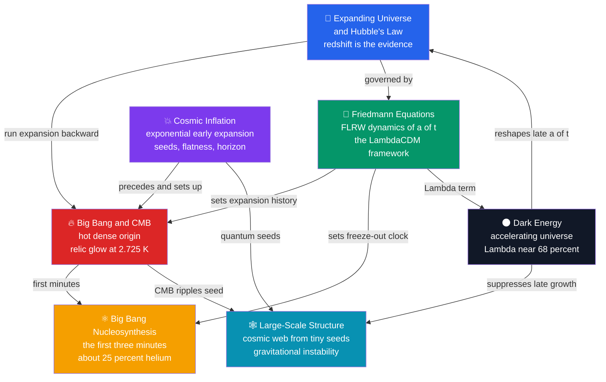

# 🌠 Cosmology — Map of Content

> [!abstract] What This Section Covers
> Cosmology is the physics of the universe as a whole — its origin, contents, geometry, and fate. This section starts from the observational bedrock that space is **expanding** ([[The_Expanding_Universe_and_Hubbles_Law|Hubble's law]]), runs that expansion backward to a hot dense beginning that left the **cosmic microwave background** and forged the **light elements** in its first three minutes, then builds the general-relativistic engine — the **Friedmann equations** and the ΛCDM concordance model — that governs the whole history $a(t)$. From that framework flow the three great modern themes: **dark energy** driving today's acceleration, **cosmic inflation** setting the initial conditions, and the growth of tiny quantum seeds into the **cosmic web** of galaxies. Each note opens with an everyday analogy and deepens to graduate-level formalism.

## Concept Map

*(Blue = the observational entry point; the Friedmann framework in green ties everything together; arrows read as "leads to" or "sets up".)*

## Learning Path

*Recommended order for a first pass through this section:*

1. [[The_Expanding_Universe_and_Hubbles_Law]] — the observational starting point: redshift, Hubble's law $v = H_0 d$, the scale factor, and cosmic expansion.
2. [[The_Big_Bang_and_Cosmic_Microwave_Background]] — run the expansion backward to a hot dense origin, recombination, and the relic CMB at 2.725 K.
3. [[Big_Bang_Nucleosynthesis]] — the first three minutes: neutron freeze-out and the primordial helium and deuterium abundances.
4. [[The_Friedmann_Equations_and_Cosmological_Models]] — the GR framework: FLRW metric, critical density, the $\Omega$ parameters, and ΛCDM.
5. [[Dark_Energy_and_the_Accelerating_Universe]] — Type Ia supernovae, the cosmological constant, negative pressure, and cosmic acceleration.
6. [[Cosmic_Inflation_and_the_Early_Universe]] — exponential early expansion that solves the horizon and flatness problems and seeds all structure.
7. [[Large_Scale_Structure_and_Structure_Formation]] — gravitational instability grows the quantum seeds into the cosmic web of voids and filaments.

## All Notes at a Glance

| Note | Difficulty | What You'll Learn |
|------|------------|-------------------|
| [[The_Expanding_Universe_and_Hubbles_Law]] | Secondary → Graduate | Cosmological redshift, $v = H_0 d$, the scale factor $a(t)$, comoving vs proper distance, superluminal recession, and the Hubble tension |
| [[The_Big_Bang_and_Cosmic_Microwave_Background]] | Secondary → Graduate | The hot Big Bang, recombination and last scattering, the 2.725 K blackbody CMB, acoustic peaks, and the ΛCDM parameters |
| [[Big_Bang_Nucleosynthesis]] | Secondary → Graduate | Neutron-to-proton freeze-out, the deuterium bottleneck, the ~25% primordial helium yield, and deuterium as the cosmic baryometer |
| [[The_Friedmann_Equations_and_Cosmological_Models]] | Undergraduate → Graduate | The FLRW metric, the Friedmann and acceleration equations, critical density, $\Omega$ parameters, geometry vs fate, and the ΛCDM model |
| [[Dark_Energy_and_the_Accelerating_Universe]] | Secondary → Graduate | Type Ia standard candles, the 1998 discovery, negative pressure and $w < -1/3$, $\Lambda$, and the cosmological-constant problem |
| [[Cosmic_Inflation_and_the_Early_Universe]] | Undergraduate → Graduate | The horizon, flatness, and monopole problems, the inflaton and slow roll, quantum seeds, $n_s$, and primordial B-modes |
| [[Large_Scale_Structure_and_Structure_Formation]] | Undergraduate → Graduate | Gravitational instability, $\delta \propto a$, the essential role of dark matter, the cosmic web, and the power spectrum and BAO |

## Key Questions This Section Answers

- How do we know the universe is expanding, and what does the redshift of distant galaxies actually measure?
- If we run the expansion backward, what did the universe look like — and why is the sky filled with a faint 2.725 K microwave glow?
- Where did the hydrogen and helium come from, and why is about a quarter of ordinary matter helium everywhere we look?
- What single equation governs the size of the whole cosmos, and how do matter, radiation, and dark energy each shape its expansion?
- Why is the expansion *accelerating*, and what is the dark energy driving it?
- How did a nearly perfectly smooth early universe grow the cosmic web of galaxies, and why is dark matter essential to the story?

## Related Sections

- [[_MOC_Astronomy_Master|↑ Astronomy Master MOC]]
- [[_MOC_Galaxies_ISM|→ Galaxies & the ISM]] — [[Dark_Matter]] and [[Galaxy_Formation_and_Evolution]] are the building blocks that fill the cosmic web
- [[_MOC_High_Energy_Astrophysics|→ High-Energy & Relativistic Astrophysics]] — [[Gravitational_Waves]] and black holes probe the relativistic gravity underlying cosmology
- [[_MOC_Observational_Astronomy|→ Observational Astronomy]] — [[The_Cosmic_Distance_Ladder]] calibrates $H_0$ and the supernova distances behind dark energy

#MOC #Astronomy #Cosmology
