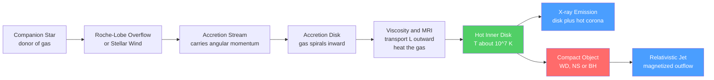

# 💫 Accretion Disks and X-ray Binaries

> [!abstract] TL;DR
> **Accretion** is the most efficient steady power source in the universe: matter falling into a deep gravitational well releases its **gravitational potential energy** as radiation. Because angular momentum forbids a straight plunge, the gas spirals in through an **accretion disk**, where **viscosity** carries angular momentum outward, heats the gas, and lets it inspiral. For a compact object the released energy is a large fraction of $mc^2$ — roughly **10% for black holes**, up to **~20–40% for neutron stars**, dwarfing nuclear fusion's **0.7%**. The **Shakura–Sunyaev thin disk** has a temperature profile $T(r)\propto r^{-3/4}$, so its inner edge around a stellar-mass compact object glows in **X-rays**. When the accretor orbits a companion star that supplies the fuel, the system is an **X-ray binary** — the setting for the discovery of stellar black holes (Cygnus X-1), for cataclysmic variables and novae, and, scaled up a billionfold, for [[Active_Galactic_Nuclei_and_Quasars]].

## Intuition — analogy FIRST

Picture water swirling down a bathtub drain. It does not fall straight in — it spins, forming a whirlpool, and the closer it gets the faster it turns. To actually go down the drain, each parcel must *shed its spin* to the water around it, rubbing against its neighbours. That friction is where the energy goes.

Now replace the drain with a **compact object** — a white dwarf, neutron star, or black hole — whose gravity is monstrously deep. Gas cannot fall straight in because it carries **angular momentum**, so it settles into a flat, spinning **accretion disk**. Internal friction (viscosity) lets each ring hand its angular momentum to the ring outside, sink a little deeper, and convert lost gravitational potential energy into heat — which the gas then radiates away. Fall deep enough, into the well of a neutron star or black hole, and the released energy is so large that the inner disk glows white-hot at millions of kelvin, pouring out **X-rays**.

---

## How It Works



---

## Key Concepts / Details

### Secondary Level

**Accretion** means gravity pulling gas onto a dense object and turning the fall into light. The deeper the object's gravity well, the more energy each kilogram releases before it lands. Ordinary stars have shallow wells; **compact objects** have extraordinarily deep ones, so accretion onto them is spectacularly luminous.

An **X-ray binary** is a pair of stars in orbit where one is a compact object — a **white dwarf, neutron star, or black hole** — pulling gas off its ordinary companion. The stolen gas cannot drop straight down; it swirls into a disk, and friction heats the innermost parts to millions of degrees. So hot a gas glows in **X-rays**, which is why these systems were first found by X-ray telescopes in the 1960s.

One such source, **Cygnus X-1**, was the first object astronomers agreed must contain a **black hole**: the unseen accretor is far too heavy to be anything else. Accretion is nature's most efficient way to make energy — more efficient, per kilogram, than the fusion that powers stars.

### Undergraduate Level

**Why matter radiates as it falls.** A mass $m$ dropped from far away to radius $R$ around mass $M$ releases gravitational potential energy $\Delta E = GMm/R$ (see [[Work_Energy_and_Conservation]]). Angular momentum prevents a radial plunge, so the gas orbits in a **disk**. Neighbouring rings shear against each other; **viscosity** exerts a torque that transports angular momentum *outward* while friction dissipates orbital energy as heat, which is then radiated (a direct application of the [[Laws_of_Thermodynamics|first and second laws of thermodynamics]]).

**Accretion luminosity and efficiency.** For a steady accretion rate $\dot{M}$ onto a body of radius $R$,

$$L = \frac{GM\dot{M}}{R} = \eta\,\dot{M}c^2, \qquad \eta \equiv \frac{GM}{Rc^2}$$

The **efficiency** $\eta$ is just the compactness $GM/Rc^2$. Contrast the accretors:

| Accretor | $M$ | $R$ | $\eta = GM/Rc^2$ | Fuel comparison |
|----------|-----|-----|------------------|-----------------|
| White dwarf | $0.6\,M_\odot$ | $\sim 8000$ km | $\sim 10^{-4}$ (0.01%) | *less* than fusion |
| Neutron star | $1.4\,M_\odot$ | $\sim 10$ km | $\sim 0.2$ (20%) | far beyond fusion |
| Black hole | any | ISCO $= 6GM/c^2$ | $\approx 0.06$–$0.42$ | far beyond fusion |
| (Hydrogen fusion) | — | — | $0.007$ (0.7%) | reference |

For a **black hole** the "surface" is the innermost stable circular orbit (ISCO); a thin disk radiates $\eta\approx 0.057$ (Schwarzschild) up to $0.42$ (maximal spin), canonically $\sim 0.1$. A **neutron star** has a *hard surface*, so besides the disk's binding energy it also radiates the leftover orbital kinetic energy in a **boundary layer** on impact — pushing the effective efficiency toward tens of percent. A **white dwarf** is so much larger that accretion alone is *less* efficient than fusion — which is exactly why accreted hydrogen on its surface eventually ignites (novae).

**The thin-disk temperature profile.** Balancing local viscous dissipation against blackbody radiation, the Shakura–Sunyaev disk has effective temperature

$$T(r) = \left[\frac{3GM\dot{M}}{8\pi\sigma r^{3}}\left(1-\sqrt{\frac{R_{\rm in}}{r}}\right)\right]^{1/4} \;\xrightarrow{\,r\gg R_{\rm in}\,}\; T\propto r^{-3/4}$$

The disk is a **multicolour blackbody**: cool ($\sim 10^{4}$ K) far out, peaking near $r\approx 1.36\,R_{\rm in}$. For a compact accretor $R_{\rm in}$ is tiny, so the inner disk reaches $\sim 10^{7}$ K and peaks in the **X-ray band** ($kT\sim 1$ keV). For a white dwarf $R_{\rm in}$ is large, so the disk peaks only in the UV/optical.

**The Eddington luminosity.** Outward radiation pressure on electrons (Thomson scattering) opposes gravity on the coupled protons. Their balance caps the steady luminosity:

$$L_{\rm Edd} = \frac{4\pi GM m_p c}{\sigma_T} \approx 1.26\times10^{31}\left(\frac{M}{M_\odot}\right)\ \text{W}$$

Above $L_{\rm Edd}$ radiation drives the fuel away, throttling accretion. It sets the natural brightness ceiling of every accreting source, from neutron stars to [[Active_Galactic_Nuclei_and_Quasars|quasars]].

**X-ray binary flavours.**

| Type | Companion | Mass transfer | Behaviour |
|------|-----------|---------------|-----------|
| **LMXB** (low-mass) | old star $\lesssim 1\,M_\odot$ | **Roche-lobe overflow** | often transient; old populations |
| **HMXB** (high-mass) | young O/B star $\gtrsim 10\,M_\odot$ | **stellar wind** or Be disk | often persistent; young regions |

**Roche-lobe overflow** occurs when the donor swells to fill its tidal "teardrop" so gas spills through the inner Lagrange point into the accretor's well. **Wind accretion** captures a fraction of a massive star's outflow. **Cygnus X-1** (an HMXB) provided the first dynamical black-hole detection: the mass function from the O-star's orbit forces the unseen accretor above $\sim 15\,M_\odot$, beyond any neutron star.

**White-dwarf accretors** are **cataclysmic variables (CVs)**. Accreted hydrogen builds on the surface until it undergoes a thermonuclear runaway — a **nova**. If a white dwarf accretes toward the **Chandrasekhar mass** ($\sim 1.4\,M_\odot$), it can detonate as a **Type Ia supernova** (see [[Supernovae_and_Gamma_Ray_Bursts]]).

### Graduate Level

**The α-viscosity prescription.** Molecular viscosity in disk plasma is absurdly small — it would take longer than the age of the universe to drain a disk. Shakura & Sunyaev (1973) parametrized the *turbulent* stress as

$$\nu = \alpha\, c_s H, \qquad \alpha \lesssim 1$$

with $c_s$ the sound speed and $H$ the disk scale height. This **α-disk** collapses the unknown microphysics into one dimensionless number ($\alpha\sim 0.01$–$0.1$ observationally) and yields the standard thin-disk solution.

**The magnetorotational instability (MRI).** For decades $\alpha$ lacked a physical origin. Balbus & Hawley (1991) showed that a *weak* magnetic field threading a differentially rotating disk is violently unstable: field lines act like springs linking inner (fast) and outer (slow) fluid elements, transferring angular momentum and driving **magnetohydrodynamic turbulence**. The MRI is now accepted as the engine of disk viscosity, self-consistently producing effective $\alpha\sim 0.01$–$0.1$ in simulations (see [[Electromagnetic_Waves_and_Radiation]] for the underlying MHD).

**Accretion states and spectral transitions.** Black-hole X-ray binaries cycle through distinct states as $\dot{M}$ varies:

- **Low/hard state** — a power-law X-ray spectrum from a hot, geometrically thick, radiatively *inefficient* flow (ADAF/RIAF); a steady compact **radio jet** is present.
- **High/soft state** — a thermal, blackbody-like spectrum from a cool, optically thick Shakura–Sunyaev disk down to the ISCO; the jet is quenched.
- **Transitions** trace **hysteresis** in the hardness–intensity diagram ("q-track"), often ejecting discrete relativistic blobs. **Quasi-periodic oscillations (QPOs)** probe the innermost orbits and black-hole spin.

**Super-Eddington and radiatively inefficient regimes.** At very high $\dot{M}$ the disk puffs into a **slim disk** with photon trapping (relevant to ultraluminous X-ray sources); at very low $\dot{M}$ it becomes an **ADAF** that advects heat inward rather than radiating it. The identical physics, scaled up in mass by $10^{6}$–$10^{9}$, powers [[Active_Galactic_Nuclei_and_Quasars]]; **microquasars** are their stellar-mass cousins, and **tidal disruption events** (a star shredded and accreted by a dormant black hole) are transient, one-off accretion flares.

```python
import numpy as np
import matplotlib.pyplot as plt

# --- Physical constants (SI) ---
G     = 6.674e-11     # m^3 kg^-1 s^-2
c     = 2.998e8       # m/s
sigma = 5.670e-8      # W m^-2 K^-4  (Stefan-Boltzmann)
k_B   = 1.381e-23     # J/K
M_sun = 1.989e30      # kg
L_sun = 3.828e26      # W
year  = 3.156e7       # s

def accretion(M_solar, R, Mdot):
    """Accretion luminosity L = G M Mdot / R and efficiency eta = G M / (R c^2)."""
    M   = M_solar * M_sun
    L   = G * M * Mdot / R
    eta = G * M / (R * c**2)
    return L, eta

# Accretion rate typical of a bright X-ray binary (~1e-9 Msun/yr)
Mdot = 1e-9 * M_sun / year          # kg/s

print(f"{'Accretor':13s} {'eta':>10s} {'L [W]':>12s} {'L [Lsun]':>12s}")
for name, M_solar, R in [("Neutron star", 1.4, 1.0e4),    # R = 10 km
                         ("White dwarf",  0.6, 8.0e6)]:    # R = 8000 km
    L, eta = accretion(M_solar, R, Mdot)
    print(f"{name:13s} {eta:10.4%} {L:12.3e} {L/L_sun:12.3e}")
print("Hydrogen fusion efficiency for reference: 0.700%")

# --- Shakura-Sunyaev thin-disk temperature profile,  T(r) ~ r^-3/4 ---
def disk_T(r, M_solar, Mdot, R_in):
    M = M_solar * M_sun
    return (3 * G * M * Mdot / (8 * np.pi * sigma * r**3)
            * (1.0 - np.sqrt(R_in / r))) ** 0.25

plt.figure(figsize=(7, 5))
# R_in: ISCO (6GM/c^2) for the black hole; surface radius for NS and WD
cases = [("Black hole 10 Msun", 10.0, 8.9e4, "k"),
         ("Neutron star",        1.4, 1.0e4, "r"),
         ("White dwarf",         0.6, 8.0e6, "b")]
for name, M_solar, R_in, colour in cases:
    r = np.logspace(np.log10(1.01 * R_in), np.log10(1e4 * R_in), 400)
    T = disk_T(r, M_solar, Mdot, R_in)
    plt.loglog(r / R_in, T, colour, label=f"{name}: Tmax = {T.max():.1e} K")

plt.axhline(1.16e7, ls="--", color="gray", label="kT = 1 keV  (X-ray)")
plt.xlabel("radius   r / R_in")
plt.ylabel("effective temperature   T (K)")
plt.title("Thin-disk temperature profile   T(r) ~ r^-3/4")
plt.legend()
plt.grid(True, which="both", alpha=0.3)
plt.tight_layout()
# Result: NS and BH inner disks peak at ~1e6-1e7 K (X-rays);
# the far larger white dwarf peaks only at ~1e4-1e5 K (UV/optical).
```

---

## Real-World Notes

- **Scorpius X-1** — the first cosmic X-ray source discovered (1962, Giacconi et al., a Nobel-winning detection). It is an LMXB in which a neutron star accretes from a low-mass companion; its brightness announced that the X-ray sky is dominated by accretion.
- **Cygnus X-1** — the archetypal black-hole HMXB. Its rapid X-ray variability and a dynamical mass of $\sim 21\,M_\odot$ established the first stellar black hole and settled a famous Hawking–Thorne wager.
- **GRS 1915+105** — a **microquasar** that launched jet blobs showing apparent *superluminal* motion, proving stellar-mass black holes drive relativistic jets by the same mechanism as [[Active_Galactic_Nuclei_and_Quasars|quasars]].
- **Cataclysmic variables and novae** — accreting white dwarfs whose surface hydrogen periodically detonates; near the Chandrasekhar limit they are a leading channel for **Type Ia supernovae**, the standardizable candles behind the discovery of cosmic acceleration.
- **Tidal disruption events (TDEs)** — a wandering star torn apart by a dormant supermassive black hole forms a transient accretion disk, flaring for months in UV/X-rays and directly demonstrating accretion "turning on."
- **Eddington-limited transients** — Type I X-ray bursts on neutron-star surfaces reach the Eddington luminosity, providing a standard-candle distance estimator and a probe of the neutron-star radius (see [[Pulsars_Neutron_Stars_and_Magnetars]]).

---

## Common Pitfalls

1. **Thinking the black hole itself radiates.** The light comes from the *disk, boundary layer, corona, and jet* outside the horizon — not the black hole. The horizon is dark; the infalling fuel is what shines.
2. **Ignoring angular momentum.** Gas cannot fall radially inward; it *must* form a disk and *must* export angular momentum outward to accrete. Without a transport mechanism (viscosity/MRI), accretion essentially stalls.
3. **Confusing $L = GM\dot M/R$ with $L = GM\dot M/2R$.** A thin disk radiates only *half* the potential energy; the other half is orbital kinetic energy at the inner edge — swallowed by a black hole but re-radiated in a neutron star's surface boundary layer. Be explicit about which you mean.
4. **Treating the Eddington limit as an absolute ceiling.** $L_{\rm Edd}$ assumes spherical, ionized, Thomson-dominated flow. Disks with anisotropic radiation and photon trapping can be genuinely **super-Eddington** (slim disks, ultraluminous X-ray sources).
5. **Assuming molecular viscosity drives the disk.** It is orders of magnitude too weak. The real angular-momentum transport is **MRI-driven MHD turbulence**, parametrized phenomenologically by $\alpha$.
6. **Mixing up LMXB and HMXB fuelling.** Low-mass systems accrete by **Roche-lobe overflow**; high-mass systems mostly by **wind capture**. The distinction sets their disks, duty cycles, and stellar populations.

---

## Related Concepts

- [[_MOC_High_Energy_Astrophysics|↑ Section MOC]]
- [[Black_Hole_Physics]] — the ISCO and spin fix the accretion efficiency and jet-launching physics
- [[Pulsars_Neutron_Stars_and_Magnetars]] — accreting neutron stars power X-ray pulsars and bursters
- [[Supernovae_and_Gamma_Ray_Bursts]] — accreting white dwarfs feed Type Ia SNe; hyper-accreting disks power long GRBs
- [[Gravitational_Waves]] — compact binaries that also accrete are gravitational-wave progenitors
- [[Cosmic_Rays_and_Neutrino_Astrophysics]] — accretion-driven jets are candidate cosmic-ray and neutrino accelerators
- [[Active_Galactic_Nuclei_and_Quasars]] — identical accretion physics scaled up to supermassive black holes
- [[Stellar_Remnants_White_Dwarfs_Neutron_Stars_Black_Holes]] — the compact objects that serve as accretors
- Physics: [[Work_Energy_and_Conservation]] — gravitational potential energy is the fuel accretion converts to light
- Physics: [[Laws_of_Thermodynamics]] — viscous dissipation and radiative cooling obey the thermodynamic laws
- Physics: [[Electromagnetic_Waves_and_Radiation]] — blackbody, synchrotron, and inverse-Compton emission shape the spectra
- Math: [[_MOC_Mathematics_Master]] — the diffusion equation for surface density and power-law spectral fitting

---

## Review Questions

1. **Secondary**: Why does gas falling toward a neutron star form a flat spinning disk instead of dropping straight in, and why does the inner disk glow in X-rays while a disk around a much larger white dwarf does not?
2. **Undergraduate**: A neutron star ($M = 1.4\,M_\odot$, $R = 10$ km) accretes at $\dot{M} = 10^{-9}\,M_\odot/\text{yr}$. (a) Compute its accretion luminosity and efficiency $\eta$. (b) Compare $\eta$ to hydrogen fusion (0.7%) and to a white dwarf accretor. (c) What is the Eddington luminosity, and is this system below it?
3. **Graduate**: Explain why molecular viscosity cannot drive observed accretion rates and how the magnetorotational instability resolves this. How do the low/hard and high/soft states of a black-hole X-ray binary differ in their accretion geometry, spectrum, and jet activity?

---

## Sources

- Frank, King & Raine — *Accretion Power in Astrophysics*, 3rd ed. (2002)
- Shakura & Sunyaev (1973) — "Black Holes in Binary Systems," *A&A* 24, 337 (the α-disk)
- Balbus & Hawley (1991) — "A Powerful Local Shear Instability in Weakly Magnetized Disks," *ApJ* 376, 214 (the MRI)
- Remillard & McClintock (2006) — "X-ray Properties of Black-Hole Binaries," *ARA&A* 44, 49 (accretion states)
- Longair — *High Energy Astrophysics*, 3rd ed. (2011), Ch. 14

#astronomy #astrophysics #accretion #xraybinaries #compactobjects #blackholes #neutronstars #eddington #secondary #undergraduate #graduate
