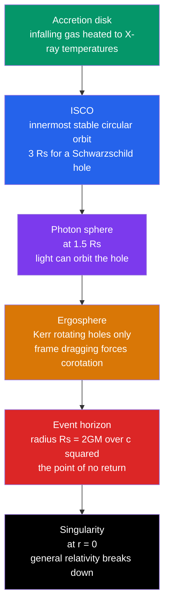

# 🕳️ Black Hole Physics

> [!abstract] TL;DR
> A **black hole** is a region of spacetime where gravity is so intense that nothing — not even light — can escape once it crosses the **event horizon**. For a non-rotating hole that boundary sits at the **Schwarzschild radius** $R_s = \dfrac{2GM}{c^2}$ (about **3 km per solar mass**), the radius at which the escape velocity reaches $c$. Black holes come in mass classes — **stellar** ($\sim 3$–$100\,M_\odot$), **intermediate**, and **supermassive** ($10^6$–$10^{10}\,M_\odot$) — and the **no-hair theorem** says each is fully described by just three numbers: **mass, spin, and charge**. Rotating (**Kerr**) holes drag spacetime around them, creating an **ergosphere** from which energy can be extracted. Remarkably, black holes are also thermodynamic objects: they carry entropy proportional to horizon **area** and radiate at a temperature $T \propto 1/M$ (**Hawking radiation**), setting up the still-unsolved **information paradox**.

## Intuition — analogy FIRST

Imagine a wide river flowing toward a waterfall. Far upstream a fish can swim against the current and hold its position. But as the water speeds up near the edge, there is a line past which the current flows faster than any fish can swim — cross it and you are going over, no matter how hard you paddle. Light is the fastest "swimmer" in the universe, so the line where even light cannot swim upstream is the ultimate line of no return: the **event horizon**.

Crucially, the horizon is not a wall you smash into. Locally, nothing special happens as you drift across it — you simply lose the ability to send anything back out. Inside, every possible future direction points inward, toward the central **singularity**, the way "downstream" is the only direction once you are over the falls.

---

## How It Works

A black hole is not "stuff" packed into a small space — it is a **feature of spacetime geometry**. Solving Einstein's field equations for a point (or collapsed) mass gives a horizon at $R_s$ and, for spinning holes, a richer layered structure. The diagram below shows the anatomy from the outside in.



### Secondary Level

**Escape velocity meets the speed of light.** The Newtonian escape velocity from radius $r$ of a mass $M$ is $v_{esc} = \sqrt{2GM/r}$. Set $v_{esc} = c$ and solve for $r$:

$$R_s = \frac{2GM}{c^2}$$

This is the **Schwarzschild radius** — the size of the event horizon. (This Newtonian shortcut happens to give exactly the correct general-relativistic answer.) It scales linearly with mass: about **2.95 km per solar mass**. Compress the Sun to a 3 km ball, or the Earth to the size of a marble, and it becomes a black hole.

Black holes are classified by mass:

| Type | Mass range | Origin | Example |
|------|-----------|--------|---------|
| **Stellar** | $\sim 3$–$100\,M_\odot$ | core collapse of a massive star | Cygnus X-1 ($\sim 21\,M_\odot$) |
| **Intermediate** | $10^2$–$10^5\,M_\odot$ | uncertain; mergers, dense clusters | few confirmed candidates |
| **Supermassive** | $10^6$–$10^{10}\,M_\odot$ | grow at galaxy centres | Sgr A*, M87* |
| **Primordial** | any (hypothetical) | density fluctuations in the early universe | not yet detected |

### Undergraduate Level

**The Schwarzschild metric** describes spacetime outside a non-rotating, uncharged mass:

$$ds^2 = -\left(1 - \frac{R_s}{r}\right)c^2\,dt^2 + \left(1 - \frac{R_s}{r}\right)^{-1}dr^2 + r^2\,d\Omega^2$$

The coefficient $(1 - R_s/r)$ vanishes at $r = R_s$ (the horizon, a coordinate not a physical singularity) and the geometry is singular at $r = 0$.

**Gravitational time dilation and redshift.** A clock at rest at radius $r$ ticks slower than a distant clock by the factor

$$\frac{d\tau}{dt} = \sqrt{1 - \frac{R_s}{r}}$$

As $r \to R_s$ this factor $\to 0$: a distant observer sees infalling clocks freeze and their light redshift toward infinity, $1 + z = (1 - R_s/r)^{-1/2}$. The infalling observer, however, crosses in **finite proper time** and notices nothing locally.

**Light bending and the photon sphere.** Strong curvature bends light so severely that at $r = 1.5\,R_s$ photons can orbit the hole on unstable circular paths — the **photon sphere**. It defines the apparent "shadow" imaged by radio telescopes.

**Orbits and the ISCO.** Around a Schwarzschild hole, no stable circular orbit exists inside the **innermost stable circular orbit** at $r_{ISCO} = 3R_s = 6GM/c^2$; matter spiralling inward crosses it and plunges. The ISCO sets the inner edge of accretion disks and thus the efficiency of energy release.

**Tidal "spaghettification."** Tidal stretching scales as $\sim GM\,\Delta r / r^3$. Near a small (stellar) hole this shreds an infalling body *before* it reaches the horizon; near a supermassive hole the horizon tides are gentle enough to cross intact.

**The no-hair theorem.** However a hole forms, it settles into a state described by only **mass $M$, angular momentum $J$ (spin), and electric charge $Q$**. All other detail (the "hair") is radiated away. Astrophysical holes have negligible charge, so in practice just $M$ and $J$ matter.

**Rotating (Kerr) black holes.** Real holes spin. The rotating solution has an **ergosphere** outside the horizon where **frame dragging** forces *everything* to co-rotate — you cannot stand still even in principle. A prograde spin shrinks the ISCO, pushing it toward the horizon and raising accretion efficiency.

### Graduate Level

**The Kerr metric** (Boyer–Lindquist coordinates, geometric units $G = c = 1$, spin parameter $a = J/M$) has an event horizon and an ergosphere at distinct radii:

$$r_+ = M + \sqrt{M^2 - a^2}, \qquad r_{\text{ergo}}(\theta) = M + \sqrt{M^2 - a^2\cos^2\theta}$$

The horizon $r_+$ exists only for $a \le M$; an **extremal** hole has $a = M$. The region $r_+ < r < r_{\text{ergo}}$ is the **ergosphere**.

**The Penrose process.** Inside the ergosphere a particle can have *negative* energy relative to infinity. Splitting a body so that the negative-energy fragment falls in lets the other escape with **more** energy than entered — extracting rotational energy from the hole. The extractable fraction is bounded by the **irreducible mass** $M_{irr}$, with $M^2 = M_{irr}^2 + J^2/(4M_{irr}^2)$; up to $\sim 29\%$ of a maximally spinning hole's mass-energy can be mined.

**Black-hole thermodynamics.** Bardeen, Carter, and Hawking (1973) proved four laws mirroring ordinary thermodynamics, with surface gravity $\kappa$ playing the role of temperature and horizon area $A$ that of entropy:

| BH mechanics | Thermodynamics |
|--------------|----------------|
| $\kappa$ constant over a stationary horizon | Zeroth law: $T$ uniform at equilibrium |
| $dM = \frac{\kappa}{8\pi}\,dA + \Omega_H\,dJ + \Phi_H\,dQ$ | First law: $dE = T\,dS + \ldots$ |
| $dA \ge 0$ (Hawking area theorem) | Second law: $dS \ge 0$ |
| cannot reach $\kappa = 0$ in finite steps | Third law: $T = 0$ unattainable |

Hawking (1974) showed this is not mere analogy. Quantum effects at the horizon produce **Hawking radiation** with a true temperature

$$T_H = \frac{\hbar c^3}{8\pi G M k_B} \approx 6.2\times10^{-8}\ \mathrm{K}\left(\frac{M_\odot}{M}\right)$$

and a genuine **Bekenstein–Hawking entropy** proportional to horizon area:

$$S_{BH} = \frac{k_B c^3}{\hbar G}\frac{A}{4} = \frac{k_B\,A}{4\,\ell_P^2}$$

Because $T_H \propto 1/M$, smaller holes are hotter. A hole slowly **evaporates**, its lifetime $\sim 10^{67}\,(M/M_\odot)^3$ years — far longer than the age of the universe for any stellar hole. The **information paradox** asks whether the seemingly thermal radiation truly erases the information of what fell in, apparently violating quantum unitarity — a central open problem linking gravity and quantum mechanics.

```python
import numpy as np
import matplotlib.pyplot as plt

# --- Physical constants (SI) ---
G    = 6.674e-11      # gravitational constant [m^3 kg^-1 s^-2]
c    = 2.998e8        # speed of light [m/s]
Msun = 1.989e30       # solar mass [kg]

def schwarzschild_radius(M):
    """Event-horizon radius R_s = 2GM/c^2 in metres."""
    return 2 * G * M / c**2

# 1) R_s across the black-hole mass spectrum (stellar -> supermassive)
masses = {
    "Stellar      (10 Msun)":   1e1   * Msun,
    "Intermediate (1e3 Msun)":  1e3   * Msun,
    "Sgr A*       (4.3e6 Msun)":4.3e6 * Msun,
    "M87*         (6.5e9 Msun)":6.5e9 * Msun,
}
print("Black hole                    R_s")
for name, M in masses.items():
    print(f"{name:28s} {schwarzschild_radius(M)/1e3:11.3e} km")

# 2) Gravitational time dilation d(tau)/dt = sqrt(1 - R_s/r) near a 10 Msun hole
M  = 10 * Msun
Rs = schwarzschild_radius(M)
r  = np.linspace(1.001 * Rs, 10 * Rs, 500)   # just outside the horizon, outward
dilation = np.sqrt(1 - Rs / r)               # clock rate vs a distant observer

plt.figure(figsize=(7, 5))
plt.plot(r / Rs, dilation, lw=2)
plt.axvline(1.0, ls="--", color="k", label="Event horizon (r = R_s)")
plt.xlabel("Distance from centre   r / R_s")
plt.ylabel(r"Clock rate   $d\tau/dt = \sqrt{1 - R_s/r}$")
plt.title("Gravitational time dilation near a 10 solar-mass black hole")
plt.legend(); plt.grid(alpha=0.3); plt.tight_layout()
# As r -> R_s the clock rate -> 0: a distant observer sees infalling clocks freeze.
```

---

## Real-World Notes

- **Sagittarius A\***: decades of tracking stars (notably S2) whipping around our galactic centre pinned down a dark, compact $\sim 4.3\times10^6\,M_\odot$ object — a supermassive black hole. This work earned Reinhard Genzel and Andrea Ghez a share of the **2020 Nobel Prize in Physics** (with Roger Penrose for the theory of collapse).
- **Event Horizon Telescope**: a global array synthesised an Earth-sized radio dish to image the glowing photon ring around **M87\*** ($\sim 6.5\times10^9\,M_\odot$, 2019) and **Sgr A\*** (2022) — the first direct pictures of black-hole "shadows."
- **X-ray binaries**: in systems like **Cygnus X-1**, a stellar-mass hole strips gas from a companion star; the gas forms an accretion disk that heats to millions of kelvin and blazes in X-rays — long the strongest evidence for stellar black holes.
- **Gravitational waves**: **GW150914** (LIGO, 2015) caught two black holes ($\sim 36$ and $29\,M_\odot$) merging into one, radiating $\sim 3\,M_\odot$ as spacetime ripples — direct proof that black holes exist, collide, and obey general relativity in the strong-field regime.
- **Colder than space**: the Hawking temperature of a solar-mass hole ($\sim 10^{-7}$ K) is far below the $2.7$ K microwave background, so real astrophysical holes absorb more than they emit and slowly **grow** rather than evaporate.

---

## Common Pitfalls

1. **The horizon is not a physical surface.** Nothing local marks it — for a large hole an infalling astronaut feels nothing special on crossing. It is a *global* causal boundary, not a membrane or wall.
2. **"Nothing escapes" is too broad.** Light and matter *inside* the horizon cannot escape, but the hole's **gravity** does act outward, matter *outside* can leave, and **Hawking radiation** emerges from just outside the horizon.
3. **The singularity is not a tiny dense object.** It is where general relativity predicts its own breakdown (infinite curvature) — a signal that a quantum theory of gravity is needed, not a literal speck of ultra-dense matter.
4. **Frozen clocks are an observer effect.** A distant observer sees an infalling object redshift and "freeze" at the horizon, but the object itself crosses in finite proper time and reaches the singularity shortly after.
5. **Spaghettification depends on mass.** Counterintuitively, tidal forces at the horizon are *weaker* for bigger holes — you would be shredded before reaching a stellar hole's horizon but could cross a supermassive one intact.
6. **$R_s$ is not "the size of the mass."** The Schwarzschild radius locates the horizon; the mass is not spread uniformly through that sphere, and doubling the mass doubles $R_s$ (not its volume-scaled equivalent).

---

## Related Concepts

- [[_MOC_High_Energy_Astrophysics|↑ Section MOC]]
- [[Gravitational_Waves]] — merging black holes are the loudest sources; ringdown probes the no-hair theorem
- [[Accretion_Disks_and_X_ray_Binaries]] — how infalling gas around a hole converts gravity into radiation
- [[Pulsars_Neutron_Stars_and_Magnetars]] — the neighbouring compact object, just below the mass threshold for collapse
- [[Supernovae_and_Gamma_Ray_Bursts]] — core-collapse events that forge stellar-mass black holes
- [[Cosmic_Rays_and_Neutrino_Astrophysics]] — jets from black-hole engines accelerate the highest-energy particles
- [[Stellar_Remnants_White_Dwarfs_Neutron_Stars_Black_Holes]] — the endpoints of stellar death, with black holes above the TOV limit
- [[Active_Galactic_Nuclei_and_Quasars]] — supermassive black holes powering the brightest persistent sources in the universe
- [[Introduction_to_General_Relativity]] *(Physics)* — the theory whose field equations predict horizons and singularities
- [[Relativistic_Dynamics]] *(Physics)* — the relativistic energy–momentum framework behind time dilation and redshift
- [[Laws_of_Thermodynamics]] *(Physics)* — the four laws mirrored by black-hole mechanics and Hawking radiation
- [[_MOC_Mathematics_Master]] *(Mathematics)* — differential geometry and tensor calculus underpinning the metrics

---

## Review Questions

1. **Secondary**: Compute the Schwarzschild radius of a $5\,M_\odot$ black hole. Explain in words why the escape velocity at $r = R_s$ equals the speed of light and what that implies for anything inside.
2. **Undergraduate**: A clock hovers at $r = 1.1\,R_s$ outside a black hole. By what factor does it run slow relative to a distant observer? Why does the *infalling* observer not experience this slowdown, and what happens to light emitted from just above the horizon?
3. **Graduate**: State the four laws of black-hole mechanics and their thermodynamic counterparts. Using $T_H = \hbar c^3/(8\pi G M k_B)$ and the first law, sketch how the Bekenstein–Hawking entropy $S \propto A$ follows, and explain why this leads to the information paradox.

---

## Sources

- Schutz — *A First Course in General Relativity*, 2nd ed., Ch. 11 (Schwarzschild) and Ch. 12 (gravitational collapse)
- Misner, Thorne & Wheeler — *Gravitation*, Ch. 31–33 (Schwarzschild and Kerr geometry)
- Bardeen, Carter & Hawking (1973) — "The Four Laws of Black Hole Mechanics," *Comm. Math. Phys.* 31, 161
- Hawking, S. W. (1975) — "Particle Creation by Black Holes," *Comm. Math. Phys.* 43, 199
- Event Horizon Telescope Collaboration (2019, 2022) — *ApJ Letters* (M87* and Sgr A* imaging)
- Abbott et al. / LIGO–Virgo (2016) — "Observation of Gravitational Waves from a Binary Black Hole Merger," *PRL* 116, 061102

#astronomy #astrophysics #black-holes #general-relativity #event-horizon #schwarzschild #kerr-metric #hawking-radiation #no-hair-theorem #secondary #undergraduate #graduate
