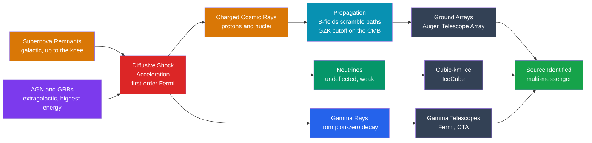

# ⚡ Cosmic Rays and Neutrino Astrophysics

> [!abstract] TL;DR
> **Cosmic rays** are high-energy charged particles — about 90% protons, 9% helium nuclei, the rest heavier nuclei and electrons — that rain onto Earth with a steeply falling **power-law energy spectrum**, $dN/dE \propto E^{-2.7}$, spanning eleven decades of energy. Two kinks break the line: the **knee** (~$3\times10^{15}$ eV), where galactic sources run out of steam, and the **ankle** (~$4\times10^{18}$ eV), where an extragalactic component takes over, up to ultra-high-energy events near $10^{20}$ eV. Because they are **charged**, magnetic fields scramble their arrival directions — so they usually cannot point back to their sources. **Neutrinos** solve this: nearly massless, chargeless, and weakly interacting, they stream *undeflected* from deep inside stellar cores and cosmic accelerators. Together with gamma rays, cosmic rays and neutrinos triangulate where the universe accelerates particles — as IceCube did for the blazar **TXS 0506+056**.

## Intuition — analogy FIRST

Imagine trying to find a factory by studying what blows out of it. Sparks fly out charged; every gust of wind bends their path, so by the time they reach you they arrive from every direction and tell you nothing about *where* the factory is — only that one exists somewhere. That is a **cosmic ray**: a charged particle whose journey through galactic magnetic fields erases its address.

Now imagine the factory also releases an odorless smoke that ignores the wind entirely and drifts in a perfectly straight line. Follow it upwind and you walk right to the front gate. That is a **neutrino**: uncharged and barely interacting, it travels dead straight from the very heart of the source — but it is so faint you need a detector the size of a mountain to smell it at all.

---

## How It Works



---

## Key Concepts / Details

### Secondary Level

Cosmic rays were discovered in **1912** by Victor Hess, who flew ionization detectors on balloons and found that ionizing radiation *increases* with altitude — it comes from space, not the ground (Nobel Prize, 1936). What arrives at the top of the atmosphere is mostly bare atomic nuclei:

| Component | Fraction (by number) |
|-----------|----------------------|
| Protons (hydrogen nuclei) | ~89% |
| Helium nuclei (alpha) | ~10% |
| Heavier nuclei + electrons | ~1% |

The defining feature is the **energy spectrum**: a steeply falling power law. For every factor of 10 you climb in energy, the flux drops by roughly a factor of 500. At a few GeV, about **one cosmic ray strikes each square metre every second**; at the very highest energies, you would wait a **century for one to hit a square kilometre**. When a primary hits the air, it shatters into a cascade of billions of secondary particles — an **air shower** — and the muons that reach sea level pass through your body at roughly one per square centimetre per minute.

**Neutrinos** are the opposite kind of messenger: nearly massless, electrically neutral, and feeling only the weak force and gravity. Tens of trillions of neutrinos from the Sun's core pass through your body *every second* without a single interaction. That ghostliness is exactly why they are precious — they escape places light cannot.

### Undergraduate Level

**The spectrum and its features.** Above ~$10^{10}$ eV the all-particle differential flux follows

$$\frac{dN}{dE} \propto E^{-\gamma}, \qquad \gamma \approx 2.7,$$

until the **knee** at $E \approx 3\times10^{15}$ eV, where it steepens to $\gamma \approx 3.1$. The knee is interpreted as the **maximum energy that galactic supernova-remnant shocks can reach** for protons; heavier nuclei (with charge $Z$) reach $Z$ times higher, so the knee is really a superposition of per-element cutoffs. At the **ankle**, $E \approx 4\times10^{18}$ eV, the spectrum *hardens* back toward $\gamma \approx 2.7$ — the signature of an **extragalactic** population taking over from the fading galactic one.

**Sources and why directions are lost.** Galactic cosmic rays (up to roughly the ankle) are accelerated at **[[Supernovae_and_Gamma_Ray_Bursts|supernova remnant]]** shock fronts. The ultra-high-energy tail ($>10^{18}$ eV) must be **extragalactic** — likely **[[Active_Galactic_Nuclei_and_Quasars|active galactic nuclei]]** jets and gamma-ray bursts. But the Galaxy is threaded by ~$\mu$G magnetic fields. A proton's Larmor radius $r_L = p / (qB)$ is far smaller than the Galaxy for typical energies, so paths coil and **arrival directions isotropize** — cosmic rays do *not* point home. Only the very highest-energy events ($>5\times10^{19}$ eV) are stiff enough to bend little and hint at their origins.

**The GZK cutoff.** Greisen, Zatsepin and Kuzmin predicted (1966) that protons above ~$5\times10^{19}$ eV interact with **cosmic-microwave-background** photons via photopion production,

$$p + \gamma_{\rm CMB} \rightarrow \Delta^{+}(1232) \rightarrow p + \pi^{0} \ \ \text{or}\ \ n + \pi^{+},$$

losing energy over a horizon of only ~50–100 Mpc. This predicts a **suppression** at the top of the spectrum, observed by Pierre Auger and Telescope Array — though whether it is pure GZK or a source cutoff is still debated. Record events include the 1991 **"Oh-My-God" particle** ($3.2\times10^{20}$ eV) and the 2021 **"Amaterasu" particle** ($2.4\times10^{20}$ eV).

**Detection.** Air-shower experiments cover huge areas because the flux is tiny. The **Pierre Auger Observatory** (Argentina, ~3000 km²) is a *hybrid*: 1600 water-Cherenkov tanks sample the particle footprint on the ground while fluorescence telescopes watch the faint UV glow of nitrogen excited by the shower. The composition and energy come from cross-calibrating the two.

**Neutrino astrophysics** has three landmark discoveries:
1. **Solar neutrinos** — Davis's Homestake experiment found only ~1/3 the predicted flux (the *solar neutrino problem*), resolved by **neutrino oscillation** (SNO, Super-Kamiokande), simultaneously confirming p–p fusion powers the Sun and that neutrinos have mass.
2. **SN 1987A** — about **two dozen neutrinos** (11 Kamiokande-II, 8 IMB, 5 Baksan) arrived over ~13 s, ~3 hours *before* the optical brightening, from 51.4 kpc away: direct proof that core collapse releases ~99% of its energy as neutrinos.
3. **High-energy astrophysical neutrinos** — **IceCube** discovered a diffuse TeV–PeV flux (2013) and in 2017 tracked a ~290 TeV neutrino to the flaring blazar **TXS 0506+056**, the first identified extragalactic cosmic-ray accelerator (see [[Multi_Messenger_Astronomy]]).

Because the weak cross-section is minuscule, you need a **cubic kilometre of clear ice** (IceCube, ~1 gigatonne) instrumented with photomultipliers to catch the rare Cherenkov flash of an interacting neutrino.

### Graduate Level

**First-order Fermi acceleration (diffusive shock acceleration).** A particle repeatedly crossing a strong shock scatters off magnetic turbulence on both sides. Each round trip gives a *first-order* fractional energy gain $\langle\Delta E/E\rangle \propto v_{\rm sh}/c$ (unlike Fermi's original *second-order* $\propto (v/c)^2$ off moving clouds). Balancing the per-cycle energy gain against the per-cycle escape probability yields a power law in momentum $f(p)\propto p^{-q}$ with

$$q = \frac{3r}{r-1}, \qquad N(E)\,dE \propto E^{-s}\,dE, \qquad s = \frac{r+2}{r-1},$$

where $r = \rho_2/\rho_1$ is the shock **compression ratio**. For a strong, non-relativistic shock in a monatomic gas, $r = 4$, giving the celebrated **$s = 2$** source spectrum. Energy-dependent diffusive escape from the Galaxy, with escape time $\tau_{\rm esc}\propto E^{-\delta}$ ($\delta \approx 0.3$–$0.6$), steepens the *observed* index to $s + \delta \approx 2.7$ — matching data.

**The cosmic-ray / gamma-ray / neutrino connection.** When accelerated protons collide (with gas, $pp$, or radiation, $p\gamma$) they make pions. Neutral and charged pions decay as

$$\pi^{0} \rightarrow \gamma + \gamma, \qquad \pi^{+} \rightarrow \mu^{+} + \nu_{\mu} \rightarrow e^{+} + \nu_{e} + \bar{\nu}_{\mu} + \nu_{\mu}.$$

So **every hadronic accelerator emits gamma rays *and* neutrinos in a fixed ratio** — a smoking gun distinguishing hadronic from leptonic sources. At the source the flavor ratio is $\nu_e : \nu_\mu : \nu_\tau = 1 : 2 : 0$; oscillation over cosmic baselines averages it to $\approx 1 : 1 : 1$ at Earth.

**The neutrino "grand unified" spectrum.** Plotting neutrino flux against energy across ~24 decades reveals distinct populations: the ~1.95 K **cosmic neutrino background** ($\sim 10^{-4}$ eV relics), **solar** (MeV), **atmospheric** (GeV–TeV, from cosmic-ray air showers), the diffuse **astrophysical** flux (TeV–PeV), and the predicted **cosmogenic/GZK** neutrinos (EeV) produced when UHECR protons undergo photopion production *in flight*. The **Waxman–Bahcall bound** ties the diffuse astrophysical neutrino flux to the measured cosmic-ray flux, since both trace the same $p\gamma$/$pp$ interactions in optically-thin sources.

```python
import numpy as np
import matplotlib.pyplot as plt

# --- All-particle cosmic-ray spectrum as a broken power law ------------------
# Differential flux J(E) = dN/dE falls steeply as E^-gamma. The index steepens
# at the "knee" and hardens again at the "ankle"; a GZK cutoff suppresses the top.

E0      = 1e9          # reference energy: 1 GeV, in eV
J0      = 1.0          # flux at E0 (arbitrary units)
E_knee  = 3e15         # knee  ~ 3 PeV
E_ankle = 4e18         # ankle ~ 4 EeV
E_gzk   = 5e19         # GZK suppression scale
g1, g2, g3 = 2.7, 3.1, 2.7   # indices: below knee / knee-to-ankle / above ankle

E = np.logspace(9, 20.5, 2000)              # 1 GeV up to ~3e20 eV

# piecewise power law, continuous across the two break energies
Jk = J0 * (E_knee  / E0)**(-g1)             # flux at the knee
Ja = Jk * (E_ankle / E_knee)**(-g2)         # flux at the ankle
J  = J0 * (E / E0)**(-g1)
J  = np.where(E >= E_knee,  Jk * (E / E_knee )**(-g2), J)
J  = np.where(E >= E_ankle, Ja * (E / E_ankle)**(-g3), J)
J *= np.where(E > E_gzk, np.exp(1.0 - E / E_gzk), 1.0)   # GZK exponential cutoff

plt.figure(figsize=(8, 6))
plt.loglog(E, J, lw=2, color="#dc2626")

for Eb, lbl in [(E_knee, "knee ~3 PeV"), (E_ankle, "ankle ~4 EeV")]:
    plt.axvline(Eb, ls="--", color="gray", alpha=0.6)

# characteristic arrival-rate landmarks along the falling spectrum
landmarks = [(1e10, "~1 / m2 / s"), (E_knee, "~1 / m2 / yr"),
             (E_ankle, "~1 / km2 / yr"), (1e20, "~1 / km2 / century")]
for Ex, rate in landmarks:
    Jx = J[np.argmin(np.abs(E - Ex))]
    plt.annotate(rate, xy=(Ex, Jx), xytext=(Ex, Jx * 1e-3),
                 fontsize=8, ha="center",
                 arrowprops=dict(arrowstyle="->", color="black", lw=0.7))

plt.xlabel("Energy per particle  E  [eV]")
plt.ylabel("Differential flux  dN/dE  [arb. units]")
plt.title("All-particle cosmic-ray energy spectrum (broken power law)")
plt.grid(True, which="both", alpha=0.3)
plt.tight_layout()
plt.show()
```

---

## Real-World Notes

- **Pierre Auger Observatory** (Argentina) and **Telescope Array** (Utah) map the ultra-high-energy sky. Auger has reported a large-scale dipole anisotropy above $8\times10^{18}$ eV pointing *away* from the galactic center — evidence the highest-energy rays are extragalactic.
- **IceCube** turned a cubic kilometre of Antarctic ice into a telescope. Its first PeV events were nicknamed "Bert," "Ernie," and "Big Bird"; its real-time alerts now steer optical and gamma-ray telescopes within seconds.
- **Solar neutrinos** were the first non-photon astronomy and the tool that discovered neutrino oscillation — a Standard-Model-breaking result born from astrophysics (see [[Standard_Model_Overview]]).
- **SN 1987A's** two-dozen neutrinos remain the only detected neutrinos from a specific star beyond the Sun; a future galactic supernova would flood detectors with thousands, giving an early-warning alert *hours* before the light arrives.
- **Cosmic-ray spallation** of carbon, nitrogen, and oxygen produces most of the universe's lithium, beryllium, and boron — light elements that stars destroy rather than make (links to [[Nuclear_Structure]]).
- **Space-weather hazard**: at aviation and orbital altitudes, cosmic-ray secondaries raise radiation dose and flip bits in electronics (single-event upsets) — a real engineering constraint for avionics and satellites.

---

## Common Pitfalls

1. **"Cosmic rays point to their sources."** They are *charged*; galactic magnetic fields randomize their directions. Except at the extreme high-energy end, only **neutrinos and gamma rays** carry directional information.
2. **Confusing the knee with the ankle.** The knee (~$3\times10^{15}$ eV) is a *steepening* marking the end of the galactic component; the ankle (~$4\times10^{18}$ eV) is a *hardening* where the extragalactic component dominates. Different energies, opposite curvature.
3. **Treating the GZK cutoff as certain.** The observed suppression could be the GZK effect *or* an intrinsic maximum-energy cutoff of the sources. The two require composition data to disentangle.
4. **Assuming neutrinos are massless.** Oscillation experiments prove they have (tiny) mass; the "massless" idealization is fine for propagation timing but wrong for the physics of oscillation.
5. **Forgetting the acceleration index differs from the observed index.** Diffusive shock acceleration predicts a source spectrum $E^{-2}$; the measured $E^{-2.7}$ arises only *after* energy-dependent escape from the Galaxy. Comparing the two directly is a classic error.
6. **Expecting big detectors to see many events.** The weak cross-section means even a cubic kilometre of ice records only a handful of astrophysical neutrinos per year — statistics, not sensitivity alone, limit the field.

---

## Related Concepts

- [[_MOC_High_Energy_Astrophysics|↑ Section MOC]]
- [[Supernovae_and_Gamma_Ray_Bursts]] — supernova-remnant shocks are the galactic cosmic-ray accelerators; SN 1987A gave the first extrasolar neutrinos
- [[Active_Galactic_Nuclei_and_Quasars]] — blazar jets (e.g. TXS 0506+056) are candidate extragalactic UHECR and neutrino sources
- [[Pulsars_Neutron_Stars_and_Magnetars]] — rotation-powered magnetospheres are alternative particle accelerators
- [[Accretion_Disks_and_X_ray_Binaries]] — accretion shocks and jets provide additional acceleration sites
- [[Black_Hole_Physics]] — the central engines powering AGN and GRB jets
- [[Gravitational_Waves]] — the fourth cosmic messenger, combined with these in [[Multi_Messenger_Astronomy]]
- [[Multi_Messenger_Astronomy]] — how cosmic rays, neutrinos, gamma rays, and gravitational waves jointly localize sources
- **Physics** — [[Standard_Model_Overview]] (neutrino flavor, oscillation, and mass), [[Fundamental_Forces_and_Feynman_Diagrams]] (the weak interaction that lets neutrinos escape and be detected), [[Nuclear_Structure]] (photopion production, spallation, air-shower physics)
- **Mathematics** — [[_MOC_Mathematics_Master]] (power-law statistics, Poisson counting, and the transport equations behind diffusive shock acceleration)

---

## Review Questions

1. **Secondary**: Cosmic rays are mostly protons and atomic nuclei. Why can't we simply look at the direction a cosmic ray arrives from and trace it back to the star or galaxy that made it? What kind of particle *can* be traced back, and why?
2. **Undergraduate**: Sketch the all-particle cosmic-ray spectrum on log–log axes. Label the knee and the ankle with their approximate energies, state whether the spectrum steepens or hardens at each, and give the physical interpretation of both features. What is the GZK cutoff and what causes it?
3. **Graduate**: Derive the diffusive-shock-acceleration spectral index $s = (r+2)/(r-1)$ for a strong shock, showing why $r=4$ gives $s=2$. Then explain why the *observed* index is ~2.7, and how the fixed pion-decay branching ratios let a coincident gamma-ray and neutrino detection prove that a source accelerates *hadrons* rather than only electrons.

---

## Sources

- Gaisser, Engel & Resconi — *Cosmic Rays and Particle Physics*, 2nd ed. (2016)
- Longair — *High Energy Astrophysics*, 3rd ed., Chs. 15–17
- Greisen (1966), *PRL* 16, 748; Zatsepin & Kuzmin (1966), *JETP Lett.* 4, 78 — the GZK cutoff
- IceCube Collaboration et al. (2018) — "Neutrino emission from the direction of the blazar TXS 0506+056," *Science* 361, 147
- Particle Data Group (2024) — "Cosmic Rays" review, *Prog. Theor. Exp. Phys.*

#astronomy #high-energy-astrophysics #particle-astrophysics #cosmicrays #neutrinos #GZK #Fermiacceleration #IceCube #PierreAuger #undergraduate #graduate
