# 〰️ Gravitational Waves

> [!abstract] TL;DR
> Gravitational waves are **ripples in the geometry of spacetime** itself, radiated whenever mass is accelerated with a *changing mass quadrupole moment*. Einstein predicted them in 1916 as a consequence of [[Introduction_to_General_Relativity|general relativity]]; they were first directly detected on **14 September 2015** (event GW150914) by LIGO, earning the 2017 Nobel Prize. A passing wave alternately **stretches and squeezes** space in two transverse polarizations ($h_+$ and $h_\times$), producing a fractional length change (strain) as tiny as $h \sim 10^{-21}$. The loudest sources are **inspiralling compact binaries** — pairs of black holes or neutron stars whose orbit decays as they radiate, producing a rising "chirp." Detecting them opened a fourth window on the cosmos (see [[Multi_Messenger_Astronomy]]).

## Intuition — analogy FIRST

Drop a stone in a still pond and circular ripples spread outward, momentarily lifting and lowering everything they pass. Now imagine the *pond is space itself*. When two black holes whirl around each other, they stir spacetime so violently that ripples race outward at the speed of light, and as each ripple passes it briefly **stretches distances in one direction while shrinking them at right angles**, then reverses — a rhythmic breathing of space.

The catch is the scale. By the time a wave from a billion light-years away reaches Earth, its ripple changes the length of a 4-kilometre ruler by less than one-thousandth the width of a proton. There is no medium doing the waving — it is the metric, the very ruler we measure with, that flexes. Astronomy spent four centuries collecting light; gravitational waves let us instead *feel* the shudder of mass in motion, even from objects that emit no light at all.

---

## How It Works

```mermaid
graph LR
    Binary["Compact Binary<br/>two masses in a<br/>decaying orbit"]
    Inspiral["Inspiral<br/>rising chirp<br/>f and amplitude grow"]
    Merger["Merger<br/>peak strain<br/>horizons coalesce"]
    Ringdown["Ringdown<br/>damped quasi-normal<br/>modes of final object"]
    Prop["Propagation<br/>transverse strain<br/>h ~ 1e-21 at speed c"]
    Det["Interferometer<br/>LIGO Virgo KAGRA<br/>arm-length changes"]
    Fil["Matched Filtering<br/>template bank<br/>digs signal from noise"]

    Binary --> Inspiral --> Merger --> Ringdown
    Ringdown --> Prop --> Det --> Fil

    style Binary fill:#7c3aed,color:#fff
    style Inspiral fill:#2563eb,color:#fff
    style Merger fill:#dc2626,color:#fff
    style Ringdown fill:#d97706,color:#fff
    style Prop fill:#0891b2,color:#fff
    style Det fill:#059669,color:#fff
    style Fil fill:#4b5563,color:#fff
```



---

## Key Concepts / Details

### Secondary Level

A gravitational wave is a **wave in spacetime**, just as an ocean wave is a wave in water — but here the thing waving is the distance between points. As a wave passes, it produces two independent patterns of distortion called **polarizations**:

- **Plus polarization** ($h_+$): a ring of test masses is squeezed vertically while stretched horizontally, then the reverse.
- **Cross polarization** ($h_\times$): the same pattern rotated by 45°.

Both are **transverse** — the stretching happens perpendicular to the direction the wave travels, sharing this geometry with ordinary [[Wave_Motion_and_Properties|waves]] and [[Interference_and_Diffraction|interfering light]].

The wave's amplitude is the **strain** $h = \Delta L / L$: the fractional change in length. For the strongest sources reaching Earth, $h \sim 10^{-21}$, meaning LIGO's 4 km arms change length by about $10^{-18}$ m.

The most powerful sources are two dense objects — **black holes or neutron stars** — spiralling into each other. As they lose energy to radiation, they orbit faster and closer, so both the *frequency* and the *loudness* of the wave rise together in a signature **chirp** that ends at the merger.

### Undergraduate Level

**Why a quadrupole, and why no dipole**

Electromagnetic radiation is dominated by the *dipole* term. Gravitational radiation cannot have monopole or dipole contributions:

- **No monopole radiation** — the total mass (the monopole moment) is conserved.
- **No dipole radiation** — the mass dipole is $\sum m_i \vec{x}_i = M\vec{x}_{\rm cm}$, and its second time-derivative is fixed by **conservation of momentum** ($\ddot{\vec{x}}_{\rm cm}=0$ for an isolated system).

The lowest radiating multipole is therefore the **mass quadrupole**. A perfectly spherical or perfectly axisymmetric collapse radiates *nothing*; you need an asymmetric, time-varying mass distribution. Order-of-magnitude, the strain is

$$h \sim \frac{G}{c^4}\,\frac{\ddot{Q}}{r} \sim \frac{2G}{c^4 r}\,\frac{d^2 Q}{dt^2}$$

where $Q$ is the mass quadrupole moment and $r$ the distance. The factor $G/c^4 \approx 8\times10^{-45}\ \mathrm{s^2\,kg^{-1}\,m^{-1}}$ is why $h$ is minuscule even for cataclysmic sources.

**The chirp mass**

For a binary of masses $m_1, m_2$, the inspiral waveform depends primarily on a single combination, the **chirp mass**:

$$\mathcal{M} = \frac{(m_1 m_2)^{3/5}}{(m_1+m_2)^{1/5}}$$

**The chirp**

As the orbit shrinks, the gravitational-wave frequency (which is **twice** the orbital frequency for the dominant quadrupole mode) sweeps upward as

$$f(t) \propto (t_c - t)^{-3/8}$$

where $t_c$ is the coalescence time. Both $f$ and the amplitude diverge toward the merger — the audible-analogue "whoop" that gives the chirp its name.

**Detection by interferometry**

Detectors are giant **Michelson interferometers**. A laser is split down two perpendicular arms, reflected, and recombined. A passing wave lengthens one arm and shortens the other, shifting the [[Interference_and_Diffraction|interference]] fringe. Longer arms give a larger absolute $\Delta L = hL$, hence the kilometre scale.

| Detector | Arm length | Sensitive band | Best targets |
|----------|-----------|----------------|--------------|
| LIGO (US) | 4 km | ~10–1000 Hz | stellar-mass BH/NS mergers |
| Virgo (Italy) | 3 km | ~10–1000 Hz | same, aids localization |
| KAGRA (Japan) | 3 km, underground, cryogenic | ~10–1000 Hz | same, low seismic noise |
| LISA (space, planned) | 2.5 million km | ~0.1–100 mHz | supermassive BH mergers |
| Pulsar Timing Arrays | galaxy-scale | ~nanohertz | SMBH binary background |

**Standard sirens**

The inspiral amplitude encodes the **luminosity distance directly**, with no rungs of the [[The_Cosmic_Distance_Ladder|cosmic distance ladder]]. Pair a merger's distance with a redshift from an electromagnetic counterpart and you get a clean, independent measurement of the Hubble constant $H_0$.

### Graduate Level

**Quadrupole luminosity (Einstein 1918)**

The total power radiated is set by the third time-derivative of the *traceless reduced* quadrupole moment $Q_{ij}=\int\rho\,(x_i x_j - \tfrac{1}{3}\delta_{ij}r^2)\,d^3x$:

$$L_{GW} = \frac{dE}{dt} = \frac{G}{5c^5}\left\langle \dddot{Q}_{ij}\,\dddot{Q}_{ij}\right\rangle$$

For a circular binary of separation $a$ this evaluates to $L_{GW} = \tfrac{32}{5}\,\tfrac{G^4}{c^5}\,\tfrac{(m_1 m_2)^2 (m_1+m_2)}{a^5}$ — a steep $a^{-5}$ dependence that drives runaway inspiral.

**Frequency evolution**

Energy balance gives the closed-form chirp:

$$\frac{df}{dt} = \frac{96}{5}\,\pi^{8/3}\left(\frac{G\mathcal{M}}{c^3}\right)^{5/3} f^{11/3}$$

Integrating (with $\tau \equiv t_c - t$):

$$f_{GW}(\tau) = \frac{1}{\pi}\left(\frac{5}{256}\,\frac{1}{\tau}\right)^{3/8}\left(\frac{G\mathcal{M}}{c^3}\right)^{-5/8}$$

Measuring $\dot f$ and $f$ together yields $\mathcal{M}$ — which is why the chirp mass is the *best-determined* parameter of any inspiral.

**Post-Newtonian waveforms and matched filtering**

The inspiral is modelled as a **post-Newtonian (PN)** expansion in $(v/c)$; in the stationary-phase approximation the strain amplitude grows as $h(t)\propto \mathcal{M}^{5/3} f^{2/3}/d_L$. Because a single event is buried far below the detector noise, signals are recovered by **matched filtering**: cross-correlating the data stream against a large **template bank** of theoretical waveforms and looking for a statistically significant overlap.

**Inspiral–Merger–Ringdown**

1. **Inspiral** — analytic PN regime, the long rising chirp.
2. **Merger** — strongly nonlinear; requires **numerical relativity** to solve Einstein's equations on a computer.
3. **Ringdown** — the settling remnant black hole rings like a struck bell in **quasi-normal modes**, a damped sinusoid whose frequency and decay time depend only on the final mass and spin (a test of the no-hair theorem; see [[Black_Hole_Physics]]).

**Frontiers** — space-based **LISA** will open the milliHz band (supermassive black-hole mergers), while **pulsar timing arrays** (NANOGrav, EPTA, PPTA) probe the nanohertz stochastic background from supermassive binaries.

---

## Code Demo — The Rising Chirp

```python
import numpy as np
import matplotlib.pyplot as plt

# Physical constants (SI)
G    = 6.674e-11      # gravitational constant
c    = 2.998e8        # speed of light
Msun = 1.989e30      # solar mass (kg)

# Binary: two 30 solar-mass black holes (GW150914-like)
m1 = m2 = 30 * Msun
Mchirp = (m1 * m2)**(3/5) / (m1 + m2)**(1/5)     # chirp mass

# Newtonian inspiral: GW frequency vs time-to-coalescence tau
#   f_gw(tau) = (1/pi) * (5/(256*tau))**(3/8) * (G*Mchirp/c**3)**(-5/8)
tau  = np.linspace(0.20, 0.004, 4000)            # seconds before merger (counts down)
K    = G * Mchirp / c**3
f_gw = (1/np.pi) * (5/(256*tau))**(3/8) * K**(-5/8)

# Strain amplitude grows as f^(2/3); distance/orientation folded into A0
A0    = 1e-21
h_amp = A0 * (f_gw / f_gw[0])**(2/3)

# Accumulate GW phase and build the observable waveform h(t)
t     = tau[0] - tau                             # time since start (increasing)
dt    = t[1] - t[0]
phase = 2*np.pi * np.cumsum(f_gw) * dt
h     = h_amp * np.cos(phase)

fig, ax = plt.subplots(2, 1, figsize=(8, 6), sharex=True)
ax[0].plot(t, f_gw, color="crimson")
ax[0].set_ylabel("GW frequency (Hz)")
ax[0].set_title(f"Inspiral chirp: two 30 Msun BHs  |  chirp mass = {Mchirp/Msun:.1f} Msun")
ax[1].plot(t, h, lw=0.7)
ax[1].set_ylabel("strain h(t)")
ax[1].set_xlabel("time (s)")
plt.tight_layout()
plt.show()

# Both the frequency and the amplitude sweep upward together -> the "chirp"
print(f"Frequency swept from {f_gw[0]:.1f} Hz to {f_gw[-1]:.0f} Hz before merger")
```

---

## Real-World Notes

- **GW150914** — the first direct detection (14 Sep 2015, announced Feb 2016): a merger of black holes of about **36 and 29 solar masses** at ~410 Mpc, radiating roughly **3 solar masses** of energy as gravitational waves in a fraction of a second, briefly outshining all the stars in the observable universe. It won Weiss, Barish, and Thorne the **2017 Nobel Prize in Physics**.
- **GW170817** — the first binary **neutron-star** merger (17 Aug 2017), at only ~40 Mpc. A short gamma-ray burst arrived **1.7 s** later and a kilonova was seen across the electromagnetic spectrum — the founding event of [[Multi_Messenger_Astronomy]], and confirmation that neutron-star mergers forge heavy elements like gold and platinum.
- **Speed of gravity** — the near-simultaneity of GW170817 and its gamma-ray burst pinned the speed of gravitational waves to the speed of light to within about $10^{-15}$, ruling out swathes of modified-gravity theories.
- **Standard siren $H_0$** — GW170817 alone gave $H_0 \approx 70^{+12}_{-8}\ \mathrm{km\,s^{-1}\,Mpc^{-1}}$, an independent handle on the [[The_Cosmic_Distance_Ladder|Hubble tension]].
- **Nanohertz background** — in 2023 pulsar timing arrays (NANOGrav and partners) reported evidence for a **stochastic gravitational-wave background**, most naturally explained by a cosmic population of supermassive black-hole binaries.
- **A steady stream** — LIGO-Virgo-KAGRA observing runs have now catalogued **hundreds** of compact-binary mergers, turning gravitational-wave astronomy from a single discovery into population statistics.

---

## Common Pitfalls

1. **Not electromagnetic and not sound.** A gravitational wave needs no medium and is not a wave *in* space — it is a wave *of* space, a time-varying distortion of the metric itself.
2. **Forgetting why there is no dipole term.** Mass conservation forbids monopole radiation and momentum conservation forbids mass-dipole radiation, so the **quadrupole** is the leading order — a perfectly spherical explosion or collapse radiates nothing.
3. **Confusing strain with displacement.** $h=\Delta L/L$ is dimensionless; the measurable shift $\Delta L = hL$ scales with arm length, which is precisely why detectors are kilometres long.
4. **The GW frequency is twice the orbital frequency.** The dominant quadrupole mode radiates at $2f_{\rm orb}$; mixing these up throws every derived quantity off by factors of two.
5. **The chirp mass is not the total mass.** The inspiral cleanly measures $\mathcal{M}$; the individual masses and mass ratio are far more degenerate and need the higher-frequency/merger information to break.
6. **Amplitude falls as $1/d$, not $1/d^2$.** Detectors respond to the *amplitude* of the strain, not the energy flux, so doubling detector sensitivity doubles the reachable distance and **eightfolds** the accessible volume.

---

## Related Concepts

- [[_MOC_High_Energy_Astrophysics|↑ Section MOC]]
- [[Black_Hole_Physics]] — the loudest GW sources; ringdown quasi-normal modes test the no-hair theorem
- [[Pulsars_Neutron_Stars_and_Magnetars]] — spinning, slightly asymmetric neutron stars are candidate continuous-wave sources
- [[Accretion_Disks_and_X_ray_Binaries]] — the electromagnetic counterparts and progenitor systems of compact binaries
- [[Supernovae_and_Gamma_Ray_Bursts]] — core-collapse supernovae are burst GW sources; NS mergers power short GRBs
- [[Cosmic_Rays_and_Neutrino_Astrophysics]] — the other non-photonic cosmic messengers
- [[Multi_Messenger_Astronomy]] — combining GWs with light and neutrinos (GW170817)
- [[Stellar_Remnants_White_Dwarfs_Neutron_Stars_Black_Holes]] — the compact objects whose mergers we hear
- [[The_Cosmic_Distance_Ladder]] — standard sirens give distances without ladder rungs
- [[Introduction_to_General_Relativity]] — the field equations that predict spacetime radiation
- [[Interference_and_Diffraction]] — the interferometric principle behind every detector
- [[Wave_Motion_and_Properties]] — transverse waves, polarization, and phase
- [[_MOC_Mathematics_Master]] — tensor calculus and Fourier methods underlying the theory

---

## Review Questions

1. **Secondary**: A gravitational wave passing through a ring of freely floating balls stretches the ring in one direction. What happens to the ring at right angles to that stretch, and what happens half a period later? Why are these called the "plus" and "cross" polarizations?
2. **Undergraduate**: Explain why gravitational radiation has no monopole or dipole component, and why the quadrupole is therefore the leading term. Using $h \sim (G/c^4)\,\ddot{Q}/r$, argue qualitatively why the strain from an astrophysical source is only $\sim 10^{-21}$ at Earth.
3. **Graduate**: Starting from $\dot f = \tfrac{96}{5}\pi^{8/3}(G\mathcal{M}/c^3)^{5/3} f^{11/3}$, derive $f(\tau) \propto \tau^{-3/8}$ and show how simultaneous measurement of $f$ and $\dot f$ determines the chirp mass. Why is $\mathcal{M}$ measured far more precisely than the individual masses?

---

## Sources

- Maggiore — *Gravitational Waves, Vol. 1: Theory and Experiments* (Oxford, 2008)
- Abbott et al. (LIGO/Virgo) — "Observation of Gravitational Waves from a Binary Black Hole Merger," *PRL* 116, 061102 (2016) — GW150914
- Abbott et al. — "Multi-messenger Observations of a Binary Neutron Star Merger," *ApJL* 848, L12 (2017) — GW170817
- Schutz, B. F. (1986) — "Determining the Hubble constant from gravitational wave observations," *Nature* 323, 310 — standard sirens
- NANOGrav Collaboration (2023) — "Evidence for a Gravitational-Wave Background," *ApJL* 951, L8

---

#astronomy #gravitationalwaves #relativity #LIGO #chirp #quadrupole #standardsirens #multimessenger #secondary #undergraduate #graduate
