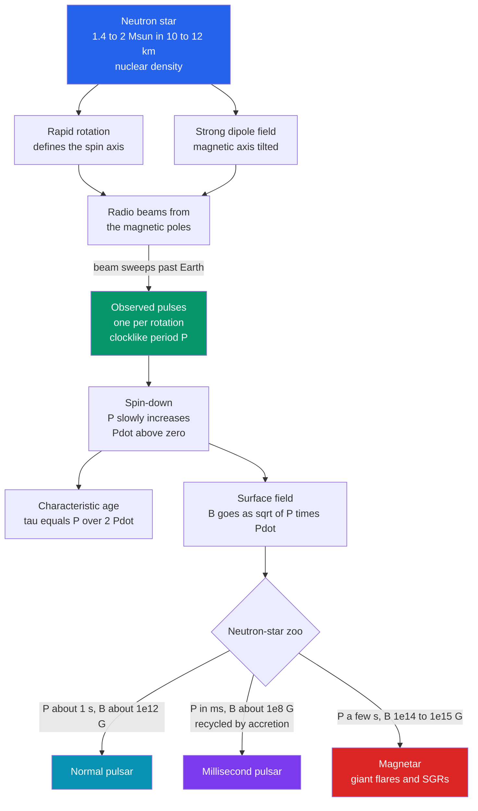

# 📡 Pulsars, Neutron Stars and Magnetars

> [!abstract] TL;DR
> A **neutron star** is the collapsed core left by a massive star's supernova — about $1.4$–$2\,M_\odot$ squeezed into a $\sim 10$–$12$ km sphere at nuclear density, the densest matter we can observe. When such a star is rapidly rotating and strongly magnetized, it beams radio emission from its magnetic poles; as the beam sweeps past Earth we see a **pulsar** — a clocklike train of pulses (the **lighthouse model**), discovered by Jocelyn Bell Burnell in 1967. Pulsars radiate away rotational energy, so the period $P$ slowly grows; the measured $\dot P$ yields a **characteristic age** $\tau = P/2\dot P$ and a **surface field** $B \propto \sqrt{P\dot P}$. The **neutron-star zoo** spans slow normal pulsars, "recycled" **millisecond pulsars**, and **magnetars** with $B\sim10^{14}$–$10^{15}$ G. As physics laboratories they proved gravitational-wave emission (**Hulse–Taylor**) and now detect nanohertz gravitational waves via **pulsar timing arrays**.

## Intuition — analogy FIRST

Stand on a foggy coastline at night. You never see the lighthouse itself — but once every few seconds a blade of light sweeps across you and is gone. The lamp is not blinking; it burns steadily and *rotates*, and you catch a flash only when its beam happens to point your way.

A pulsar is exactly this. A neutron star's radio "lamp" shines from its two magnetic poles, and because the magnetic axis is tilted from the spin axis, the beams whirl around like a lighthouse as the whole star spins. A distant astronomer catches one pulse per rotation. The astonishing part is the *regularity*: the best pulsars keep time to better than a microsecond over years — the steadiness of a spinning top the size of a city and the mass of the Sun.

---

## How It Works



### Secondary Level

A neutron star is what remains when the iron core of a massive star collapses in a **core-collapse supernova** (see [[Stellar_Remnants_White_Dwarfs_Neutron_Stars_Black_Holes]]). Gravity crushes protons and electrons into neutrons until the matter is as dense as an atomic nucleus: a sugar-cube of it would weigh about a **billion tonnes**. Conservation of angular momentum spins the shrinking core up to many rotations per second, and its magnetic field is amplified to trillions of times Earth's.

If a beam from its magnetic poles happens to sweep across Earth, we detect a **pulse** each rotation — a pulsar. Jocelyn Bell Burnell found the first (nicknamed "LGM-1") in 1967 by its impossibly regular $1.337$ s ticking.

| Type | Period $P$ | Surface field $B$ | Powered by | Example |
|------|-----------|-------------------|-----------|---------|
| **Normal pulsar** | $0.1$–$1$ s | $\sim 10^{12}$ G | rotation | Crab pulsar |
| **Millisecond pulsar** | $1$–$10$ ms | $\sim 10^{8}$–$10^{9}$ G | rotation (recycled) | PSR J0437$-$4715 |
| **Magnetar** | $2$–$12$ s | $10^{14}$–$10^{15}$ G | magnetic-field decay | SGR 1806$-$20 |

### Undergraduate Level

**Structure.** Below a thin atmosphere lies a solid **crust** (a Coulomb lattice of nuclei in a sea of relativistic electrons), which at the "neutron-drip" density $\rho \approx 4\times10^{11}\ \mathrm{g\,cm^{-3}}$ gives way to free neutrons. The **outer core** is a neutron **superfluid** threaded by a proton **superconductor**; the composition of the **inner core** at several times nuclear density is unknown — the **equation-of-state (EOS) problem**.

**Spin-down by magnetic-dipole radiation.** A tilted rotating magnetic dipole radiates like a classical antenna. In Gaussian units the luminosity is

$$L_{sd} = \frac{B_p^2 R^6 \Omega^4 \sin^2\alpha}{6c^3},$$

where $B_p$ is the polar field, $R$ the radius, $\Omega = 2\pi/P$, and $\alpha$ the angle between spin and magnetic axes. This energy is stolen from the star's rotation, $L_{sd} = -I\Omega\dot\Omega$, so

$$\dot\Omega = -K\,\Omega^{\,n}, \qquad n = 3 \ \text{(pure dipole)}.$$

**Characteristic age.** Writing this in terms of period gives $P\dot P = \text{const}$. Integrating from an initial period $P_0$:

$$t = \frac{P^2 - P_0^2}{2P\dot P} \;\xrightarrow{\,P_0 \ll P\,}\; \tau \equiv \frac{P}{2\dot P}.$$

**Surface field.** Solving $L_{sd} = -I\Omega\dot\Omega$ for the field and inserting canonical values ($I = 10^{45}\ \mathrm{g\,cm^2}$, $R = 10$ km, $\sin\alpha = 1$):

$$B_s \;=\; \sqrt{\frac{3Ic^3}{2\pi^2 R^6}\,P\dot P}\;\approx\; 3.2\times10^{19}\,\sqrt{P\dot P}\ \ \text{gauss} \quad (P \text{ in s}).$$

**Recycling.** Old, spun-down pulsars in binaries can be **spun back up** by accreting matter (and angular momentum) from a companion — see [[Accretion_Disks_and_X_ray_Binaries]]. This produces **millisecond pulsars**: rotating hundreds of times per second yet with weak, "buried" fields ($\sim 10^8$ G), which makes them the most stable natural clocks known.

**The Hulse–Taylor binary pulsar** (PSR B1913+16, 1974) orbits another neutron star. Its orbital period shrinks by $\sim 76\ \mu\mathrm{s\,yr^{-1}}$, matching general relativity's prediction for energy lost to **gravitational waves** to better than $0.2\%$ — the first proof that gravitational waves are real (Nobel Prize 1993). See [[Gravitational_Waves]] and [[Introduction_to_General_Relativity]].

### Graduate Level

**The $P$–$\dot P$ diagram** is the Hertzsprung–Russell diagram of pulsars. Since $B\propto\sqrt{P\dot P}$ and $\tau\propto P/\dot P$, lines of constant field have slope $-1$ and lines of constant age slope $+1$ in log–log space. Pulsars are born at upper left and migrate down and to the right as they spin down, until they cross the **death line** — where the polar-cap voltage $\propto \sqrt{\dot P/P^3}$ drops below the threshold for the $e^\pm$ pair cascade that powers radio emission — and fall silent in the "graveyard." Millisecond pulsars sit at lower left (small $P$, tiny $\dot P$); magnetars at upper right.

**Braking index.** Measuring the second derivative gives $n = \Omega\ddot\Omega/\dot\Omega^2$. Pure dipole braking predicts $n=3$; young pulsars measure $n\approx 2$–$3$ (Crab $\approx 2.5$), revealing extra torques from magnetized particle **winds** and field evolution.

**Glitches.** Some pulsars show sudden **spin-ups** ($\Delta\Omega/\Omega \sim 10^{-9}$–$10^{-6}$, e.g. the Vela pulsar). The standard model: the crustal **neutron superfluid** rotates as an array of quantized vortices **pinned** to the crustal lattice, so it lags the slowing crust; when the stress unpins them catastrophically, angular momentum is dumped to the crust — a direct probe of superfluidity inside the star.

**Magnetars.** With $B$ exceeding the quantum critical field $B_Q = m_e^2c^3/e\hbar \approx 4.4\times10^{13}$ G, the *magnetic* energy ($\sim 10^{47}$ erg) dwarfs the rotational reservoir. Its decay and sudden reconfiguration ("starquakes") power **soft-gamma repeaters (SGRs)** and rare **giant flares**. At least some **fast radio bursts (FRBs)** are magnetar-driven — Galactic magnetar SGR 1935+2154 emitted FRB 200428 in April 2020.

**Pulsar Timing Arrays (PTAs).** Monitoring an ensemble of millisecond pulsars turns the Galaxy into a gravitational-wave detector. A passing **nanohertz** gravitational wave imprints a distinctive quadrupolar (Hellings–Downs) correlation across timing residuals. In 2023 NANOGrav, EPTA, PPTA and CPTA reported evidence for such a stochastic background, likely from merging supermassive black-hole binaries.

---

## Code Demo

```python
import numpy as np
import matplotlib.pyplot as plt

# Spin-down diagnostics for a rotating, magnetised neutron star.
# Inputs: rotation period P [s] and its derivative Pdot [s/s].
# Assumes magnetic-dipole braking (n = 3) and a canonical neutron
# star: I = 1e45 g cm^2, R = 10 km, orthogonal rotator (sin a = 1).

YEAR = 3.156e7  # seconds per year

def characteristic_age(P, Pdot):
    """Spin-down age tau = P / (2 Pdot), in years (assumes P0 << P)."""
    return P / (2.0 * Pdot) / YEAR

def surface_Bfield(P, Pdot):
    """Inferred dipole surface field B = 3.2e19 * sqrt(P*Pdot) gauss."""
    return 3.2e19 * np.sqrt(P * Pdot)

# name : (P [s], Pdot [s/s])   -- three real, iconic pulsars
pulsars = {
    "Crab (young)":           (0.03340,  4.21e-13),
    "B1937+21 (MSP)":         (0.001558, 1.05e-19),
    "SGR 1806-20 (magnetar)": (7.548,    8.30e-11),
}

print(f"{'Pulsar':24s} {'P [s]':>10s} {'Pdot':>10s} {'tau [yr]':>11s} {'B [G]':>10s}")
for name, (P, Pdot) in pulsars.items():
    tau = characteristic_age(P, Pdot)
    B   = surface_Bfield(P, Pdot)
    print(f"{name:24s} {P:10.4g} {Pdot:10.2e} {tau:11.3g} {B:10.2e}")

# ---- P-Pdot diagram ----
fig, ax = plt.subplots(figsize=(7, 6))
for name, (P, Pdot) in pulsars.items():
    ax.scatter(P, Pdot, s=80, zorder=5, label=name)

# Diagonal lines of constant surface field  (B proportional to sqrt(P*Pdot))
Pgrid = np.logspace(-3, 1.2, 200)
for B in [1e8, 1e10, 1e12, 1e14]:
    Pdot_line = (B / 3.2e19)**2 / Pgrid
    ax.plot(Pgrid, Pdot_line, 'k--', alpha=0.3)

ax.set_xscale('log'); ax.set_yscale('log')
ax.set_xlabel('Period P [s]'); ax.set_ylabel('Period derivative Pdot [s/s]')
ax.set_title('P-Pdot diagram (dashed = constant surface B)')
ax.set_ylim(1e-22, 1e-9)
ax.legend(loc='lower right', fontsize=8)
plt.tight_layout()
```

Output: Crab $\tau \approx 1.26\times10^3$ yr, $B\approx 3.8\times10^{12}$ G; B1937+21 $\tau\approx 2.3\times10^8$ yr, $B\approx 4.1\times10^8$ G (old and weakly magnetized); SGR 1806$-$20 $\tau\approx 1.4\times10^3$ yr, $B\approx 8.0\times10^{14}$ G (young magnetar). Note the Crab's characteristic age overshoots its true age of $\sim 970$ yr (SN 1054) because $P_0$ was not negligible.

---

## Real-World Notes

- **The 1967 discovery** — Jocelyn Bell Burnell spotted "a bit of scruff" recurring every $1.337$ s in Antony Hewish's radio survey. The regularity was so unnatural it was half-jokingly labelled "LGM-1" (Little Green Men) before rotation was understood. Hewish shared the 1974 Nobel Prize.
- **The Crab pulsar** — a $\sim 30$ Hz neutron star born in the SN of 1054 CE. Its spin-down luminosity ($\sim 5\times10^{38}\ \mathrm{erg\,s^{-1}}$) powers the entire surrounding Crab Nebula across radio through gamma rays — a rotating flywheel lighting up a cloud light-years wide.
- **Millisecond pulsars as clocks** — PSR J0437$-$4715 and kin are timed to sub-microsecond precision over decades, rivaling atomic clocks and enabling deep-space navigation concepts and PTA gravitational-wave searches.
- **The Hulse–Taylor pulsar** — three decades of orbital-decay data trace GR's gravitational-wave prediction almost perfectly; the two stars will merge in $\sim 300$ Myr.
- **The 2004 giant flare** — magnetar SGR 1806$-$20 released $\sim 2\times10^{46}$ erg in $0.2$ s, briefly outshining the full Moon in gamma rays and perturbing Earth's ionosphere from $\sim 50{,}000$ light-years away.
- **Nanohertz gravitational waves (2023)** — pulsar timing arrays reported the first evidence for a stochastic gravitational-wave background, opening a window on supermassive black-hole binaries complementary to LIGO's kilohertz band.

---

## Common Pitfalls

1. **Characteristic age is not the true age.** $\tau = P/2\dot P$ assumes braking index $n=3$ **and** $P_0 \ll P$; the Crab's $\tau\approx 1260$ yr versus its true $\sim 970$ yr shows both assumptions can fail.
2. **Pulsars do not "pulsate."** The star rotates steadily; the *beam* sweeps. They are lighthouses, not intrinsically variable stars — do not confuse them with Cepheids or other pulsating variables.
3. **Millisecond pulsars are old, not young.** Their blistering spin is not youth but **recycling** by accretion; their weak fields ($\sim 10^8$ G) and tiny $\dot P$ place them among the *oldest* neutron stars.
4. **Magnetars are magnetically powered.** Their bursts far exceed their spin-down luminosity — the energy comes from field decay, not rotation, unlike ordinary pulsars.
5. **$B\propto\sqrt{P\dot P}$ is an order-of-magnitude dipole estimate.** It assumes an orthogonal rotator and canonical $I$ and $R$, and ignores higher multipoles and plasma torques; treat it as a scaling, not a precise measurement.
6. **Not every neutron star is a pulsar.** We only see one if a beam crosses Earth *and* it is still active; radio-quiet neutron stars (central compact objects, X-ray-dim isolated neutron stars) exist and are counted in different ways.

---

## Related Concepts

- [[_MOC_High_Energy_Astrophysics|↑ Section MOC]]
- [[Stellar_Remnants_White_Dwarfs_Neutron_Stars_Black_Holes]] — how neutron stars form and where the TOV mass limit and equation-of-state problem come from.
- [[Black_Hole_Physics]] — the fate of remnants above the neutron-star maximum mass; the endpoint of the compact-object sequence.
- [[Gravitational_Waves]] — the emission proved by Hulse–Taylor and now sought at nanohertz frequencies with pulsar timing arrays.
- [[Accretion_Disks_and_X_ray_Binaries]] — the recycling mechanism that spins up millisecond pulsars and powers accreting neutron stars.
- [[Supernovae_and_Gamma_Ray_Bursts]] — the core-collapse explosions that birth neutron stars; magnetars may power some long GRBs and superluminous SNe.
- [[Cosmic_Rays_and_Neutrino_Astrophysics]] — pulsar magnetospheres and their winds accelerate particles to extreme energies.
- [[Magnetism_and_Biot_Savart]] — the magnetic-dipole physics behind pulsar beams and spin-down radiation.
- [[Rotational_Dynamics]] — angular-momentum conservation (spin-up in collapse) and the torque that drives spin-down.
- [[Introduction_to_General_Relativity]] — orbital decay of binary pulsars and strong-field tests of gravity.
- [[_MOC_Mathematics_Master]] — the differential equations of spin-down and stellar structure used throughout.

---

## Review Questions

1. **Secondary**: A pulsar keeps far better time than most clocks yet is a collapsed star. Using the lighthouse analogy, explain *why* we see regular pulses and what physically sets their period.
2. **Undergraduate**: A pulsar has $P = 0.10$ s and $\dot P = 1.0\times10^{-15}$. Estimate its characteristic age and inferred surface magnetic field. Would you classify it as a normal pulsar, a millisecond pulsar, or a magnetar, and why?
3. **Graduate**: On the $P$–$\dot P$ diagram, derive the slopes of lines of constant $B$ and constant $\tau$. Explain how a millisecond pulsar reaches the lower-left corner, and why the death line prevents pulsars from radiating indefinitely as they spin down.

---

## Sources

- Lorimer & Kramer — *Handbook of Pulsar Astronomy*, Cambridge University Press
- Shapiro & Teukolsky — *Black Holes, White Dwarfs, and Neutron Stars*, Ch. 9–10
- Hewish, Bell, et al. (1968) — "Observation of a Rapidly Pulsating Radio Source," *Nature* 217, 709
- Hulse & Taylor (1975) — "Discovery of a Pulsar in a Binary System," *ApJ* 195, L51
- Kaspi & Beloborodov (2017) — "Magnetars," *ARA&A* 55, 261
- NANOGrav Collaboration (2023) — "Evidence for a Gravitational-Wave Background," *ApJL* 951, L8

#astronomy #astrophysics #neutronstars #pulsars #magnetars #millisecondpulsars #spindown #pulsartiming #gravitationalwaves #secondary #undergraduate #graduate
