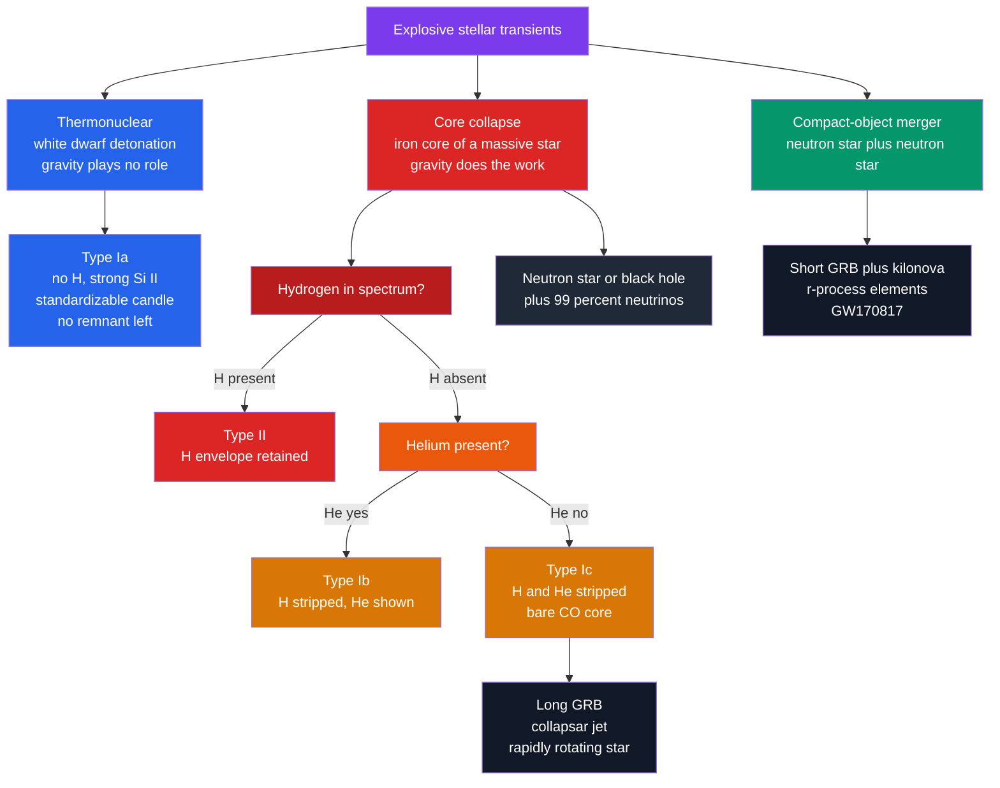

# 💥 Supernovae and Gamma-Ray Bursts

> [!abstract] TL;DR
> A **supernova** is a stellar explosion that briefly outshines an entire galaxy, and there are two physically unrelated kinds. **Thermonuclear (Type Ia)** events are white dwarfs in binaries that reach the **Chandrasekhar limit** ($\sim 1.4\,M_\odot$) and detonate in a runaway carbon-fusion blast that *destroys* the star and leaves no remnant — and because they always ignite near the same mass, they are the **standardizable candles** that revealed cosmic acceleration. **Core-collapse (Types II, Ib, Ic)** events are the iron-core collapse of massive stars, which form a **neutron star or black hole** and release $\sim 99\%$ of their energy as **neutrinos** (confirmed by SN 1987A). In both, the visible light is powered not by the blast but by the radioactive chain $^{56}\mathrm{Ni}\to{}^{56}\mathrm{Co}\to{}^{56}\mathrm{Fe}$. **Gamma-ray bursts** are the most luminous electromagnetic events since the Big Bang: **long GRBs** from the collapsar death of rapidly rotating massive stars, and **short GRBs** from neutron-star mergers (confirmed by GW170817).

## Intuition — analogy FIRST

There are two utterly different ways to blow up a star, and the cleanest analogy is *dynamite versus demolition*.

A **Type Ia** supernova is a stick of dynamite with a **fixed amount of explosive**. A white dwarf quietly steals gas from a companion until it tips over a precise mass threshold — always the same threshold — and then it goes off. Because every stick carries the same charge, every blast has nearly the same brightness. That is why astronomers can use them as **standard candles**: measure how bright one *appears*, compare to how bright it truly *is*, and you know its distance across billions of light-years.

A **core-collapse** supernova is a skyscraper whose **foundation is suddenly removed**. A massive star builds an inert iron core that cannot support itself; gravity wins in less than a second, the core implodes, and the outer building comes crashing down and rebounds outward. Here gravity does the work, and — strangely — almost all of the released energy leaks away invisibly as ghostly **neutrinos**; only a sliver becomes light.

A **gamma-ray burst** is the narrow **searchlight beam** thrown out by the most extreme of these deaths — a relativistic jet drilling out of a collapsing star or a merging pair of neutron stars, pointed by chance almost straight at us.

---

## How It Works



### Secondary Level

A supernova can briefly shine as bright as $10^{9}$–$10^{10}$ Suns — rivalling its whole host galaxy. There are **two fundamentally different families**, and confusingly the historical names (Type I vs Type II) do *not* match the physics.

**Type Ia — a white dwarf detonates.** A [[Stellar_Remnants_White_Dwarfs_Neutron_Stars_Black_Holes|white dwarf]] in a binary gains mass from its companion (or merges with another white dwarf). As it nears the **Chandrasekhar limit** of $\sim 1.4\,M_\odot$, its core ignites carbon fusion. With no way to expand and cool, the burning runs away and **blows the entire star apart** — nothing is left behind. Because they all go off near the same mass, Type Ia supernovae have nearly identical peak brightness, making them **cosmic distance markers** (see [[The_Cosmic_Distance_Ladder]]).

**Core-collapse — a massive star's iron heart implodes.** A star above $\sim 8\,M_\odot$ (see [[Stellar_Evolution]]) fuses elements up to iron. Iron cannot release energy by fusing, so the core collapses in under a second into a **neutron star or black hole**, and the rebound blows off the outer layers. About **99% of the energy escapes as neutrinos** — ghostly particles that barely interact — which is why the light is only a faint echo of the true blast (see [[Multi_Messenger_Astronomy]]).

**What makes the light?** Not the explosion itself, but **radioactivity**. The blast forges $\sim 0.1$–$0.6\,M_\odot$ of nickel-56, which decays $^{56}\mathrm{Ni}\to{}^{56}\mathrm{Co}\to{}^{56}\mathrm{Fe}$, and the gamma rays from that decay heat the expanding gas for months (see [[Radioactive_Decay]]).

The spectral fingerprint sorts the types:

| Type | Spectrum | Mechanism | Progenitor | Remnant |
|------|----------|-----------|------------|---------|
| **Ia** | No H, strong **Si II** | Thermonuclear runaway | White dwarf in a binary | None — star destroyed |
| **II** | **Hydrogen** lines | Core collapse | Massive star, H envelope intact | Neutron star / black hole |
| **Ib** | No H, **He** lines | Core collapse | Massive star stripped of H | Neutron star / black hole |
| **Ic** | No H, **no He** | Core collapse | Stripped of H *and* He | Neutron star / black hole |

### Undergraduate Level

**Type Ia energetics.** The Chandrasekhar mass is set by electron-degeneracy pressure, $M_{Ch}\approx 1.44\,(2/\mu_e)^2\,M_\odot \approx 1.4\,M_\odot$. Two channels are debated: the **single-degenerate** case (a white dwarf accreting from a normal star) and the **double-degenerate** case (two white dwarfs merging). Carbon fusion ignites near the centre and propagates as a subsonic **deflagration** that transitions to a supersonic **detonation**, unbinding the $\sim 1.4\,M_\odot$ star. The nuclear energy released, $\sim 1.5\times 10^{51}$ erg, goes almost entirely into **kinetic energy** of $\sim 10^{4}\ \mathrm{km/s}$ ejecta, synthesising $\sim 0.6\,M_\odot$ of $^{56}$Ni whose decay powers a peak luminosity of $\sim 10^{43}\ \mathrm{erg/s}$ ($M_B\approx -19.3$).

**Core-collapse energetics.** When the iron core exceeds $M_{Ch}$, electron captures and photodisintegration remove pressure support and it collapses in $\lesssim 1$ s. Collapse halts when the inner core reaches **nuclear density** ($\sim 2.7\times 10^{14}\ \mathrm{g/cm^3}$), becomes incompressible, and **bounces**, launching a shock. The total energy released is the gravitational binding energy of the neutron star, $\sim 3\times 10^{53}$ erg, of which:

- $\sim 99\%$ ($\sim 3\times 10^{53}$ erg) escapes as **neutrinos**,
- $\sim 1\times 10^{51}$ erg ("1 foe" or 1 Bethe) becomes **ejecta kinetic energy**,
- $\sim 10^{49}$ erg emerges as **visible light**.

**SN 1987A** in the Large Magellanic Cloud confirmed this picture: Kamiokande-II, IMB, and Baksan detected $\sim 24$ neutrinos hours *before* the optical brightening — the birth cry of a neutron star, and the founding event of multi-messenger astronomy.

**Light-curve shape.** After shock breakout, the emission is sustained by the radioactive chain. The mean lives (from half-lives $6.1$ d and $77$ d) give a fast **Ni-dominated rise** and a slower **Co-dominated decline**. Type II-P supernovae add a months-long luminosity **plateau** as the hydrogen envelope recombines. Supernovae also disperse the heavy elements they forge (see [[Stellar_Nucleosynthesis]]) and their shocks compress clouds to trigger new **star formation**; their expanding shells become **supernova remnants** such as the Crab and Cassiopeia A.

### Graduate Level

**Explosion mechanisms.** A naive prompt bounce shock *stalls* within milliseconds, sapped by photodisintegration and neutrino losses. Two revival routes are studied:

- **Neutrino-driven (delayed Bethe–Wilson) mechanism.** Neutrinos streaming from the protoneutron star deposit energy behind the stalled shock in the gain region. Multidimensional turbulence — **neutrino-driven convection** and the **standing accretion shock instability (SASI)** — is essential to push the shock over the threshold; spherically symmetric models generally fail to explode.
- **Magnetorotational mechanism.** For rapidly rotating, strongly magnetised cores, field winding (and the magnetorotational instability) taps rotational energy to drive **bipolar jets**, producing hypernovae and possibly [[Pulsars_Neutron_Stars_and_Magnetars|magnetars]] and long GRBs.

**Arnett's rule.** For a radioactively powered supernova, the bolometric **peak luminosity equals the instantaneous radioactive energy deposition rate at peak**:
$$L_{peak}\;\approx\;\dot{E}_{rad}(t_{peak}),$$
which lets $M_{Ni}$ be read directly from the peak. The rise is governed by the effective photon-diffusion timescale $\tau_m \propto (\kappa M_{ej}/v)^{1/2}$; the Arnett (1982) solution convolves the decay heating with this diffusion time to yield the characteristic rise-and-fall.

**Type Ia standardization and dark energy.** Raw Type Ia peaks scatter by $\sim 0.3$–$0.4$ mag, but the **Phillips relation** — intrinsically brighter events decline *more slowly* (broader light curves) — reduces this to $\lesssim 0.15$ mag after a width–luminosity correction, giving $\sim 5\%$ distances. In 1998 the High-z and Supernova Cosmology Project teams found distant Type Ia's **fainter than expected** in a decelerating universe, implying **accelerating expansion** driven by dark energy (Nobel Prize 2011).

**Gamma-ray bursts.** GRBs release isotropic-equivalent energies up to $E_{iso}\sim 10^{54}$ erg. The **compactness problem** — such luminosity varying on millisecond scales implies a photon density opaque to pair production — is solved by an ultrarelativistic **fireball** with bulk Lorentz factor $\Gamma\sim 100$–$1000$. **Internal shocks** in the jet produce the prompt gamma rays; the jet ploughing into the surroundings drives an **external shock** seen as a multi-wavelength **afterglow**. Jets are collimated ($\theta_j\sim$ a few degrees), so the true energy is $\sim (\theta_j^2/2)\,E_{iso}\sim 10^{51}$ erg. **Long GRBs** ($\gtrsim 2$ s) arise from **collapsars** (MacFadyen & Woosley) — rapidly rotating stripped stars, seen with broad-lined Type Ic "hypernovae." **Short GRBs** ($\lesssim 2$ s) arise from **neutron-star mergers**: GW170817 / GRB 170817A jointly confirmed this and its **kilonova**, the site of **r-process** heavy-element synthesis (see [[Gravitational_Waves]]). Because they are so luminous, GRBs are beacons that probe the universe out to $z\gtrsim 8$–$9$.

```python
# Type Ia bolometric light curve powered by 56Ni -> 56Co -> 56Fe decay,
# using the Arnett (1982) diffusion solution to get the rise AND the decline.
import numpy as np
import matplotlib.pyplot as plt

Msun = 1.989e33                 # g
# Mean lives from the given half-lives (t_half / ln2)
tau_Ni = 6.1 / np.log(2)        # 56Ni -> 56Co,  ~8.80 days
tau_Co = 77.0 / np.log(2)       # 56Co -> 56Fe,  ~111.1 days

# Specific radioactive heating rates (erg/s per gram of 56Ni), from decay Q-values
eps_Ni = 3.90e10                # 56Ni gamma rays
eps_Co = 6.78e9                 # 56Co gamma rays + positrons

M_Ni  = 0.6 * Msun              # nickel-56 synthesised in the explosion
tau_m = 13.6                    # effective photon-diffusion time (days) -> sets the rise

# Instantaneous radioactive power deposited (Arnett input function)
def L_input(t):                 # t in days -> erg/s
    return M_Ni * ((eps_Ni - eps_Co) * np.exp(-t / tau_Ni)
                   + eps_Co * np.exp(-t / tau_Co))

t = np.linspace(0.01, 120, 1200)          # days since explosion
x = t / tau_m

# L(t) = e^{-(t/tm)^2} * integral_0^t 2 t'/tm^2 e^{(t'/tm)^2} L_input(t') dt'
integrand = (2 * x / tau_m) * np.exp(x**2) * L_input(t)
seg = 0.5 * (integrand[1:] + integrand[:-1]) * np.diff(t)   # trapezoid segments
cum = np.concatenate([[0.0], np.cumsum(seg)])
L = np.exp(-x**2) * cum                                     # diffused light curve

peak = t[np.argmax(L)]
print(f"Rise time to bolometric peak: {peak:.1f} d")
print(f"Peak luminosity: {L.max():.2e} erg/s  ({L.max()/3.828e33:.2e} Lsun)")

plt.figure(figsize=(7, 5))
plt.plot(t, L, lw=2, color="crimson", label="Arnett light curve  L(t)")
plt.plot(t, L_input(t), "--", color="gray", label="instantaneous decay power (Arnett's rule)")
plt.axvline(peak, ls=":", color="k", alpha=0.6)
plt.yscale("log")
plt.xlabel("Days since explosion")
plt.ylabel("Bolometric luminosity  (erg/s)")
plt.title("Type Ia light curve:  56Ni -> 56Co -> 56Fe")
plt.legend()
plt.grid(True, which="both", alpha=0.3)
plt.tight_layout()
plt.show()
```

---

## Real-World Notes

- **SN 1987A** — the nearest naked-eye supernova since 1604. Its $\sim 24$ detected neutrinos arrived before the light, giving the first direct proof that a stellar core collapses and a neutron star is born, and launching neutrino astronomy.
- **Historical supernovae** — SN 1006 and Kepler's SN 1604 were likely Type Ia; the Crab (SN 1054) was a core-collapse event whose remnant hosts the Crab **pulsar**. Chinese and Arab records still fix their dates.
- **Type Ia and dark energy** — in 1998 two teams used Type Ia standard candles to measure that distant supernovae are dimmer than a decelerating universe predicts, discovering cosmic acceleration and dark energy (Nobel Prize in Physics, 2011).
- **GW170817 / GRB 170817A** — a binary neutron-star merger at $\sim 40$ Mpc seen in gravitational waves, followed $1.7$ s later by a short GRB and a **kilonova** (AT2017gfo) whose spectra revealed freshly made r-process elements — the definitive short-GRB progenitor.
- **Cassiopeia A** — the youngest known Galactic supernova remnant ($\sim 340$ yr), a benchmark for X-ray spectroscopy; detection of $^{44}$Ti maps the innermost explosion and probes the asymmetry of core collapse.
- **High-redshift GRBs** — GRB 090423 at $z\approx 8.2$ and GRB 220101A rank among the most distant, most energetic events ever observed, serving as backlights to probe gas and star formation in the early universe.

---

## Common Pitfalls

1. **"Type I is thermonuclear and Type II is core-collapse."** False. Classification is *spectroscopic* (presence of hydrogen), not physical. Only **Type Ia** is thermonuclear; **Types Ib and Ic are core-collapse** despite lacking hydrogen. The physics splits Ia from everything else, not I from II.
2. **Confusing a nova with a supernova.** A **nova** is surface hydrogen burning on a white dwarf — non-destructive and recurrent, $\sim 10^{5}$ times fainter. A **supernova** destroys the white dwarf (Ia) or collapses a massive star's core.
3. **"The explosion energy is what we see as light."** No. Light is a *tiny* fraction of the budget: kinetic energy dominates, and in core-collapse events $\sim 99\%$ of the total energy leaves as **neutrinos**. The optical display is powered by radioactive $^{56}$Ni decay, not the blast wave directly.
4. **Reading GRB isotropic energy as the true energy.** $E_{iso}$ assumes the burst radiates in all directions; real jets are **beamed** into a few degrees, so the actual energy is smaller by $\theta_j^2/2$ — typically $\sim 10^{51}$ erg, not $10^{54}$.
5. **Treating the 2-second long/short GRB boundary as a hard physical line.** It is a rough statistical divide in the duration distribution; the true distinction is the **progenitor** (collapsar vs compact merger), and some events sit ambiguously between.
6. **Thinking the Chandrasekhar mass "triggers" every supernova the same way.** It sets the white-dwarf limit for Type Ia *and* the iron-core limit for core-collapse, but the ensuing physics — thermonuclear runaway versus gravitational implosion — is entirely different.

---

## Related Concepts

- [[_MOC_High_Energy_Astrophysics|↑ Section MOC]]
- [[Black_Hole_Physics]] — the endpoint of the most massive core collapses and the engine of long GRB jets
- [[Gravitational_Waves]] — neutron-star mergers power short GRBs; GW170817 tied the two together
- [[Pulsars_Neutron_Stars_and_Magnetars]] — the compact remnants left by core-collapse supernovae, and magnetar-driven explosions
- [[Accretion_Disks_and_X_ray_Binaries]] — accretion onto a white dwarf feeds it toward the Chandrasekhar limit; disks form in collapsars and mergers
- [[Cosmic_Rays_and_Neutrino_Astrophysics]] — supernova remnant shocks accelerate cosmic rays; SN 1987A neutrinos opened the field
- [[Stellar_Evolution]] — sets which stars end as white dwarfs versus iron cores headed for collapse
- [[Stellar_Nucleosynthesis]] — supernovae forge and disperse the heavy elements, including the $^{56}$Ni that lights the display
- [[Stellar_Remnants_White_Dwarfs_Neutron_Stars_Black_Holes]] — white-dwarf progenitors of Type Ia and the neutron-star/black-hole remnants of core collapse
- [[The_Cosmic_Distance_Ladder]] — Type Ia supernovae are its top rung and the basis of the dark-energy discovery
- [[Multi_Messenger_Astronomy]] — supernovae and mergers are the archetypal light + neutrino + gravitational-wave sources
- **Physics** — [[Nuclear_Reactions_Fission_Fusion]] (the carbon-fusion runaway of Type Ia and the fusion that builds the iron core); [[Radioactive_Decay]] (the $^{56}\mathrm{Ni}\to{}^{56}\mathrm{Co}\to{}^{56}\mathrm{Fe}$ chain that powers the light curve)
- **Mathematics** — [[_MOC_Mathematics_Master]] (the coupled decay ODEs and the diffusion convolution behind the Arnett light curve)

---

## Review Questions

1. **Secondary**: Explain in your own words why Type Ia supernovae make good "standard candles" for measuring cosmic distances, and why a core-collapse supernova would *not*. What single property of the white-dwarf progenitor is responsible?
2. **Undergraduate**: A core-collapse supernova releases $\sim 3\times 10^{53}$ erg in total. Roughly how much emerges as light, as ejecta kinetic energy, and as neutrinos? Which channel confirmed SN 1987A, and why was that signal detected *before* the optical brightening?
3. **Graduate**: State Arnett's rule and explain how it lets you infer the synthesised $^{56}$Ni mass from an observed light curve. Separately, describe the compactness problem for gamma-ray bursts and how a bulk Lorentz factor $\Gamma\sim 100$–$1000$ resolves it.

---

## Sources

- Carroll & Ostlie — *An Introduction to Modern Astrophysics*, 2nd ed., Ch. 15 (supernovae)
- Arnett, W. D. (1982) — "Type I supernovae. I. Analytic solutions for the early part of the light curve," *ApJ* 253, 785
- Phillips, M. M. (1993) — "The Absolute Magnitudes of Type IA Supernovae," *ApJ* 413, L105
- Woosley & Bloom (2006) — "The Supernova–Gamma-Ray Burst Connection," *ARA&A* 44, 507
- Janka, H.-T. (2012) — "Explosion Mechanisms of Core-Collapse Supernovae," *Annu. Rev. Nucl. Part. Sci.* 62, 407
- Abbott et al. (2017) — "Multi-messenger Observations of a Binary Neutron Star Merger" (GW170817), *ApJL* 848, L12

#astronomy #high-energy-astrophysics #transients #supernova #type-ia #core-collapse #gamma-ray-burst #standard-candle #dark-energy #secondary #undergraduate #graduate
