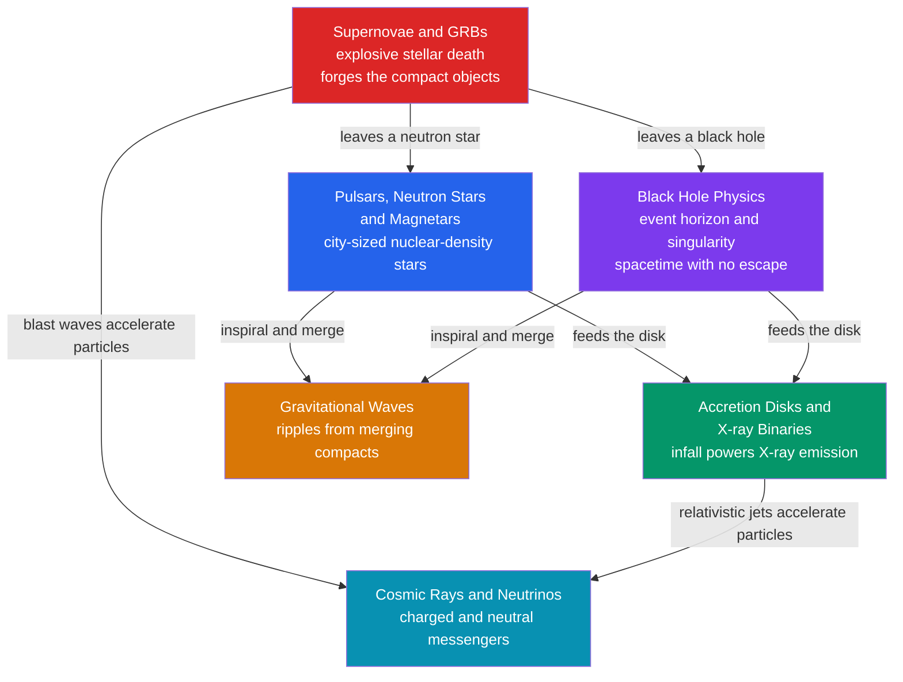

# ⚡ High-Energy & Relativistic Astrophysics — Map of Content

> [!abstract] What This Section Covers
> This section explores the most extreme environments in the universe, where gravity, density, and energy reach limits that demand general relativity and particle physics to describe. It follows a single storyline: massive stars die in **supernovae** and leave behind **neutron stars** or **black holes**; these compact objects power **accretion disks and X-ray binaries** as gas spirals into their deep gravitational wells; and when they whirl together and merge they broadcast **gravitational waves** across spacetime. Beyond light, the same violent sites accelerate **cosmic rays and neutrinos**, the charged and neutral messengers that let us triangulate the universe's particle accelerators. From the Schwarzschild radius to the GZK cutoff, every note opens with an everyday analogy and deepens to graduate-level formalism.

## Concept Map

*(Red = the explosions that make compact objects · blue/purple = the compact objects · green = how they emit · orange/teal = the messengers we detect)*

## Learning Path

*Recommended order for a first pass through this section:*

1. [[Black_Hole_Physics]] — The anchor of the whole section: event horizons, the Schwarzschild radius, Kerr spin and the ergosphere, the no-hair theorem, and Hawking radiation.
2. [[Gravitational_Waves]] — Ripples in spacetime from inspiralling compact binaries — the inspiral-merger-ringdown chirp, strain, and how LIGO/Virgo detect it.
3. [[Pulsars_Neutron_Stars_and_Magnetars]] — The other endpoint of collapse: nuclear-density stars, the lighthouse model, spin-down, and the neutron-star zoo up to magnetars.
4. [[Accretion_Disks_and_X_ray_Binaries]] — How infalling matter becomes the universe's most efficient power source, glowing in X-rays around compact objects.
5. [[Supernovae_and_Gamma_Ray_Bursts]] — The explosions that forge compact objects: thermonuclear Type Ia standard candles, core-collapse events, and the most luminous bursts since the Big Bang.
6. [[Cosmic_Rays_and_Neutrino_Astrophysics]] — Beyond light: charged particles and neutrinos as messengers that reveal where the cosmos accelerates matter to extreme energies.

## All Notes in This Section

| Note | Core Idea | Difficulty |
|------|-----------|------------|
| [[Black_Hole_Physics]] | Regions where gravity traps even light; horizons, Kerr spin, the no-hair theorem, thermodynamics, and Hawking radiation | Secondary → Graduate |
| [[Gravitational_Waves]] | Spacetime ripples from accelerating masses; inspiral-merger-ringdown chirps and interferometric detection | Secondary → Graduate |
| [[Pulsars_Neutron_Stars_and_Magnetars]] | Collapsed nuclear-density stars as cosmic clocks; the lighthouse model, spin-down, and pulsar timing arrays | Secondary → Graduate |
| [[Accretion_Disks_and_X_ray_Binaries]] | Gravitational infall as the most efficient power source; Shakura-Sunyaev disks, the Eddington limit, and X-ray binaries | Secondary → Graduate |
| [[Supernovae_and_Gamma_Ray_Bursts]] | Two ways to blow up a star and the beamed jets of gamma-ray bursts; standard candles and the neutrino/GW connection | Secondary → Graduate |
| [[Cosmic_Rays_and_Neutrino_Astrophysics]] | High-energy charged particles and neutrinos as cosmic messengers; the spectrum, shock acceleration, and source identification | Undergraduate → Graduate |

## Key Questions This Section Answers

- What actually happens at an event horizon, and why do black holes have a temperature and an entropy?
- How can we "hear" two black holes a billion light-years away when their signal moves a 4 km detector by less than a proton width?
- How does a city-sized stellar corpse keep time to better than a microsecond over years?
- Why is accretion onto a compact object far more efficient than nuclear fusion at converting mass to energy?
- What is the difference between a white dwarf that detonates and a massive star that implodes — and why does one make a standard candle while the other makes neutrinos?
- If cosmic rays are scrambled by magnetic fields, how do neutrinos and gamma rays let us find the sources that accelerate them?

## Related Sections

- [[_MOC_Astronomy_Master|↑ Astronomy Master MOC]]
- [[_MOC_Stellar_Astrophysics|→ Stellar Astrophysics]] — stellar evolution and [[Stellar_Remnants_White_Dwarfs_Neutron_Stars_Black_Holes|remnants]] feed directly into this section's compact objects
- [[_MOC_Galaxies_ISM|→ Galaxies & the ISM]] — [[Active_Galactic_Nuclei_and_Quasars|AGN and quasars]] are accretion onto supermassive black holes scaled up a billionfold
- [[_MOC_Observational_Astronomy|→ Observational Astronomy]] — [[Multi_Messenger_Astronomy|multi-messenger astronomy]] unifies light, gravitational waves, and particles
- [[_MOC_Physics_Master|→ Physics]] — [[Introduction_to_General_Relativity|general relativity]] and [[Quantum_Statistical_Mechanics|degeneracy pressure]] underlie horizons, waves, and compact-object structure

#MOC #Astronomy #HighEnergyAstrophysics
