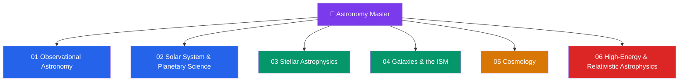

# 🔭 Astronomy & Astrophysics — Master Map of Content

> [!abstract] About This Vault
> A comprehensive astronomy & astrophysics reference spanning **senior secondary through graduate level** — **~39 notes across 6 sections**. Every note opens with an everyday analogy, builds through undergraduate theory and quantitative treatment, and reaches graduate depth with research frontiers. Sections cover **Observational Astronomy & Instrumentation**, **The Solar System & Planetary Science**, **Stellar Astrophysics**, **Galaxies & the Interstellar Medium**, **Cosmology**, and **High-Energy & Relativistic Astrophysics** — from how we collect light, out through planets and stars and galaxies, to the origin and fate of the whole universe. Each note grounds the astronomy in the underlying physics ([[_MOC_Physics_Master|Physics]]) and chemistry ([[_MOC_Chemistry_Master|Chemistry]]), with real observations, worked calculations in Python, and tiered review questions.

## Vault Architecture

## Sections at a Glance

| # | Section | Notes | Entry Point | Level Range |
|---|---------|-------|-------------|-------------|
| 01 | Observational Astronomy & Instrumentation | 6 | [[_MOC_Observational_Astronomy]] | Secondary → Graduate |
| 02 | The Solar System & Planetary Science | 7 | [[_MOC_Solar_System]] | Secondary → Graduate |
| 03 | Stellar Astrophysics | 7 | [[_MOC_Stellar_Astrophysics]] | Secondary → Graduate |
| 04 | Galaxies & the Interstellar Medium | 6 | [[_MOC_Galaxies_ISM]] | Undergraduate → Graduate |
| 05 | Cosmology | 7 | [[_MOC_Cosmology]] | Undergraduate → Graduate |
| 06 | High-Energy & Relativistic Astrophysics | 6 | [[_MOC_High_Energy_Astrophysics]] | Undergraduate → Graduate |

---

## Section Contents

**01 — Observational Astronomy & Instrumentation** — [[_MOC_Observational_Astronomy]]
- [[The_Celestial_Sphere_and_Coordinates]]
- [[Telescopes_and_Detectors]]
- [[Light_and_Astronomical_Spectroscopy]]
- [[Magnitudes_Luminosity_and_Flux]]
- [[The_Cosmic_Distance_Ladder]]
- [[Multi_Messenger_Astronomy]]

**02 — The Solar System & Planetary Science** — [[_MOC_Solar_System]]
- [[Formation_of_the_Solar_System]]
- [[Orbital_Mechanics_and_Celestial_Dynamics]]
- [[Terrestrial_Planets]]
- [[Giant_Planets_and_Their_Moons]]
- [[Small_Bodies_Asteroids_Comets_and_KBOs]]
- [[Exoplanets_and_Detection_Methods]]
- [[Astrobiology_and_Habitability]]

**03 — Stellar Astrophysics** — [[_MOC_Stellar_Astrophysics]]
- [[The_Sun]]
- [[Stellar_Properties_and_the_HR_Diagram]]
- [[Stellar_Structure_and_Energy_Generation]]
- [[Star_Formation]]
- [[Stellar_Evolution]]
- [[Stellar_Nucleosynthesis]]
- [[Stellar_Remnants_White_Dwarfs_Neutron_Stars_Black_Holes]]

**04 — Galaxies & the Interstellar Medium** — [[_MOC_Galaxies_ISM]]
- [[The_Interstellar_Medium]]
- [[The_Milky_Way_Galaxy]]
- [[Types_of_Galaxies]]
- [[Galaxy_Formation_and_Evolution]]
- [[Active_Galactic_Nuclei_and_Quasars]]
- [[Dark_Matter]]

**05 — Cosmology** — [[_MOC_Cosmology]]
- [[The_Expanding_Universe_and_Hubbles_Law]]
- [[The_Big_Bang_and_Cosmic_Microwave_Background]]
- [[Big_Bang_Nucleosynthesis]]
- [[The_Friedmann_Equations_and_Cosmological_Models]]
- [[Dark_Energy_and_the_Accelerating_Universe]]
- [[Cosmic_Inflation_and_the_Early_Universe]]
- [[Large_Scale_Structure_and_Structure_Formation]]

**06 — High-Energy & Relativistic Astrophysics** — [[_MOC_High_Energy_Astrophysics]]
- [[Black_Hole_Physics]]
- [[Gravitational_Waves]]
- [[Pulsars_Neutron_Stars_and_Magnetars]]
- [[Accretion_Disks_and_X_ray_Binaries]]
- [[Supernovae_and_Gamma_Ray_Bursts]]
- [[Cosmic_Rays_and_Neutrino_Astrophysics]]

---

## Learning Paths

### Path 1 — Senior Secondary Student
> Best for: grades 11–12 building the foundation.

[[The_Celestial_Sphere_and_Coordinates]] → [[Telescopes_and_Detectors]] → [[Magnitudes_Luminosity_and_Flux]] → [[Formation_of_the_Solar_System]] → [[Terrestrial_Planets]] → [[The_Sun]] → [[Stellar_Properties_and_the_HR_Diagram]] → [[The_Milky_Way_Galaxy]] → [[The_Expanding_Universe_and_Hubbles_Law]]

### Path 2 — Observational & Instrumentation Track
[[The_Celestial_Sphere_and_Coordinates]] → [[Light_and_Astronomical_Spectroscopy]] → [[Telescopes_and_Detectors]] → [[Magnitudes_Luminosity_and_Flux]] → [[The_Cosmic_Distance_Ladder]] → [[Multi_Messenger_Astronomy]]

### Path 3 — Planetary Science & Exoplanets Track
[[Formation_of_the_Solar_System]] → [[Orbital_Mechanics_and_Celestial_Dynamics]] → [[Terrestrial_Planets]] → [[Giant_Planets_and_Their_Moons]] → [[Small_Bodies_Asteroids_Comets_and_KBOs]] → [[Exoplanets_and_Detection_Methods]] → [[Astrobiology_and_Habitability]]

### Path 4 — Stellar Astrophysics Track
[[The_Sun]] → [[Stellar_Properties_and_the_HR_Diagram]] → [[Stellar_Structure_and_Energy_Generation]] → [[Star_Formation]] → [[Stellar_Evolution]] → [[Stellar_Nucleosynthesis]] → [[Stellar_Remnants_White_Dwarfs_Neutron_Stars_Black_Holes]]

### Path 5 — Galaxies & Cosmology Track
[[The_Interstellar_Medium]] → [[The_Milky_Way_Galaxy]] → [[Types_of_Galaxies]] → [[Dark_Matter]] → [[Galaxy_Formation_and_Evolution]] → [[Active_Galactic_Nuclei_and_Quasars]] → [[The_Expanding_Universe_and_Hubbles_Law]] → [[The_Big_Bang_and_Cosmic_Microwave_Background]] → [[The_Friedmann_Equations_and_Cosmological_Models]] → [[Dark_Energy_and_the_Accelerating_Universe]] → [[Large_Scale_Structure_and_Structure_Formation]]

### Path 6 — High-Energy & Relativistic Frontier
[[Black_Hole_Physics]] → [[Gravitational_Waves]] → [[Pulsars_Neutron_Stars_and_Magnetars]] → [[Accretion_Disks_and_X_ray_Binaries]] → [[Supernovae_and_Gamma_Ray_Bursts]] → [[Cosmic_Rays_and_Neutrino_Astrophysics]] → [[Cosmic_Inflation_and_the_Early_Universe]]

---

## Cross-Vault Links

Astrophysics is physics applied to the cosmos — it draws on nearly the whole Physics vault:

- **Physics** — [[_MOC_Physics_Master]]: [[Newtons_Laws_and_Kinematics]] and gravitation govern orbits and dynamics; [[Electromagnetic_Waves_and_Radiation]] and [[Atomic_Models_and_Spectroscopy]] underlie all of observational astronomy; [[Laws_of_Thermodynamics]] and [[Kinetic_Theory_of_Gases]] set stellar structure and the ISM; [[Nuclear_Reactions_Fission_Fusion]] and [[Nuclear_Structure]] power the stars and nucleosynthesis; [[Introduction_to_General_Relativity]] and [[Cosmology_and_Expanding_Universe]] frame black holes, gravitational waves, and the expanding universe; [[Quantum_Statistical_Mechanics]] gives degeneracy pressure in white dwarfs and neutron stars.
- **Chemistry** — [[_MOC_Chemistry_Master]]: stellar [[Stellar_Nucleosynthesis|nucleosynthesis]] builds the [[Periodic_Table_and_Periodic_Trends|periodic table]]; [[Molecular_Spectroscopy_and_Symmetry]] identifies molecules in the interstellar medium.
- **Earth Science** — [[_MOC_Earth_Science_Master]]: [[Formation_of_the_Solar_System]] and [[Terrestrial_Planets]] connect to [[Earth_Formation_and_Differentiation]]; meteorite [[Radiometric_Dating]] dates the solar system.
- **Mathematics** — [[_MOC_Mathematics_Master]]: calculus, differential equations, and statistics throughout.
- **Signals & Systems** — [[_MOC_SS_Master]]: the [[Fourier_Transform]] is the engine of radio interferometry and time-series/transient analysis.

---

## Section MOC Index

- [[_MOC_Observational_Astronomy]] — how we observe: coordinates, telescopes, spectroscopy, magnitudes, the distance ladder, and multi-messenger signals.
- [[_MOC_Solar_System]] — our cosmic neighborhood: formation, orbits, the planets and moons, small bodies, exoplanets, and habitability.
- [[_MOC_Stellar_Astrophysics]] — the lives of stars: the Sun, the HR diagram, stellar structure, birth, evolution, nucleosynthesis, and remnants.
- [[_MOC_Galaxies_ISM]] — island universes: the interstellar medium, the Milky Way, galaxy types and evolution, AGN, and dark matter.
- [[_MOC_Cosmology]] — the universe as a whole: expansion, the Big Bang and CMB, nucleosynthesis, Friedmann models, dark energy, inflation, and structure.
- [[_MOC_High_Energy_Astrophysics]] — the extreme universe: black holes, gravitational waves, pulsars, accretion, supernovae/GRBs, and cosmic rays.

#MOC #Astronomy #Astrophysics #MasterMOC
