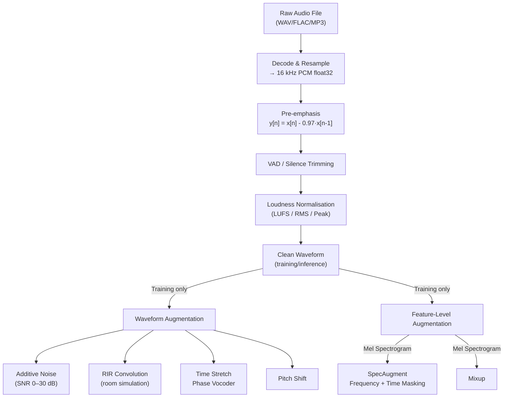

# 🔧 Audio Preprocessing and Augmentation

> [!tldr] TL;DR
> Audio preprocessing transforms raw recordings into clean, normalised waveforms ready for feature extraction; augmentation synthetically expands the training set by simulating real-world conditions (noise, reverb, speed changes). SpecAugment — masking rectangles on the mel spectrogram — is the single most impactful augmentation for ASR, while RIR convolution is most effective for robust noise-invariant speech models.

## Intuition

A model trained only on studio-quality microphone recordings will fail when deployed in a car, a noisy office, or over a phone line. Preprocessing ensures all inputs are in a consistent format (sample rate, amplitude); augmentation teaches the model to be *robust* by exposing it to the kinds of degradations it will encounter at inference. Think of preprocessing as washing vegetables before cooking, and augmentation as stress-testing the recipe under different kitchen conditions.

SpecAugment borrows ideas from computer vision — randomly masking patches of an image forces the network to learn from context rather than memorising specific spatial positions. Applied to mel spectrograms, masking time steps forces the ASR model to complete words from partial context (like reading a partially obscured page), while masking frequency bands forces invariance to missing formants.

## Mermaid Diagram



## Key Concepts

### Pre-emphasis Filter

Speech has a natural high-frequency rolloff (~6 dB/octave) due to glottal source characteristics. Pre-emphasis partially compensates:

$$y[n] = x[n] - \alpha\, x[n-1], \quad \alpha \approx 0.97$$

In the Z-domain: $H(z) = 1 - \alpha z^{-1}$, a first-order high-pass filter.

Effect: lifts energy in the 1–8 kHz range (formant region), improving SNR of higher-frequency MFCCs. Used in classical ASR pipelines; modern end-to-end models often skip it since learned frontend filters subsume this.

```python
import numpy as np

def pre_emphasis(x: np.ndarray, alpha: float = 0.97) -> np.ndarray:
    """First-order high-pass FIR pre-emphasis filter."""
    return np.append(x[0], x[1:] - alpha * x[:-1])
```

### Voice Activity Detection (VAD)

VAD identifies which frames contain speech vs silence/noise.

**Energy-based VAD** (simple, fast):
$$E[m] = \sum_{n=mH}^{mH+N-1} x[n]^2$$
Frames with $E[m] < \theta$ are silence. Threshold $\theta$ is typically set at mean energy − 1 std.

**librosa silence trimming:**
```python
import librosa
y_trimmed, _ = librosa.effects.trim(y, top_db=20)
# Removes leading/trailing frames >20 dB below peak
```

**DNN-based VAD:** WebRTC VAD (Google), Silero VAD, pyannote.audio — far more robust in noisy conditions.

### Normalisation

| Method | Formula | Pros | Cons |
|--------|---------|------|------|
| Peak | $y = x / \max\|x\|$ | Simple, prevents clipping | Sensitive to single-sample spikes |
| RMS | $y = x \cdot (r_\text{target} / \text{rms}(x))$ | Perceptually consistent loudness | Ignores transient peaks |
| LUFS (ITU-R BS.1770) | Gating + K-weighting filter + mean-square | Broadcast standard | Requires >400 ms of signal |

```python
import numpy as np

def rms_normalize(x: np.ndarray, target_rms: float = 0.1) -> np.ndarray:
    rms = np.sqrt(np.mean(x ** 2)) + 1e-9
    return x * (target_rms / rms)

def peak_normalize(x: np.ndarray, target_peak: float = 0.9) -> np.ndarray:
    peak = np.max(np.abs(x)) + 1e-9
    return x * (target_peak / peak)
```

### Noise Augmentation (Additive + RIR)

**Additive noise** at a target SNR:

$$\text{SNR (dB)} = 10 \log_{10}\!\left(\frac{P_\text{signal}}{P_\text{noise}}\right)$$

To add noise at a target SNR $\rho$ (in dB):

$$\sigma_\text{noise} = \sqrt{\frac{P_\text{signal}}{10^{\rho/10}}}$$

```python
def add_noise(signal: np.ndarray, noise: np.ndarray, snr_db: float) -> np.ndarray:
    """Mix noise into signal at the requested SNR (dB)."""
    # Match lengths
    if len(noise) < len(signal):
        reps = int(np.ceil(len(signal) / len(noise)))
        noise = np.tile(noise, reps)
    noise = noise[: len(signal)]

    p_signal = np.mean(signal ** 2) + 1e-9
    p_noise  = np.mean(noise  ** 2) + 1e-9
    scale    = np.sqrt(p_signal / (p_noise * 10 ** (snr_db / 10)))
    return signal + scale * noise
```

**Room Impulse Response (RIR) convolution** simulates reverberation:

$$y[n] = (x * h)[n] = \sum_{k=0}^{K-1} h[k]\, x[n - k]$$

where $h[k]$ is the room impulse response. Real RIRs are recorded in real rooms; synthetic RIRs use the image-source method (pyroomacoustics library).

```python
import scipy.signal

def apply_rir(signal: np.ndarray, rir: np.ndarray) -> np.ndarray:
    """Convolve signal with a room impulse response."""
    reverberant = scipy.signal.fftconvolve(signal, rir, mode="full")
    return reverberant[: len(signal)]   # truncate to original length
```

### Time Stretching and Pitch Shifting

**Time stretching** (change speed without changing pitch):
Uses a phase vocoder — STFT → modify time axis → ISTFT.

```python
import librosa
y_slow = librosa.effects.time_stretch(y, rate=0.9)   # 10% slower
y_fast = librosa.effects.time_stretch(y, rate=1.1)   # 10% faster
```

**Pitch shifting** (change pitch without changing speed):
```python
y_higher = librosa.effects.pitch_shift(y, sr=sr, n_steps=2)   # +2 semitones
y_lower  = librosa.effects.pitch_shift(y, sr=sr, n_steps=-2)  # −2 semitones
```

### SpecAugment (Park et al., 2019)

SpecAugment applies rectangular masks directly on the log mel spectrogram. It is the dominant augmentation strategy for ASR and has been incorporated into every major modern system (LAS, Conformer, Whisper training).

**Frequency masking:** randomly mask $f$ consecutive mel bands starting at $f_0$:
$$X[f_0 : f_0 + f, :] = 0, \quad f \sim \mathcal{U}[0, F], \quad f_0 \sim \mathcal{U}[0, n_\text{mels} - f]$$

**Time masking:** randomly mask $t$ consecutive time frames starting at $t_0$:
$$X[:, t_0 : t_0 + t] = 0, \quad t \sim \mathcal{U}[0, T], \quad t_0 \sim \mathcal{U}[0, T_\text{total} - t]$$

SpecAugment LB policy (LibriSpeech): 2 freq masks ($F=27$) + 2 time masks ($T=100$) + time warp ($W=80$).

```python
import torch
import torchaudio.transforms as T

# ── torchaudio SpecAugment ─────────────────────────────────────────────────
freq_mask  = T.FrequencyMasking(freq_mask_param=27)
time_mask  = T.TimeMasking(time_mask_param=100, iid_masks=True)

def specaugment(log_mel: torch.Tensor, n_freq_masks: int = 2, n_time_masks: int = 2) -> torch.Tensor:
    """
    Apply SpecAugment to a log mel spectrogram.
    Input: log_mel of shape (batch, n_mels, T) or (n_mels, T)
    """
    x = log_mel.clone()
    if x.dim() == 2:
        x = x.unsqueeze(0)     # add batch dim

    for _ in range(n_freq_masks):
        x = freq_mask(x)
    for _ in range(n_time_masks):
        x = time_mask(x)

    return x.squeeze(0) if log_mel.dim() == 2 else x

# ── PyTorch Dataset-level augmentation pipeline ──────────────────────────────
import torchaudio

def load_and_augment(path: str, sr: int = 16000, training: bool = True) -> torch.Tensor:
    waveform, orig_sr = torchaudio.load(path)

    # Resample
    if orig_sr != sr:
        waveform = torchaudio.functional.resample(waveform, orig_sr, sr)

    waveform = waveform.mean(dim=0, keepdim=True)   # to mono

    # Log mel spectrogram
    mel_transform = T.MelSpectrogram(
        sample_rate=sr, n_fft=1024, hop_length=256,
        n_mels=80, f_max=8000.0
    )
    log_mel = torch.log(mel_transform(waveform) + 1e-8)  # (1, n_mels, T)

    # SpecAugment (training only)
    if training:
        log_mel = specaugment(log_mel.squeeze(0)).unsqueeze(0)

    return log_mel  # (1, 80, T)
```

### Mixup for Audio Classification

Mixes two training examples and their labels:

$$\tilde{x} = \lambda x_i + (1-\lambda) x_j, \quad \tilde{y} = \lambda y_i + (1-\lambda) y_j, \quad \lambda \sim \text{Beta}(\alpha, \alpha)$$

Applied either at the waveform level or on log mel spectrograms. Works best for environmental sound classification (ESC-50, AudioSet) rather than ASR.

### Augmentation Strategy by Task

| Augmentation | ASR | Speaker ID | Audio Classification | TTS |
|-------------|-----|-----------|---------------------|-----|
| SpecAugment | ★★★ | ★★ | ★★ | ✗ |
| Additive Noise | ★★★ | ★★★ | ★★ | ✗ |
| RIR Convolution | ★★★ | ★★★ | ★ | ✗ |
| Time Stretch | ★★ | ★ | ★★ | ★ |
| Pitch Shift | ★ | ✗ | ★★ | ✗ |
| Mixup | ✗ | ★ | ★★★ | ✗ |

## Real-World Notes

- **SpecAugment alone** reduced WER on LibriSpeech test-clean from 6.8% → 5.8% with a Listen-Attend-Spell model (2019), without any additional data.
- **SNR range for training**: 0–20 dB covers most real-world conditions; below 0 dB the speech becomes unintelligible even to humans.
- **MUSAN and RIR databases** (OpenSLR) are the de-facto noise/RIR corpora: MUSAN has 900 hours of music, speech, and noise; RIR DB has ~40k room impulse responses.
- When using `torchaudio`, prefer `T.FrequencyMasking` and `T.TimeMasking` over manual masking — they are faster on CUDA tensors.
- **Pre-emphasis is less relevant** for models with learnable front-ends (LEAF, SincNet) because the convolutional filters learn the optimal frequency shaping.

## Common Pitfalls

- Applying SpecAugment before mean-variance normalisation — normalise first, then mask. Masking before normalisation biases the statistics.
- Setting time mask $T$ too large relative to utterance length — masking >30% of the sequence degrades convergence.
- Convolving with a full RIR including the long reverberant tail at high SNR — the artificial reverb sounds unnatural; truncate the RIR to the direct path + early reflections (<50 ms) for moderate augmentation.
- Using `librosa.effects.pitch_shift` with large n_steps (>6 semitones) on speech — produces artefacts and unnatural formants; stick to ±2 semitones for ASR augmentation.
- Normalising after augmentation rather than before — if noise is added before peak normalisation, the resulting signal level is unpredictable.

## Related Concepts

- [[Digital_Audio_Fundamentals]] — PCM, sample rates, and decibels are prerequisites for understanding normalisation
- [[Spectrograms_Features]] — SpecAugment operates on the mel spectrogram produced here
- [[Mel_Filterbank_MFCCs]] — CMVN is a feature-level normalisation technique applied after MFCC extraction

## Review Questions

1. Derive the noise scaling factor needed to add noise $n[k]$ to a signal $s[k]$ such that the resulting mixture has an SNR of 10 dB.
2. SpecAugment applies masking to the mel spectrogram rather than the raw waveform. Why does masking at the feature level work better for ASR than masking at the waveform level?
3. A model trained with RMS normalisation performs well on clean speech but poorly on heavily reverberant test data. What additional augmentation strategy would you add, and why?

## Sources

- Park, D. S. et al. (2019). *SpecAugment: A Simple Data Augmentation Method for Automatic Speech Recognition.* Interspeech 2019.
- Snyder, D. et al. (2015). *MUSAN: A Music, Speech, and Noise Corpus.* arXiv:1510.08484.
- ITU-R BS.1770-4 (2015). *Algorithms to Measure Audio Programme Loudness and True-Peak Audio Level.*
- Ko, T. et al. (2017). *A Study on Data Augmentation of Reverberant Speech for Robust Speech Recognition.* ICASSP.

#audio-augmentation #specaugment #pre-emphasis #VAD #LUFS #RIR #noise-augmentation #torchaudio
