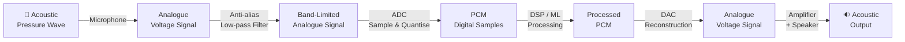

# 🔊 Digital Audio Fundamentals

> [!tldr] TL;DR
> Sound is a continuous pressure wave; digital audio captures it by measuring amplitude thousands of times per second (sample rate) and rounding each measurement to the nearest integer level (bit depth). The Nyquist theorem guarantees perfect reconstruction as long as the sample rate is at least twice the highest frequency present.

## Intuition

Imagine photographing a spinning fan: if the camera shutter fires fast enough you freeze each blade clearly; too slow and the blades blur or appear to spin backwards — that optical illusion is *aliasing*. Audio sampling works the same way. A microphone senses continuous pressure; an Analogue-to-Digital Converter (ADC) takes a snapshot of that pressure at regular intervals. The rate of snapshots is the **sample rate**, and the number of distinct amplitude levels available is determined by **bit depth**. When the fan (a frequency) spins faster than half the camera speed (Nyquist limit), the aliasing artefact maps it to a phantom lower frequency that was never in the original sound.

Technically: a band-limited signal $x(t)$ with maximum frequency $f_\text{max}$ can be perfectly reconstructed from its samples if the sample rate satisfies

$$f_s \geq 2 f_\text{max} \quad \text{(Nyquist–Shannon Theorem)}$$

## Mermaid Diagram



## Key Concepts

### Pulse-Code Modulation (PCM)

PCM is the lossless raw format for digital audio. Each sample is an integer encoding the instantaneous amplitude:

$$x[n] = \text{round}\!\left(\frac{x(nT_s)}{A_\text{max}} \cdot (2^{B-1} - 1)\right)$$

where $T_s = 1/f_s$ is the sampling period and $B$ is bit depth. WAV files store uncompressed PCM.

### Sample Rates

| Sample Rate | Typical Use |
|-------------|-------------|
| 8 kHz | Telephone / narrowband speech (max freq 4 kHz) |
| 16 kHz | Wideband speech, most ASR models |
| 22.05 kHz | Mid-quality audio, some TTS outputs |
| 44.1 kHz | CD audio, music production |
| 48 kHz | Broadcast, video audio track |

Speech energy is almost entirely below 8 kHz, so 16 kHz is the de-facto ASR standard.

### Bit Depth and Dynamic Range

Each additional bit doubles the number of quantisation levels, adding ~6 dB of dynamic range:

$$\text{Dynamic Range (dB)} \approx 6.02 \times B$$

| Bit Depth | Levels | Dynamic Range |
|-----------|--------|---------------|
| 8-bit | 256 | 48 dB |
| 16-bit | 65,536 | 96 dB |
| 24-bit | 16,777,216 | 144 dB |
| 32-bit float | ~1.8 × 10³⁸ (continuous) | ~190 dB |

### Decibels

**dB SPL** — absolute acoustic pressure: $L = 20 \log_{10}(p / p_0)$, reference $p_0 = 20\,\mu\text{Pa}$.

**dBFS** — relative to digital full-scale: 0 dBFS is the maximum representable sample; all real signals are negative dBFS. Silence is $-\infty$ dBFS.

**A-weighting** — frequency-dependent weighting (dBA) that mimics the ear's reduced sensitivity at low and very high frequencies, used in loudness standards.

### Audio File Formats

| Format | Type | Compression | Notes |
|--------|------|-------------|-------|
| WAV | Lossless | None (PCM) | Universal, large files |
| FLAC | Lossless | ~50% reduction | Free, supports metadata |
| AIFF | Lossless | None | Apple equivalent of WAV |
| MP3 | Lossy | ~10:1 | Psychoacoustic masking, 128–320 kbps |
| OGG Vorbis | Lossy | ~10:1 | Open codec, slightly better than MP3 |
| AAC | Lossy | ~12:1 | iTunes, better quality than MP3 at same bitrate |
| Opus | Lossy | Variable | Best codec for speech at low bitrates (<32 kbps) |

### Python: Loading and Inspecting Audio

```python
import librosa
import soundfile as sf
import numpy as np
import matplotlib.pyplot as plt

# --- Load with librosa (always resamples to mono float32 by default) ---
y, sr = librosa.load("speech.wav", sr=16000, mono=True)
# y: float32 numpy array in [-1.0, 1.0], sr: 16000

# --- Load with soundfile (preserves original sr and channels) ---
data, sr_orig = sf.read("speech.wav", dtype="float32")
# data shape: (num_samples,) for mono, (num_samples, 2) for stereo

# --- Basic statistics ---
duration = len(y) / sr                          # seconds
rms      = np.sqrt(np.mean(y ** 2))
peak_dbfs = 20 * np.log10(np.max(np.abs(y)) + 1e-9)

print(f"Duration : {duration:.2f} s")
print(f"Sample rate : {sr} Hz")
print(f"RMS amplitude : {rms:.4f}")
print(f"Peak level : {peak_dbfs:.1f} dBFS")

# --- Waveform plot ---
t = np.linspace(0, duration, len(y))
fig, ax = plt.subplots(figsize=(10, 3))
ax.plot(t, y, linewidth=0.5, color="steelblue")
ax.set_xlabel("Time (s)")
ax.set_ylabel("Amplitude")
ax.set_title("Waveform")
ax.set_ylim(-1.05, 1.05)
plt.tight_layout()
plt.savefig("waveform.png", dpi=150)
plt.show()

# --- Resample from 44.1 kHz to 16 kHz ---
y_16k = librosa.resample(y, orig_sr=44100, target_sr=16000)
```

## Real-World Notes

- Always **resample to 16 kHz** before feeding audio to pre-trained ASR/TTS models unless documentation specifies otherwise. Whisper, wav2vec 2.0, and HuBERT all expect 16 kHz.
- **Anti-aliasing filter** is applied *before* the ADC in real hardware; in software resampling librosa's `resample()` uses a polyphase filterbank that does this automatically.
- **Clipping** (samples hitting ±1.0) introduces severe harmonic distortion. Check with `(np.abs(y) >= 1.0).sum()` before processing.
- MP3/OGG decoding can introduce a **delay artefact** of ~100 ms of silence at the start; strip it with `librosa.load(..., offset=0.1)` if timestamps matter.
- For production pipelines prefer `soundfile` over `librosa.load` for the first read — it is faster and preserves the native sample rate without silent resampling.

## Common Pitfalls

- Forgetting to check sample rate before computing spectrograms — hop_length in *samples* scales with sr, so a 512-sample hop at 16 kHz is 32 ms, but at 44.1 kHz it is only 11.6 ms.
- Using `int16` audio arrays in arithmetic without casting to `float32` first — causes integer overflow.
- Assuming stereo files are mono — always check `data.ndim` and average channels if needed: `y = data.mean(axis=1)`.
- Ignoring DC offset (non-zero mean) — subtract the mean before computing spectrograms.
- MP3 lossy encoding before feeding to an ML model — always work from the original lossless source.

## Related Concepts

- [[STFT_and_Windowing]] — the next step: framing and windowing the PCM signal before frequency analysis
- [[Spectrograms_Features]] — converting PCM into 2-D time-frequency representations for ML
- [[_MOC_SS_Master]] — continuous-time Fourier analysis, sampling theory, and Z-transforms

## Review Questions

1. A signal has a maximum frequency of 7.5 kHz. What is the minimum sample rate required to avoid aliasing, and what standard sample rate would you choose?
2. A 16-bit PCM recording has a dynamic range of roughly 96 dB. How many bits would you need to capture a signal with a 120 dB dynamic range?
3. Why is MP3 unsuitable as a training data format for speech recognition models, and what should you use instead?

## Sources

- Shannon, C. E. (1949). *Communication in the Presence of Noise.* Proceedings of the IRE.
- Zölzer, U. (2011). *DAFX: Digital Audio Effects* (2nd ed.). Wiley.
- librosa documentation — https://librosa.org/doc/latest/
- ITU-R BS.1770 — Algorithms to measure audio programme loudness

#audio #PCM #sampling #nyquist #bit-depth #digital-audio #decibels #audio-formats
