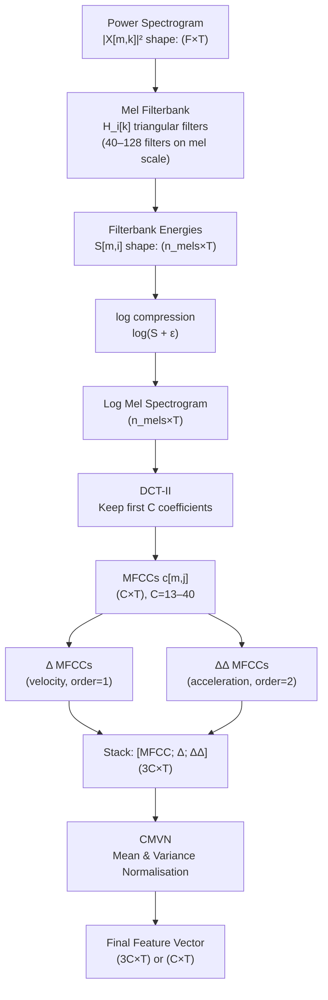

# 🎼 Mel Filterbank and MFCCs

> [!tldr] TL;DR
> The mel filterbank mimics the human cochlea by applying overlapping triangular filters spaced equally on the perceptual mel scale; log-compressing the filterbank outputs and applying a DCT decorrelates the energies into Mel-Frequency Cepstral Coefficients (MFCCs). Delta and delta-delta MFCCs add first and second derivatives over time, capturing speech dynamics essential for HMM-based ASR.

## Intuition

The human ear is not a spectrometer. Your cochlea resolves frequency differences finely at low pitches (you easily distinguish a 100 Hz tone from a 200 Hz tone) but very coarsely at high pitches (500 Hz and 600 Hz sound almost the same distance apart as 4500 Hz and 4600 Hz). This non-linear perceptual warping is the *mel scale*. Designing audio features that mimic it means the model's input already has "human-like" frequency resolution built in, which helps enormously for speech where information density is highest in the lower frequencies.

The DCT step is borrowed from image compression (JPEG). Filterbank channel energies are highly correlated with their neighbours (adjacent mel bands overlap). The DCT rotates the correlated channels into a decorrelated basis, concentrating most energy into the first ~13 coefficients (energy compaction). This makes each MFCC coefficient nearly independent — a major advantage for diagonal-covariance Gaussian models in HMM-GMM ASR.

## Mermaid Diagram



## Key Concepts

### Mel Scale

The mel scale converts linear frequency $f$ (Hz) to perceptual pitch $m$ (mel):

$$m = 2595 \log_{10}\!\left(1 + \frac{f}{700}\right)$$

Inverse conversion:

$$f = 700\!\left(10^{m/2595} - 1\right)$$

The crossover point where mel and Hz agree is approximately at 1000 Hz (1000 mel ≈ 1000 Hz). Above 1 kHz the mel scale increasingly compresses the frequency axis.

**Relationship to Bark scale:** The Bark scale (Zwicker, 1961) is an alternative psychoacoustic scale based on critical bandwidths. Mel and Bark differ mostly below 500 Hz; for speech processing mel is far more common.

### Triangular Filterbank Construction

$M$ filterbank centers $f_c(i)$ are placed uniformly spaced on the mel scale between $f_\text{min}$ and $f_\text{max}$:

1. Map $f_\text{min}$ and $f_\text{max}$ to mel: $m_\text{min}$, $m_\text{max}$
2. Create $M + 2$ equally spaced mel points: $m_0, m_1, \ldots, m_{M+1}$
3. Map back to Hz to get center frequencies $f_c(i) = 700(10^{m_i / 2595} - 1)$
4. Map center frequencies to FFT bin indices: $k(i) = \lfloor (N + 1) f_c(i) / f_s \rfloor$

The $i$-th triangular filter:

$$H_i[k] = \begin{cases}
\frac{k - k(i-1)}{k(i) - k(i-1)} & k(i-1) \leq k < k(i) \\
\frac{k(i+1) - k}{k(i+1) - k(i)} & k(i) \leq k \leq k(i+1) \\
0 & \text{otherwise}
\end{cases}$$

### Log Compression

$$S_\text{log}[m, i] = \log\!\left(S_\text{mel}[m, i] + \epsilon\right), \quad \epsilon = 10^{-10}$$

Log compression serves two purposes: (1) it compresses the dynamic range to match perceptual loudness sensitivity, and (2) it converts multiplicative noise (microphone gain variations, room reverberation) into additive noise, making features more robust.

### Discrete Cosine Transform (DCT-II)

The $j$-th MFCC coefficient at frame $m$:

$$c_j[m] = \sqrt{\frac{2}{M}} \sum_{i=1}^{M} S_\text{log}[m, i] \cos\!\left[\frac{\pi j (i - 0.5)}{M}\right], \quad j = 0, 1, \ldots, C-1$$

- $j = 0$: overall log energy of the frame (often replaced by $\log E$ separately)
- $j = 1$ to $j = 12$: spectral shape (most speech information here)
- $j > 12$: fine spectral detail, often noisy

### Delta and Delta-Delta Features

Velocity (Δ) and acceleration (ΔΔ) MFCCs capture temporal dynamics:

$$\Delta c_j[m] = \frac{\sum_{\tau=1}^{K} \tau \left(c_j[m + \tau] - c_j[m - \tau]\right)}{2 \sum_{\tau=1}^{K} \tau^2}$$

Typically $K = 2$ (uses 2 frames on each side). The full 39-dimensional feature vector is:

$$\mathbf{f}[m] = \left[c_1, \ldots, c_{13}, \Delta c_1, \ldots, \Delta c_{13}, \Delta^2 c_1, \ldots, \Delta^2 c_{13}\right]^\top$$

### CMVN (Cepstral Mean Variance Normalisation)

CMVN removes channel and speaker variation by standardising each coefficient across the utterance (or across a sliding window of ~3 seconds for streaming):

$$\hat{c}_j[m] = \frac{c_j[m] - \mu_j}{\sigma_j + \epsilon}$$

where $\mu_j = \frac{1}{T}\sum_m c_j[m]$ and $\sigma_j = \sqrt{\frac{1}{T}\sum_m (c_j[m] - \mu_j)^2}$.

**Global CMVN** (mean over the entire corpus) is preferred for neural network inputs as it does not distort per-utterance dynamics.

### Feature Comparison for ASR

| Feature | Dim | Invertible | Noise Robust | Modern ASR Use |
|---------|-----|-----------|--------------|----------------|
| Raw waveform | 1 | Yes | No | wav2vec 2.0, HuBERT |
| 40-bin log mel | 40 | No | Moderate | Whisper, Conformer |
| 80-bin log mel | 80 | No | Moderate | Most modern models |
| 13 MFCCs | 13 | No | Good (CMVN) | HMM-GMM, classical DNN |
| 39 MFCCs (Δ,ΔΔ) | 39 | No | Good | Classical ASR systems |

### Custom Filterbank Implementation

```python
import numpy as np
import librosa
import matplotlib.pyplot as plt

def mel_to_hz(m: np.ndarray) -> np.ndarray:
    return 700.0 * (10.0 ** (m / 2595.0) - 1.0)

def hz_to_mel(f: np.ndarray) -> np.ndarray:
    return 2595.0 * np.log10(1.0 + f / 700.0)

def build_mel_filterbank(
    sr: int = 16000,
    n_fft: int = 1024,
    n_mels: int = 40,
    fmin: float = 0.0,
    fmax: float = 8000.0,
) -> np.ndarray:
    """
    Returns filterbank matrix H of shape (n_mels, 1 + n_fft // 2).
    Rows are filters; columns are FFT bins.
    """
    n_freqs = 1 + n_fft // 2
    fft_freqs = np.linspace(0, sr / 2, n_freqs)

    mel_min, mel_max = hz_to_mel(np.array([fmin, fmax]))
    mel_points = np.linspace(mel_min, mel_max, n_mels + 2)
    hz_points  = mel_to_hz(mel_points)
    bin_points = np.floor((n_fft + 1) * hz_points / sr).astype(int)

    H = np.zeros((n_mels, n_freqs), dtype=np.float32)
    for i in range(n_mels):
        left, center, right = bin_points[i], bin_points[i + 1], bin_points[i + 2]
        for k in range(left, center + 1):
            if center > left:
                H[i, k] = (k - left) / (center - left)
        for k in range(center, right + 1):
            if right > center:
                H[i, k] = (right - k) / (right - center)
    return H

# ── Full MFCC extraction pipeline ─────────────────────────────────────────────
def extract_mfccs(
    y: np.ndarray,
    sr: int = 16000,
    n_fft: int = 1024,
    hop_length: int = 256,
    n_mels: int = 40,
    n_mfcc: int = 13,
    cmvn: bool = True,
) -> np.ndarray:
    import scipy.fft

    # 1. Power spectrogram
    D = librosa.stft(y, n_fft=n_fft, hop_length=hop_length, window="hann")
    power = np.abs(D) ** 2                                   # (F, T)

    # 2. Apply mel filterbank
    H = build_mel_filterbank(sr=sr, n_fft=n_fft, n_mels=n_mels)
    mel_energy = H @ power                                   # (n_mels, T)

    # 3. Log compression
    log_mel = np.log(mel_energy + 1e-10)                     # (n_mels, T)

    # 4. DCT-II (scipy uses type-2 DCT with orthonormal normalisation)
    mfcc = scipy.fft.dct(log_mel, type=2, axis=0, norm="ortho")[:n_mfcc]  # (n_mfcc, T)

    # 5. Delta features
    delta  = librosa.feature.delta(mfcc, order=1)
    delta2 = librosa.feature.delta(mfcc, order=2)
    features = np.vstack([mfcc, delta, delta2])              # (3*n_mfcc, T)

    # 6. CMVN (utterance-level)
    if cmvn:
        mean = features.mean(axis=1, keepdims=True)
        std  = features.std(axis=1, keepdims=True) + 1e-8
        features = (features - mean) / std

    return features

# ── Demo ──────────────────────────────────────────────────────────────────────
y, sr = librosa.load("speech.wav", sr=16000, mono=True)
feats = extract_mfccs(y, sr)
print(f"MFCC feature shape: {feats.shape}")   # (39, T)

# Visualise filterbank
H = build_mel_filterbank()
fig, ax = plt.subplots(figsize=(10, 4))
freqs = np.linspace(0, 8000, H.shape[1])
for i in range(H.shape[0]):
    ax.plot(freqs, H[i])
ax.set_xlabel("Frequency (Hz)")
ax.set_ylabel("Filter Response")
ax.set_title("40-Filter Mel Filterbank (0–8 kHz)")
plt.tight_layout()
plt.savefig("mel_filterbank.png", dpi=150)
plt.show()
```

## Real-World Notes

- **13 MFCCs + Δ + ΔΔ = 39 dims** was the standard for HMM-GMM ASR through the mid-2010s. Modern end-to-end models use 80 log mel bins without DCT.
- **CMVN window size matters**: utterance-level CMVN does not work for streaming/online systems. Use a 3–10 second sliding window instead.
- **Librosa vs torchaudio MFCCs are not identical** — librosa uses a slightly different mel filterbank normalisation (`norm="slaney"` by default); always check which convention your downstream model expects.
- At very low signal energy (silence) log mel values are near $\log \epsilon \approx -23$; CMVN normalises this away but raw log-mel silence frames can confuse models.
- **Pre-emphasis** (applied before STFT) lifts high-frequency energy and partially compensates for the natural spectral tilt of speech, improving high-frequency MFCC coefficients.

## Common Pitfalls

- Using `librosa.feature.mfcc` with default `n_mfcc=20` when your model expects 13 — always set explicitly.
- Forgetting to remove the 0th MFCC ($c_0$, log energy) when using the standard 12-coefficient speech representation.
- Applying utterance CMVN before delta computation — compute deltas first, then normalise the concatenated 39-dim vector.
- Not specifying `fmax` — default is `sr/2 = 8000` for 16 kHz audio, which is fine, but confirm if using 22 kHz or 44 kHz audio.
- Confusing mel spectrogram shape `(n_mels, T)` with MFCC shape `(n_mfcc, T)` — they look identical but have very different semantics.

## Related Concepts

- [[STFT_and_Windowing]] — the power spectrogram that feeds the mel filterbank
- [[Spectrograms_Features]] — overview of the full STFT → mel → MFCC pipeline
- [[Audio_Preprocessing_Augmentation]] — pre-emphasis filter typically applied before mel extraction; CMVN in preprocessing context

## Review Questions

1. Why are the mel filterbank triangular filters wider at high frequencies when measured in Hz, even though they are equally spaced on the mel scale?
2. What is the role of the DCT in MFCC extraction, and why does it help classical ASR systems that use diagonal Gaussian models?
3. A researcher replaces utterance-level CMVN with global CMVN computed over the full training corpus. What are the tradeoffs for (a) offline batch inference and (b) online streaming inference?

## Sources

- Davis, S. & Mermelstein, P. (1980). *Comparison of Parametric Representations for Monosyllabic Word Recognition.* IEEE TASLP.
- O'Shaughnessy, D. (1987). *Speech Communication: Human and Machine.* Addison-Wesley.
- Young, S. et al. (2006). *The HTK Book* (v3.4). Cambridge University Engineering Dept.
- Huang, X., Acero, A., & Hon, H.-W. (2001). *Spoken Language Processing.* Prentice Hall.

#mel-filterbank #MFCC #mel-scale #cepstrum #DCT #CMVN #delta-features #speech-features
