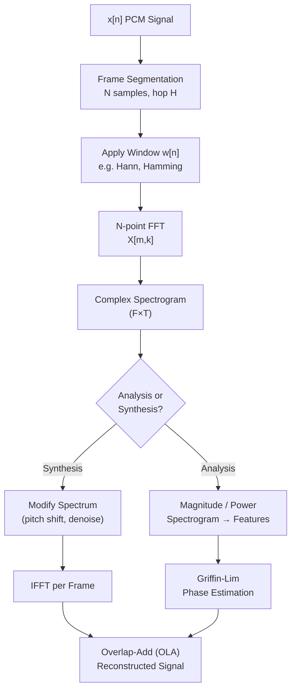

# 🪟 STFT and Windowing

> [!tldr] TL;DR
> The Short-Time Fourier Transform chops a signal into short overlapping frames and applies a window function before each FFT to prevent spectral leakage at frame boundaries. The window type and length control the fundamental time-frequency resolution tradeoff: longer windows give sharper frequency resolution but smear transients; shorter windows resolve transients at the cost of frequency smearing.

## Intuition

Imagine asking "which musical notes are playing?" at every moment during a song. If you listen for a very long time (large window), you can identify the pitch precisely but lose track of *when* each note started. If you listen for just a split second (small window), you catch fast changes but cannot distinguish close frequencies. This is the **time-frequency uncertainty principle** — you cannot be arbitrarily precise in both dimensions simultaneously.

The **window function** is a smooth taper applied to each frame before the FFT. Without tapering, a frame has abrupt hard edges where the signal is simply cut off. The FFT treats these discontinuities as artificial high-frequency energy that "leaks" into all frequency bins — spectral leakage. A smooth window rolls the amplitude to zero at both ends, eliminating the discontinuity and dramatically reducing leakage.

Formally, the uncertainty principle in time-frequency analysis states:

$$\Delta t \cdot \Delta f \geq \frac{1}{4\pi}$$

where $\Delta t$ is the time resolution and $\Delta f$ is the frequency resolution of the STFT.

## Mermaid Diagram



## Key Concepts

### STFT Definition

$$X[m, k] = \sum_{n=0}^{N-1} x[n + mH]\, w[n]\, e^{-j 2\pi k n / N}$$

Key hyperparameters:

| Parameter | Symbol | Typical Speech | Typical Music |
|-----------|--------|---------------|---------------|
| FFT size | N (n_fft) | 1024 | 2048–4096 |
| Window length | $N_w$ (win_length) | = n_fft | = n_fft |
| Hop length | H (hop_length) | 256 (25% of N) | 512 |
| Frame rate | $f_s / H$ | 62.5 fps | 43–86 fps |
| Freq resolution | $f_s / N$ | 15.6 Hz | 11–22 Hz |

### Window Functions

All windows are defined on $n = 0, \ldots, N_w - 1$:

**Rectangular (boxcar)**
$$w_\text{rect}[n] = 1$$
No taper. Worst spectral leakage (~13 dB sidelobe). Used when leakage is irrelevant (e.g., block-by-block processing without overlap).

**Hann (Hanning)**
$$w_\text{hann}[n] = 0.5 \left(1 - \cos\frac{2\pi n}{N_w - 1}\right)$$
Most commonly used in audio DSP. ~31 dB sidelobe suppression. Satisfies the Constant Overlap-Add (COLA) condition at 50% overlap.

**Hamming**
$$w_\text{hamm}[n] = 0.54 - 0.46 \cos\frac{2\pi n}{N_w - 1}$$
Slightly better sidelobe suppression (~43 dB) than Hann at the cost of higher mainlobe width.

**Blackman**
$$w_\text{black}[n] = 0.42 - 0.5\cos\frac{2\pi n}{N_w-1} + 0.08\cos\frac{4\pi n}{N_w-1}$$
~74 dB sidelobe suppression — best for resolving closely spaced tones. Widest mainlobe (worst frequency resolution).

| Window | Mainlobe Width | Sidelobe Level | Use Case |
|--------|---------------|----------------|----------|
| Rectangular | Narrowest | −13 dB | Rarely — worst leakage |
| Hamming | Moderate | −43 dB | Speech (classic) |
| Hann | Moderate | −31 dB | Speech & music (default) |
| Blackman | Widest | −74 dB | Resolving closely spaced tones |

### Time-Frequency Resolution Tradeoff

$$\Delta f = \frac{f_s}{N}, \quad \Delta t = \frac{H}{f_s}$$

At 16 kHz:

| n_fft | $\Delta f$ | hop_length | $\Delta t$ |
|-------|-----------|------------|-----------|
| 256 | 62.5 Hz | 64 | 4 ms |
| 512 | 31.25 Hz | 128 | 8 ms |
| 1024 | 15.6 Hz | 256 | 16 ms |
| 2048 | 7.8 Hz | 512 | 32 ms |

### Zero-Padding and Spectral Interpolation

Setting `n_fft > win_length` zero-pads each frame before the FFT. This **does not increase frequency resolution** (resolution is still $f_s / N_w$) but interpolates the spectrum, producing smoother-looking spectrograms and improving peak frequency estimation.

### Overlap-Add (OLA) Reconstruction

To reconstruct a signal from a modified STFT (each frame processed independently):

$$\hat{x}[n] = \frac{\sum_m \tilde{X}_m[n] \cdot w[n - mH]}{\sum_m w^2[n - mH]}$$

The denominator is the normalisation window; perfect reconstruction is possible when the synthesis window satisfies the COLA constraint (e.g., Hann at 50% or 75% overlap).

### Griffin-Lim Algorithm

When only the magnitude spectrogram $|X[m,k]|$ is known (phase discarded), Griffin-Lim iteratively estimates the missing phase:

1. Initialise with random phase: $X^{(0)}[m,k] = |X[m,k]| e^{j \phi_0}$
2. ISTFT → $\hat{x}^{(t)}$
3. STFT → $\hat{X}^{(t)}[m,k]$
4. Replace magnitude: $X^{(t+1)}[m,k] = |X[m,k]| e^{j \angle \hat{X}^{(t)}}$
5. Repeat 30–60 iterations until convergence

Griffin-Lim is the baseline vocoder; neural vocoders (HiFi-GAN, WaveGlow) produce much better quality.

### Python: STFT, ISTFT, Griffin-Lim

```python
import librosa
import numpy as np
import matplotlib.pyplot as plt
import scipy.signal as signal

y, sr = librosa.load("speech.wav", sr=16000, mono=True)

# ── STFT ──────────────────────────────────────────────────────────────────────
n_fft      = 1024
hop_length = 256
win_length = 1024

D = librosa.stft(
    y,
    n_fft=n_fft,
    hop_length=hop_length,
    win_length=win_length,
    window="hann",
    center=True          # pads signal so frame 0 is centred on sample 0
)
print(f"STFT shape: {D.shape}")   # (513, T) — (n_fft//2+1, frames)

# ── Perfect reconstruction (ISTFT) ───────────────────────────────────────────
y_reconstructed = librosa.istft(
    D,
    hop_length=hop_length,
    win_length=win_length,
    window="hann",
    center=True,
    length=len(y)
)
reconstruction_error = np.max(np.abs(y - y_reconstructed))
print(f"Max reconstruction error: {reconstruction_error:.2e}")  # should be ~1e-7

# ── Griffin-Lim phase reconstruction ─────────────────────────────────────────
mag = np.abs(D)                              # discard phase
y_griffin = librosa.griffinlim(
    mag,
    n_iter=60,
    hop_length=hop_length,
    win_length=win_length,
    window="hann",
    n_fft=n_fft,
    length=len(y)
)

# ── Compare window functions ──────────────────────────────────────────────────
N = 1024
windows = {
    "Rectangular": np.ones(N),
    "Hann":        np.hanning(N),
    "Hamming":     np.hamming(N),
    "Blackman":    np.blackman(N),
}

fig, axes = plt.subplots(1, 2, figsize=(14, 4))
for name, w in windows.items():
    W = 20 * np.log10(np.abs(np.fft.fft(w, n=8 * N)) + 1e-12)
    W -= W.max()
    axes[0].plot(w, label=name)
    axes[1].plot(W[:N * 2], label=name)

axes[0].set_title("Window Shapes")
axes[0].set_xlabel("Sample")
axes[0].legend()
axes[1].set_title("Frequency Response (dB)")
axes[1].set_xlabel("Frequency bin")
axes[1].set_ylim(-120, 5)
axes[1].legend()
plt.tight_layout()
plt.savefig("windows.png", dpi=150)
plt.show()
```

## Real-World Notes

- For neural vocoder training (HiFi-GAN, Encodec) use **n_fft=1024, hop_length=256, win_length=1024** — this is the most common configuration in published papers.
- `center=True` (default in librosa) pads both ends of the signal with `n_fft//2` zeros so every audio sample appears in at least one frame. Turn it off if you need exact timestamp alignment (e.g., streaming inference).
- The phase vocoder (used in time-stretching) tracks phase *continuity* across frames rather than discarding it — this avoids the "phasiness" artefacts of Griffin-Lim.
- Overlap of 75% (hop = N/4) with a Hann window gives even better quality in synthesis applications.

## Common Pitfalls

- Using `center=False` and then comparing spectrogram timestamps to waveform samples — the frame-to-time mapping differs.
- Setting `hop_length` larger than `win_length/2` — violates COLA, causing amplitude fluctuations in OLA reconstruction.
- Assuming Griffin-Lim will produce broadcast-quality audio — it sounds metallic/phasey; only use it for debugging or as a baseline.
- Zero-padding to a larger `n_fft` and thinking resolution has improved — resolution is set by `win_length`, not `n_fft`.
- Forgetting that librosa's STFT outputs a *complex* array of shape `(1 + n_fft//2, T)` — taking `.real` is wrong; always use `np.abs(D)` for magnitude.

## Related Concepts

- [[Digital_Audio_Fundamentals]] — PCM waveform and sampling prerequisites
- [[Spectrograms_Features]] — using STFT output to build mel spectrograms and MFCCs
- [[Mel_Filterbank_MFCCs]] — applying mel filterbank to power spectrogram bins
- [[Audio_Preprocessing_Augmentation]] — phase vocoder used in pitch shifting and time stretching

## Review Questions

1. Why does the Hann window reduce spectral leakage compared to the rectangular window, and what does it cost?
2. Given n_fft=2048, hop_length=512, sr=44100 — what is the frequency resolution in Hz and the time step between frames in ms?
3. Explain why Griffin-Lim converges and what prevents it from recovering the original phase exactly.

## Sources

- Allen, J. B. & Rabiner, L. R. (1977). *A Unified Approach to Short-Time Fourier Analysis and Synthesis.* Proc. IEEE.
- Griffin, D. & Lim, J. (1984). *Signal Estimation from Modified Short-Time Fourier Transform.* IEEE TASSP.
- Zölzer, U. (2011). *DAFX: Digital Audio Effects* (2nd ed.). Wiley.
- Harris, F. J. (1978). *On the Use of Windows for Harmonic Analysis with the DFT.* Proc. IEEE.

#STFT #windowing #spectral-leakage #FFT #griffin-lim #phase-vocoder #OLA #librosa
