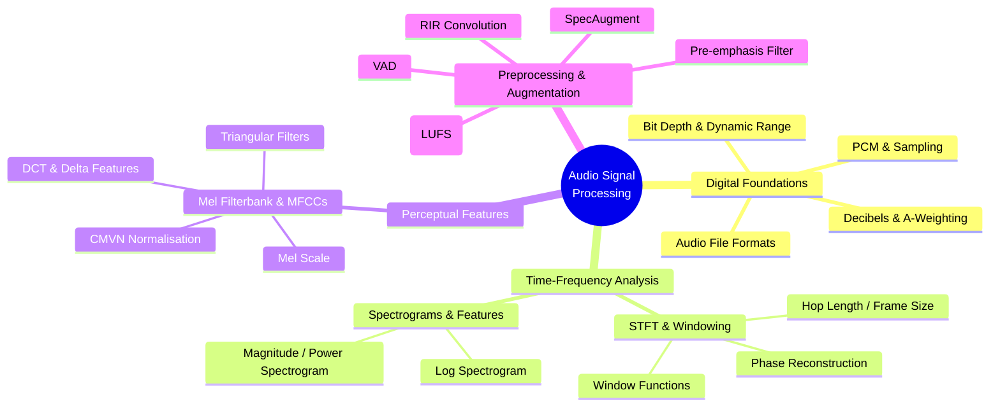

# 🎧 Audio Signal Processing — Map of Content

> [!abstract]
> Audio Signal Processing is the mathematical and computational foundation for every audio and speech system. This section covers how analog sound is captured and digitised (PCM, sampling, bit depth), how signals are decomposed into time-frequency representations (STFT, spectrograms, mel filterbanks, MFCCs), and how raw recordings are cleaned and augmented before being fed into models. Mastering these five notes gives you the signal-processing vocabulary needed for ASR, TTS, speaker recognition, and audio classification.

## Concept Map

## Learning Path

| Step | Note | Why |
|------|------|-----|
| 1 | [[Digital_Audio_Fundamentals]] | Understand how sound becomes numbers before any processing |
| 2 | [[STFT_and_Windowing]] | Learn the core framing operation that underpins all spectral features |
| 3 | [[Spectrograms_Features]] | Build intuition for STFT output — magnitude, power, log spectrograms |
| 4 | [[Mel_Filterbank_MFCCs]] | Apply perceptual compression and extract classic speech features |
| 5 | [[Audio_Preprocessing_Augmentation]] | Prepare and augment real-world audio for model training |

## All Notes in This Section

| Note | Difficulty | Key Concept |
|------|------------|-------------|
| [[Digital_Audio_Fundamentals]] | Beginner | PCM, Nyquist, sample rates, bit depth, audio formats |
| [[STFT_and_Windowing]] | Intermediate | Window functions, spectral leakage, OLA reconstruction |
| [[Spectrograms_Features]] | Intermediate | STFT → mel spectrogram → MFCC extraction pipeline |
| [[Mel_Filterbank_MFCCs]] | Intermediate | Mel scale, triangular filterbanks, DCT, delta MFCCs, CMVN |
| [[Audio_Preprocessing_Augmentation]] | Intermediate | Pre-emphasis, SpecAugment, RIR noise, LUFS normalisation |

## Key Questions This Section Answers

1. Why must the sample rate be at least twice the highest frequency of interest, and what happens when it is not?
2. How does the STFT decompose a non-stationary signal into a 2-D time-frequency representation?
3. Why do speech and audio models prefer mel spectrograms or MFCCs over raw FFT bins?
4. What are the tradeoffs between window length and hop length when computing an STFT?
5. Which augmentation strategies transfer from vision (SpecAugment) and which are audio-specific (RIR convolution)?

## Related Sections

- [[_MOC_ASR]] — Automatic Speech Recognition builds directly on STFT and MFCC features from this section
- [[_MOC_TTS]] — Text-to-Speech synthesis uses vocoder components (Griffin-Lim, mel spectrograms) explained here
- [[_MOC_SS_Master]] — Signals & Systems vault: continuous-time Fourier theory, convolution, z-transforms that underpin DSP
- [[_MOC_Audio_Speech_Master]] — Top-level Audio & Speech vault index

#MOC #AudioSignalProcessing #AudioSpeech
