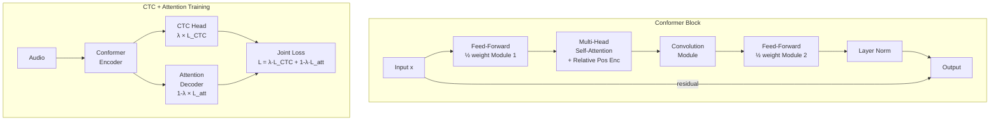

# ⚡ CTC, Attention Hybrid, and the Conformer

> [!tldr] TL;DR
> CTC (Connectionist Temporal Classification) eliminates forced alignment by marginalising over all valid input-output alignments via a blank symbol and dynamic programming. The Conformer encoder, combining convolution (local) with self-attention (global), sets the state of the art when trained with a joint CTC + attention loss.

## Intuition

Imagine transcribing a speech recording without knowing exactly when each word was spoken. CTC says: "I don't need to know the exact timing — I'll just say there's a blank between letters, collapse repeated outputs, and sum over all possible timing arrangements." It is like reading a telegram that spaces out letters but might repeat them: "H-H-E-L-_-L-_-O" collapses to "HELLO".

The Conformer improves the encoder by noticing that transformers are excellent at long-range context but miss fine-grained local patterns. Adding a convolutional sub-layer inside each block gives the model both telescopic (global attention) and microscopic (convolution) views — like combining binoculars and a magnifying glass in the same instrument.

## Mermaid Diagram



## Key Concepts

### CTC: The Alignment Problem

Standard cross-entropy requires knowing which input frame corresponds to which output token. CTC removes this requirement by introducing a **blank symbol** $\langle\text{b}\rangle$ and defining a many-to-one mapping $\mathcal{B}$ that collapses paths to transcripts:

- Remove all blank symbols
- Merge consecutive duplicate symbols

Example: `[h, h, \langle b\rangle, e, l, l, \langle b\rangle, l, o]` → `hello`

### CTC Loss: Forward-Backward Algorithm

The CTC loss marginalises over all valid alignments $\pi$ that collapse to the target $\mathbf{y}$:

$$\mathcal{L}_{\text{CTC}} = -\log P(\mathbf{y} \mid X) = -\log \sum_{\pi \in \mathcal{B}^{-1}(\mathbf{y})} P(\pi \mid X)$$

$$P(\pi \mid X) = \prod_{t=1}^{T} p_t(\pi_t \mid X)$$

This sum is computed efficiently with the **forward variable** $\alpha_t(s)$ — the probability of emitting the first $s$ tokens of the extended label sequence by frame $t$:

$$\alpha_t(s) = \alpha_{t-1}(s) \cdot p_t(\pi_t = \ell_s) + \alpha_{t-1}(s-1) \cdot p_t(\pi_t = \ell_{s-1})$$

with an additional term for the blank symbol and non-blank repeat transitions. Total complexity: $O(T \cdot S)$.

> [!important] CTC Independence Assumption
> CTC assumes conditional independence of output tokens given the encoder states: $P(\pi \mid X) = \prod_t p_t(\pi_t \mid X)$. This prevents the model from learning inter-token dependencies, which limits language modelling capacity.

### CTC Decoding

**Greedy**: argmax at every timestep, then collapse. Fast but suboptimal.

**Prefix beam search**: maintains a set of prefixes with probabilities summed over all valid alignments. At each step, extend prefixes with any symbol or blank. Integrates an external LM during search:

$$\log \hat{P}(W) = \log P_{\text{CTC}}(W \mid X) + \lambda \log P_{\text{LM}}(W)$$

```python
import torch
import torchaudio

# CTC loss with PyTorch
def compute_ctc_loss(log_probs, targets, input_lengths, target_lengths):
    """
    log_probs: (T, B, vocab+1)  — softmax output including blank at index 0
    targets: (B, S)              — target token sequences
    """
    ctc_loss = torch.nn.CTCLoss(blank=0, reduction='mean', zero_infinity=True)
    loss = ctc_loss(log_probs, targets, input_lengths, target_lengths)
    return loss

# Example: using pyctcdecode for beam search with LM
# pip install pyctcdecode kenlm
from pyctcdecode import build_ctcdecoder

vocab = ["<blank>", "a", "b", "c", "d", "e", " ", "..."]  # your vocab
decoder = build_ctcdecoder(
    labels=vocab,
    kenlm_model="path/to/lm.arpa",
    alpha=0.5,   # LM weight
    beta=1.0,    # word insertion bonus
)

# logits: (T, vocab_size) numpy array
transcript = decoder.decode(logits)
```

### Conformer Architecture

The Conformer (Gulati et al. 2020) interleaves feed-forward, self-attention, and convolution modules in a macaron-style layout:

$$\tilde{x} = x + \tfrac{1}{2} \text{FF}(x)$$
$$\tilde{x} = \tilde{x} + \text{MHSA}(\tilde{x})$$
$$\tilde{x} = \tilde{x} + \text{Conv}(\tilde{x})$$
$$y = \text{LayerNorm}\!\left(\tilde{x} + \tfrac{1}{2} \text{FF}(\tilde{x})\right)$$

**Convolution Module** (inside each Conformer block):

```
LayerNorm → Pointwise Conv → GLU → Depthwise Conv (k=31) → BN → Swish → Pointwise Conv → Dropout
```

**Relative Positional Encoding** (Shaw et al., Transformer-XL style): attention logit becomes:

$$e_{ij} = \frac{(q_i + u)^\top k_j + (q_i + v)^\top r_{i-j}}{\sqrt{d_k}}$$

where $r_{i-j}$ is a sinusoidal encoding of the relative distance, and $u, v$ are learned bias vectors.

```python
import torch
import torch.nn as nn

class ConformerBlock(nn.Module):
    """Simplified Conformer block."""
    def __init__(self, d_model=256, num_heads=4, conv_kernel=31,
                 ff_expansion=4, dropout=0.1):
        super().__init__()
        self.ff1 = nn.Sequential(
            nn.LayerNorm(d_model),
            nn.Linear(d_model, d_model * ff_expansion),
            nn.SiLU(),
            nn.Dropout(dropout),
            nn.Linear(d_model * ff_expansion, d_model),
            nn.Dropout(dropout),
        )
        self.attn = nn.MultiheadAttention(d_model, num_heads,
                                          dropout=dropout, batch_first=True)
        self.attn_norm = nn.LayerNorm(d_model)
        # Depthwise separable conv
        self.conv = nn.Sequential(
            nn.LayerNorm(d_model),
            nn.Conv1d(d_model, 2 * d_model, 1),          # pointwise + GLU
            nn.GLU(dim=1),
            nn.Conv1d(d_model, d_model, conv_kernel,      # depthwise
                      padding=conv_kernel // 2, groups=d_model),
            nn.BatchNorm1d(d_model),
            nn.SiLU(),
            nn.Conv1d(d_model, d_model, 1),               # pointwise
            nn.Dropout(dropout),
        )
        self.ff2 = nn.Sequential(
            nn.LayerNorm(d_model),
            nn.Linear(d_model, d_model * ff_expansion),
            nn.SiLU(),
            nn.Dropout(dropout),
            nn.Linear(d_model * ff_expansion, d_model),
            nn.Dropout(dropout),
        )
        self.final_norm = nn.LayerNorm(d_model)

    def forward(self, x):
        x = x + 0.5 * self.ff1(x)
        x_norm = self.attn_norm(x)
        x = x + self.attn(x_norm, x_norm, x_norm)[0]
        x_conv = self.conv(x.transpose(1, 2)).transpose(1, 2)
        x = x + x_conv
        x = x + 0.5 * self.ff2(x)
        return self.final_norm(x)
```

### CTC + Attention Hybrid (ESPnet)

Jointly train CTC and attention decoder on the same encoder:

$$\mathcal{L} = \lambda \cdot \mathcal{L}_{\text{CTC}} + (1 - \lambda) \cdot \mathcal{L}_{\text{attention}}$$

Typical $\lambda = 0.3$. During decoding, combine both scores in beam search:

$$\text{score}(y) = (1-\lambda) \log P_{\text{att}}(y|X) + \lambda \log P_{\text{CTC}}(y|X) + \gamma \log P_{\text{LM}}(y)$$

Benefits: CTC enforces monotonic alignment (speeds up convergence), attention provides label dependency modelling (lower WER).

## Comparison Table

| Criterion | CTC | Attention | CTC+Attn Hybrid | Conformer-CTC |
|-----------|-----|-----------|-----------------|---------------|
| Alignment-free training | Yes | Yes | Yes | Yes |
| Models label dependencies | No | Yes | Partial | Yes (attn) |
| Streaming friendly | Yes | No (needs full input) | Partial | Partial |
| Monotonic alignment | Yes | No | Soft via CTC | Soft via CTC |
| LibriSpeech test-clean | ~2.5% | ~2.8% | ~2.1% | ~1.9% |
| Training stability | High | Moderate | High | High |

## Real-World Notes

- ESPnet2 ships a complete Conformer-CTC+attention recipe for LibriSpeech, Aishell-1, and Common Voice.
- Conformer-Transducer (RNN-T instead of attention decoder) is popular for streaming on-device ASR (Google Pixel).
- `pyctcdecode` is the standard open-source beam search decoder with KenLM integration for CTC models.
- The `blank_id` must be consistent between training and decoding; convention in ESPnet is blank = 0.

## Common Pitfalls

- **CTC input length must be ≥ output length**: after downsampling by 4×, a 0.25-second clip might have fewer encoder frames than tokens — CTC loss becomes undefined.
- **GLU dimension mismatch**: Conformer conv pointwise produces 2*d_model for GLU but output must be d_model; forgetting `groups=d_model` in depthwise conv breaks channel count.
- **λ tuning**: too high λ (→ 1.0) makes training CTC-only and loses attention quality; typical optimum is λ ∈ [0.2, 0.4].
- **Relative position bias at inference on long audio**: model trained on ≤30 s clips may degrade on longer audio if positional encoding doesn't extrapolate.

## Related Concepts

- [[ASR_Deep_Learning]] — LAS encoder-decoder precursor to CTC+attention
- [[Whisper_Architecture]] — pure attention Transformer, no CTC
- [[LM_Integration_ASR]] — integrating external LMs with CTC beam search
- [[_MOC_Audio_Foundation_Models]] — wav2vec 2.0 pre-trains a Conformer encoder with CTC fine-tuning

## Review Questions

1. Write the CTC forward variable recursion $\alpha_t(s)$ and explain why two transitions (from $s$ and $s-1$) are needed, with a third for non-blank repetitions.
2. Why does CTC's conditional independence assumption limit language modelling capacity, and how does the hybrid CTC+attention approach compensate?
3. Describe the four sub-modules of a Conformer block in order. What does each module capture, and why is the feed-forward module applied at half-weight on each side?

## Sources

- Graves, A., Fernández, S., Gomez, F., & Schmidhuber, J. (2006). "Connectionist Temporal Classification." *ICML*.
- Gulati, A. et al. (2020). "Conformer: Convolution-augmented Transformer for Speech Recognition." *Interspeech*.
- Watanabe, S. et al. (2017). "Hybrid CTC/Attention Architecture for End-to-End Speech Recognition." *IEEE JSTSP*.
- Kahn, J. et al. (2020). "Self-training and Pre-training are Complementary for Speech Recognition." *ICASSP*.

#asr #ctc #conformer #attention #hybrid #espnet #speech-recognition #alignment-free
