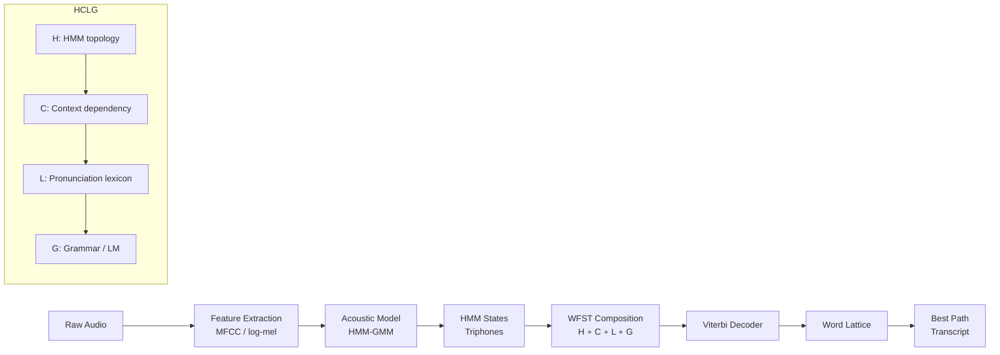

# 🏛️ HMM-GMM Classical ASR Pipeline

> [!tldr] TL;DR
> Classical ASR chains an HMM-GMM acoustic model, a pronunciation lexicon, and an n-gram language model into a single WFST graph (HCLG) decoded with Viterbi search. This pipeline dominated the field from the 1980s through ~2012 and still underpins many production Kaldi-based systems.

## Intuition

Imagine transcribing speech like solving a jigsaw puzzle with three separate boxes. The first box (acoustic model) figures out which sounds are being made at each moment. The second box (pronunciation dictionary) knows how sequences of sounds spell out words. The third box (language model) knows which sequences of words make sense in a sentence. Classical ASR snaps these three boxes together into one giant lookup graph and races through it to find the most likely word sequence.

Technically: the acoustic model is a Hidden Markov Model where hidden states represent sub-phoneme units, and each state emits acoustic feature vectors drawn from a Gaussian Mixture Model. A Weighted Finite-State Transducer (WFST) framework fuses all three knowledge sources into a single composed graph for efficient decoding.

## Mermaid Diagram



## Key Concepts

### HMM Topology for Phonemes

Each phoneme is modelled as a **3-state left-to-right HMM** (entry, middle, exit). Self-loops allow the model to stay in a state for multiple frames.

$$P(\mathbf{O}, \mathbf{Q}) = \pi_{q_1} \prod_{t=1}^{T} a_{q_{t-1}, q_t} \cdot b_{q_t}(\mathbf{o}_t)$$

- $\mathbf{O} = \{o_1, \ldots, o_T\}$: observation sequence (MFCC frames)
- $\mathbf{Q} = \{q_1, \ldots, q_T\}$: hidden state sequence
- $a_{ij}$: transition probability from state $i$ to state $j$
- $b_j(o_t)$: emission probability of observation $o_t$ in state $j$

### GMM Emission Probabilities

Each HMM state emits a feature vector with probability given by a Gaussian Mixture:

$$b_j(\mathbf{o}_t) = \sum_{k=1}^{K} w_k \, \mathcal{N}(\mathbf{o}_t;\, \boldsymbol{\mu}_k,\, \boldsymbol{\Sigma}_k)$$

- $w_k$: mixture weight, $\sum_k w_k = 1$
- $\boldsymbol{\mu}_k, \boldsymbol{\Sigma}_k$: mean and covariance of the $k$-th Gaussian
- Typical: 16–64 Gaussians per state; diagonal covariance

### Triphone Context Dependency

Monophone HMMs ignore context; **triphones** condition on left and right neighbours: `/p/` becomes `/s-p+t/` (left context `s`, right context `t`). This gives $\sim$7,000–12,000 tied states (senones) after clustering with a decision tree.

### Viterbi Decoding

Finds the single most-likely state sequence:

$$\delta_t(j) = \max_{q_1,\ldots,q_{t-1}} P(o_1,\ldots,o_t, q_t = j \mid \lambda)$$

$$\delta_t(j) = \left[\max_i \delta_{t-1}(i) \cdot a_{ij}\right] \cdot b_j(o_t)$$

Backtracking recovers the best state path in $O(TN^2)$ time.

### Baum-Welch (EM) Training

Expectation step: compute forward $\alpha_t(j)$ and backward $\beta_t(j)$ probabilities.

$$\alpha_t(j) = \sum_i \alpha_{t-1}(i) \cdot a_{ij} \cdot b_j(o_t)$$

Maximisation step: re-estimate $\pi$, $a_{ij}$, and GMM parameters using sufficient statistics accumulated over all training utterances.

### WFST Composition: HCLG

| Transducer | Input | Output | Role |
|-----------|-------|--------|------|
| **H** | HMM states | Context-dep. phones | HMM structure |
| **C** | Context-dep. phones | Monophones | Context tying |
| **L** | Phones | Words | Pronunciation dict |
| **G** | Words | Words | N-gram LM |

The final graph `HCLG = H ∘ C ∘ L ∘ G` maps HMM state sequences directly to word sequences. Determinisation and minimisation make it compact for real-time decoding.

### Word Error Rate (WER)

$$\text{WER} = \frac{S + D + I}{N} \times 100\%$$

- $S$: substitutions, $D$: deletions, $I$: insertions
- $N$: total words in reference transcript
- Computed via dynamic-programming edit distance

```python
def wer(reference: list[str], hypothesis: list[str]) -> float:
    """Compute Word Error Rate via dynamic programming."""
    r, h = reference, hypothesis
    d = [[0] * (len(h) + 1) for _ in range(len(r) + 1)]
    for i in range(len(r) + 1):
        d[i][0] = i
    for j in range(len(h) + 1):
        d[0][j] = j
    for i in range(1, len(r) + 1):
        for j in range(1, len(h) + 1):
            if r[i-1] == h[j-1]:
                d[i][j] = d[i-1][j-1]
            else:
                d[i][j] = 1 + min(d[i-1][j],    # deletion
                                   d[i][j-1],    # insertion
                                   d[i-1][j-1])  # substitution
    return d[len(r)][len(h)] / len(r)

ref = ["the", "cat", "sat", "on", "the", "mat"]
hyp = ["the", "cat", "set", "on", "a", "mat"]
print(f"WER = {wer(ref, hyp):.2%}")  # WER = 33.33%
```

## Comparison Table

| Aspect | HMM-GMM | DNN-HMM Hybrid | End-to-End (CTC/LAS) |
|--------|---------|----------------|----------------------|
| Acoustic model | GMM per state | DNN replacing GMM | Encoder directly maps audio→text |
| Requires forced alignment | Yes (Baum-Welch) | Yes (HMM alignment) | No |
| Pronunciation dict needed | Yes | Yes | No |
| LM integration | WFST composition | WFST composition | Shallow/deep fusion |
| Training data needed | ~100 h | ~1000 h | ~10k+ h |
| LibriSpeech test-clean WER | ~5.5% | ~3.5% | <2% |
| Interpretability | High (explicit states) | Moderate | Low |

## Real-World Notes

- **Kaldi** is the standard open-source HMM-GMM / DNN-HMM toolkit. Its `egs/` directory has recipes for WSJ, LibriSpeech, and more.
- Feature extraction: 13-dim MFCCs + delta + delta-delta = 39 dims; or 40-dim log-mel filterbanks (no delta needed with DNN).
- Speaker adaptation (**MLLR**, **fMLLR**) transforms feature space to reduce speaker mismatch — still used in production.
- WFST decoding uses a **token-passing** algorithm; Kaldi's `LatticeFasterDecoder` produces lattices for later rescoring.

## Common Pitfalls

- **Insufficient Gaussians**: too few mixture components → poor modelling of spectral variation; too many → data sparsity.
- **Ignoring silence modelling**: silence HMM must be trained carefully; a missing silence arc breaks WFST paths.
- **Forgetting fMLLR at test time**: without speaker adaptation, WER degrades ~10–15% relative on unseen speakers.
- **WFST composition order**: must compose in HCLG order; wrong order produces an incorrect or empty graph.

## Related Concepts

- [[ASR_Deep_Learning]] — DNN-HMM replaces GMM; keeps HMM backbone
- [[CTC_and_Attention_ASR]] — removes HMM topology entirely
- [[_MOC_Audio_Signal_Processing]] — MFCC and log-mel feature extraction
- [[LM_Integration_ASR]] — integrating n-gram LMs into decoding

## Review Questions

1. Why are triphones used instead of monophones in HMM-GMM ASR, and how does decision-tree clustering manage the explosion in triphone states?
2. Derive the Viterbi recursion and explain what makes it $O(TN^2)$ rather than exponential in the sequence length.
3. In WFST-based decoding, what does each of H, C, L, and G represent, and why is the composition order important?

## Sources

- Rabiner, L. R. (1989). "A Tutorial on Hidden Markov Models and Selected Applications in Speech Recognition." *Proc. IEEE*.
- Mohri, M., Pereira, F., & Riley, M. (2002). "Weighted Finite-State Transducers in Speech Recognition." *Computer Speech & Language*.
- Povey, D. et al. (2011). "The Kaldi Speech Recognition Toolkit." *ASRU Workshop*.
- Young, S. et al. (2006). *The HTK Book*. Cambridge University Engineering Department.

#asr #hmm #gmm #kaldi #wfst #viterbi #speech-recognition #classical-asr
