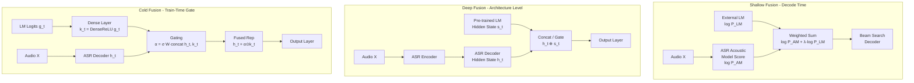

# 🔗 Language Model Integration for ASR

> [!tldr] TL;DR
> Acoustic models excel at mapping audio frames to tokens but lack long-range syntactic and semantic context; language models fill this gap. Integration strategies range from simple log-linear rescoring (shallow fusion) to architectures that fuse LM hidden states into the ASR decoder (deep/cold fusion), with classical systems using WFST composition.

## Intuition

A speech recogniser that knows only acoustics is like a very good lip-reader who knows nothing about English grammar. They might transcribe "ice cream" as "I scream" because both sound identical in isolation. A language model is the grammar/knowledge expert sitting next to the lip-reader, whispering "that doesn't make sense in context — it must be *ice cream*." Language model integration is the design of the communication protocol between these two experts.

Technically, ASR systems combine an acoustic score $\log P(X \mid W)$ with a language model score $\log P(W)$ in a log-linear framework. The key question is *when* and *how tightly* to couple these two signals: during training, during decoding, or as a post-processing step.

## Mermaid Diagram



## Key Concepts

### Why LM Integration Matters

The acoustic model trained on short context windows cannot learn:
- Long-range grammatical dependencies ("The keys that were on the table **are** missing")
- Domain-specific vocabulary (medical, legal terms)
- Discourse coherence across utterances

A language model trained on billions of text tokens fills these gaps, especially for rare words that appear infrequently in speech training data.

### Log-Linear Combination (Theoretical Basis)

Bayes' theorem motivates the combination:

$$\log P(W \mid X) \propto \underbrace{\log P(X \mid W)}_{\text{acoustic}} + \underbrace{\log P(W)}_{\text{language model}}$$

In practice, add scaling factors and a word insertion bonus $\beta$:

$$\text{score}(W) = \log P_{\text{AM}}(X \mid W) + \lambda \cdot \log P_{\text{LM}}(W) + \beta \cdot |W|$$

- $\lambda$: LM weight (tuned on a dev set; typical range 0.1–0.5)
- $\beta$: word insertion bonus; positive $\beta$ rewards longer hypotheses

### N-gram Language Models

**Kneser-Ney smoothing** is the standard n-gram LM method. The modified KN probability for trigrams:

$$P_{\text{KN}}(w_i \mid w_{i-2}, w_{i-1}) = \frac{\max(c(w_{i-2}, w_{i-1}, w_i) - d, 0)}{c(w_{i-2}, w_{i-1})} + \gamma(w_{i-2}, w_{i-1}) \cdot P_{\text{KN}}(w_i \mid w_{i-1})$$

**Perplexity** measures LM quality:

$$\text{PPL} = \exp\!\left(-\frac{1}{N} \sum_{i=1}^{N} \log P(w_i \mid w_{<i})\right)$$

Lower perplexity = better LM; good 4-gram on Wall Street Journal achieves PPL ~100.

**ARPA format**: standard text format for n-gram LMs; used by KenLM, SRILM, OpenFST.

### Shallow Fusion

Add external LM log-probability to beam score at decode time. No retraining of ASR model required. Works with CTC, attention-based, and RNN-T decoders.

```python
# Shallow fusion with pyctcdecode (CTC + n-gram LM)
from pyctcdecode import build_ctcdecoder
import kenlm

# Build decoder with KenLM language model
labels = ["<blank>"] + list("abcdefghijklmnopqrstuvwxyz '")  # example vocab
decoder = build_ctcdecoder(
    labels=labels,
    kenlm_model="4gram_big.arpa",  # KenLM ARPA file
    alpha=0.5,    # LM weight (λ)
    beta=1.5,     # word insertion bonus (β)
)

# logits: numpy array (T, vocab_size)
transcription = decoder.decode(logits)
print(transcription)

# Batch decoding with multiprocessing
from multiprocessing import get_context
with get_context("fork").Pool(4) as pool:
    transcriptions = decoder.decode_batch(pool, batch_logits)
```

### Deep Fusion

During training, the ASR decoder receives the hidden states of a **frozen, pre-trained LM** concatenated with its own states. The LM runs in parallel at every decoder step:

$$[\mathbf{h}_t^{\text{ASR}}; \mathbf{s}_t^{\text{LM}}] \rightarrow \text{Output Layer}$$

This requires the LM to be fixed during ASR training; the ASR model learns to use LM representations.

### Cold Fusion

Gulcehre et al. (2018) propose training from scratch with live LM logits gated into the decoder:

$$\mathbf{k}_t = \text{DenseReLU}(g_t^{\text{LM}})$$
$$\alpha_t = \sigma\!\left(W_{\text{cf}} \cdot [\mathbf{h}_t; \mathbf{k}_t]\right)$$
$$\tilde{\mathbf{h}}_t = W_1 \mathbf{h}_t + \alpha_t \odot W_2 \mathbf{k}_t$$

The gating mechanism lets the ASR model selectively incorporate LM information. Cold fusion consistently outperforms shallow and deep fusion, especially in domain mismatch scenarios.

### N-best List Rescoring

1. Generate top-N hypotheses with the ASR decoder (typically N = 50–200)
2. Re-score each hypothesis with a more powerful LM (e.g., GPT-2, LLaMA)
3. Select the hypothesis with the highest combined score

```python
import torch
from transformers import AutoModelForCausalLM, AutoTokenizer

def rescore_nbest(hypotheses: list[str], lm_weight: float = 0.3,
                  model_name: str = "gpt2") -> str:
    """Rescore N-best ASR hypotheses using a neural LM."""
    tokenizer = AutoTokenizer.from_pretrained(model_name)
    lm = AutoModelForCausalLM.from_pretrained(model_name).eval()

    best_hyp, best_score = None, float("-inf")
    for hyp_text, am_score in hypotheses:  # (text, log-prob from ASR)
        tokens = tokenizer.encode(hyp_text, return_tensors="pt")
        with torch.no_grad():
            out = lm(tokens, labels=tokens)
        lm_score = -out.loss.item() * tokens.size(1)  # sum log-prob
        total = am_score + lm_weight * lm_score
        if total > best_score:
            best_score, best_hyp = total, hyp_text
    return best_hyp

# Example hypotheses: list of (text, AM_log_prob)
hypotheses = [
    ("ice cream is good", -2.3),
    ("i scream is good", -2.1),
    ("ice cream is great", -2.6),
]
print(rescore_nbest(hypotheses, lm_weight=0.3))
```

### WFST LM Integration (Classical ASR)

In Kaldi/HCLG, the LM is the **G** transducer, composed with the lexicon (L) and HMM (H, C). Upgrading from a 3-gram to 4-gram LM means recomposing G and re-running `mkgraph.sh`. For neural LMs, WFST integration requires on-the-fly composition or lattice rescoring.

```python
# Kaldi-style lattice rescoring with new LM
# After generating lattices with HCLG, rescore with a 4-gram LM:
# lattice-lmrescore --lm-scale=1.0 ark:old_lm.fst \
#   ark:"gunzip -c lat.gz|" ark:- | \
#   lattice-lmrescore-pruned --lm-scale=1.0 ark:new_lm.fst \
#   ark:- ark:- | lattice-best-path ...
```

### Spelling Correction as LM Post-Processing

For E2E ASR outputs, a seq2seq correction model can fix systematic ASR errors:

```python
from transformers import pipeline

corrector = pipeline(
    "text2text-generation",
    model="oliverguhr/spelling-correction-english-base"
)
asr_output = "ive bin wating four a wile"
corrected = corrector(asr_output, max_length=128)[0]["generated_text"]
print(corrected)  # "I've been waiting for a while"
```

## Comparison Table

| Strategy | Training Required | LM Type | WER Improvement | Latency Impact |
|----------|------------------|---------|-----------------|----------------|
| Shallow fusion | None (plug-in) | N-gram / Neural | +5–10% relative | Low |
| N-best rescoring | None | Neural LM (GPT-2+) | +10–15% relative | Moderate |
| Deep fusion | ASR retrain | Pre-trained LM | +12–17% relative | Moderate |
| Cold fusion | Train from scratch | Any LM | +15–20% relative | Low (gated) |
| WFST composition | Graph recompile | N-gram only | +5–12% relative | Low (static graph) |

## Real-World Notes

- **Shallow fusion with KenLM** is the most widely deployed technique: zero retraining, easy to swap domain LMs, works with any CTC or attention decoder.
- **LLaMA-based N-best rescoring** (2024) shows the largest WER reductions but requires GPU at inference time; acceptable for batch transcription, not real-time.
- Domain adaptation: swap the G transducer (WFST) or replace the n-gram LM with a domain-tuned one; no acoustic model retraining needed.
- `pyctcdecode` implements shallow fusion natively and is compatible with HuggingFace `Wav2Vec2ProcessorWithLM`.

## Common Pitfalls

- **LM weight not tuned on held-out dev set**: λ varies significantly across acoustic models and domains; always grid-search on dev data.
- **OOV words in n-gram LM**: words not seen during LM training get probability zero; use `<unk>` smoothing or a neural LM fallback.
- **Double-counting LM in E2E models**: Whisper's decoder already incorporates LM implicitly; shallow fusion on top may over-weight language, hurting WER on well-matched domains.
- **N-best list too small**: with N < 20, the oracle WER (best possible from list) may be much higher than needed; use N ≥ 100 for rescoring experiments.

## Related Concepts

- [[HMM_GMM_ASR]] — WFST HCLG composition; G transducer is the n-gram LM
- [[CTC_and_Attention_ASR]] — CTC beam search integrates LM via shallow fusion; `pyctcdecode`
- [[Whisper_Architecture]] — built-in decoder LM; external LM rescoring still helps on OOD data
- [[_MOC_NLP_Master]] — language model architectures (GPT, BERT, LLaMA) used for rescoring

## Review Questions

1. Derive the log-linear combination score for an N-best hypothesis, including the word insertion bonus term. Why is a positive $\beta$ needed and what happens at $\beta = 0$?
2. Explain the difference between shallow fusion, deep fusion, and cold fusion. What does each require in terms of training, and what is the key advantage of cold fusion over the other two?
3. Why might shallow LM fusion *hurt* WER when applied to Whisper on LibriSpeech test-clean, even though it consistently helps classical CTC models?

## Sources

- Chorowski, J. & Jaitly, N. (2017). "Towards Better Decoding and Language Model Integration in Sequence-to-Sequence Models." *Interspeech*.
- Gulcehre, C. et al. (2018). "Incorporating Structured Commonsense Knowledge in Story Completion." (Cold fusion). *arXiv:1708.00400*.
- Hori, T., Watanabe, S., Zhang, Y., & Chan, W. (2017). "Advances in Joint CTC-Attention Based End-to-End Speech Recognition with a Deep CNN Encoder and RNN-LM." *ICASSP*.
- Xu, H. et al. (2022). "Rescoring Sequence-to-Sequence Models for Text Normalization in Speech Recognition." *Interspeech*.

#asr #language-model #shallow-fusion #deep-fusion #cold-fusion #n-best-rescoring #wfst #speech-recognition
