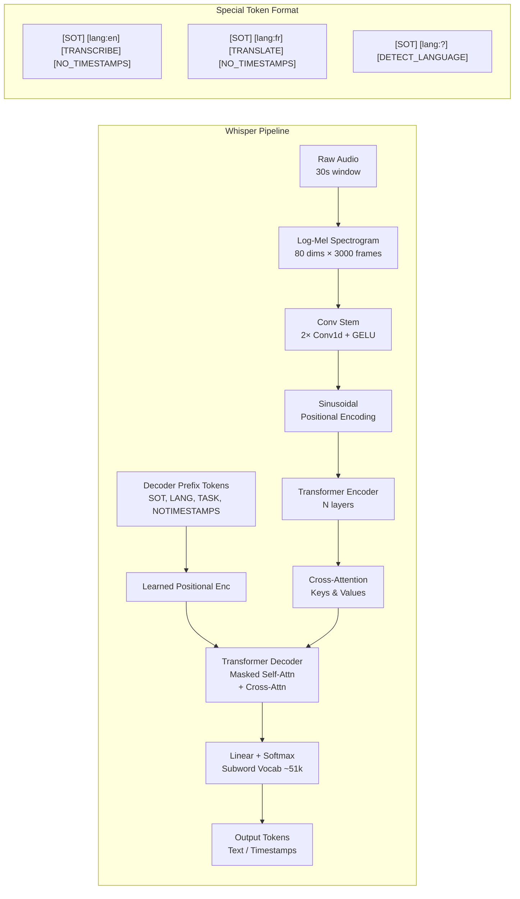

# 🔊 OpenAI Whisper: Architecture and Multitask ASR

> [!tldr] TL;DR
> Whisper (Radford et al. 2022) is a weakly supervised encoder-decoder Transformer trained on 680,000 hours of internet audio across 97 languages, performing transcription, translation to English, language identification, VAD, and timestamp prediction — all controlled by special tokens prepended to the decoder. Its Whisper Large-v3 model achieves 2.0% WER on LibriSpeech test-clean with zero ASR-specific fine-tuning.

## Intuition

Imagine hiring a polyglot scribe who learned to transcribe by listening to millions of YouTube videos, podcasts, and movies in 97 languages — without anyone correcting their mistakes, just with captions as weak guidance. That scribe would learn an incredible amount about how speech maps to text, even if some training captions were noisy or mistimed.

Whisper does exactly this: it trains on noisy internet subtitles rather than carefully annotated speech datasets. The trick is scale — 680k hours drowns out the noise, and multitask training (transcription + translation + language ID) forces the encoder to build a rich universal audio representation. A single model does it all via special prefix tokens that tell the decoder what task to perform.

## Mermaid Diagram



## Key Concepts

### Training Data & Weak Supervision

| Source | Hours | Languages |
|--------|-------|-----------|
| Internet audio + subtitles | 680,000 | 97 |
| Human-verified English | ~117,000 | 1 |
| Non-English speech | ~125,000 | 96 |
| X→English translation | ~63,000 | 75 |

Subtitles are weakly paired: captions may be slightly mistimed, machine-translated, or contain OCR noise. Whisper filters out data with excessive repetition, foreign characters, and subtitle artifacts.

### Audio Frontend

- Input: 30-second audio chunks, padded or trimmed
- Preprocessing: 25 ms Hann window, 10 ms hop, 80-band log-mel spectrogram (80 × 3000)
- **Conv stem**: two strided 1D convolutions (kernel 3, stride 1; kernel 3, stride 2) with GELU activation → output: 80 × 1500 feature map, which flattens to 1500 tokens for the encoder

$$x_{\text{feat}} = \text{GELU}(\text{Conv}_{3,2}(\text{GELU}(\text{Conv}_{3,1}(S_{\text{mel}}))))$$

### Transformer Encoder

Standard Transformer encoder blocks with:
- Pre-norm (LayerNorm before attention/FFN)
- Multi-head self-attention with sinusoidal positional encoding
- No CLS token; all 1500 encoder positions attend to each other

### Decoder Prefix & Multitask Tokens

The decoder is conditioned by a prefix sequence of special tokens:

| Token | Role |
|-------|------|
| `<\|startoftranscript\|>` | BOS; always first |
| `<\|en\|>`, `<\|fr\|>`, … | Language tag (97 options) |
| `<\|transcribe\|>` | Transcription task |
| `<\|translate\|>` | Speech → English translation |
| `<\|nospeech\|>` | No speech detected (VAD) |
| `<\|notimestamps\|>` | Disable timestamp output |
| `<\|0.00\|>`…`<\|30.00\|>` | Timestamp tokens (every 0.02 s) |

### Decoder Architecture

Standard causal Transformer decoder:
- Masked multi-head self-attention (causal)
- Cross-attention to encoder outputs
- Position-wise FFN
- Learned positional embeddings (not sinusoidal, unlike encoder)
- Tied input/output embeddings

### Model Sizes

| Model | Encoder Layers | Decoder Layers | Heads | d_model | Parameters | test-clean WER | test-other WER |
|-------|----------------|----------------|-------|---------|------------|----------------|----------------|
| Tiny | 4 | 4 | 6 | 384 | 39M | 5.7% | 13.8% |
| Base | 6 | 6 | 8 | 512 | 74M | 4.2% | 10.1% |
| Small | 12 | 12 | 12 | 768 | 244M | 3.0% | 6.7% |
| Medium | 24 | 24 | 16 | 1024 | 769M | 2.5% | 5.2% |
| Large-v1 | 32 | 32 | 20 | 1280 | 1.5B | 2.2% | 4.2% |
| Large-v3 | 32 | 32 | 20 | 1280 | 1.5B | 2.0% | 3.6% |

### Timestamp Generation

When timestamps are enabled, the decoder alternates between text tokens and timestamp tokens. Each timestamp token encodes an absolute time in the 30-second window. Cross-attention alignment can be inspected post-hoc to generate word-level alignments:

$$\text{align}_{w} = \arg\max_t \alpha_{t, \text{token}(w)}$$

where $\alpha_{t,u}$ is the cross-attention weight from decoder step $t$ to encoder position $u$.

### Inference API

```python
# pip install openai-whisper
import whisper

# Load model (downloads weights automatically)
model = whisper.load_model("base")  # or "large-v3"

# Transcribe with default settings
result = model.transcribe("audio.mp3")
print(result["text"])

# Transcribe with custom options
result = model.transcribe(
    "audio.mp3",
    language="en",           # skip language detection
    task="transcribe",       # or "translate" for X→English
    word_timestamps=True,    # get per-word timing
    beam_size=5,
    best_of=5,
    temperature=0.0,         # greedy decode
    condition_on_previous_text=False,  # reduce hallucinations
)

# Access segments with timestamps
for seg in result["segments"]:
    print(f"[{seg['start']:.2f}s → {seg['end']:.2f}s] {seg['text']}")

# Access word-level timestamps
for word_info in result["segments"][0]["words"]:
    print(f"  {word_info['word']}: {word_info['start']:.3f}s")
```

```python
# Using faster-whisper (CTranslate2 backend, ~4× faster)
from faster_whisper import WhisperModel

model = WhisperModel("large-v3", device="cuda", compute_type="float16")
segments, info = model.transcribe("audio.mp3", beam_size=5)
print(f"Detected language: {info.language} (prob={info.language_probability:.2f})")
for seg in segments:
    print(f"[{seg.start:.2f}s → {seg.end:.2f}s] {seg.text}")
```

### Hallucination & Shortcomings

Whisper is known to hallucinate during silence or low-energy audio (music, noise). Mitigations:
- Set `no_speech_threshold` to skip low-confidence segments
- Use `logprob_threshold` to filter low-probability outputs
- `condition_on_previous_text=False` breaks the autoregressive conditioning that spreads hallucinations

## Real-World Notes

- **Streaming**: Whisper is not natively streaming; use chunk-and-overlap (e.g., 30 s windows with 5 s overlap via `whisper-live` or `insanely-fast-whisper`).
- **Fine-tuning**: Hugging Face `transformers` wraps Whisper for fine-tuning via `Seq2SeqTrainer`; converges quickly on domain-specific audio.
- `faster-whisper` (CTranslate2) runs Whisper Large-v3 in real-time on a single RTX 3090 at batch size 16.
- Large-v3 was trained on additional data vs Large-v2; better on accented and noisy speech.

## Common Pitfalls

- **30-second window trimming**: audio longer than 30 s must be chunked; Whisper's `transcribe()` does this automatically, but manual chunking loses context at boundaries.
- **Timestamp drift**: for long audio with many segments, cumulative timestamp drift can be significant; use word-level timestamps rather than segment boundaries.
- **Language detection on short clips**: the language detection token is predicted from the first 30 s; short clips may misdetect language.
- **tokenizer mismatch**: Whisper uses its own multilingual BPE tokenizer (`tiktoken`-based); never use a generic tokenizer for decoding.

## Related Concepts

- [[CTC_and_Attention_ASR]] — alternative E2E approach; CTC lacks multitask prefix conditioning
- [[ASR_Deep_Learning]] — LAS is the predecessor encoder-decoder architecture
- [[LM_Integration_ASR]] — Whisper has a built-in LM in the decoder; external LM rescoring still helps
- [[_MOC_Audio_Foundation_Models]] — wav2vec 2.0, HuBERT are alternative pre-trained encoders

## Review Questions

1. Explain the role of each special token in Whisper's decoder prefix. How does changing `[TRANSCRIBE]` to `[TRANSLATE]` change what the decoder produces?
2. Why does Whisper use sinusoidal positional encoding in the encoder but learned positional embeddings in the decoder? What would break if you swapped them?
3. Describe two techniques to reduce Whisper hallucinations on silent or low-energy audio segments, explaining the mechanism behind each.

## Sources

- Radford, A., Kim, J. W., Xu, T., Brockman, G., McLeavey, C., & Sutskever, I. (2022). "Robust Speech Recognition via Large-Scale Weak Supervision." *ICML 2023*. arXiv:2212.04356.
- OpenAI Whisper GitHub: https://github.com/openai/whisper
- faster-whisper: https://github.com/SYSTRAN/faster-whisper
- Peng, P. et al. (2023). "Reproducing Whisper-Style Training Using an Open-Source Data Pipeline and Evaluation." *ASRU*.

#asr #whisper #openai #transformer #multitask #weak-supervision #speech-recognition #speech-translation
