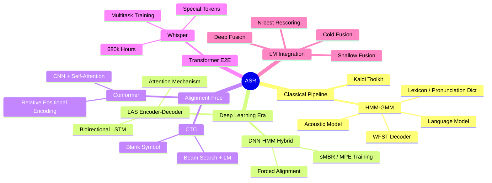

# 🗺️ Speech Recognition (ASR) — Section Map

> [!abstract] Section Overview
> Automatic Speech Recognition (ASR) converts spoken audio into text. This section covers the full arc from classical HMM-GMM pipelines to modern Transformer-based systems like Whisper, including alignment-free CTC training and language model integration strategies.

## Concept Map

## Learning Path

| Step | Note | Difficulty | What You Learn |
|------|------|------------|----------------|
| 1 | [[HMM_GMM_ASR]] | Intermediate | Classical pipeline: HMM states, GMM emissions, Viterbi, WFSTs |
| 2 | [[ASR_Deep_Learning]] | Intermediate | DNN-HMM hybrid, LAS encoder-decoder, attention-based ASR |
| 3 | [[CTC_and_Attention_ASR]] | Advanced | CTC loss math, conformer architecture, CTC+attention hybrid |
| 4 | [[Whisper_Architecture]] | Advanced | Whisper model design, multitask tokens, model sizes, WER |
| 5 | [[LM_Integration_ASR]] | Advanced | Shallow/deep/cold fusion, N-best rescoring, neural LM integration |

## All Notes in This Section

| Note | Core Topic | Key Algorithms | Difficulty |
|------|-----------|----------------|------------|
| [[HMM_GMM_ASR]] | Classical ASR | Viterbi, Baum-Welch, WFST HCLG | Intermediate |
| [[ASR_Deep_Learning]] | DNN-HMM & LAS | CE loss, sMBR, location-sensitive attention | Intermediate |
| [[CTC_and_Attention_ASR]] | CTC & Conformer | CTC forward-backward, conformer block | Advanced |
| [[Whisper_Architecture]] | OpenAI Whisper | Multitask Transformer, special tokens | Advanced |
| [[LM_Integration_ASR]] | LM Rescoring | Shallow/deep/cold fusion, N-best | Advanced |

## 5 Key Questions for This Section

1. **What is the HCLG composition in WFST-based ASR and why does it enable efficient decoding?**
2. **How does CTC handle the alignment problem without requiring forced alignment during training?**
3. **Why does the Conformer outperform a pure Transformer on ASR tasks?**
4. **How does Whisper achieve zero-shot multilingual transcription without a separate language module?**
5. **What is the difference between shallow fusion, deep fusion, and cold fusion for LM integration?**

## Prerequisites

- [[_MOC_Audio_Signal_Processing]] — log-mel spectrograms, MFCC features, filterbanks
- Basic understanding of sequence models (RNN/LSTM) and attention

## Related Sections

- [[_MOC_Audio_Signal_Processing]] — feature extraction pipeline that feeds into ASR acoustic models
- [[_MOC_Speaker_Recognition]] — related speech task; shares encoder architectures
- [[_MOC_Audio_Foundation_Models]] — large pre-trained models (wav2vec 2.0, HuBERT) used as ASR encoders
- [[_MOC_NLP_Master]] — ASR output feeds NLP pipelines (NER, intent detection, dialogue)
- [[_MOC_Audio_Speech_Master]] — parent vault MOC

## WER Benchmark Quick Reference

| Model | LibriSpeech test-clean | LibriSpeech test-other |
|-------|----------------------|----------------------|
| HMM-GMM (Kaldi) | ~5.5% | ~15.3% |
| DNN-HMM Hybrid | ~3.8% | ~10.1% |
| LAS (SOTA 2019) | ~2.8% | ~6.8% |
| Conformer-CTC | ~1.9% | ~3.9% |
| Whisper Large-v3 | ~2.0% | ~3.6% |

#asr #speech-recognition #moc #audio-speech
