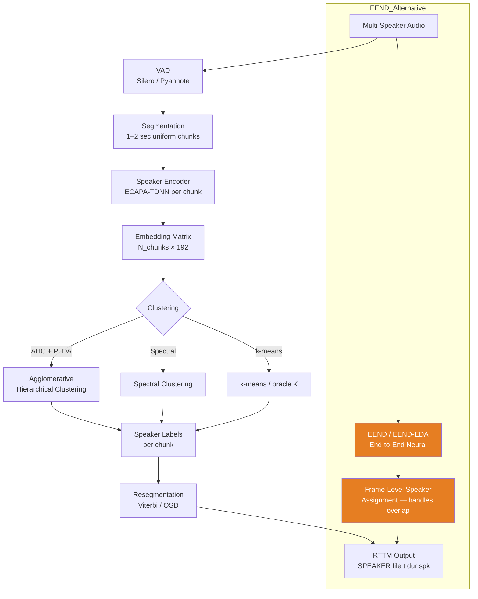

# 🗣️ Speaker Diarization

> [!tldr] TL;DR
> Speaker diarization answers "who spoke when" — segmenting audio into speaker-homogeneous regions without prior enrollment. The pipeline approach chains VAD, segmentation, embedding, and clustering; end-to-end neural systems (EEND) handle overlapping speech directly.

## Intuition

Imagine transcribing a recorded board meeting as a journalist. You don't know anyone's name, but you can tell from the audio which voice is speaking at each moment. You'd naturally break the recording into turns, mentally tag each turn with a consistent voice label (A, B, C…), and produce a timeline like "A spoke 0–12s, B 12–18s, A 18–31s…". Diarization automates exactly this. The hard parts are: detecting where one speaker ends and another begins, handling moments when two people speak simultaneously, and correctly grouping all turns from the same person even when their voice quality changes over an hour-long meeting.

## Mermaid Diagram



## Key Concepts

### Pipeline Diarization

**Step 1 — VAD**: extract speech segments (see [[Voice_Activity_Detection]]).

**Step 2 — Segmentation**: split speech into short overlapping chunks (1–2 sec). Shorter = more temporal precision; longer = better embedding quality.

**Step 3 — Speaker Embedding**: encode each chunk to a 192-dim ECAPA vector.

**Step 4 — Clustering**: group chunks by speaker identity.

**Step 5 — Resegmentation**: optionally re-run a speaker change detection pass using Viterbi decoding on a HMM to refine boundaries.

### Agglomerative Hierarchical Clustering (AHC)

Starts with each chunk as its own cluster, repeatedly merges the two most similar clusters until a stopping criterion is met:

$$\text{merge}(C_i, C_j) \text{ if } s_{\text{PLDA}}(\mathbf{e}_i, \mathbf{e}_j) > \theta_{\text{AHC}}$$

The dendrogram is cut either at a fixed threshold or by estimating the number of speakers $K$ from a BIC (Bayesian Information Criterion) or eigenvalue gap analysis.

### Spectral Clustering

1. Build affinity matrix $\mathbf{A}_{ij} = \cos(\mathbf{e}_i, \mathbf{e}_j)$ (or PLDA score).
2. Normalize to Laplacian $\mathbf{L}$.
3. Compute eigenvectors; number of near-zero eigenvalues estimates $K$.
4. Apply k-means in eigenvector space.

Spectral clustering better handles non-convex speaker clusters and is default in pyannote.audio ≥2.0.

### EEND: End-to-End Neural Diarization

EEND (Fujita et al., 2019) reframes diarization as multi-label binary classification at every frame:

$$\hat{\mathbf{y}}_t = \sigma\left(\text{Transformer}(\mathbf{x}_{1:T})\right) \in [0,1]^S$$

where $S$ = max speakers and $\hat{y}_{t,s} > 0.5$ means speaker $s$ is active at frame $t$. Multiple active speakers = overlapping speech, handled natively.

**Training loss** (Permutation-Invariant Training, PIT):

$$\mathcal{L}_{\text{PIT}} = \min_{\phi \in \text{Perm}(S)} \sum_{t=1}^{T} \sum_{s=1}^{S} \text{BCE}\left(\hat{y}_{t,s},\ y_{t,\phi(s)}\right)$$

**EEND-EDA** extends to variable/unknown $S$ by using an encoder-decoder attractor mechanism.

### DER: Diarization Error Rate

$$\text{DER} = \frac{T_{\text{FA}} + T_{\text{MISS}} + T_{\text{CONF}}}{T_{\text{REF}}}$$

| Component | Meaning |
|-----------|---------|
| $T_{\text{FA}}$ | Falsely detected speech (VAD false alarm) |
| $T_{\text{MISS}}$ | Missed speech (VAD miss) |
| $T_{\text{CONF}}$ | Correct speech duration but wrong speaker assigned |
| $T_{\text{REF}}$ | Total reference speech duration |

DER can exceed 100% (multiple overlapping errors). Overlap regions are often excluded ("collar" of 0.25 sec at boundaries).

### Benchmark DER (AMI Meeting Corpus, overlap excluded)

| System | DER |
|--------|-----|
| Pipeline (AHC + x-vector) | ~8.5% |
| Pipeline (Spectral + ECAPA) | ~4.8% |
| EEND (SA-EEND, 2-spk) | ~7.9% |
| pyannote.audio 3.1 | ~\~5.1% |
| EEND-EDA + overlap | ~4.3% |

### Python Code: pyannote.audio Diarization Pipeline

```python
from pyannote.audio import Pipeline
import torch

# Load pre-trained pipeline (requires HF token)
pipeline = Pipeline.from_pretrained(
    "pyannote/speaker-diarization-3.1",
    use_auth_token="YOUR_HF_TOKEN"
)
pipeline.to(torch.device("cuda" if torch.cuda.is_available() else "cpu"))

# Run diarization
diarization = pipeline("meeting.wav")

# Print RTTM-style output
for turn, _, speaker in diarization.itertracks(yield_label=True):
    print(f"[{turn.start:06.3f}s — {turn.end:06.3f}s] {speaker}")

# Save RTTM file for scoring
with open("output.rttm", "w") as f:
    diarization.write_rttm(f)
```

### Overlap Detection and Handling

```python
# Pyannote overlap-aware pipeline
from pyannote.audio import Pipeline

pipeline = Pipeline.from_pretrained(
    "pyannote/overlapped-speech-detection",
    use_auth_token="YOUR_HF_TOKEN"
)
overlap = pipeline("meeting.wav")

# Mark overlap regions (both speakers active)
for segment in overlap.get_timeline():
    print(f"Overlap: {segment.start:.3f}s — {segment.end:.3f}s")
```

### System Comparison

| Approach | DER (AMI) | Overlap | Latency | Complexity |
|----------|-----------|---------|---------|-----------|
| AHC + x-vector | ~8.5% | Poor | Low | Medium |
| Spectral + ECAPA | ~4.8% | Poor | Medium | Medium |
| EEND (fixed S) | ~7.9% | Native | High | High |
| EEND-EDA (var S) | ~4.3% | Native | High | Very High |
| pyannote 3.1 | ~5.1% | Overlap model | Medium | Medium |

## Real-World Notes

- AMI (Augmented Multi-Party Interaction) corpus: 100 hours of meeting recordings, 4-speaker scenarios, gold standard for diarization benchmarks.
- Call-centre diarization is typically 2-speaker (agent + customer) and achieves DER < 3% with good VAD.
- pyannote.audio is the most widely used open-source toolkit; version 3.1 uses a WeSpeaker or SpeechBrain ECAPA embedding.
- Speaker count estimation (K) is the hardest sub-problem; oracle K (known ground truth) improves DER by 2–5 points.
- Meeting transcription systems (Teams, Zoom) combine diarization + ASR + speaker-word alignment in a joint system.

## Common Pitfalls

- **Short segments for embedding** — chunks < 1 sec produce noisy embeddings; use 1.5–2 sec minimum.
- **Not handling overlapping speech** — pipeline methods assign overlap to one speaker, creating confusions counted in DER.
- **Wrong collar setting** — standard evaluation ignores 0.25 sec around boundaries; omitting collar inflates DER by 1–3%.
- **RTTM format errors** — scoring with `dscore` or `pyannote.metrics` requires exact field alignment; spaces in speaker names break parsers.

## Related Concepts

- [[Voice_Activity_Detection]] — step 1 of every diarization pipeline
- [[Speaker_Embeddings]] — provides per-segment representations for clustering
- [[Speaker_Verification]] — PLDA scoring used in AHC
- [[Speaker_Identification_Adaptation]] — open-set extension of diarization labels
- [[_MOC_ASR]] — diarization + ASR = speaker-attributed transcription

## Review Questions

1. What does Permutation-Invariant Training (PIT) solve in EEND, and why is it necessary?
2. A meeting has 4 speakers but your EEND model was trained for max 3. What failure mode do you expect, and how would EEND-EDA help?
3. If $T_{\text{FA}} = 0$ and $T_{\text{MISS}} = 0$ but $T_{\text{CONF}} = 30$ sec and $T_{\text{REF}} = 300$ sec, what is the DER?

## Sources

- Fujita et al., "End-to-End Neural Diarization" (Interspeech 2019)
- Bredin et al., "pyannote.audio: neural building blocks for speaker diarization" (ICASSP 2020)
- Horiguchi et al., "EEND-EDA: End-to-End Neural Diarization with Encoder-Decoder Attractors" (Interspeech 2020)
- AMI Corpus: https://groups.inf.ed.ac.uk/ami/corpus/

#diarization #eend #pyannote #ahc-clustering #der #speaker-segmentation #meeting-transcription #audio-speech
