# 🔊 Speaker Embeddings

> [!tldr] TL;DR
> A speaker embedding maps a variable-length audio utterance to a fixed-size vector that captures voice identity regardless of what was said. The field evolved from GMM-based i-vectors (2010) through deep d-vectors and TDNN x-vectors to the current state-of-the-art ECAPA-TDNN (2020).

## Intuition

Imagine a fingerprint scanner that works on voice instead of skin: no matter whether you say "hello" for 2 seconds or read a paragraph for 30, the scanner produces the same 192-dimensional fingerprint that uniquely describes your vocal tract, pitch patterns, and speaking style. Just as two fingerprints from the same person look similar even under different lighting conditions, two embeddings from the same speaker cluster together in vector space even across different sentences and recording conditions. The technical challenge is teaching a neural network to be *speaker-discriminative* (different speakers far apart) while being *utterance-invariant* (same speaker close together regardless of content or noise).

## Mermaid Diagram

```mermaid
graph LR
    subgraph Input
        A[Raw Waveform] --> B[MFCC / Filterbank\n80-dim × T frames]
    end
    subgraph TDNN_Backbone
        B --> C[TDNN Layer 1\ncontext -2..+2]
        C --> D[TDNN Layer 2\ncontext -2,0,+2]
        D --> E[TDNN Layer 3\ncontext -3,0,+3]
        E --> F[TDNN Layer 4\ncontext 1]
        F --> G[TDNN Layer 5\ncontext 1]
    end
    subgraph Pooling
        G --> H[Statistics Pooling\nmean + std over T]
        H --> I[Concat: 2×512-dim]
    end
    subgraph Embedding_Head
        I --> J[FC Layer 1\n512-dim  + ReLU]
        J --> K[FC Layer 2\n192-dim = embedding]
    end
    subgraph Training
        K --> L[AM-Softmax\nSpeaker Classification]
    end
```



## Key Concepts

### Evolution of Speaker Embeddings

| Model | Year | Architecture | Backend | Typical EER |
|-------|------|-------------|---------|-------------|
| i-vector | 2010 | GMM supervector + MAP/JFA | PLDA | ~5–8% |
| d-vector | 2014 | Deep LSTM, frame-level avg | Cosine | ~4–6% |
| x-vector | 2018 | TDNN + stats pooling | PLDA | ~3–5% |
| ECAPA-TDNN | 2020 | SE-Res2Net + attentive pooling | Cosine/PLDA | ~0.87% |

### i-Vector Mathematics

The i-vector model factors a GMM supervector $\mathbf{m}$ as:

$$\mathbf{m} = \mathbf{m}_0 + \mathbf{T}\mathbf{w}$$

where $\mathbf{m}_0$ is the Universal Background Model (UBM) supervector, $\mathbf{T}$ is the total variability matrix (low-rank), and $\mathbf{w} \sim \mathcal{N}(\mathbf{0}, \mathbf{I})$ is the i-vector. Given Baum-Welch statistics $(N_c, F_c)$ from a recording, the MAP estimate of $\mathbf{w}$ is:

$$\hat{\mathbf{w}} = \left(\mathbf{I} + \mathbf{T}^\top \tilde{\Sigma}^{-1} \mathbf{T}\right)^{-1} \mathbf{T}^\top \tilde{\Sigma}^{-1} \tilde{\mathbf{f}}$$

### TDNN Temporal Context

A Time Delay Neural Network (TDNN) layer at context $\{-d, \ldots, +d\}$ computes:

$$\mathbf{h}_t = \sigma\left(\mathbf{W} \cdot \left[\mathbf{x}_{t-d}; \ldots; \mathbf{x}_{t+d}\right] + \mathbf{b}\right)$$

allowing efficient multi-scale temporal modeling without RNN sequential bottlenecks.

### Statistics Pooling

Given frame-level representations $\{\mathbf{h}_t\}_{t=1}^{T}$:

$$\mu = \frac{1}{T}\sum_t \mathbf{h}_t, \quad \sigma = \sqrt{\frac{1}{T}\sum_t (\mathbf{h}_t - \mu)^2}$$

$$\mathbf{e}_{\text{pool}} = [\mu; \sigma] \in \mathbb{R}^{2d}$$

This aggregates across all $T$ frames into a fixed-size vector.

### AM-Softmax (Additive Margin Softmax) Loss

$$\mathcal{L} = -\log \frac{e^{s(\cos\theta_{y_i} - m)}}{e^{s(\cos\theta_{y_i} - m)} + \sum_{j \neq y_i} e^{s\cos\theta_j}}$$

where $s$ is a scale factor (~30), $m$ is the angular margin (~0.2), and $\theta_{y_i}$ is the angle between the embedding and its class center. This forces tighter within-class clusters and larger between-class margins.

### ECAPA-TDNN Innovations

1. **SE-Res2Net blocks**: multi-scale feature extraction within each layer via hierarchical residual connections with Squeeze-and-Excitation channel reweighting.
2. **Attentive statistics pooling**: instead of uniform mean/std, learn a frame-level attention weight $\alpha_t$ depending on the whole utterance context.
3. **Multi-scale feature aggregation (MFA)**: concatenate outputs from multiple TDNN layers before pooling.

### Python Code: x-Vector Extraction with SpeechBrain

```python
import torch
import torchaudio
from speechbrain.pretrained import EncoderClassifier

# Load pretrained x-vector model
classifier = EncoderClassifier.from_hparams(
    source="speechbrain/spkrec-xvect-voxceleb",
    savedir="pretrained_models/xvect"
)

# Load audio (must be 16 kHz mono)
waveform, sr = torchaudio.load("utterance.wav")
if sr != 16000:
    waveform = torchaudio.functional.resample(waveform, sr, 16000)

# Extract embedding  [1, 512]
with torch.no_grad():
    embeddings = classifier.encode_batch(waveform)  # shape: (1, 1, 512)
    emb = embeddings.squeeze()                       # shape: (512,)

print(f"Embedding shape: {emb.shape}")   # torch.Size([512])
print(f"L2 norm: {emb.norm():.4f}")

# ECAPA-TDNN (192-dim)
ecapa = EncoderClassifier.from_hparams(
    source="speechbrain/spkrec-ecapa-voxceleb",
    savedir="pretrained_models/ecapa"
)
emb_ecapa = ecapa.encode_batch(waveform).squeeze()   # shape: (192,)
```

### PLDA Scoring Backend

PLDA (Probabilistic LDA) models speaker embeddings as:

$$\mathbf{e} = \mathbf{\mu} + \mathbf{V}\mathbf{y} + \mathbf{\epsilon}$$

where $\mathbf{V}$ spans the speaker subspace, $\mathbf{y} \sim \mathcal{N}(\mathbf{0}, \mathbf{I})$ is the latent speaker factor, and $\mathbf{\epsilon} \sim \mathcal{N}(\mathbf{0}, \mathbf{\Lambda}^{-1})$ is channel/session noise. The likelihood ratio score is:

$$s_{\text{PLDA}} = \log \frac{p(\mathbf{e}_{\text{enr}}, \mathbf{e}_{\text{test}} | H_\text{same})}{p(\mathbf{e}_{\text{enr}}, \mathbf{e}_{\text{test}} | H_\text{diff})}$$

## Real-World Notes

- Production deployments often use 192-dim ECAPA embeddings; larger dims (512) add cost with marginal gain.
- Normalize embeddings to unit sphere before cosine scoring; skip normalization before PLDA.
- Data augmentation (RIR, noise, speed perturbation) during training is crucial — VoxCeleb2 alone is 1M+ utterances from 6K speakers.
- VoxCeleb2 pre-training + VoxSRC fine-tuning is the standard recipe for competition systems.
- For very short utterances (<1 sec), attentive pooling significantly outperforms uniform pooling.

## Common Pitfalls

- **Forgetting length normalization before cosine scoring** — raw embeddings have varying norms that inflate scores for louder utterances.
- **Using speaker-overlapping train/test splits** — VoxCeleb has a strict test list; overlapping speakers inflates EER.
- **Applying PLDA on raw (unnormalized) embeddings** — PLDA assumes Gaussian; always apply LDA + length normalization first.
- **Ignoring domain mismatch** — in-domain fine-tuning (even 10 hours) dramatically outperforms out-of-domain models.

## Related Concepts

- [[Speaker_Verification]] — uses embeddings as the core representation
- [[Speaker_Diarization]] — embeds each segment then clusters
- [[Voice_Activity_Detection]] — must run before embedding extraction
- [[_MOC_Audio_Signal_Processing]] — MFCC feature extraction feeding TDNN layers

## Review Questions

1. What is the role of statistics pooling in x-vector models, and how does attentive pooling in ECAPA-TDNN improve upon it?
2. Derive the AM-Softmax loss and explain the effect of increasing the margin parameter $m$.
3. A TDNN layer with context $\{-3, 0, +3\}$ has what effective receptive field after stacking 3 such layers with identical context?

## Sources

- Snyder et al., "X-vectors: Robust DNN embeddings for speaker recognition" (ICASSP 2018)
- Desplanques et al., "ECAPA-TDNN" (Interspeech 2020)
- Dehak et al., "Front-End Factor Analysis for Speaker Verification" (IEEE T-ASLP 2011)
- SpeechBrain documentation: https://speechbrain.github.io

#speaker-embeddings #x-vector #ecapa-tdnn #i-vector #tdnn #speaker-recognition #audio-speech
