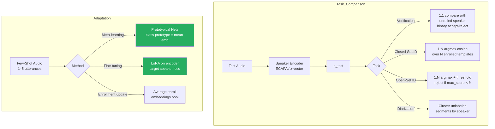

# 🧩 Speaker Identification & Adaptation

> [!tldr] TL;DR
> Speaker identification extends verification to multi-class scenarios: closed-set finds the best match among N enrolled speakers; open-set adds a reject option for unknown speakers. Adaptation techniques personalize models to new speakers from as few as 1–5 utterances using meta-learning or parameter-efficient fine-tuning.

## Intuition

Imagine a corporate phone system that can recognize any of 500 registered employees by voice alone, without them pressing any keys. If a known employee calls, it routes them to their personalized menu (closed-set identification). If an unknown caller dials in, it flags them for manual verification (open-set). Now imagine the company hires 10 new employees — the system needs to learn their voices quickly without forgetting the 500 existing ones. This is speaker adaptation: absorbing new identities efficiently, ideally from a single voice sample. All three challenges — multi-class recognition, graceful rejection, and rapid personalization — together define the full speaker ID problem.

## Mermaid Diagram



## Key Concepts

### Closed-Set Identification

Given $N$ enrolled speakers with gallery embeddings $\{\mathbf{e}_1, \ldots, \mathbf{e}_N\}$:

$$\hat{s} = \argmax_{i \in \{1,\ldots,N\}} \cos(\mathbf{e}_{\text{test}}, \mathbf{e}_i)$$

Evaluated by **Rank-1 accuracy** (top prediction correct) and **Rank-5 accuracy** (correct in top 5).

Multi-enrollment: average multiple gallery embeddings per speaker before scoring:

$$\bar{\mathbf{e}}_i = \frac{1}{K_i}\sum_{k=1}^{K_i} \mathbf{e}_i^{(k)}$$

### Open-Set Identification

Adds an "unknown" class with a reject threshold $\theta_{\text{reject}}$:

$$\hat{s} = \begin{cases} \argmax_i \cos(\mathbf{e}_{\text{test}}, \mathbf{e}_i) & \text{if } \max_i \cos > \theta_{\text{reject}} \\ \text{UNKNOWN} & \text{otherwise} \end{cases}$$

Calibration: $\theta_{\text{reject}}$ is tuned on a development set. Open-set metric = OSEER (Open-Set Equal Error Rate), combining miss and false-accept for unknowns.

### Task Formulation Comparison

| Task | Enrollment | Decision | Metric | Key Challenge |
|------|-----------|---------|--------|---------------|
| Verification | 1 speaker, 1 template | Binary accept/reject | EER, minDCF | Threshold calibration |
| Closed-Set ID | N speakers, 1+ templates each | argmax over N | Rank-1 accuracy | Gallery scale, confusion |
| Open-Set ID | N speakers + unknown | argmax + reject | OSEER, rank-1 | Threshold + unknown diversity |
| Diarization | None (unsupervised) | Cluster assignment | DER | Overlap, # speakers |

### Few-Shot Speaker Recognition

**Problem**: recognize new speakers from 1–5 utterances — no retraining.

**Prototypical Networks** (Snell et al., 2017, applied to speaker):

Given a support set $\mathcal{S} = \{(\mathbf{x}_i, y_i)\}_{i=1}^{N \cdot K}$ ($N$ speakers, $K$ shots each), compute class prototype:

$$\mathbf{c}_n = \frac{1}{K}\sum_{(\mathbf{x},y)\in\mathcal{S}, y=n} f(\mathbf{x})$$

where $f$ is the speaker encoder. Query classification:

$$p(y = n \mid \mathbf{q}) = \frac{\exp(-d(\mathbf{q}, \mathbf{c}_n))}{\sum_m \exp(-d(\mathbf{q}, \mathbf{c}_m))}$$

with $d = $ cosine or Euclidean distance. Training uses episodic sampling (simulate few-shot tasks).

### Speaker Adaptation via Fine-Tuning

**Full fine-tune**: re-train all parameters on new speaker data — fast convergence but catastrophic forgetting.

**LoRA (Low-Rank Adaptation)**: inject trainable low-rank matrices into transformer/TDNN layers:

$$\mathbf{W}' = \mathbf{W}_0 + \mathbf{B}\mathbf{A}, \quad \mathbf{B} \in \mathbb{R}^{d \times r},\ \mathbf{A} \in \mathbb{R}^{r \times k},\ r \ll k$$

Only $\mathbf{A}, \mathbf{B}$ are updated (0.1–1% of total parameters). Preserves base model; ideal for personalizing to 1 target speaker.

**x-vector adaptation**: update enrollment embedding by exponential moving average as more utterances arrive:

$$\bar{\mathbf{e}}_t = \alpha \bar{\mathbf{e}}_{t-1} + (1-\alpha) \mathbf{e}_t, \quad \alpha = 0.9$$

### Speaker Count Estimation

For closed-set identification one must know $N$. For open-set (unknown $N$):

1. Compute pairwise cosine similarity matrix $\mathbf{A}$ across all gallery embeddings.
2. Perform eigenvalue decomposition of normalized Laplacian.
3. Eigengap heuristic: $K = \argmax_k (\lambda_{k+1} - \lambda_k)$.

### Soft Biometrics from Embeddings

Beyond identity, speaker embeddings encode:

| Attribute | Extraction Method | Application |
|-----------|------------------|------------|
| Age estimation | Ridge regression on embeddings | Age-gating |
| Gender | Linear classifier | Routing, personalization |
| Language/accent | Auxiliary head during training | Dialect routing |
| Health (COVID-19) | Anomaly detection on embedding shift | Health screening research |

These are considered **soft biometrics** — probabilistic, not definitive.

### Privacy: Reversibility of Embeddings

Speaker embeddings are **not guaranteed irreversible**. Research shows:

- **Embedding inversion attacks**: approximate voice reconstruction from embeddings using a decoder.
- **Linkage attacks**: match embeddings across databases without consent.

Mitigation: anonymization via **voice conversion** (replace speaker characteristics), hash-based commitments, or differential privacy during training.

### Python Code: Open-Set Speaker ID

```python
import torch
import torch.nn.functional as F
import torchaudio
from speechbrain.pretrained import EncoderClassifier
from typing import Optional

class OpenSetSpeakerID:
    def __init__(self, reject_threshold: float = 0.25):
        self.model = EncoderClassifier.from_hparams(
            source="speechbrain/spkrec-ecapa-voxceleb",
            savedir="pretrained_models/ecapa"
        )
        self.gallery: dict[str, torch.Tensor] = {}
        self.threshold = reject_threshold

    def enroll(self, speaker_id: str, audio_paths: list[str]) -> None:
        """Enroll a speaker from one or more utterances."""
        embeddings = []
        for path in audio_paths:
            wav, sr = torchaudio.load(path)
            if sr != 16000:
                wav = torchaudio.functional.resample(wav, sr, 16000)
            with torch.no_grad():
                emb = self.model.encode_batch(wav).squeeze()
                embeddings.append(F.normalize(emb, dim=-1))
        # Average enrollment embeddings
        self.gallery[speaker_id] = F.normalize(
            torch.stack(embeddings).mean(dim=0), dim=-1
        )
        print(f"Enrolled {speaker_id} from {len(audio_paths)} utterance(s).")

    def identify(self, audio_path: str) -> tuple[Optional[str], float]:
        """Return (speaker_id, score), or (None, score) if rejected."""
        wav, sr = torchaudio.load(audio_path)
        if sr != 16000:
            wav = torchaudio.functional.resample(wav, sr, 16000)
        with torch.no_grad():
            emb = F.normalize(self.model.encode_batch(wav).squeeze(), dim=-1)

        if not self.gallery:
            return None, 0.0

        scores = {sid: torch.dot(emb, g_emb).item()
                  for sid, g_emb in self.gallery.items()}
        best_id = max(scores, key=scores.__getitem__)
        best_score = scores[best_id]

        if best_score < self.threshold:
            return None, best_score   # UNKNOWN
        return best_id, best_score

# Example usage
sid = OpenSetSpeakerID(reject_threshold=0.25)
sid.enroll("Alice", ["alice_1.wav", "alice_2.wav", "alice_3.wav"])
sid.enroll("Bob",   ["bob_1.wav"])

speaker, score = sid.identify("test_utterance.wav")
if speaker:
    print(f"Identified: {speaker} (score={score:.4f})")
else:
    print(f"UNKNOWN speaker (best score={score:.4f})")
```

## Real-World Notes

- Smart-home systems (Alexa, Google Home) use closed-set identification over 3–10 enrolled household members; reject threshold tuned for low FRR.
- Forensic speaker ID for court requires much stricter evaluation; ISO/IEC standards apply.
- TTS voice cloning (e.g., VALL-E, YourTTS) is the speaker adaptation problem applied to synthesis: the same speaker encoder guides the decoder.
- Cocktail party problem — recognizing a target speaker amid others — benefits from speaker beamforming guided by enrollment embeddings.
- Embedding drift over years: the same person's embedding may shift measurably; re-enrollment every 6–12 months is advised.

## Common Pitfalls

- **Not normalizing gallery embeddings** — unnormalized cosine scores are biased by utterance loudness.
- **Using a single 2-second enrollment** — 3+ diverse utterances reduce enrollment variability by ~30%.
- **Threshold from clean dev data applied to noisy deployment** — noise lowers scores; threshold should be calibrated on matched conditions.
- **Ignoring soft biometric leakage** — publishing embeddings can inadvertently reveal age/gender/health information.

## Related Concepts

- [[Speaker_Embeddings]] — core representation for all identification tasks
- [[Speaker_Verification]] — binary sub-case of identification
- [[Speaker_Diarization]] — unsupervised alternative when identities are unknown
- [[_MOC_Audio_Foundation_Models]] — WavLM/HuBERT representations for few-shot speaker tasks

## Review Questions

1. Derive the open-set identification decision rule and describe how to choose $\theta_{\text{reject}}$ operationally.
2. Explain how prototypical networks differ from standard nearest-centroid classification for few-shot speaker recognition.
3. What is catastrophic forgetting in speaker adaptation, and why does LoRA mitigate it better than full fine-tuning?

## Sources

- Snell et al., "Prototypical Networks for Few-shot Learning" (NeurIPS 2017)
- Hu et al., "LoRA: Low-Rank Adaptation of Large Language Models" (ICLR 2022)
- Nautsch et al., "Speaker Anonymization" (Computer Speech & Language 2022)
- SpeechBrain: https://speechbrain.github.io

#speaker-identification #open-set #closed-set #few-shot #prototypical-networks #speaker-adaptation #lora #audio-speech
